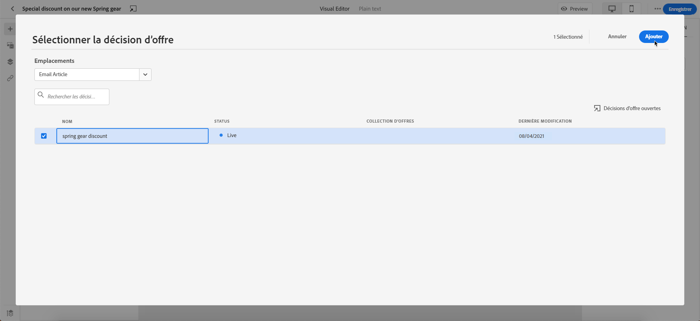

# Ajouter des offres personnalisées {#deliver-personalized-offers}

Dans les e-mails [!DNL Journey Optimizer], vous pouvez insérer des décisions qui utiliseront le moteur de gestion des décisions afin de sélectionner la meilleure offre à proposer à vos client(e)s.

Par exemple, vous pouvez ajouter une décision qui affichera dans votre e-mail une offre de remise spéciale qui variera en fonction du niveau de fidélité du destinataire.

>[!IMPORTANT]
>
>Si des modifications sont apportées à une décision d’offres qui est utilisée dans le message d’un parcours, vous devez dépublier le parcours et le republier. Cela permet de s’assurer que les modifications sont intégrées au message du parcours et que le message est cohérent avec les dernières mises à jour.

* Pour plus d’informations sur la façon de créer et gérer des offres, reportez-vous à [cette section](../offers/get-started/starting-offer-decisioning.md).
* Pour obtenir un **exemple complet** montrant comment configurer des offres, les utiliser dans une décision et exploiter cette décision dans un e-mail, consultez [cette section](../offers/offers-e2e.md#insert-decision-in-email).

➡️ [Découvrez comment ajouter des offres en tant que personnalisation dans cette vidéo](#video-offers).

## Insertion d’une décision dans un e-mail {#insert-offers}

>[!CAUTION]
>
>Avant de commencer, vous devez [définir une décision d&#39;offre](../offers/offer-activities/create-offer-activities.md).

Pour insérer une décision dans un email, procédez comme suit :

1. Créez votre email, puis ouvrez le concepteur d’e-mail pour configurer son contenu.

1. Ajoutez un composant de contenu **[!UICONTROL Décision d&#39;offre]**.

   

   Découvrez comment utiliser les composants de contenu dans [cette section](content-components.md).

1. L&#39;onglet **[!UICONTROL Décision d&#39;offre]** s&#39;affiche dans la palette de droite. Cliquez sur **[!UICONTROL Sélectionner la décision d’offres]** :

   1. Dans la fenêtre qui s&#39;affiche, sélectionnez l&#39;emplacement correspondant aux offres que vous souhaitez afficher.

      Les [emplacements](../offers/offer-library/creating-placements.md) sont des conteneurs utilisés pour présenter vos offres. Dans cet exemple, nous utiliserons l’emplacement « image en haut de l&#39;e-mail ». Cet emplacement a été créé dans la bibliothèque des offres pour afficher les offres de type image situées en haut des messages.

   1. Les décisions correspondant à l’emplacement sélectionné s’affichent. Sélectionnez la décision à utiliser dans le composant de contenu, puis cliquez sur **[!UICONTROL Ajouter]**.

      >[!NOTE]
      >
      >Seules les décisions compatibles avec l&#39;emplacement sélectionné s&#39;affichent dans la liste. Dans cet exemple, une seule activité d&#39;offre correspond à l&#39;emplacement « image en haut de l&#39;e-mail ».

      

La décision est maintenant ajoutée au composant. Une fois vos modifications enregistrées, vos offres sont prêtes à être affichées pour les profils pertinents lors de l’envoi du message dans le cadre d’un parcours.

>[!NOTE]
>
>Lors de la mise à jour dʼune offre, dʼune offre de secours, dʼune collection d’offres ou dʼune décision d’offre, directement ou indirectement référencée dans un message, les mises à jour sont automatiquement répercutées dans le message correspondant.

## Prévisualisation des offres dans un e-mail {#preview-offers-in-email}

Vous pouvez prévisualiser les différentes offres qui font partie de la décision ajoutée à l’e-mail en utilisant la section **[!UICONTROL Offre]** ou les flèches des composants de contenu.

Pour afficher les différentes offres qui font partie de la décision avec un profil client, procédez comme suit.

1. Sélectionnez les profils de test à utiliser pour prévisualiser l’offre :

   1. Cliquez sur le bouton **[!UICONTROL Simuler le contenu]**, puis choisissez l’espace de noms à utiliser pour identifier les profils de test à partir du champ **[!UICONTROL Espace de noms d’identité]**.

      >[!NOTE]
      >
      >Dans cet exemple, nous utiliserons l’espace de noms **E-mail**. Apprenez-en davantage sur les espaces de noms d’identité d’Adobe Experience Platform [dans cette section](../audience/get-started-identity.md).

   1. Dans le champ **[!UICONTROL Valeur d&#39;identité]**, saisissez la valeur pour identifier le profil de test. Dans cet exemple, saisissez l&#39;adresse e-mail d&#39;un profil de test.

   <!--For example enter smith@adobe.com and click the **[!UICONTROL Add profile]** button.-->

   1. Ajoutez d&#39;autres profils afin de pouvoir tester différentes variantes du message en fonction des données de profil.

      

1. Cliquez sur le bouton **[!UICONTROL Aperçu]** pour tester votre message, puis sélectionnez un profil de test. L’offre correspondant au profil sélectionné (une femme) s’affiche.

   

   Vous pouvez sélectionner d’autres profils de test pour prévisualiser le contenu des e-mails pour chaque variante de votre message. Dans le contenu du message, l’offre correspondant au profil de test sélectionné (désormais un homme) s’affiche maintenant.

En savoir plus sur les étapes détaillées permettant de vérifier l’aperçu du message dans [cette section](#preview-your-messages).

## Vidéo pratique{#video-offers}

Découvrez comment ajouter un composant de gestion des décisions aux messages dans [!DNL Journey Optimizer].

>[!VIDEO](https://video.tv.adobe.com/v/3415688?quality=12&captions=fre_fr)
