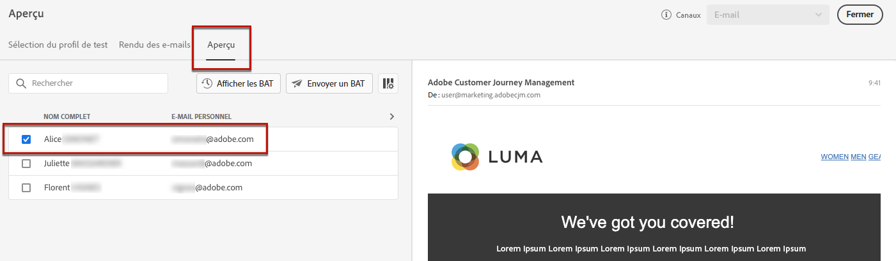

# Ajout d’offres personnalisées {#deliver-personalized-offers}

Dans [!DNL Journey Optimizer] Par e-mail, vous pouvez insérer des décisions qui exploiteront le moteur de gestion des décisions afin de choisir la meilleure offre à diffuser à vos clients.

Par exemple, vous pouvez ajouter une décision qui affichera dans votre email une offre de réduction spéciale qui variera en fonction du niveau de fidélité du destinataire.

Pour plus d’informations sur la création et la gestion des offres, reportez-vous à la section [cette section](../offers/get-started/starting-offer-decisioning.md).

Pour un **exemple complet de bout en bout** montrant comment configurer des offres, les utiliser dans une décision et exploiter cette décision dans un email, extraire [cette section](../offers/offers-e2e.md#insert-decision-in-email).

➡️ [Découvrez comment ajouter des offres en tant que personnalisation dans cette vidéo](#video-offers)

## Insérer une décision dans un email {#insert-offers}

>[!CAUTION]
>
>Avant de commencer, vous devez [définir une décision d’offre ;](../offers/offer-activities/create-offer-activities.md).

Pour insérer une décision dans un email, procédez comme suit :

1. Créez votre email, puis ouvrez le Concepteur d&#39;email pour configurer son contenu.

1. Ajoutez un **[!UICONTROL Offer decision]** composant de contenu.

   

   Découvrez comment utiliser les composants de contenu dans [cette section](content-components.md).

1. Le **[!UICONTROL Offer decision]** s’affiche dans la palette de droite. Cliquez sur **[!UICONTROL Select Offer decision]**.

   

1. Dans la fenêtre qui s’affiche, sélectionnez l’emplacement correspondant aux offres que vous souhaitez afficher.

   [Emplacements](../offers/offer-library/creating-placements.md) sont des conteneurs utilisés pour présenter vos offres. Dans cet exemple, nous utiliserons l’emplacement &quot;image du haut de l’email&quot;. Cet emplacement a été créé dans la bibliothèque des offres pour afficher les offres de type image situées en haut des messages.

1. Les décisions correspondant à l’emplacement sélectionné s’affichent. Sélectionnez la décision à utiliser dans le composant de contenu, puis cliquez sur **[!UICONTROL Add]**.

   >[!NOTE]
   >
   >Seules les décisions compatibles avec l’emplacement sélectionné s’affichent dans la liste. Dans cet exemple, une seule activité d’offre correspond à l’emplacement &quot;image du haut de l’email&quot;.

   

La décision est maintenant ajoutée au composant.

Une fois vos modifications enregistrées, vos offres sont prêtes à être affichées pour les profils pertinents lors de l’envoi du message dans le cadre d’un parcours.

>[!NOTE]
>
>Lorsque vous mettez à jour une offre, une offre de secours, une collecte d’offres ou une décision d’offre directement ou indirectement référencée dans un message, les mises à jour sont automatiquement répercutées dans le message correspondant.

## Prévisualiser des offres dans un email {#preview-offers-in-email}

Vous pouvez prévisualiser les différentes offres qui font partie de la décision ajoutée à l’email à l’aide de la variable **[!UICONTROL Offers]** ou les flèches des composants de contenu.

Pour afficher les différentes offres qui font partie de la décision avec un profil client, procédez comme suit.

1. Cliquez sur **[!UICONTROL Preview]**.

   

   >[!NOTE]
   >
   >Vous devez disposer de profils de test pour pouvoir prévisualiser vos messages. Découvrez comment [créer des profils de test](../segment/creating-test-profiles.md).

1. Pour choisir l’espace de noms à utiliser pour identifier les profils de test, sélectionnez **[!UICONTROL Email]** de la **[!UICONTROL Identity namespace]** champ .

   >[!NOTE]
   >
   >Dans cet exemple, nous utiliserons la variable **Email** espace de noms. En savoir plus sur les espaces de noms d’identité Adobe Experience Platform [dans cette section](../segment/get-started-identity.md).

1. Dans la liste des espaces de noms d’identité, sélectionnez **[!UICONTROL Email]** et cliquez sur **[!UICONTROL Select]**.

1. Dans le **[!UICONTROL Identity value]** , saisissez la valeur permettant d&#39;identifier le profil de test. Dans cet exemple, saisissez l&#39;adresse email d&#39;un profil de test.

   <!--For example enter smith@adobe.com and click the **[!UICONTROL Add profile]** button.-->

1. Ajoutez d&#39;autres profils afin de pouvoir tester différentes variantes du message en fonction des données de profil.

   

1. Cliquez sur le bouton **[!UICONTROL Preview]** pour tester votre message.

1. Sélectionnez un profil de test. L&#39;offre correspondant au profil sélectionné (une femme) s&#39;affiche.

   

1. Sélectionnez d&#39;autres profils de test pour prévisualiser le contenu de l&#39;email pour chaque variante de votre message. Dans le contenu du message, l&#39;offre correspondant au profil de test sélectionné (désormais un homme) s&#39;affiche désormais.

   

En savoir plus sur les étapes détaillées pour vérifier l’aperçu du message dans [cette section](#preview-your-messages).

## Vidéo pratique{#video-offers}

Découvrez comment ajouter un composant de gestion des décisions aux messages dans [!DNL Journey Optimizer].

>[!VIDEO](https://video.tv.adobe.com/v/334088?quality=12)

