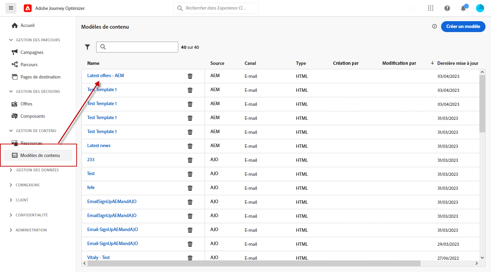
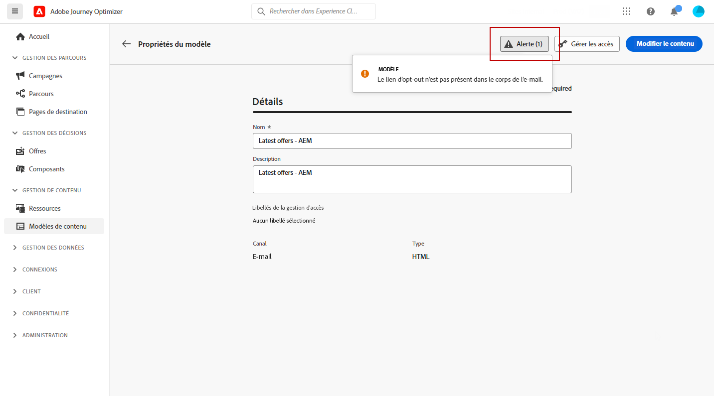
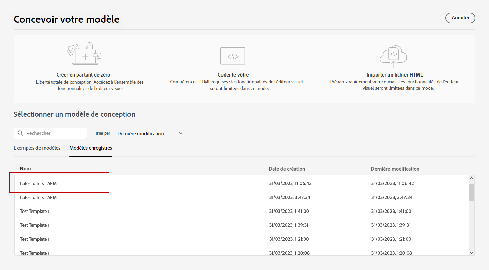
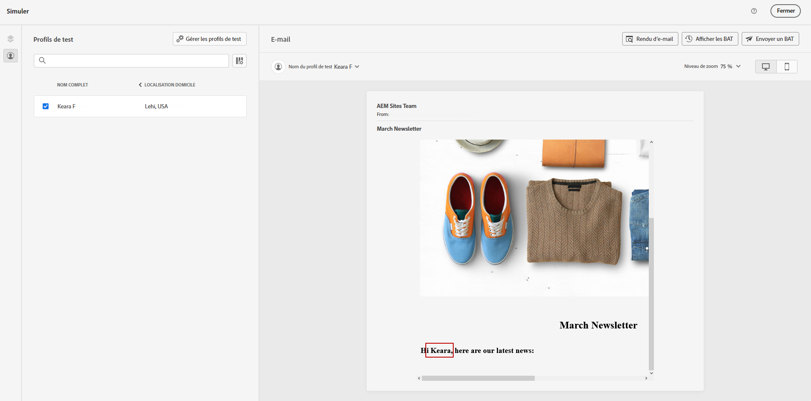

# Utilisation de modèles Adobe Experience Manager {#aem-templates}

>[!AVAILABILITY]
>
>L’intégration à Adobe Experience Manager est actuellement disponible en version bêta pour sélectionner uniquement les utilisateurs.
> En tant qu’utilisateur bêta, utilisez [ce formulaire](https://forms.office.com/pages/responsepage.aspx?id=Wht7-jR7h0OUrtLBeN7O4Wf0cbVTQ3tCpW_unE-w8-JUN1FaNlAzNkhPSUdaSkJXVFRCNTRJNVRFSy4u){target="_blank"} pour partager vos commentaires.

Avec Adobe Journey Optimizer, vous pouvez créer des messages personnalisés via des sites Adobe Experience Manager. Commencez par concevoir vos modèles à l’aide de sources de contenu Adobe Experience Manager, puis envoyez-les à Adobe Journey Optimizer. Une fois partagés, ces modèles sont accessibles dans le Concepteur d’email de Adobe Journey Optimizer, ce qui simplifie le processus d’élaboration et d’envoi de messages à votre audience souhaitée.

## Conditions préalables {#prerequisites}

Avant de commencer à utiliser cette fonctionnalité, assurez-vous d’être en phase avec les exigences suivantes :

* **Paramètres du Experience Manager**

   Cette fonctionnalité est disponible avec [Adobe Experience Manager as a Cloud Service](https://experienceleague.adobe.com/docs/experience-manager-cloud-service/content/overview/introduction.html?lang=fr){target="_blank"}.

   Dans le cadre du programme bêta, la configuration du Cloud Service est effectuée par Adobe dans Adobe Experience Manager pour se connecter à Adobe Journey Optimizer.

* **Autorisations**

   Pour créer, modifier et supprimer des modèles de contenu dans Adobe Journey Optimizer, vous devez disposer de la variable **[!DNL Manage Library Items]** autorisation incluse dans la variable **[!DNL Content Library Manager]** profil de produit. [En savoir plus](../administration/ootb-product-profiles.md#content-library-manager).

## Mécanismes de sécurisation et limitations{#aem-templates-limitations}

Pour optimiser davantage votre utilisation d’Adobe Experience Manager avec Adobe Journey Optimizer, il est important de connaître les barrières de sécurité et les limitations supplémentaires suivantes :

* Pour que la personnalisation dans le modèle de Experience Manager soit effective, une syntaxe Journey Optimizer appropriée est requise. [En savoir plus](../personalization/personalization-syntax.md).

* L’exportation de modèles en bloc n’est actuellement pas prise en charge, les modèles doivent être exportés unitairement.

* La synchronisation entre Experience Manager et Journey Optimizer n’est actuellement pas disponible. Si des modifications sont apportées à un modèle de Experience Manager après son envoi à Journey Optimizer, l’utilisateur devra réexporter le modèle et le renvoyer vers Journey Optimizer.

## Envoyer un modèle à Journey Optimizer{#aem-templates-send}

Pour exporter un modèle Adobe Experience Manager vers Adobe Journey Optimizer, procédez comme suit :

1. Sur votre page d’accueil Adobe Experience Manager, sélectionnez la variable **[!UICONTROL Marketing sortant]**.

   

1. Dans votre bibliothèque de contenu, vous pouvez utiliser des modèles configurés précédemment ou en créer un de A à Z. [En savoir plus](https://experienceleague.adobe.com/docs/experience-manager-65/authoring/authoring/managing-pages.html?lang=en#creating-a-new-page).

1. En incorporant la syntaxe de personnalisation Journey Optimizer dans votre modèle, vous pouvez améliorer ses capacités de personnalisation. [En savoir plus](../personalization/personalization-syntax.md).

   

1. Sélectionnez le modèle à exporter vers Journey Optimizer, puis cliquez sur **[!UICONTROL Envoyer à]** dans le menu avancé.

   

1. Saisissez le **[!UICONTROL Nom]** du modèle Contenu et sélectionnez la cible **[!UICONTROL Sandbox]**.

   

1. Une fois que vous avez cliqué sur la variable **[!UICONTROL Envoyer]** , le processus d’exportation commencera. Une fois l&#39;export terminé, le message suivant s&#39;affiche dans l&#39;interface utilisateur : &quot;Modèle &quot;XX&quot; envoyé avec succès à AJO&quot;.

Le modèle est ajouté aux modèles de contenu Adobe Journey Optimizer de l’environnement de test sélectionné.

## Utiliser et personnaliser un modèle Adobe Experience Manager{#aem-templates-perso}

Une fois que le modèle de Experience Manager est disponible dans Journey Optimizer en tant que modèle de contenu, vous pouvez identifier et incorporer le contenu nécessaire à l’email, y compris la personnalisation.

1. Dans Journey Optimizer, à partir du **[!UICONTROL Modèle de contenu]** , accédez au modèle importé.

   

1. En cliquant sur le bouton **[!UICONTROL Alerte]** , vous pouvez vérifier rapidement si des paramètres importants sont manquants. Cela permet de vous assurer que vos messages sont correctement configurés et d’éviter toute erreur ou problème potentiel.

   

1. Dans le **[!UICONTROL Propriétés du modèle]** , cliquez sur la fenêtre **[!UICONTROL Gérer l’accès]** pour attribuer des libellés d’utilisation des données principales ou personnalisées à votre modèle. [En savoir plus sur le contrôle d’accès au niveau de l’objet (OLAC)](../administration/object-based-access.md)

1. Pour personnaliser davantage votre modèle de Experience Manager et ajouter une personnalisation personnalisée à votre contenu, cliquez sur **[!UICONTROL Modifier le contenu]**. Vous pourrez ainsi apporter facilement des modifications et adapter le modèle à vos besoins. [En savoir plus](get-started-email-design.md).

   >[!NOTE]
   >
   > Si vous souhaitez modifier et personnaliser votre modèle, vous ne pourrez utiliser que le mode de compatibilité.

1. Lorsque votre modèle de contenu est prêt, [tester et valider](content-templates.md#test-template).

1. Une fois votre contenu défini, vous pouvez l’utiliser lors de la création d’un email en naviguant sur la page **[!UICONTROL Modèles enregistrés]** collection. Sélectionnez ensuite **[!UICONTROL Utiliser ce modèle]**.

   

1. Vous pouvez maintenant modifier et personnaliser votre contenu. Pour plus d&#39;informations sur la création de votre contenu d&#39;email, reportez-vous à cette section [page](content-from-scratch.md).

   

1. Si vous avez ajouté du contenu personnalisé à votre modèle de Experience Manager, cliquez sur **[!UICONTROL Simulation du contenu]** pour prévisualiser l’affichage du message à l’aide de profils de test.

[En savoir plus sur l’aperçu et les profils de test](../email/preview.md)

   

1. Lors de l&#39;affichage de l&#39;aperçu du message, tout élément personnalisé est automatiquement remplacé par les données correspondantes du profil de test sélectionné.

   Au besoin, des profils de test supplémentaires peuvent être ajoutés au moyen de la **[!UICONTROL Gestion des profils de test]** bouton .

   

Une fois votre e-mail prêt, effectuez la configuration de votre [parcours](../building-journeys/journey-gs.md) ou [campagne](../campaigns/create-campaign.md) et activez-le pour envoyer le message.
