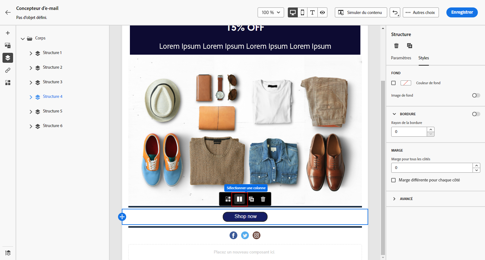
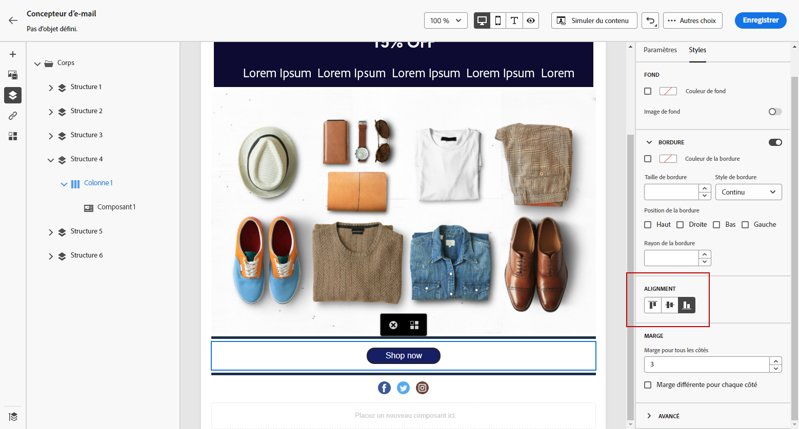
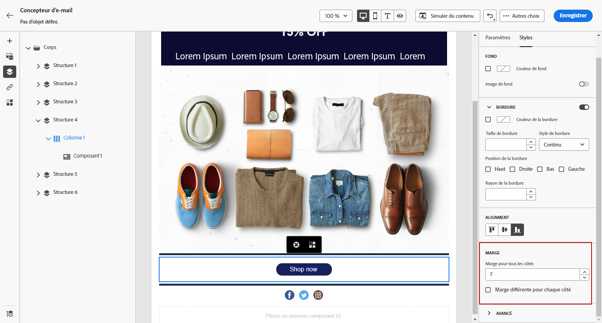

# Ajuster l’alignement vertical et la marge intérieure {#alignment-and-padding}

Dans cet exemple, nous allons ajuster la marge intérieure et l&#39;alignement vertical à l&#39;intérieur d&#39;un composant de structure composé de trois colonnes.

1. Sélectionnez le composant de structure directement dans l’email ou à l’aide de l’**[!UICONTROL arborescence de navigation]** disponible dans le menu de gauche.

1. Dans la barre d&#39;outils, cliquez sur **[!UICONTROL Sélectionner une colonne]** et choisissez celle à modifier. Vous pouvez également la sélectionner dans l&#39;arborescence.

   Les paramètres modifiables de cette colonne sont affichés dans l’onglet **[!UICONTROL Styles]**.

   

1. Sous **[!UICONTROL Alignement]**, sélectionnez **[!UICONTROL Haut]**, **[!UICONTROL Milieu]** ou **[!UICONTROL Bas]**.

   

1. Sous **[!UICONTROL Marge intérieure]**, définissez la marge intérieure pour tous les côtés.

   Sélectionner **[!UICONTROL Marge intérieure différente pour chaque côté]** si vous souhaitez mieux définir la marge intérieure. Cliquez sur l’icône représentant un verrou pour interrompre la synchronisation.

   

1. Procédez de la même façon pour ajuster l’alignement et la marge intérieure des autres colonnes.

1. Enregistrez vos modifications.

>[!TIP]
>
>Lors de la conception de contenu d’e-mail pour Gmail sur les appareils Android, assurez-vous que les images et les séparateurs utilisent la marge intérieure des colonnes plutôt que de grandes marges fixes. Gmail sur Android effectue souvent un rendu surdimensionné des images et incorrect des marges, ce qui entraîne un débordement de la disposition ou une réduction des lignes de séparation. Utilisez une largeur d’image plus petite ou utilisez la marge intérieure basée sur les colonnes pour un affichage cohérent.

## Gestion de la marge intérieure des fragments avec la navigation du chemin de navigation {#fragment-padding-breadcrumb}

Lorsque vous utilisez des [fragments](../content-management/fragments.md) dans le Designer d’e-mail, vous pouvez rencontrer une marge intérieure masquée ou résiduelle qui affecte le rendu sur les appareils mobiles différemment de celui sur les ordinateurs de bureau. Cela est particulièrement fréquent lorsque des fragments ont été déverrouillés ou lorsque [l’héritage a été rompu](use-visual-fragments.md#break-inheritance), car les styles restants peuvent rester dans la colonne sous-jacente ou les composants de texte.

Pour identifier et modifier la marge intérieure restante dans les fragments :

1. Utilisez l’**[!UICONTROL arborescence de navigation]** ou cliquez directement sur les éléments dans l’éditeur pour sélectionner chaque structure parent ou colonne de votre fragment. Vous pouvez ainsi localiser la marge intérieure ou la marge masquée qui peut être spécifique aux appareils mobiles.

1. Après avoir sélectionné l’élément dans le chemin de navigation, accédez à l’onglet **[!UICONTROL Styles]** à droite.

1. Passez en revue les paramètres **[!UICONTROL Marge intérieure]** et supprimez ou réajustez la marge intérieure selon les besoins pour obtenir un alignement mobile correct.

1. Si des problèmes d’alignement persistent lors de la réutilisation de fragments, répétez ce processus pour d’autres colonnes ou composants de texte dans le fragment.

>[!NOTE]
>
>Ce comportement est prévisible lorsque des fragments sont insérés et supprimés de manière répétée, car les règles de style peuvent s’accumuler. Vérifiez toujours la marge intérieure à l’aide de la navigation du chemin de navigation, en particulier lors du ciblage des appareils mobiles.