# Appliquer des thèmes au contenu de votre e-mail {#apply-email-themes}

>[!CONTEXTUALHELP]
>id="ajo_use_theme"
>title="Appliquer un thème à votre e-mail"
>abstract="Sélectionnez un thème pour votre e-mail afin d’appliquer rapidement un style spécifique adapté à votre marque et à votre conception."

>[!AVAILABILITY]
>
>Cette fonctionnalité est en disponibilité limitée. Contactez votre représentant ou représentante Adobe pour en bénéficier.

Grâce aux thèmes, les utilisateurs et les utilisatrices non techniques ont la possibilité de créer du contenu réutilisable adapté à une marque et une langue de conception spécifiques en ajoutant un style personnalisé aux modèles standard<!-- to achieve brand specific results-->.

Cette fonctionnalité permet aux spécialistes du marketing d’utiliser plus rapidement et à moindre effort des e-mails visuellement attrayants et conformes à la marque, tout en fournissant des options de personnalisation avancées pour des besoins de conception uniques.

## Mécanismes de sécurisation et limitations {#themes-guardrails}

* Lors de la création d’un e-mail en partant de zéro, vous pouvez choisir de commencer à créer votre contenu à l’aide d’un thème afin d’appliquer rapidement un style spécifique adapté à votre marque et à votre conception.

  Si vous choisissez le mode Style manuel, vous ne pourrez appliquer aucun thème à moins de réinitialiser votre e-mail.

* Les [fragments](../content-management/fragments.md) ne sont pas compatibles entre les modes Utiliser des thèmes et Style manuel.

   * Les fragments avec thème ne sont pas disponibles dans les contenus d’e-mail créés sans utiliser de thème.

   * Pour exploiter un [fragment](../content-management/fragments.md) dans un contenu avec thème, ce fragment doit avoir été créé lui-même à l’aide de thèmes. [En savoir plus](#leverage-themes-fragment)

   * Lors de l’utilisation d’un fragment dans le contenu d’un e-mail, veillez à appliquer un thème que vous avez défini pour ce fragment. Si vous ne le faites pas, vous risquez de rencontrer des problèmes d’affichage, en particulier dans Outlook 2021 et les versions précédentes. [En savoir plus](#leverage-themes-fragment)

* Si vous utilisez du contenu créé en HTML, vous serez en [mode de compatibilité](existing-content.md) et vous ne pourrez pas appliquer de thèmes directement à ce contenu.

   * Pour appliquer des thèmes, vous devez d’abord enregistrer le contenu importé [en tant que nouveau modèle](../content-management/create-content-templates.md#save-as-template), puis convertir ce modèle en un contenu compatible avec le thème. Vous pouvez ensuite utiliser ce modèle pour créer le contenu de votre e-mail. Découvrez comment convertir un modèle créé avec un style manuel dans [cette section](#theme-convertor).

   * Vous pouvez également toujours convertir le contenu HTML importé. [En savoir plus](existing-content.md)

  <!--To fully leverage all the capabilities of the Email Designer, including themes, you must either create a new content in Use Themes mode, or convert your imported HTML content. [Learn more](existing-content.md)-->

* Lors de l’utilisation de polices web personnalisées (y compris les polices Google) dans vos thèmes, sachez que de nombreux clients de messagerie ne les prennent pas en charge. Définissez toujours des polices de secours appropriées dans votre thème pour garantir la lisibilité sur tous les clients de messagerie.

   * Gmail et Yahoo ! ne chargez pas de polices web externes et reviendront aux polices système, quelle que soit la famille de polices spécifiée dans votre HTML/CSS.
   * Les seules polices Google prises en charge par Gmail sont Roboto et Google Sans.
   * Les clients de messagerie qui *prennent* en charge les polices web sont Apple Mail, iOS Mail, Android Mail, Thunderbird et Outlook pour macOS.

<!--If you apply a theme to a content using a [fragment](../content-management/fragments.md) created with Manual Styling mode, the rendering may not be optimal.-->

## Créer un thème {#create-and-edit-themes}

Pour définir un thème que vous pouvez utiliser dans les futurs contenus d’e-mail, procédez comme suit.

1. Pour commencer, créez un [modèle de contenu](../content-management/create-content-templates.md).

1. Sélectionnez l’option **[!UICONTROL Créer ou modifier des thèmes]**.

   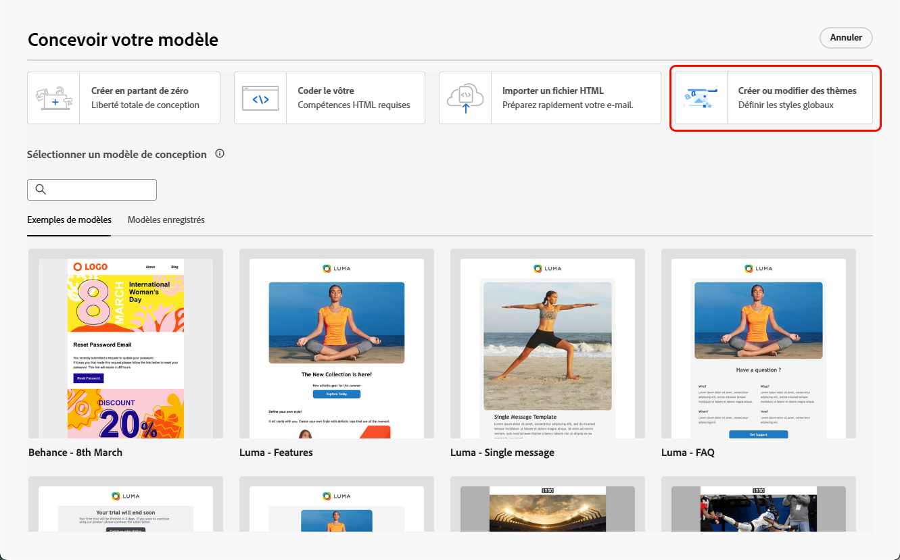

1. Sélectionnez un thème Adobe. Dans cet exemple, sélectionnez le **[!UICONTROL thème par défaut]** et cliquez sur **[!UICONTROL Créer]**.

   

1. Vous pouvez également sélectionner un modèle personnalisé dans l’onglet **[!UICONTROL Mes thèmes]** et cliquer sur **[!UICONTROL Modifier]** pour le mettre à jour.

   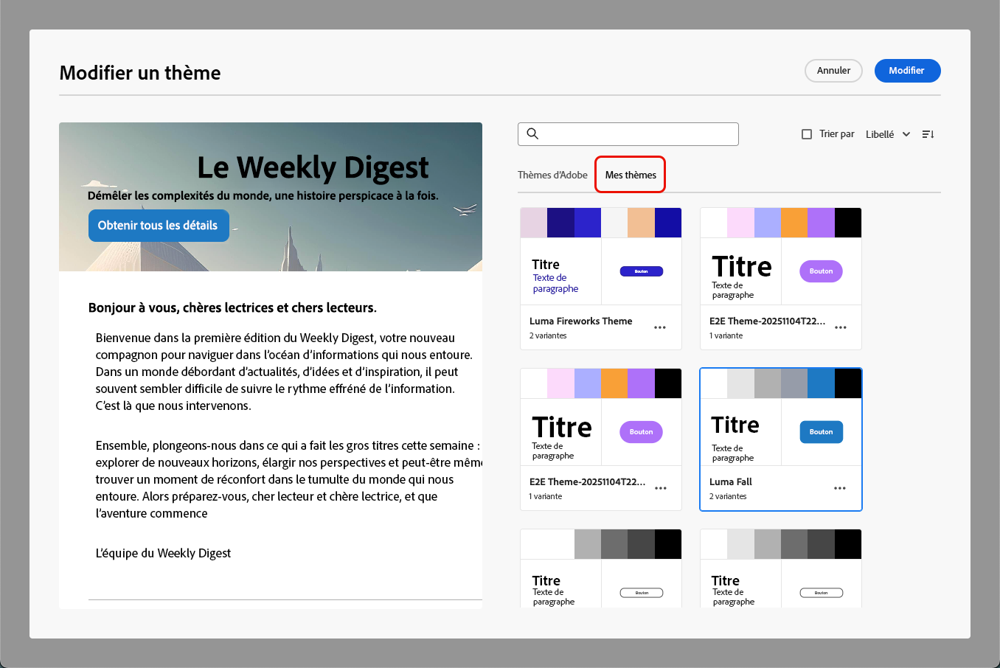

1. Dans l’onglet **[!UICONTROL Paramètres généraux]**, commencez à définir votre thème en lui donnant un nom spécifique pour votre marque. Vous pouvez ajuster la largeur par défaut de vos e-mails et exporter le thème actuel pour le [partager sur plusieurs sandbox](../configuration/copy-objects-to-sandbox.md).

   <!--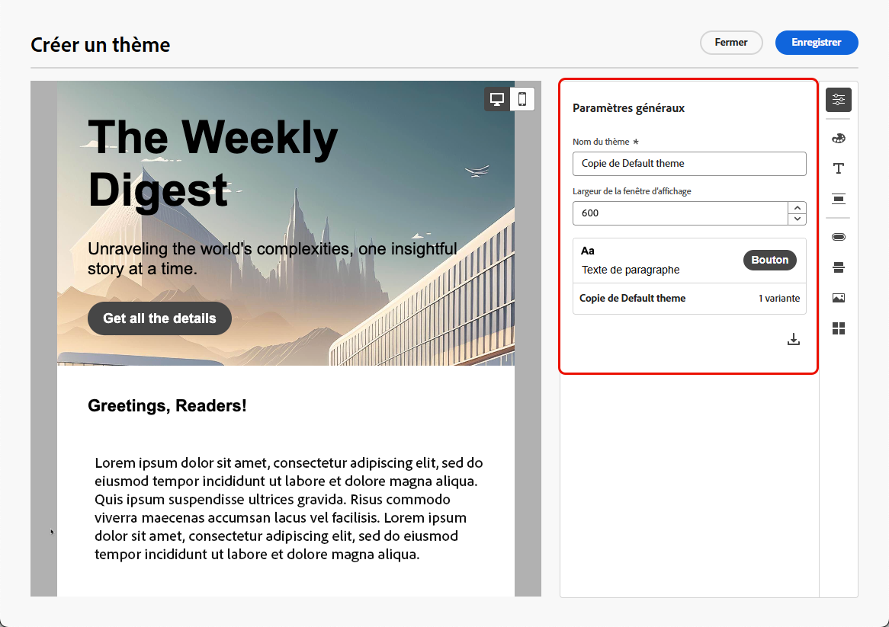-->

1. Utilisez le rail à droite pour parcourir les différents onglets et mettre à jour vos paramètres de conception.

   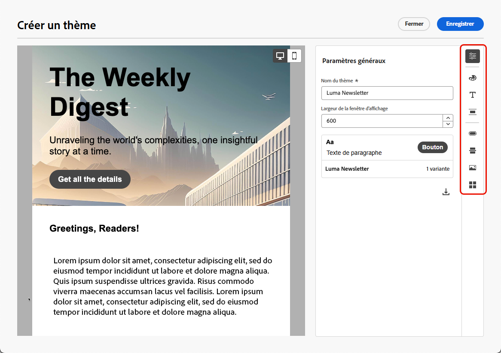

1. Dans l’onglet **[!UICONTROL Couleurs]** :

   * Utilisez le bouton **[!UICONTROL Modifier]** pour configurer une **[!UICONTROL palette de couleurs]** avec les couleurs par défaut de votre marque. Sélectionnez un **[!UICONTROL préréglage]** pour créer rapidement un jeu de couleurs ou ajuster chaque couleur de votre thème individuellement. Vous pouvez également utiliser une combinaison des deux.

     

   * Cliquez sur **[!UICONTROL Ajouter une variante]** pour créer plusieurs variantes de couleurs, telles que le mode clair et le mode sombre, où chaque variante de votre thème a sa propre palette de couleurs et ses propres commandes de nuances.

     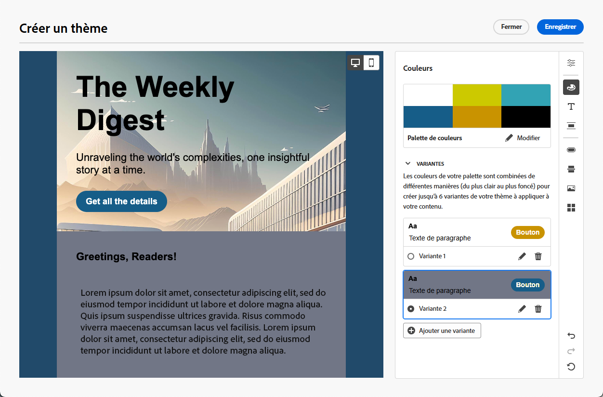

   * Pour chaque variante, cliquez sur l’icône **[!UICONTROL Modifier]** pour modifier un élément individuel. Vous pouvez utiliser la palette par défaut que vous avez créée ou n’importe quelle couleur personnalisée.

     

1. Dans les **[!UICONTROL Paramètres de texte]**, vous pouvez définir la police globale que vous souhaitez utiliser pour l’ensemble du thème. Pour un contrôle plus granulaire, vous pouvez également modifier chaque en-tête et type de paragraphe pour ajuster la police, la taille, le style, etc.

   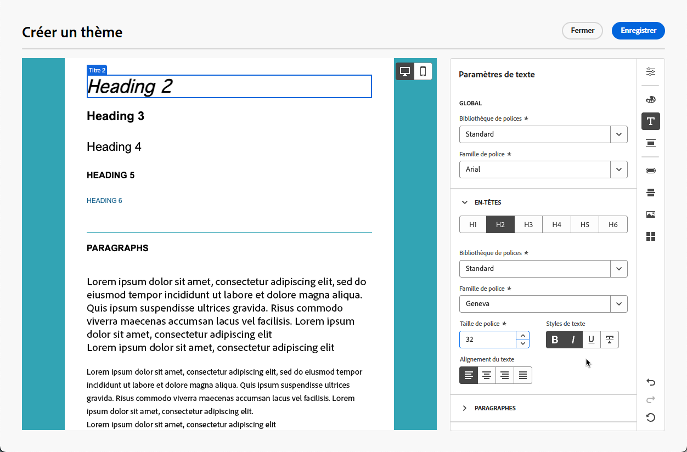

   >[!NOTE]
   >
   >Lors de la sélection de polices web personnalisées, notez que de nombreux clients de messagerie, tels que Gmail et Yahoo ! ne prend pas en charge les polices web externes et va revenir aux polices système. Pensez à inclure des polices de secours pour vous assurer que votre contenu s’affiche correctement sur tous les clients de messagerie. [En savoir plus](#themes-guardrails)

1. Dans l’onglet **[!UICONTROL Espacement]**, sélectionnez un élément dans la liste pour l’espacer correctement entre les différents composants.

   <!--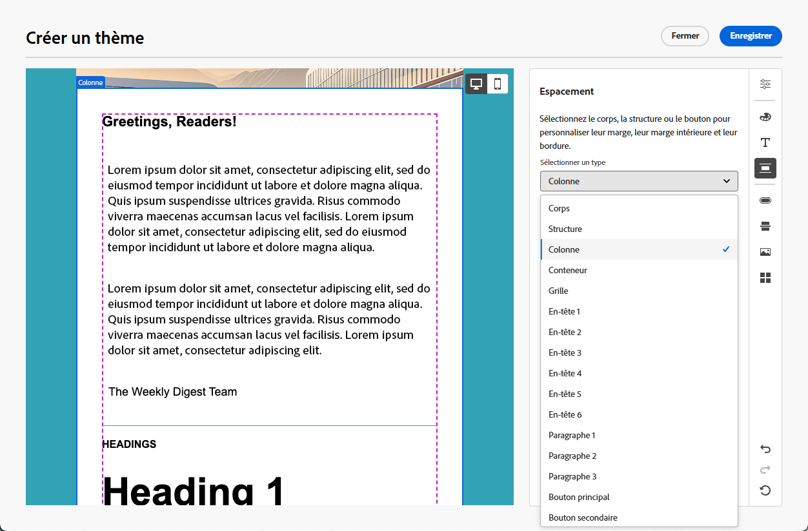-->

1. En utilisant les autres onglets sur la droite, vous pouvez gérer séparément chaque élément de bouton, séparateur, mise en forme d’image supplémentaire et espacement de la disposition de la grille pour ce thème.

   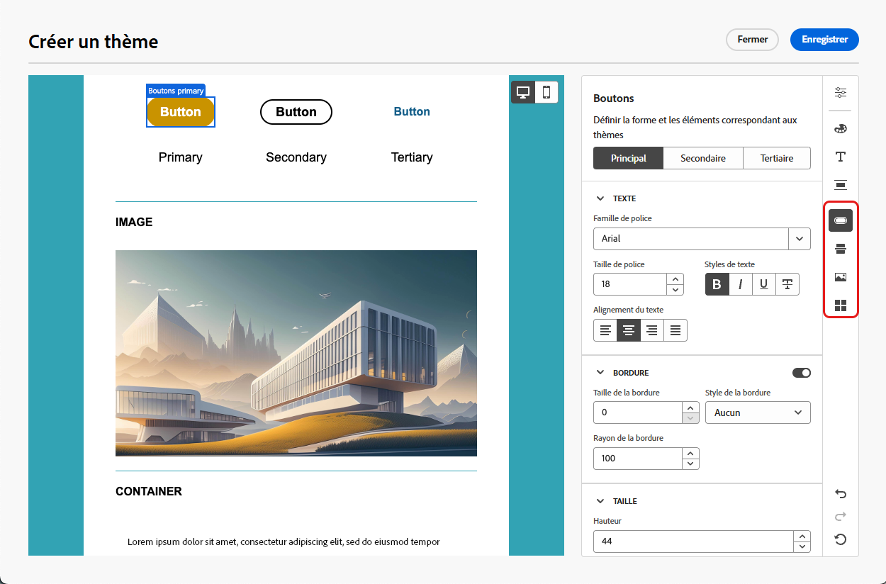

1. Cliquez sur **[!UICONTROL Enregistrer]** pour stocker ce thème en vue d’une utilisation ultérieure. Il s’affiche désormais dans l’onglet **[!UICONTROL Mes thèmes]**.

<!--A little strange upon hitting Save, because once the theme is created, you need to hit Close to go back to Design your template screen, then click Cancel if you don't want to proceed with template creation.-->

## Appliquer des thèmes au contenu d’un e-mail {#apply-themes-email}

Pour appliquer des thèmes de style par défaut ou personnalisés à un modèle de contenu ou à un e-mail, procédez comme suit.

1. Dans [!DNL Journey Optimizer], [ajoutez une action d’e-mail](create-email.md) à un parcours ou à une campagne, ou créez un [modèle de contenu](../content-management/create-content-templates.md#create-template-from-scratch) d’e-mail et [modifiez le corps de l’e-mail](get-started-email-design.md#key-steps).

1. Vous pouvez sélectionner l’une des actions suivantes :

   * Sélectionnez un [modèle d’e-mail](use-email-templates.md) intégré pour ouvrir le Concepteur d’e-mail. Un thème par défaut spécifique à chaque modèle est automatiquement appliqué.

   * Créez du [contenu à partir de zéro](content-from-scratch.md) et sélectionnez **[!UICONTROL Utiliser des thèmes]** pour commencer avec un thème de style prédéfini.

     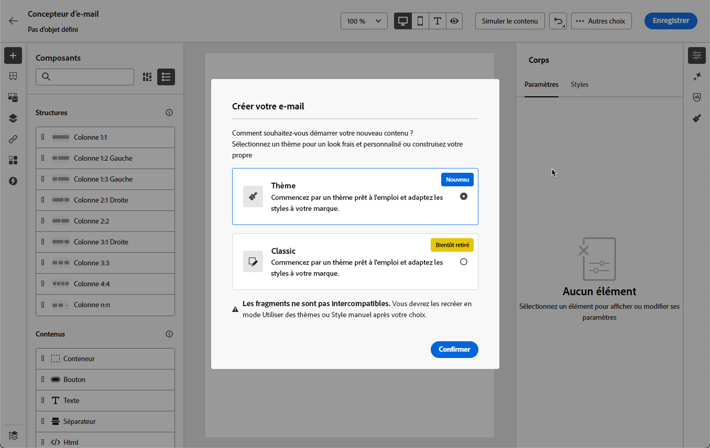

     >[!CAUTION]
     >
     >Si vous choisissez le mode Style manuel, vous ne pourrez appliquer aucun thème à moins de réinitialiser votre conception.
     >
     >Pour exploiter un [fragment](../content-management/fragments.md) dans un contenu avec thème, ce fragment doit avoir été créé lui-même à l’aide de thèmes. [En savoir plus](#leverage-themes-fragment)

1. Une fois dans le Concepteur d’e-mail, cliquez sur le bouton **[!UICONTROL Thèmes]** sur le rail de droite. Le thème par défaut ou le thème du modèle s’affiche. Vous pouvez basculer entre les deux variantes de couleur de ce thème.

   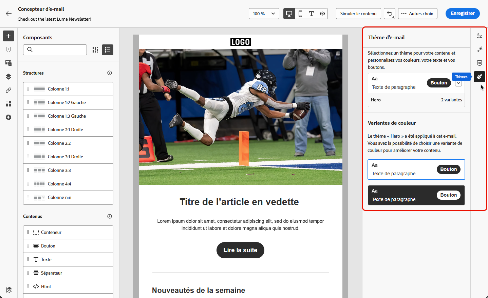

1. Cliquez sur la flèche en regard du thème actuellement utilisé. La liste des thèmes personnalisés et Adobe disponibles s’affiche.

   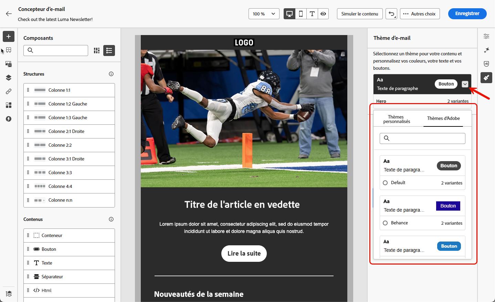

1. Cliquez sur **[!UICONTROL Mes thèmes]** et sélectionnez le thème que vous avez créé.

   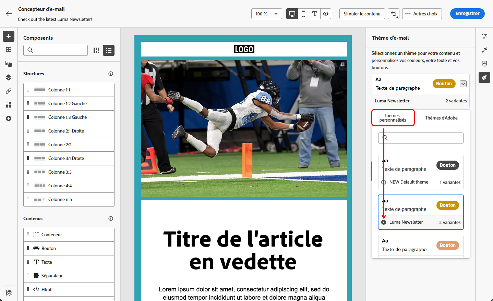

1. Cliquez en dehors de la liste déroulante. Le thème personnalisé nouvellement sélectionné applique automatiquement ses styles à tous les composants d’e-mail. Vous pouvez basculer entre les variantes de couleur, le cas échéant.

1. Lorsqu’un thème est sélectionné dans un modèle de contenu, vous pouvez cliquer sur le bouton **[!UICONTROL Modifier le thème]** pour le mettre à jour. [En savoir plus](#create-and-edit-themes)

   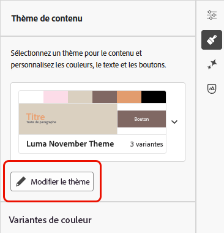{width="40%"}

   >[!NOTE]
   >
   >Cette option n’est pas disponible lors de l’utilisation de thèmes dans les contenus d’e-mail.

1. Si vous utilisez un thème à l’aide de plusieurs variantes de couleur, vous pouvez choisir une variante spécifique pour un composant de structure donné. Vous pouvez ainsi définir une variante de couleur pour l’ensemble du contenu et utiliser une variante différente pour une seule structure spécifique.

   >[!NOTE]
   >
   >Vous ne pouvez pas effectuer cette action sur les composants de contenu.

   Pour ce faire, sélectionnez un composant de structure, cliquez sur l’option **[!UICONTROL Utiliser la variante du thème spécifique]** dans l’onglet **[!UICONTROL Styles]** à droite, puis appliquez la variante souhaitée à cette structure.

   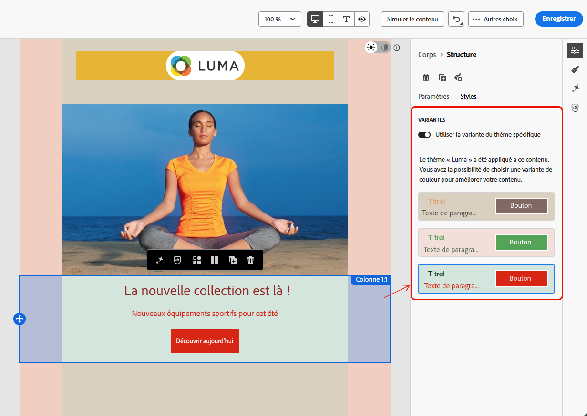

   Dans cet exemple, la première variante de couleur du thème actuel est appliquée à l’ensemble du contenu de l’e-mail, mais la troisième variante de couleur est appliquée à la structure sélectionnée. Vous pouvez constater que les couleurs d’arrière-plan du corps et du viewport pour cette structure spécifique sont différentes du reste du contenu.

Vous pouvez baculer entre les thèmes à tout moment. Le contenu de l’e-mail reste inchangé, mais les styles sont mis à jour pour refléter le nouveau thème.

### Déverrouiller les styles {#unlocking-styles}

Lorsqu’un composant est sélectionné, vous pouvez toujours déverrouiller son style à l’aide de l’icône dédiée dans l’onglet **[!UICONTROL Styles]**.

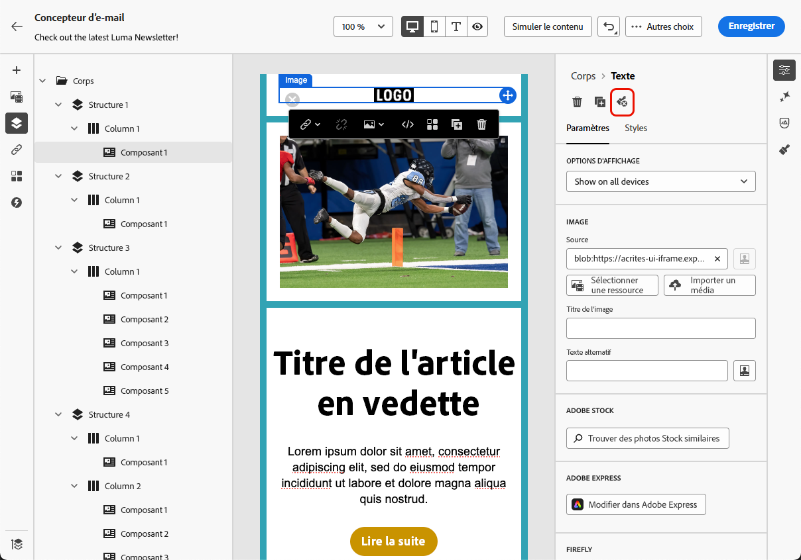{width="90%"}

Le thème sélectionné est toujours appliqué à ce composant, mais vous pouvez remplacer ses éléments de style. Si vous modifiez les thèmes, le nouveau thème n’est appliqué qu’aux éléments de style qui n’ont pas été remplacés.<!--can you revert this action?-->

Par exemple, si vous déverrouillez un composant de texte, vous pouvez modifier <!--the font size from 11 to 14 and -->la couleur de la police de noir à rouge :

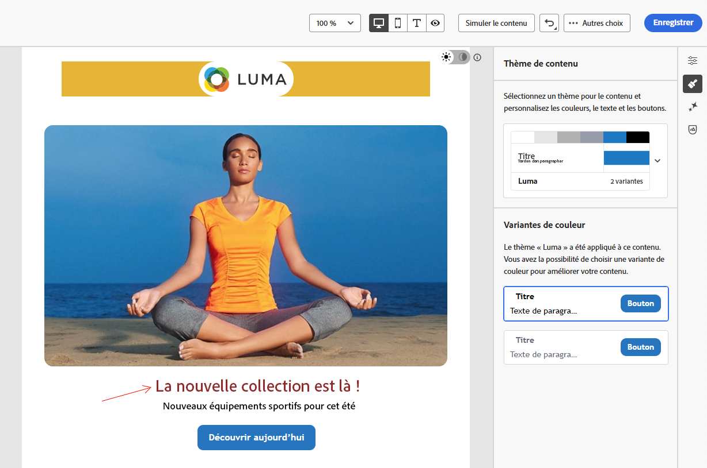{width="80%" align="center" zoomable="yes"}

Si vous modifiez les thèmes, <!--the font size is still 14 and -->la couleur de la police est toujours rouge pour ce composant, mais la couleur d’arrière-plan de ce composant changera avec le nouveau thème :

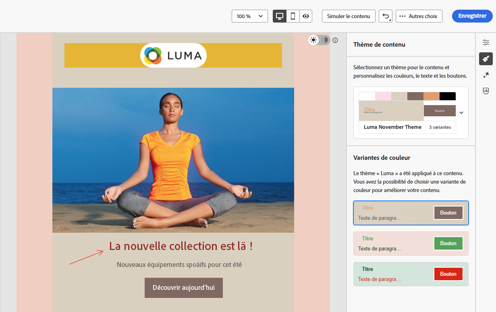{width="80%"}

## Utiliser les thèmes dans un fragment {#leverage-themes-fragment}

Pour exploiter un fragment dans un modèle ou un e-mail avec des [thèmes appliqués](#apply-themes-email), ce fragment doit avoir été créé lui-même à l’aide de thèmes. Sinon, vous ne pourrez pas utiliser ce fragment dans votre contenu à thème.

Pour créer un fragment compatible avec les thèmes, procédez comme suit.

1. Dans [!DNL Journey Optimizer], créez un fragment visuel, puis cliquez sur **[!UICONTROL Créer]** pour concevoir le contenu de votre fragment. [Voici comment procéder](../content-management/create-fragments.md)

1. Sélectionnez **[!UICONTROL Utiliser des thèmes]** pour commencer avec un thème de style prédéfini.

   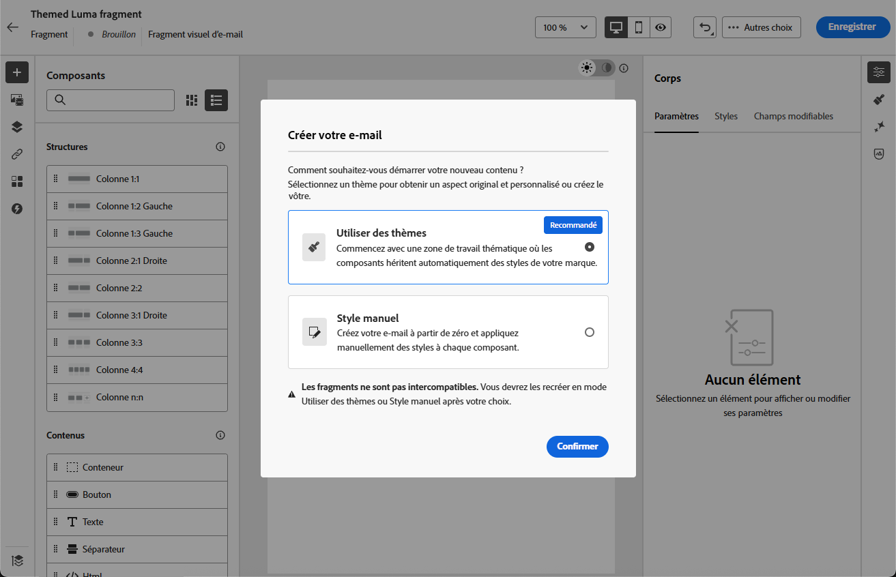{width="100%"}

   >[!CAUTION]
   >
   >Si vous choisissez le mode Style manuel, vous ne pourrez appliquer aucun thème à moins de réinitialiser la conception de votre fragment.

1. Une fois dans le Concepteur d’e-mail, vous pouvez commencer à créer votre fragment.

1. Cliquez sur le bouton **[!UICONTROL Thèmes]** sur le rail de droite. Le thème par défaut s’affiche. Vous pouvez basculer entre les différentes variantes de couleur de ce thème.

   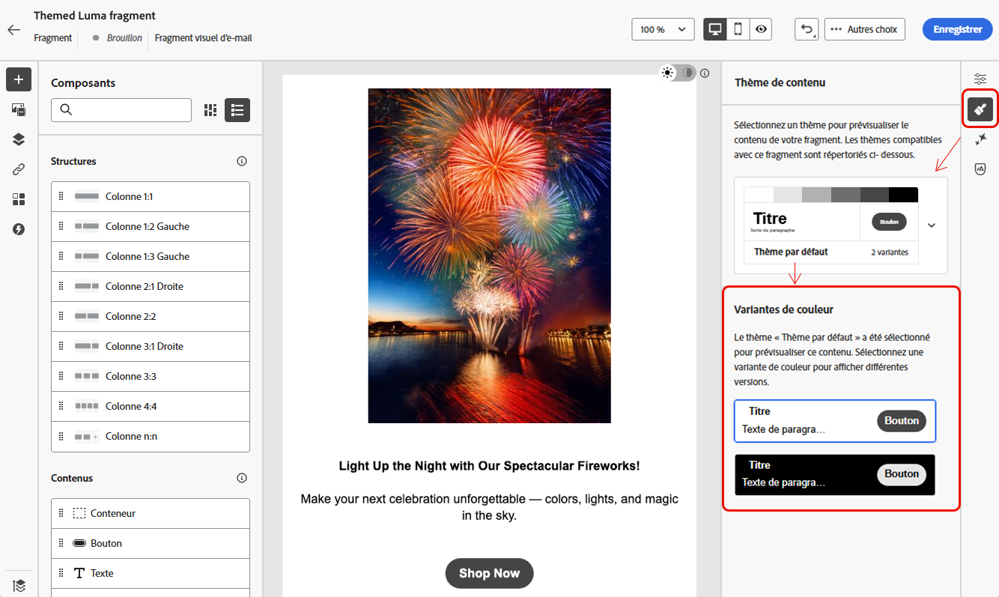{width="100%" align="center" zoomable="yes"}

1. Vous pouvez sélectionner d’autres thèmes pour prévisualiser le contenu de votre fragment. Pour ce faire, sélectionnez la flèche en regard du thème par défaut, puis cliquez sur **[!UICONTROL Sélectionner des thèmes]**.

   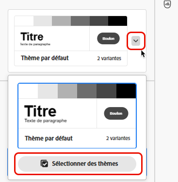{width="40%"}

1. Vous pouvez naviguer entre les onglets **[!UICONTROL Thèmes Adobe]** et **[!UICONTROL Mes thèmes]** et sélectionner jusqu’à cinq thèmes compatibles (dans les deux onglets) pour votre fragment.

   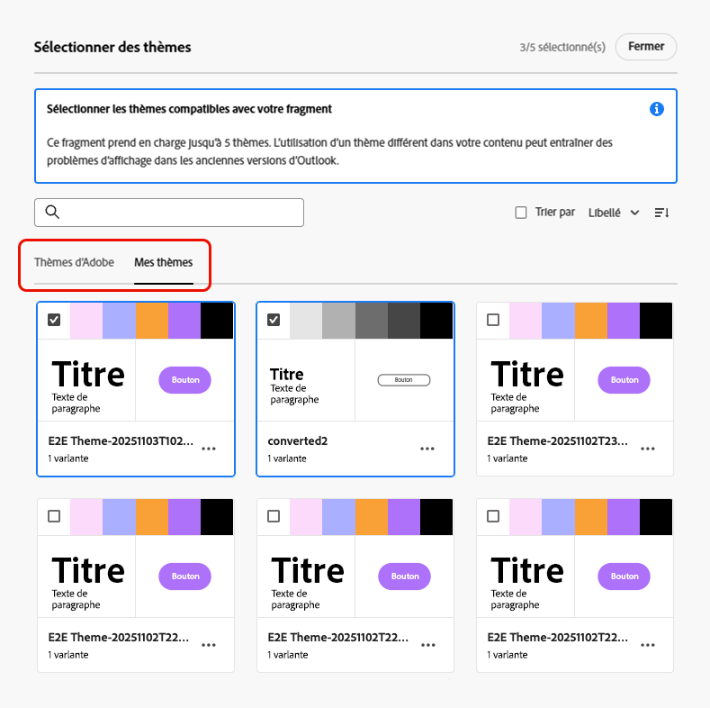{width=70%}

   >[!CAUTION]
   >
   >Lors de l’utilisation du fragment dans le contenu d’un e-mail, veillez à [appliquer un thème](#apply-themes-email) que vous avez défini pour ce fragment. Si vous ne le faites pas, vous risquez de rencontrer des problèmes d’affichage, en particulier dans Outlook 2021 et les versions précédentes.

1. Cliquez sur **[!UICONTROL Fermer]**.

1. Sélectionnez à nouveau la flèche en regard du **[!UICONTROL Thème par défaut]**. Vous pouvez désormais basculer entre les différents thèmes que vous venez de sélectionner pour prévisualiser chaque rendu de style.

   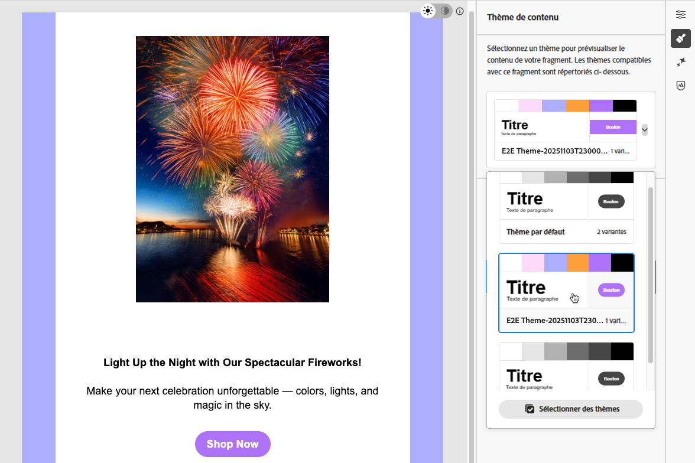{width=90%}

1. Cliquez de nouveau sur **[!UICONTROL Sélectionner des thèmes]** pour ajouter d’autres thèmes ou modifier votre sélection.

## Rendre un modèle compatible avec les thèmes {#theme-convertor}

[!DNL Journey Optimizer] vous permet de convertir un modèle créé à l’aide d’un style manuel en un contenu compatible avec le thème. Cela peut s’avérer particulièrement utile si vous avez créé des modèles de contenu avant l’introduction des thèmes dans [!DNL Journey Optimizer] ou si vous importez des contenus externes.

>[!NOTE]
>
> Seuls les **modèles d’e-mail** peuvent être convertis pour être compatibles avec les thèmes. Les e-mails individuels ne peuvent pas être convertis. Vous devez d’abord enregistrer votre contenu en tant que modèle.

1. Ouvrez un [modèle de contenu](../content-management/create-content-templates.md) d’e-mail et modifiez son contenu à l’aide du Concepteur d’e-mail.

1. Sélectionnez l’icône **[!UICONTROL Thèmes]** sur le rail de droite et cliquez sur le bouton **[!UICONTROL Générer le thème à partir du contenu]**.

   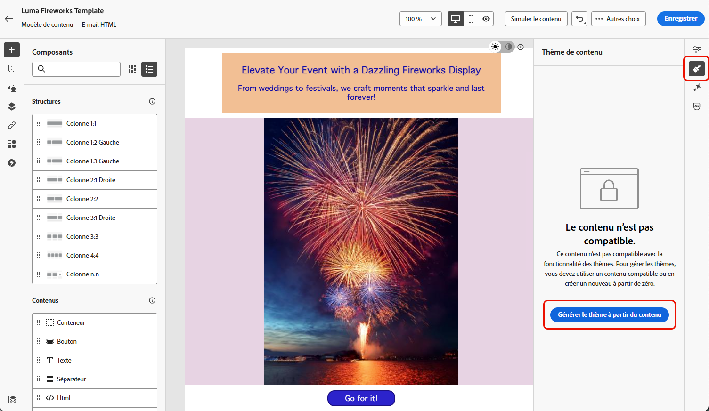{width=100%}

1. La fenêtre **[!UICONTROL Créer un thème]** s’ouvre. [!DNL Journey Optimizer] détecte automatiquement les éléments de style et les consolide dans un nouveau thème.

   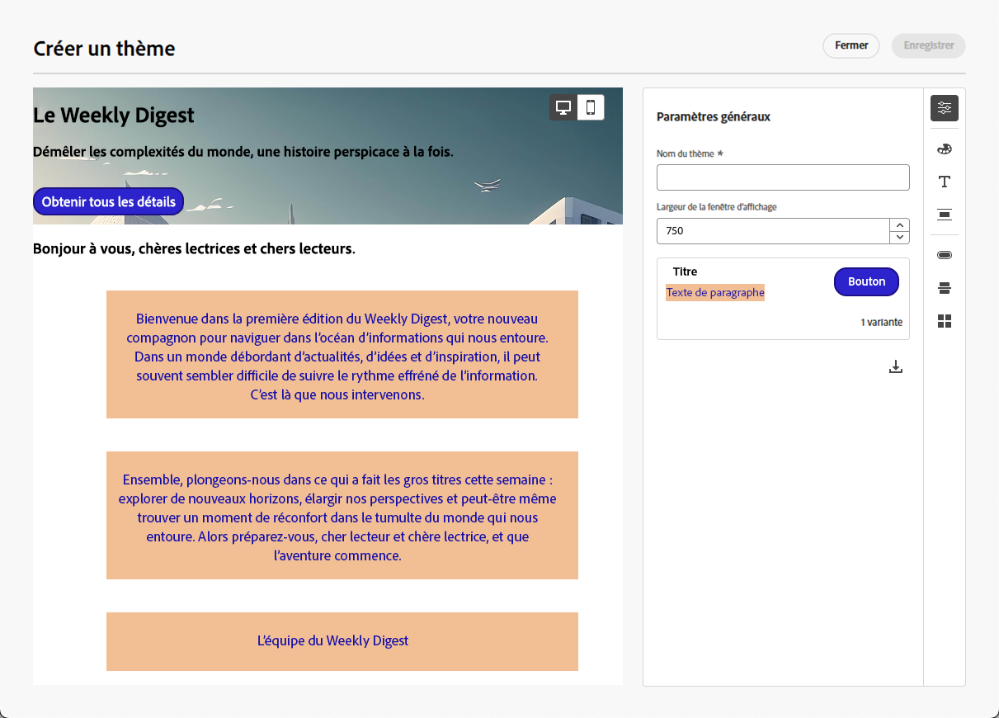{width=90%}

1. Attribuez un nom à votre thème.

1. Effectuez vos propres ajustements si nécessaire, comme vous le faites lors de la création d’un thème à partir de zéro ; vous pouvez ajouter une variante de couleur, modifier les polices, etc. [Voici comment procéder](#create-and-edit-themes)

   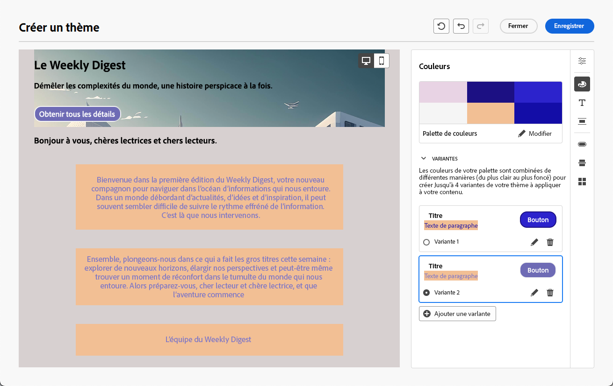{width=90%}

1. Cliquez sur **[!UICONTROL Enregistrer]** pour stocker ce nouveau thème afin de le réutiliser. Vous pouvez maintenant appliquer ce thème à vos contenus, comme n’importe quel autre thème. [Voici comment procéder](#apply-themes-email)