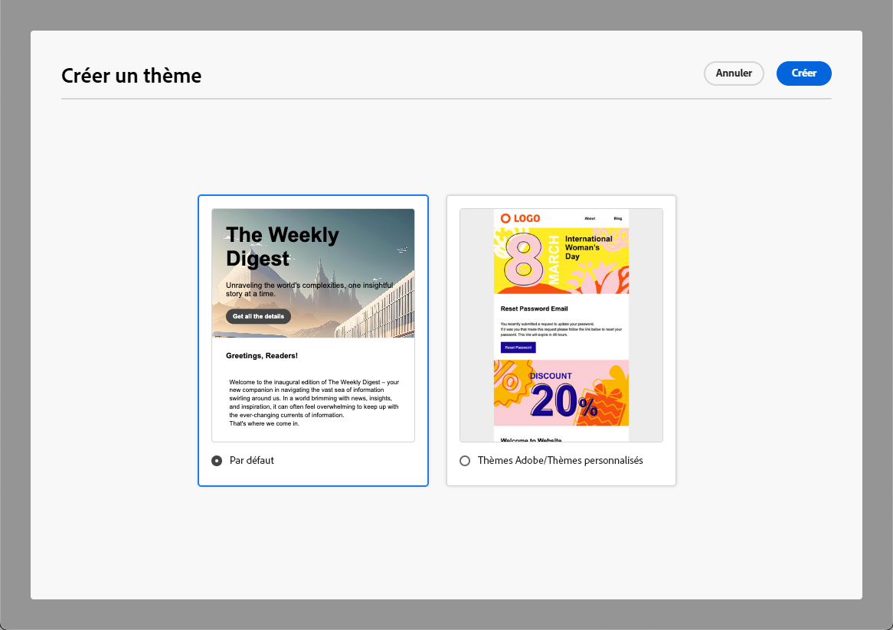

# Appliquer des thèmes au contenu de votre e-mail {#apply-email-themes}

>[!CONTEXTUALHELP]
>id="ajo_use_theme"
>title="Appliquer un thème à votre e-mail"
>abstract="Sélectionnez un thème pour votre e-mail afin d’appliquer rapidement un style spécifique adapté à votre marque et à votre conception."

<!--This documentation provides a comprehensive guide to using themes to streamline your email creation process. With the ability to define reusable themes and leverage pre-designed modules, marketers can create professional, brand-aligned emails faster and with less effort.-->

>[!AVAILABILITY]
>
>Cette fonctionnalité est actuellement en version Beta et disponible uniquement pour les clientes et clients Beta. Pour rejoindre le programme bêta, contactez votre représentant ou représentante Adobe.

Grâce aux thèmes, les utilisateurs et les utilisatrices non techniques ont la possibilité de créer du contenu réutilisable adapté à une marque et une langue de conception spécifiques en ajoutant un style personnalisé aux modèles standard<!-- to achieve brand specific results-->.

Cette fonctionnalité permet aux spécialistes du marketing d’utiliser plus rapidement et à moindre effort des e-mails visuellement attrayants et conformes à la marque, tout en fournissant des options de personnalisation avancées pour des besoins de conception uniques.

<!--What is the Enhanced Email Authoring Experience?

This feature introduces two key components to simplify and enhance email creation:

* **Theme Management System**: A centralized system for creating, customizing, and applying reusable themes to emails. Themes ensure consistent styling across campaigns and eliminate the need for repetitive manual styling.

* **Modules**: Pre-designed, reusable content blocks that abstract common email elements (e.g., titles, descriptions, images, and links). Modules are built using customizable low-level components, offering flexibility while maintaining design standards.

Key Benefits:

- **Consistency**: Ensure all emails align with your brand's design guidelines.
- **Efficiency**: Save time by reusing themes and modules across campaigns.
- **Customization**: Add custom CSS and mobile-specific styles for advanced designs.
- **Scalability**: Eliminate repetitive styling tasks, enabling faster email creation.-->

## Mécanismes de sécurisation et limitations {#themes-guardrails}

* Lors de la création d’un e-mail en partant de zéro, vous pouvez choisir de commencer à créer votre contenu à l’aide d’un thème afin d’appliquer rapidement un style spécifique adapté à votre marque et à votre conception.

  Si vous choisissez le mode Style manuel, vous ne pourrez appliquer aucun thème à moins de réinitialiser votre e-mail.

* Les [fragments](../content-management/fragments.md) ne sont pas compatibles entre les modes Utiliser des thèmes et Style manuel.

  Pour pouvoir utiliser un fragment dans un contenu auquel un thème est appliqué, ce fragment doit être créé en mode Utiliser des thèmes.

* Si vous utilisez du contenu créé en HTML, vous serez en [mode de compatibilité](existing-content.md) et vous ne pourrez pas appliquer de thèmes à ce contenu.

  Pour tirer pleinement parti de toutes les fonctionnalités du Concepteur d’e-mail, y compris les thèmes, vous devez soit créer du contenu en mode Utiliser des thèmes, soit convertir le contenu HTML importé. [En savoir plus](existing-content.md)

<!--If using a content created in Manual Styling mode or HTML, you cannot apply themes to this content. You must create a new content in Use Themes mode.

If you apply a theme to a content using a [fragment](../content-management/fragments.md) created in Manual Styling mode, the rendering may not be optimal.-->

## Créer un thème {#create-and-edit-themes}

Pour définir un thème que vous pouvez utiliser dans les futurs contenus d’e-mail, procédez comme suit.

1. Pour commencer, créez un [modèle de contenu](../content-management/create-content-templates.md).

1. Sélectionnez l’option **[!UICONTROL Créer ou modifier des thèmes]**.

   

1. Vous pouvez sélectionner le thème par défaut ou utiliser un modèle Adobe ou personnalisé. Dans cet exemple, sélectionnez le thème par défaut et cliquez sur **[!UICONTROL Créer]**.

   

1. Dans l’onglet **[!UICONTROL Paramètres généraux]**, commencez à définir votre thème en lui donnant un nom spécifique pour votre marque. Vous pouvez ajuster la largeur par défaut de vos e-mails et exporter le thème actuel pour le [partager sur plusieurs sandbox](../configuration/copy-objects-to-sandbox.md).

   <!---->

1. Utilisez le rail à droite pour parcourir les différents onglets et mettre à jour vos paramètres de conception.

   

1. Dans l’onglet **[!UICONTROL Couleurs]** :

   * Utilisez le bouton **[!UICONTROL Modifier]** pour configurer une **[!UICONTROL palette de couleurs]** avec les couleurs par défaut de votre marque. Sélectionnez un **[!UICONTROL préréglage]** pour créer rapidement un jeu de couleurs ou ajuster chaque couleur de votre thème individuellement. Vous pouvez également utiliser une combinaison des deux.

     

   * Cliquez sur **[!UICONTROL Ajouter une variante]** pour créer plusieurs variantes de couleurs, telles que le mode clair et le mode sombre, où chaque variante a sa propre palette de couleurs et ses propres commandes de nuances.

     

   * Pour chaque variante, cliquez sur l’icône Modifier pour modifier un élément individuel. Vous pouvez utiliser la palette par défaut que vous avez créée ou n’importe quelle couleur personnalisée.

     

1. Dans les **[!UICONTROL Paramètres de texte]**, vous pouvez définir la police globale que vous souhaitez utiliser pour l’ensemble du thème. Pour un contrôle plus granulaire, vous pouvez également modifier chaque en-tête et type de paragraphe pour ajuster la police, la taille, le style, etc.

   

1. Dans l’onglet **[!UICONTROL Espacement]**, sélectionnez un élément dans la liste pour l’espacer correctement entre les différents composants.

   <!---->

1. En utilisant les autres onglets sur la droite, vous pouvez gérer séparément chaque élément de bouton, séparateur, mise en forme d’image supplémentaire et espacement de la disposition de la grille pour ce thème.

   <!---->

1. Cliquez sur **[!UICONTROL Enregistrer]** pour stocker ce thème en vue d’une utilisation ultérieure.

## Appliquer des thèmes à un e-mail {#apply-themes}

Pour appliquer des thèmes de style par défaut ou personnalisés à un e-mail, procédez comme suit.

1. Dans [!DNL Journey Optimizer], [ajoutez une action d’e-mail](create-email.md) à un parcours ou à une campagne et [modifiez le corps de l’e-mail](get-started-email-design.md#key-steps).

1. Vous pouvez sélectionner l’une des actions suivantes :

   * Sélectionnez un [modèle d’e-mail](use-email-templates.md) intégré pour ouvrir le Concepteur d’e-mail. Un thème par défaut spécifique à chaque modèle est automatiquement appliqué.

   * Créez du [contenu à partir de zéro](content-from-scratch.md) et sélectionnez **[!UICONTROL Utiliser un thème]** pour commencer avec un thème de style prédéfini.

     

     >[!CAUTION]
     >
     >Si vous choisissez le mode Style manuel, vous ne pourrez appliquer aucun thème à moins de réinitialiser votre e-mail.
     >
     >Pour utiliser un [fragment](../content-management/fragments.md) en mode Utiliser des thèmes, celui-ci doit avoir été créé lui-même à l’aide du mode Utiliser des thèmes.

1. Une fois dans le Concepteur d’e-mail, cliquez sur le bouton **[!UICONTROL Thèmes]** sur le rail de droite. Le thème par défaut ou le thème du modèle s’affiche. Vous pouvez basculer entre les deux variantes de couleur de ce thème.

   

1. Cliquez sur la flèche en regard du thème actuellement utilisé. La liste des thèmes personnalisés et Adobe disponibles s’affiche.

   

1. Cliquez sur **[!UICONTROL Thèmes personnalisés]** et sélectionnez le thème que vous avez créé.

   

1. Cliquez en dehors de la liste déroulante. Le thème personnalisé nouvellement sélectionné applique automatiquement ses styles à tous les composants d’e-mail. Vous pouvez basculer entre les deux variantes de couleur.

1. Lorsqu’un composant est sélectionné, vous pouvez toujours déverrouiller son style à l’aide de l’icône dédiée.

   

Vous pouvez baculer entre les thèmes à tout moment. Le contenu de l’e-mail reste inchangé, mais les styles sont mis à jour pour refléter le nouveau thème.

<!--
>[!NOTE]
> - Themes apply styles globally. Ensure your theme is finalized before applying it to multiple emails.
> - Switching themes may override custom styles applied to individual components.

>[!CAUTION]
> - When using fragments, the email's theme will override the fragment's styles. A warning will be displayed in the editor if there is a conflict.

## Example Use Cases {#example-use-cases}

### 1. Creating a New Theme
- A marketer creates a theme with their brand's colors, fonts, and button styles.
- The theme is saved and reused across multiple email campaigns.

### 2. Switching Themes
- A marketer applies a holiday-themed design to an existing email by switching to a pre-designed holiday theme.-->
