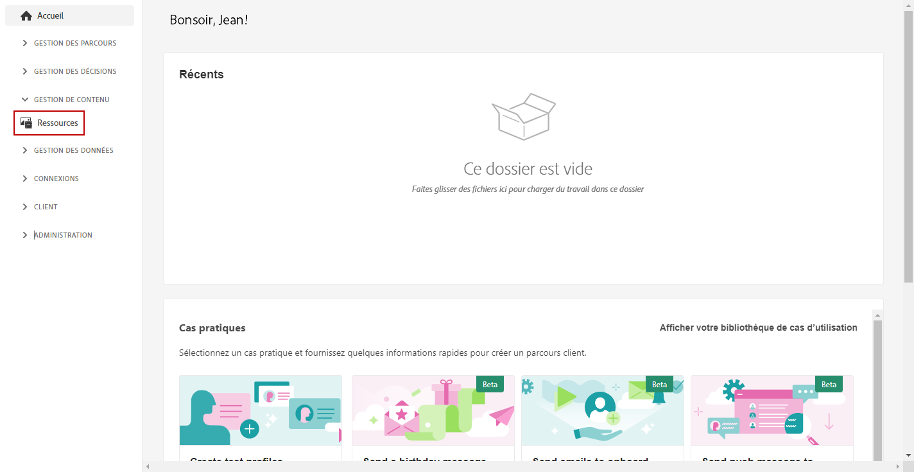
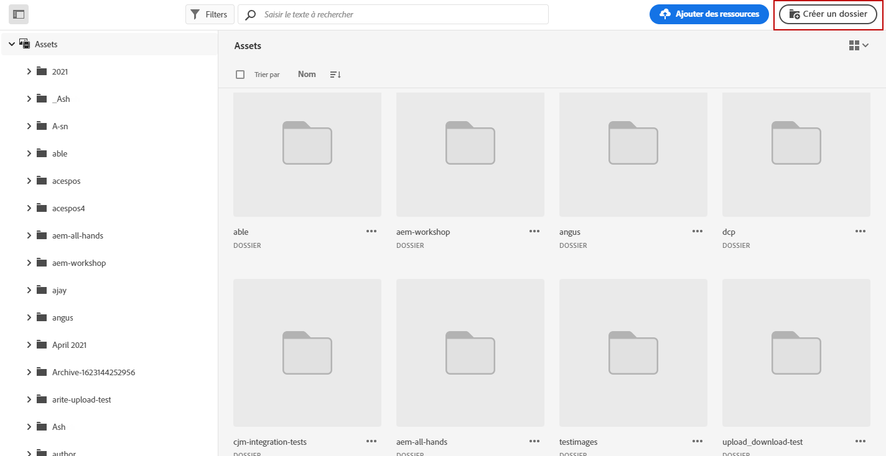
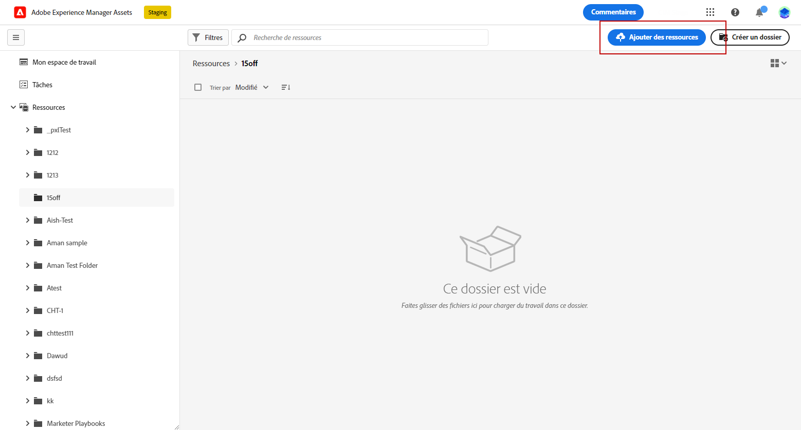
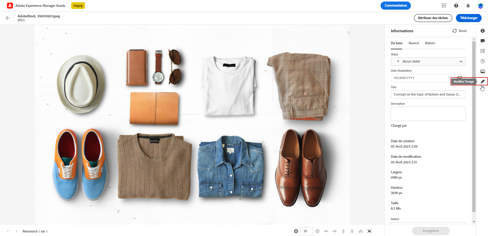
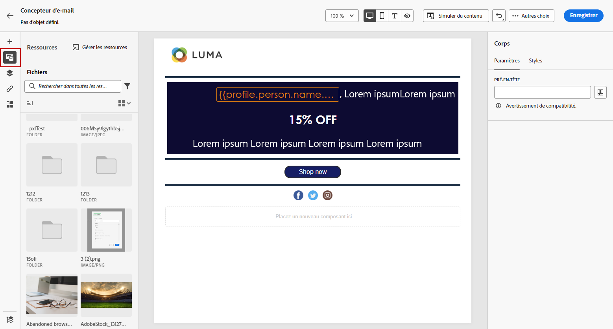
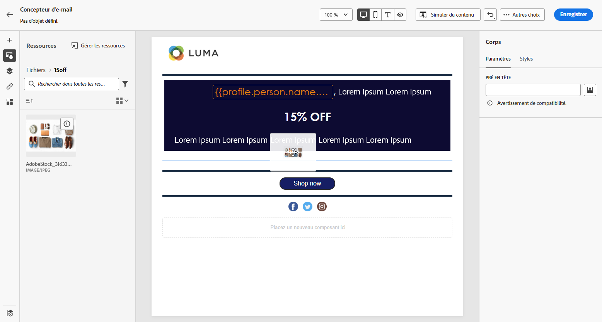

# Création et gestion de ressources avec [!DNL Assets Essentials]{#experience-manager-assets}

## Prise en main d’ [!DNL Assets Essentials] {#get-started-assets-essentials}

Rassembler les workflows marketing et créatifs à l’aide de [!DNL Adobe Experience Manager Assets Essentials]. Intégrée nativement à [!DNL Adobe Journey Optimizer], accès [!DNL Assets Essentials] pour stocker, gérer, découvrir et distribuer des ressources numériques. Il fournit un référentiel unique et centralisé de ressources que vous pouvez utiliser pour remplir vos messages.

[!DNL Adobe Experience Manager Assets Essentials] est un espace de travail collaboratif et centralisé sur les ressources qui étend votre système de création et unifie les ressources numériques pour la diffusion de l’expérience. Vous pouvez facilement organiser, baliser et rechercher des ressources de production approuvées pour garantir la cohérence de la marque entre les équipes. Grâce à son expérience utilisateur intuitive, l’accès [!DNL Assets Essentials] pour partager instantanément des ressources dans vos applications Adobe Creative Cloud et Experience Cloud.

En savoir plus dans [Documentation sur Adobe Experience Manager Assets Essentials](https://experienceleague.adobe.com/docs/experience-manager-assets-essentials/help/introduction.html){target=&quot;_blank&quot;}.

[!DNL Adobe Experience Manager Assets Essentials] est accessible directement depuis [!DNL Adobe Journey Optimizer] dans le menu de gauche **[!UICONTROL Assets]** . Vous pouvez également accéder aux ressources et aux dossiers lorsque [conception d&#39;un contenu d&#39;email](get-started-email-design.md).

## Conditions préalables{#assets-prerequisites}

Avant d’utiliser [!DNL Adobe Experience Manager Assets Essentials], vous devez ajouter des utilisateurs au **Utilisateurs clients Assets Essentials** ou/et **Utilisateurs d’Assets Essentials** Profils de produit. En savoir plus dans [Documentation Assets Essentials](https://experienceleague.adobe.com/docs/experience-manager-assets-essentials/help/deploy-administer.html){target=&quot;_blank&quot;}.

>[!NOTE]
>Pour les produits Journey Optimizer obtenus avant le 6 janvier 2022, vous devez déployer [!DNL Adobe Experience Manager Assets Essentials] pour votre organisation. En savoir plus dans la section [Déploiement des éléments essentiels d’Assets](https://experienceleague.adobe.com/docs/experience-manager-assets-essentials/help/deploy-administer.html)section {target=&quot;_blank&quot;}.

## Chargement et insertion de ressources{#add-asset}

Pour importer des fichiers dans [!DNL Assets Essentials], vous devez d’abord parcourir ou créer le dossier dans lequel il sera stocké. Vous pourrez alors les insérer dans le contenu de votre email.

Pour plus d’informations sur le chargement de ressources, reportez-vous à la section [Documentation sur Adobe Experience Manager Assets Essentials](https://experienceleague.adobe.com/docs/experience-manager-assets-essentials/help/add-delete.html){target=&quot;_blank&quot;}.

1. De [!DNL Adobe Journey Optimizer] page d’accueil, sélectionnez **[!UICONTROL Assets]** sous l’onglet **[!UICONTROL Content management]** pour accéder à [!DNL Assets Essentials].

   

1. Double-cliquez sur un dossier dans la section centrale ou dans l’arborescence pour l’ouvrir.

   Vous pouvez également cliquer sur **[!UICONTROL Create folder]** pour créer un dossier.

   

1. Une fois dans le dossier sélectionné ou créé, cliquez sur **[!UICONTROL Add Assets]** pour charger une nouvelle ressource dans votre dossier.

   

1. Dans la **[!UICONTROL Upload files]**, cliquez sur **[!UICONTROL Browse]** et choisissez si vous souhaitez **[!UICONTROL Browse files]** ou **[!UICONTROL Browse folders]**.

   

1. Sélectionnez le fichier que vous souhaitez charger. Lorsque vous avez terminé, cliquez sur **[!UICONTROL Upload]**.

   Pour en savoir plus sur la gestion de vos ressources, reportez-vous à cette section [page](https://experienceleague.adobe.com/docs/experience-manager-assets-essentials/help/manage-organize.html).

1. Une fois votre ressource téléchargée, vous pouvez désormais insérer vos ressources dans l’un de vos messages à l’aide du Concepteur d’email.

   Votre ressource peut également être modifiée plus en détail à l’aide de la fonction **Modifier** mode de [!DNL Assets Essentials]. [En savoir plus](https://experienceleague.adobe.com/docs/experience-manager-assets-essentials/help/edit-images.html){target=&quot;_blank&quot;}.

   

1. De [!DNL Adobe Journey Optimizer], sélectionnez **[!UICONTROL Asset picker]** dans le volet gauche du concepteur d&#39;email.

   

1. Sélectionnez votre **[!UICONTROL Assets]** dossier. Vous pouvez également rechercher votre ressource ou votre dossier dans la barre de recherche.

1. Placez votre ressource dans le contenu de votre email.

   

1. Vous pouvez personnaliser davantage vos ressources, par exemple en ajoutant un lien externe ou du texte à l’aide du **[!UICONTROL Components settings]**. [En savoir plus sur les paramètres des composants](content-components.md)

   

   <!--
    After adding your asset to your email, use the **[!UICONTROL Find similar Stock photos]** option to locate Stock photos that match the content, color, and composition of your image. [Learn more about Adobe Stock](stock.md).

    Note that this option is available for licensed/unlicensed Stock images and images from your Assets folder. 

    
    -->