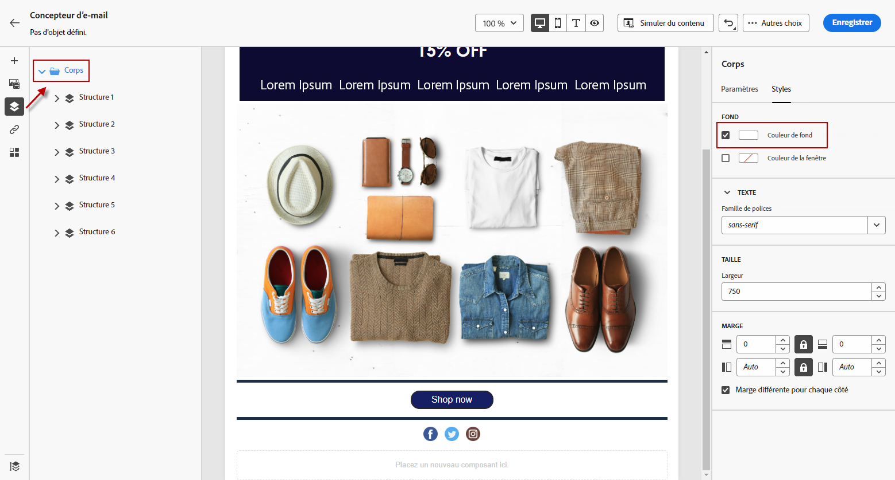
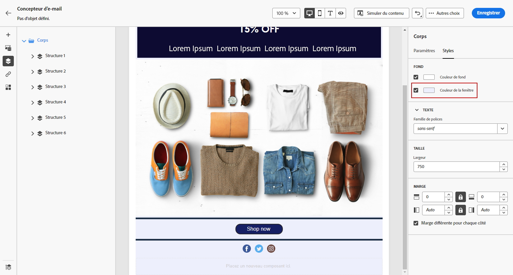
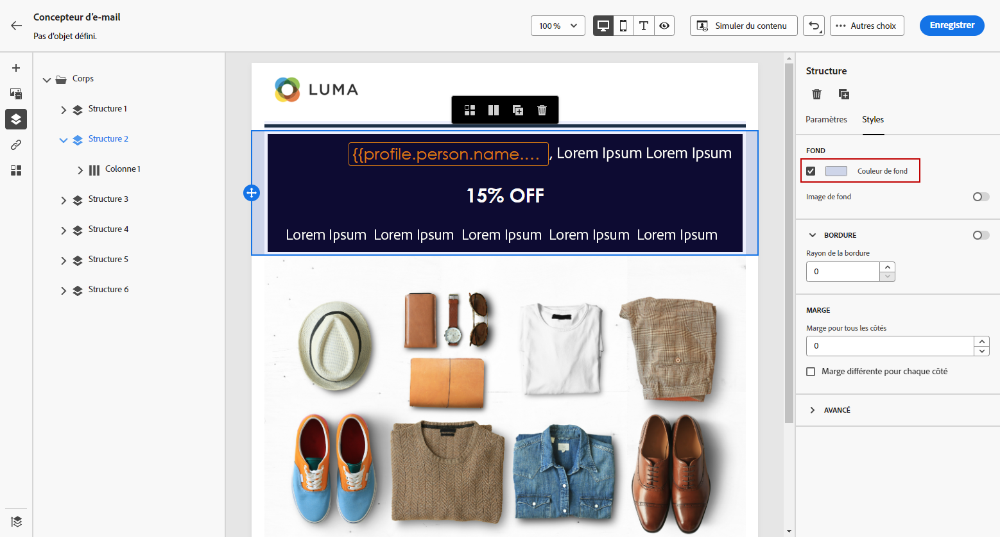
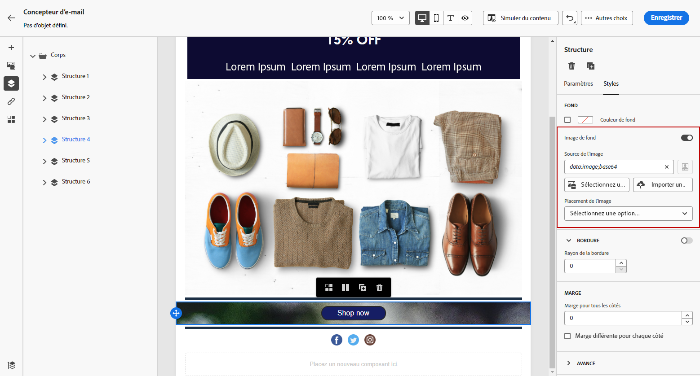

# Personnaliser l&#39;arrière-plan de votre e-mail {#backgrounds}

>[!CONTEXTUALHELP]
>id="ac_edition_backgroundimage"
>title="Paramètres d&#39;arrière-plan"
>abstract="Vous pouvez personnaliser la couleur ou l’image d’arrière-plan de votre contenu. Notez que l’image d’arrière-plan n’est pas prise en charge par tous les clients de messagerie."

Lorsqu’il s’agit de définir des arrière-plans avec le concepteur d’e-mail, Adobe recommande ce qui suit :

1. Appliquez une couleur de fond au corps de votre email, si votre conception l’exige.
1. En règle générale, définissez les couleurs d’arrière-plan au niveau de la colonne.
1. Essayez de ne pas utiliser de couleurs de fond sur les composants d’image ou de texte, car ceux-ci sont difficiles à gérer.

Vous trouverez ci-dessous les paramètres d’arrière-plan que vous pouvez utiliser.

* Définissez une **[!UICONTROL Couleur d’arrière-plan]** pour l’ensemble de l’e-mail. Assurez-vous de sélectionner les paramètres du corps dans l&#39;arborescence de navigation accessible à partir de la palette gauche.

  

* Définissez la même couleur d’arrière-plan pour tous les composants de structure en sélectionnant **[!UICONTROL Couleur d’arrière-plan de la fenêtre]**. Cette option vous permet de sélectionner un autre paramètre dans la couleur de fond.

  

* Définissez une couleur de fond différente pour chaque composant de structure. Sélectionnez une structure dans l’arborescence de navigation accessible via la palette de gauche pour n’appliquer une couleur de fond spécifique qu’à cette structure.

  Veillez à ne pas définir de couleur de fond de fenêtre, car celle-ci pourrait cacher les couleurs de fond de la structure.

  

* Définissez une **[!UICONTROL Image d’arrière-plan]** pour le contenu d’un composant de structure.

  >[!NOTE]
  >
  >Certaines messageries ne prennent pas en charge les images de fond. Si ces images ne sont pas prises en charge, la couleur d’arrière-plan de la ligne est utilisée à la place. Veillez à sélectionner une couleur de fond de secours appropriée au cas où l’image ne s’afficherait pas.

  

* Définissez une couleur de fond au niveau de la colonne.

  >[!NOTE]
  >
  >Il s’agit du cas pratique le plus courant. Adobe recommande de définir les couleurs de fond au niveau de la colonne, car cela donne une plus grande flexibilité lors de la modification du contenu entier de l’email.

  Vous pouvez également définir une image de fond au niveau de la colonne, mais ce scénario est rare.
