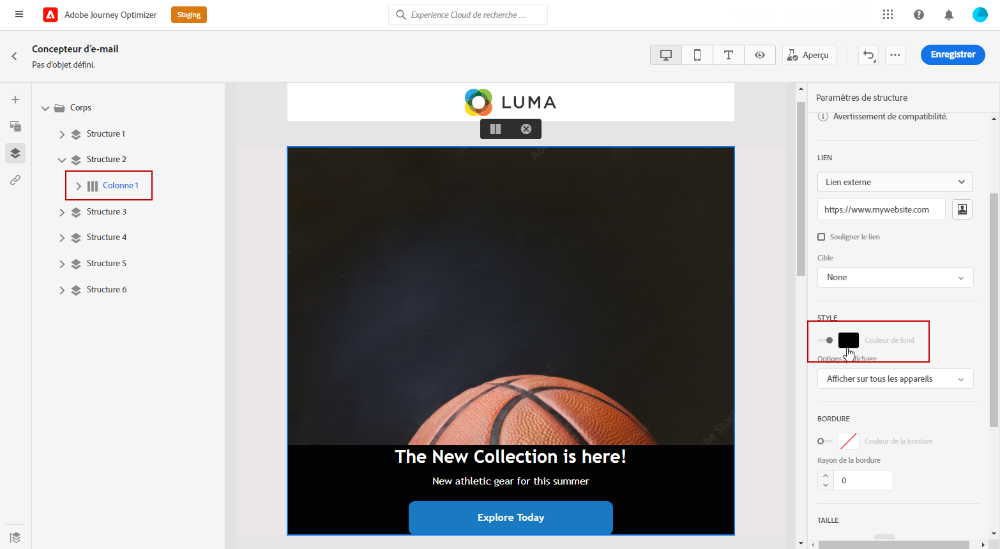

# Personnaliser l&#39;arrière-plan de votre email {#backgrounds}

>[!CONTEXTUALHELP]
>id="ac_edition_backgroundimage"
>title="Paramètres d’arrière-plan"
>abstract="Vous pouvez personnaliser la couleur d’arrière-plan ou l’image d’arrière-plan de votre contenu. Notez que l’image d’arrière-plan n’est pas prise en charge par tous les clients de messagerie."

Pour définir des arrière-plans avec le Concepteur d&#39;email, Adobe recommande les éléments suivants :

1. Appliquez une couleur d&#39;arrière-plan au corps de votre email si votre conception l&#39;exige.
1. En règle générale, définissez les couleurs d’arrière-plan au niveau de la colonne.
1. Essayez de ne pas utiliser de couleurs d’arrière-plan sur les composants d’image ou de texte, car ils sont difficiles à gérer.

Vous trouverez ci-dessous les paramètres d’arrière-plan disponibles que vous pouvez utiliser.

* Définir une **[!UICONTROL Background color]** pour l’ensemble de l’email. Veillez à sélectionner les paramètres du corps dans l&#39;arborescence de navigation accessible à partir de la palette gauche.

   

* Définissez la même couleur d’arrière-plan pour tous les composants de structure en sélectionnant **[!UICONTROL Viewport background color]**. Cette option permet de sélectionner un paramètre différent de la couleur d’arrière-plan.

   

* Définissez une couleur d’arrière-plan différente pour chaque composant de structure. Sélectionnez une structure dans l&#39;arborescence de navigation accessible à partir de la palette gauche pour appliquer une couleur d&#39;arrière-plan spécifique uniquement à cette structure.

   Veillez à ne pas définir de couleur d’arrière-plan de fenêtre d’affichage, car elle peut masquer les couleurs d’arrière-plan de la structure.

   

* Définir une **[!UICONTROL Background image]** pour le contenu d’un composant de structure.

   >[!NOTE]
   >
   >Certains programmes de messagerie ne prennent pas en charge les images d’arrière-plan. Lorsqu’elle n’est pas prise en charge, la couleur d’arrière-plan de la ligne est utilisée à la place. Veillez à sélectionner une couleur d’arrière-plan de secours appropriée si l’image ne peut pas être affichée.

   

* Définissez une couleur d’arrière-plan au niveau de la colonne.

   >[!NOTE]
   >
   >Il s’agit du cas d’utilisation le plus courant. Adobe recommande de définir les couleurs d’arrière-plan au niveau des colonnes, car cela offre plus de flexibilité lors de la modification de l’ensemble du contenu de l’email.

   Vous pouvez également définir une image d’arrière-plan au niveau de la colonne, mais celle-ci est rarement utilisée.

   
