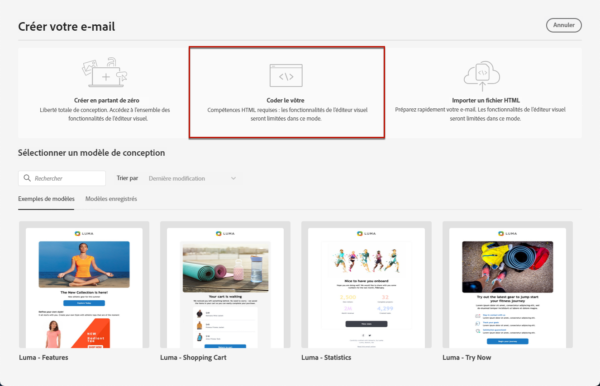
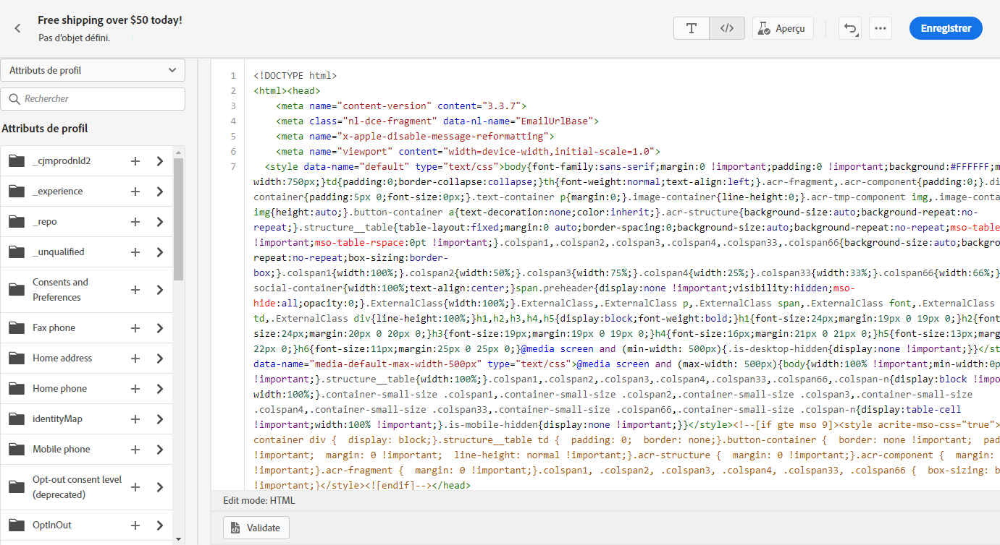
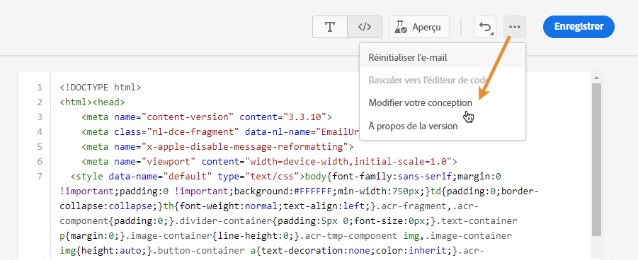
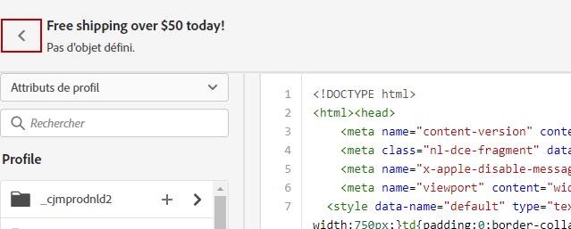

# Coder votre propre contenu {#code-content}

Utilisez le mode **[!UICONTROL Coder votre propre contenu]** pour importer du code HTML brut et/ou coder votre contenu d’e-mail. Cette méthode nécessite des compétences HTML.

➡️ [Découvrez cette fonctionnalité en vidéo.](#video)

>[!CAUTION]
>
> Les images provenant d’[Adobe Experience Manager Assets](../integrations/assets.md) ne peuvent pas être référencées lors de l’utilisation de cette méthode. Les images référencées dans votre code HTML doivent être stockées dans un emplacement public.

1. Dans la page d’accueil du concepteur d’e-mail, sélectionnez **[!UICONTROL Coder le vôtre]**.

   

1. Saisissez ou collez votre code HTML brut.

1. Utilisez le volet de gauche pour tirer parti des fonctionnalités de personnalisation [!DNL Journey Optimizer]. [En savoir plus](../personalization/personalize.md)

   

   >[!NOTE]
   >
   >L’éditeur de personnalisation de la Designer d’e-mail présente certaines limitations de fonction par rapport aux expressions de parcours. [En savoir plus sur les limitations des fonctions date/heure](#date-time-limitations)

1. Pour effacer le contenu de votre e-mail et en recréer un à partir d’une nouvelle conception, sélectionnez **[!UICONTROL Modifier votre conception]** dans le menu Options.

   

   >[!NOTE]
   >
   >Cette action ouvre le modèle sélectionné dans le concepteur d’e-mail. À partir de là, vous pouvez soit terminer la conception de votre e-mail, soit revenir à l’éditeur de code à l’aide de l’option **[!UICONTROL Basculer vers l’éditeur de code]**.

1. Cliquez sur le bouton **[!UICONTROL Aperçu]** pour vérifier la conception et la personnalisation des messages à l’aide de profils de test. [En savoir plus](../content-management/preview-test.md)

   

1. Une fois votre code prêt, cliquez sur **[!UICONTROL Enregistrer]**, puis revenez à l’écran de création du message pour finaliser votre message.

   

## Limites des fonctions de date et d’heure {#date-time-limitations}

Lors de l’utilisation de la personnalisation dans l’éditeur de code d’Email Designer, la fonction `now()` n’est pas disponible pour les calculs de date dynamiques.

>[!IMPORTANT]
>
>La fonction `now()` n’est **pas prise en charge** dans le langage d’expression du créateur d’e-mail. Bien que `now()` soit disponible dans des conditions de parcours, il ne peut pas être utilisé dans le contenu d’e-mail ou l’éditeur de code.

**Alternatives disponibles :**

Utilisez les fonctions suivantes pour utiliser la date et l’heure actuelles dans la personnalisation d’e-mail :

* **`getCurrentZonedDateTime()`** - Renvoie la date et l’heure actuelles avec les informations de fuseau horaire. Il s’agit de l’alternative recommandée à `now()`.

  Exemple : `` renvoie `2024-12-06T17:22:02.281067+05:30[Asia/Kolkata]`

* **`currentTimeInMillis()`** - Renvoie l’heure actuelle en millisecondes Epoch.

  Exemple : ``

**Solutions recommandées :**

Si vous devez effectuer des calculs de date dans le contenu de votre e-mail :

* **Précalculer les champs de date** - Calculez les valeurs de date requises dans votre pipeline de données ou les attributs de profil avant d’envoyer l’e-mail, puis référencez ces valeurs précalculées dans votre personnalisation.

  Exemple : ``

* **Utiliser des fonctions de manipulation de date** - Utilisez des fonctions [date/heure](../personalization/functions/dates.md) telles que `dayOfYear()` ou `diffInDays()` avec des valeurs de date provenant d’attributs de profil.

  Exemple : ``

* **Utiliser les attributs calculés** - Créez [attributs calculés](../audience/computed-attributes.md) qui effectuent des calculs de date complexes, et qui rendent les résultats disponibles sous forme d’attributs de profil.

En savoir plus sur les fonctions [Date et heure](../personalization/functions/dates.md) dans la personnalisation.
