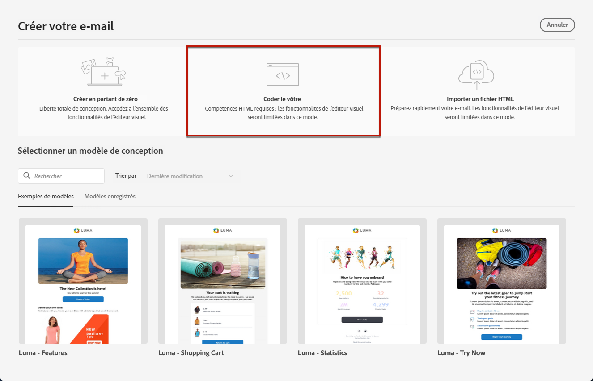
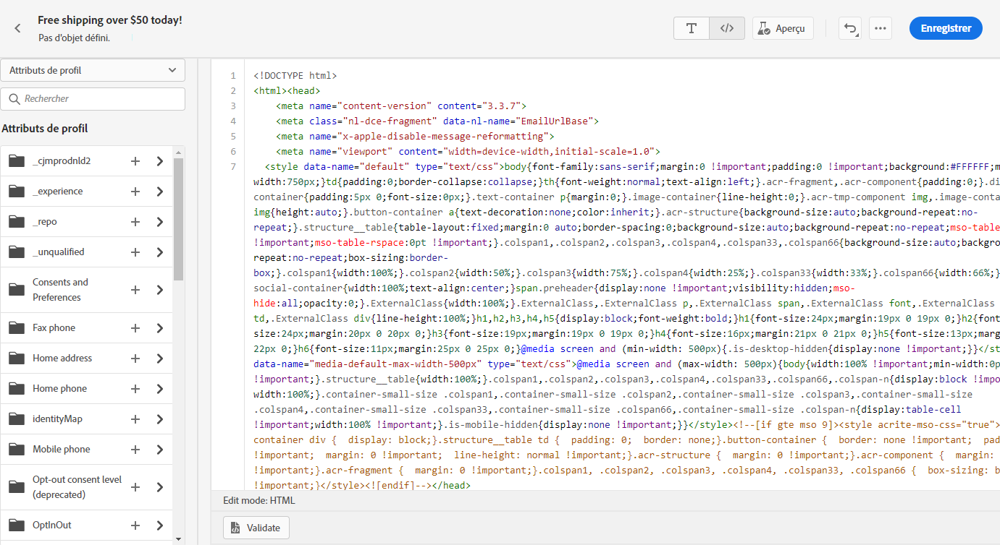
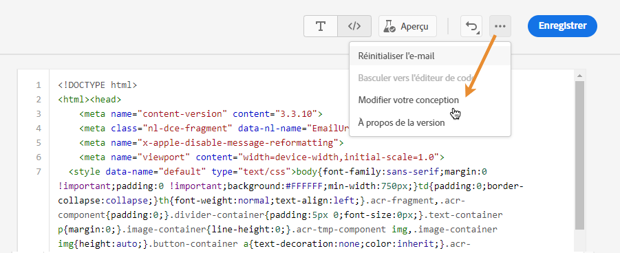
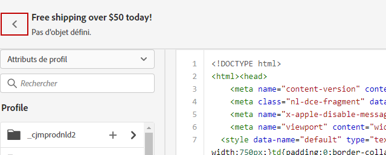

# Coder votre propre contenu {#code-content}

**[!UICONTROL Coder le vôtre]** vous permet d’écrire ou de coller du contenu HTML brut pour créer du contenu d’e-mail directement dans le Designer d’e-mail [!DNL Journey Optimizer]. Utilisez ce mode lorsque vous avez besoin d’un contrôle total sur les balises ou lors de l’importation d’HTML existantes.

Vous devez posséder des compétences HTML et, une fois ce mode sélectionné, vous restez dans l’éditeur de code ; vous ne pouvez pas passer à l’éditeur visuel.

➡️ [Découvrez cette fonctionnalité en vidéo](#video)

>[!NOTE]
>
>**[!UICONTROL Coder le vôtre]** n’est pas identique à l’éditeur HTML avancé dans les modèles de contenu. L’éditeur de code HTML avancé vous permet de basculer entre la vue HTML et la vue visuelle (bureau) à tout moment, et non l’éditeur de code. [En savoir plus sur l’éditeur HTML avancé](../content-management/email-template-expert-mode.md).

## Utiliser l’éditeur de code {#use-code-editor}

Pour créer ou modifier du contenu d’e-mail à l’aide de l’éditeur de code, procédez comme suit.

1. Sur la page d’accueil [Email Designer](get-started-email-design.md), sélectionnez **[!UICONTROL Coder le vôtre]**.

   

1. Saisissez ou collez votre code HTML brut.

1. Utilisez le volet de gauche pour tirer parti des fonctionnalités de personnalisation [!DNL Journey Optimizer]. [En savoir plus](../personalization/personalize.md)

   

   >[!NOTE]
   >
   >L’éditeur de personnalisation du Concepteur d’e-mail présente certaines limitations de fonction par rapport aux expressions de parcours. [En savoir plus sur les limitations des fonctions date/heure](#date-time-limitations)

1. Pour effacer le contenu de votre e-mail et en recréer un à partir d’une nouvelle conception, sélectionnez **[!UICONTROL Modifier votre conception]** dans le menu Options.

   

   >[!NOTE]
   >
   >Cette action ouvre le modèle sélectionné dans le concepteur d’e-mail. À partir de là, vous pouvez soit terminer la conception de votre e-mail, soit revenir à l’éditeur de code à l’aide de l’option **[!UICONTROL Basculer vers l’éditeur de code]**.

1. Cliquez sur le bouton **[!UICONTROL Aperçu]** pour vérifier la conception et la personnalisation des messages à l’aide de profils de test. [En savoir plus](../content-management/preview-test.md)

   

1. Une fois votre code prêt, cliquez sur **[!UICONTROL Enregistrer]**, puis revenez à l’écran de création du message pour finaliser votre message.

   

>[!CAUTION]
>
>Les images provenant de [Adobe Experience Manager Assets](../integrations/assets.md) ne peuvent pas être référencées lors de l&#39;utilisation de la méthode Coder votre propre contenu. Stockez les images référencées dans votre code HTML dans un emplacement public.

## Limitations des fonctions de date/heure {#date-time-limitations}

Lors de l’utilisation de la personnalisation dans l’éditeur de code du Concepteur d’e-mail, la fonction `now()` n’est pas disponible pour les calculs de date dynamiques.

>[!IMPORTANT]
>
>La fonction `now()` n’est **pas prise en charge** dans le langage d’expression du créateur d’e-mail. Bien que `now()` soit disponible dans des conditions de parcours, il ne peut pas être utilisé dans le contenu d’e-mail ou l’éditeur de code.

**Solutions disponibles :**

Servez-vous des fonctions suivantes pour utiliser la date et l’heure actuelles dans la personnalisation d’e-mail :

* **`getCurrentZonedDateTime()`** : renvoie la date et l’heure actuelles avec les informations de fuseau horaire. C’est la solution alternative recommandée à `now()`.

  Exemple : `` renvoie `2024-12-06T17:22:02.281067+05:30[Asia/Kolkata]`.

* **`currentTimeInMillis()`** : renvoie l’heure actuelle en millisecondes au format Epoch.

  Exemple : ``

**Solutions recommandées :**

Si vous devez effectuer des calculs de date dans le contenu de votre e-mail :

* **Précalculer les champs de date** : calculez les valeurs de date requises dans votre pipeline de données ou les attributs de profil avant d’envoyer l’e-mail, puis référencez ces valeurs précalculées dans votre personnalisation.

  Exemple : ``

* **Utiliser des fonctions de manipulation de date** : utilisez des fonctions [date/heure](../personalization/functions/dates.md) telles que `dayOfYear()` ou `diffInDays()` avec des valeurs de date provenant d’attributs de profil.

  Exemple : ``

* **Utiliser des attributs calculés** : créez des [attributs calculés](../audience/computed-attributes.md) qui effectuent des calculs de date complexes et qui rendent les résultats disponibles sous forme d’attributs de profil.

Voir [Fonctions de date et d’heure](../personalization/functions/dates.md) pour obtenir la liste complète des fonctions prises en charge.
