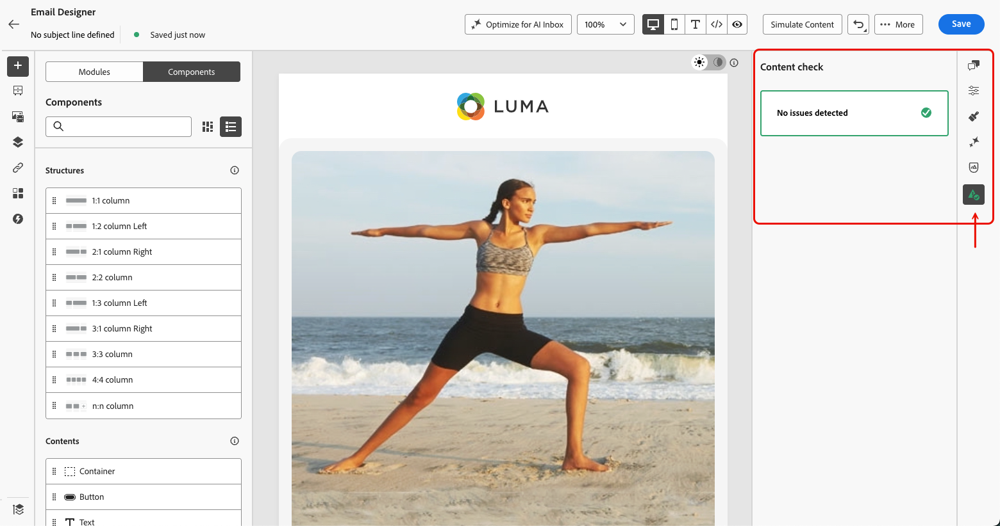

# Vérifications de contenu dans le Designer Email {#content-checks}

>[!CONTEXTUALHELP]
>id="ajo_email_content_check"
>title="Vérifications de contenu"
>abstract="Détectez et corrigez les problèmes HTML et CSS dans votre e-mail avant l’envoi. Les contrôles couvrent les balises non prises en charge, les balises div vides et les seuils de taille qui déclenchent des échecs de rendu dans Gmail ou Microsoft Outlook. Les problèmes apparaissent sous forme d’erreurs, d’avertissements ou d’informations."

[!DNL Journey Optimizer] comprend une validation technique automatisée directement dans le Designer d’e-mail, ce qui vous permet de détecter les problèmes HTML et CSS avant l’envoi.

Les résultats sont affichés sous forme d’erreurs, d’avertissements ou d’informations dans le panneau de création, avec des détails contextuels et des correctifs en un clic le cas échéant, afin que les problèmes puissent être résolus sans quitter le Designer d’e-mail.

## Vérifications d’accès au contenu {#access-content-checks}

Les vérifications de contenu sont toujours disponibles dans la Designer Email. Pour les afficher, cliquez sur l’icône Problèmes dans le rail de droite pour ouvrir le volet **[!UICONTROL Vérification de contenu]** — tous les problèmes détectés y sont répertoriés.

>[!NOTE]
>
>Les vérifications sont automatiquement exécutées par rapport à l’état actuel de votre e-mail et après chaque modification. [En savoir plus](#recalculation)

Les contrôles sont affichés avec trois niveaux de gravité :

| Gravité | Couleur | Description |
|---|---|---|
| **Erreur** | Rouge | Un problème critique qui provoquera des échecs de diffusion ou de rendu. Résoudre avant envoi. |
| **Avertissement** | Orange | Un problème potentiel qui peut affecter le rendu dans des clients de messagerie spécifiques. Recommandé pour examen et résolution. |
| **Info** | Bleu | Avis d’information sur une condition qui ne bloque pas l’envoi, mais qui peut affecter la maintenabilité à long terme de votre contenu. |

Lorsqu’aucun problème n’est détecté, le volet affiche **Aucun problème détecté** et l’icône correspondante est verte.

Selon le problème, vous pouvez afficher plus de contexte, appliquer un correctif en un clic ou enregistrer votre e-mail pour actualiser un résultat de vérification.

* Pour certains problèmes détectés, vous pouvez cliquer sur le bouton **[!UICONTROL Afficher les détails]** pour afficher plus de contexte. Cliquez sur **[!UICONTROL Masquer les détails]** pour réduire l’image.
  {width="80%"}
* De même, vous pouvez cliquer sur le bouton **[!UICONTROL Afficher le correctif]** et appliquer un correctif en un clic, le cas échéant. Si le correctif ne peut pas être appliqué automatiquement, un message s’affiche et vous devez résoudre le problème manuellement.
  {width="80%"}

### Recalcul des chèques {#recalculation}

La plupart des contrôles, tels que les éléments HTML non pris en charge, les balises div vides et la taille d’HTML, sont recalculés chaque fois que vous modifiez votre e-mail. Ils reflètent donc toujours votre contenu actuel.

D’autres contrôles, tels que la taille de la feuille de style CSS, sont calculés à partir du contenu sérialisé (la version de votre e-mail telle qu’elle est chargée ou enregistrée), et non à partir de l’état de modification en direct dans le Designer d’e-mail. Dans ce cas, le contenu enregistré peut différer légèrement de ce que vous voyez lors de la modification. Si vous apportez des modifications sans enregistrer, un libellé **[!UICONTROL Vérification obsolète]** apparaît pour indiquer que le résultat peut ne plus être précis. Enregistrez votre e-mail pour actualiser le calcul.

{width="100%"}

## Correction des problèmes détectés {#fix-issues}

Les tableaux ci-dessous répertorient tous les messages possibles et l’action recommandée pour chacun d’eux. Développez la catégorie correspondant au message affiché dans le volet **[!UICONTROL Vérification de contenu]**.

+++ Éléments HTML non pris en charge

| Message | Gravité | Que faire |
|---|---|---|
| Votre contenu contient une balise `<script>`, qui n’est prise en charge dans aucun système de messagerie. Supprimez-la pour éviter des problèmes de diffusion et de rendu. | Erreur | Recherchez et supprimez toutes les balises `<script>` de votre contenu HTML. |
| Votre contenu contient une balise `<base>`, ce qui peut entraîner des problèmes de résolution de liens et de ressources dans le Designer d’e-mail. Pour corriger ce problème, vous devez le supprimer. | Erreur | Supprimez la balise `<base>` de votre HTML. |
| Votre contenu contient une balise meta HTML avec renouvellement, qui n’est pas prise en charge dans le Designer de messagerie. Supprimez-le pour éviter tout comportement inattendu. | Avertissement | Supprimez la balise de méta-actualisation de votre HTML. |
| Votre contenu contient des balises div vides, ce qui peut entraîner des problèmes de disposition dans Microsoft Outlook (MSO). Pour corriger ce problème, supprimez les balises div vides et utilisez plutôt l’espacement des éléments frères. | Avertissement | Supprimez les éléments de `
` vides et ajustez la marge intérieure ou la marge sur les éléments environnants pour conserver l’espacement. |

+++

+++ Problèmes CSS

| Message | Gravité | Que faire |
|---|---|---|
| La taille totale de CSS dépasse la limite de 16 Ko de Gmail et provoquera des problèmes de rendu dans Gmail. | Erreur | Utilisez **[!UICONTROL Appliquer le correctif]** pour supprimer automatiquement les règles CSS inutilisées ou simplifier manuellement vos styles. |
| La taille totale de CSS est proche de la limite de 16 Ko de Gmail et peut entraîner des problèmes de rendu si d’autres fichiers CSS sont ajoutés. | Avertissement | Utilisez **[!UICONTROL Appliquer le correctif]** pour supprimer les règles CSS inutilisées ou réduire les styles avant d’ajouter plus de contenu. |
| La taille totale de CSS de ce fragment dépasse 3 Ko. Si vous combinez cela avec d’autres fragments, le CSS total de l’e-mail pourrait dépasser la limite de 16 Ko de Gmail et provoquer des problèmes de rendu. | Avertissement | Simplifiez le CSS dans ce fragment pour conserver le CSS de l’e-mail combiné inférieur à 16 Ko. |
| Le contenu contient des règles CSS inutilisées. Cela peut entraîner des problèmes de rendu dans Gmail. | Avertissement | Utilisez **[!UICONTROL Appliquer le correctif]** pour supprimer automatiquement les règles CSS qui référencent des éléments qui ne sont plus présents dans l’e-mail. |

<!--
| Message | Severity | What to do |
|---|---|---|
| Your content has modifications to the system-generated default CSS. These changes may be overridden by future Email Designer updates. To preserve your styles, add them using the Custom CSS feature instead. | Info | Move your custom styles to [Custom CSS](custom-css.md) to ensure they are preserved across Email Designer updates. |
-->

+++

+++ Taille d’HTML

| Message | Gravité | Que faire |
|---|---|---|
| La taille estimée d’HTML dépasse la limite de 100 Ko de Gmail et provoquera des problèmes de rendu dans Gmail. La taille réelle d’HTML peut différer au moment de l’envoi. | Erreur | Réduire le contenu des e-mails : supprimez les éléments inutiles, simplifiez la structure ou divisez le contenu en plusieurs envois. |
| La taille estimée d’HTML est proche de la limite de 100 Ko de Gmail et peut entraîner des problèmes de rendu si d’autres HTML sont ajoutées. La taille réelle d’HTML peut différer au moment de l’envoi. | Avertissement | Simplifiez le contenu avant d’en ajouter d’autres. Les e-mails dépassant la limite de Gmail seront tronqués pour les destinataires. |
| La taille estimée d’HTML pour ce fragment dépasse 20 Ko. La combinaison de ce paramètre avec d’autres fragments peut entraîner un dépassement de la limite de 100 Ko du nombre total d’e-mails HTML dans Gmail et des problèmes de rendu. La taille réelle d’HTML peut différer au moment de l’envoi. | Avertissement | Réduisez la taille d’HTML dans ce fragment pour que la taille de l’e-mail total reste inférieure à la limite de 100 Ko de Gmail. |

+++

## À propos d’HTML et de la taille CSS {#size-estimation}

Les valeurs de taille HTML et CSS sont des **estimations calculées au moment de la création** et peuvent différer de la taille réelle diffusée aux destinataires, par exemple, lorsque votre e-mail utilise des blocs conditionnels (un seul rendu de branche par destinataire) ou lorsque la minimisation HTML est activée au moment de l’envoi.

Les avertissements de taille sont des signaux proactifs qui vous aident à optimiser le contenu avant l’envoi, et non des blocs durs.
