# Utiliser les composants de contenu du concepteur d’e-mail {#content-components}

>[!CONTEXTUALHELP]
>id="ac_content_components_email"
>title="À propos des composants de contenu"
>abstract="Les composants de contenu sont des espaces réservés de contenu vides que vous pouvez utiliser pour créer la disposition d&#39;un e-mail."

>[!CONTEXTUALHELP]
>id="ac_content_components_landing_page"
>title="À propos des composants de contenu"
>abstract="Les composants de contenu sont des espaces réservés de contenu vides que vous pouvez utiliser pour créer la disposition d’une page de destination."

>[!CONTEXTUALHELP]
>id="ac_content_components_fragment"
>title="À propos des composants de contenu"
>abstract="Les composants de contenu sont des espaces réservés de contenu vides que vous pouvez utiliser pour créer la disposition d’un fragment."

>[!CONTEXTUALHELP]
>id="ac_content_components_template"
>title="À propos des composants de contenu"
>abstract="Les composants de contenu sont des espaces réservés de contenu vides que vous pouvez utiliser pour créer la disposition d’un modèle."

Lorsque vous créez le contenu de votre e-mail, la section **[!UICONTROL Composants de contenu]** vous permet de personnaliser davantage votre e-mail à l’aide des composants bruts que vous pouvez modifier une fois placés dans un e-mail.

Vous pouvez ajouter autant de composants de contenu que nécessaire dans un ou plusieurs composants de structure, ce qui permet de définir la disposition de votre e-mail.

>[!NOTE]
>
>La [directive européenne sur l’accessibilité](https://eur-lex.europa.eu/legal-content/EN/TXT/?uri=CELEX%3A32019L0882){target="_blank"} stipule que toutes les communications numériques doivent être accessibles. Suivez les instructions spécifiques répertoriées sur [cette page](accessible-content.md) lorsque vous utilisez des composants de contenu pour concevoir des e-mails dans [!DNL Journey Optimizer], par exemple en utilisant des polices accessibles, des formats lisibles et en fournissant un texte secondaire pour les images.

## Ajouter des composants de contenu {#add-content-components}

Pour ajouter des composants de contenu à votre e-mail et les ajuster selon vos besoins, suivez les étapes ci-dessous.

1. Dans le concepteur d’e-mail, utilisez un contenu existant ou faites glisser et déposez la section **[!UICONTROL Composants de structure]** dans votre contenu vide pour définir la disposition de votre e-mail. [Voici comment procéder](content-from-scratch.md)

1. Pour accéder à la section **[!UICONTROL Composants de contenu]**, sélectionnez le bouton correspondant dans le volet gauche du concepteur d’e-mail.

   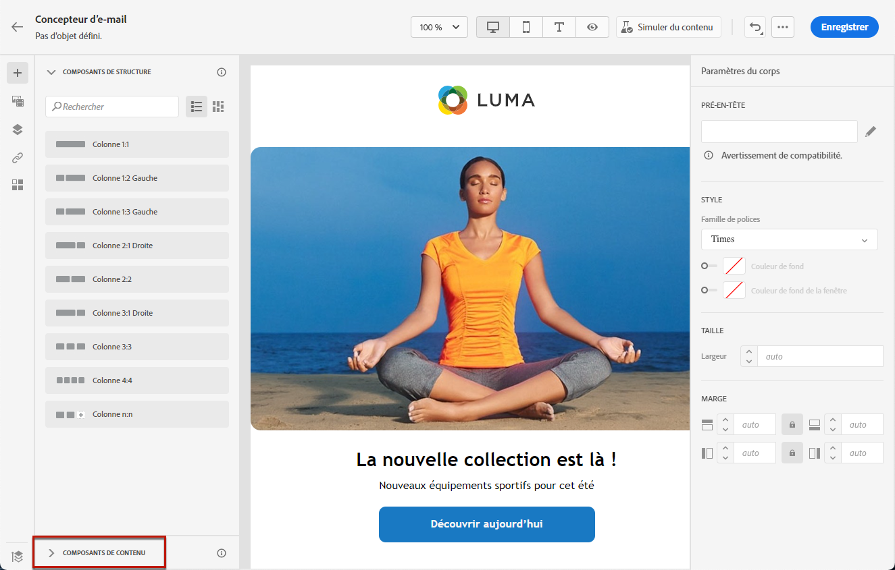

1. Faites glisser et déposez les composants de contenu de votre choix dans les composants de structure appropriés.

   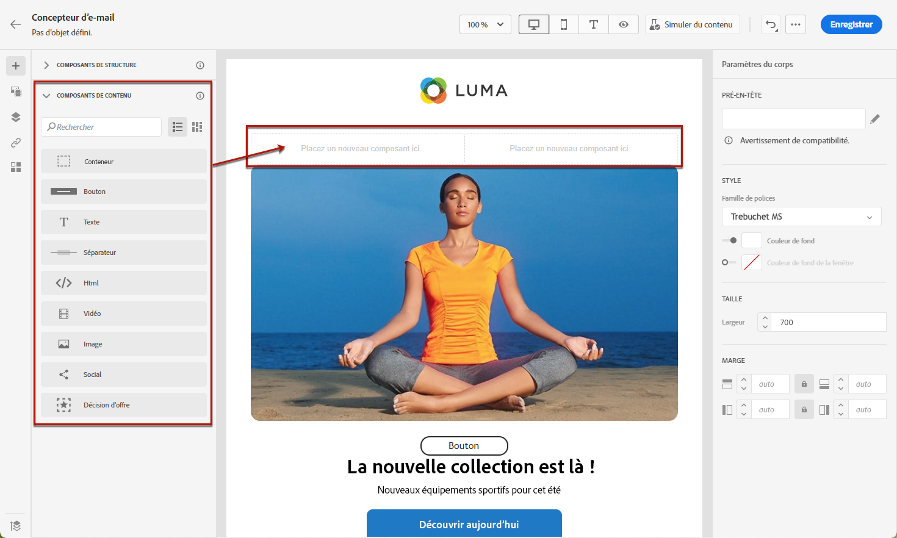

   >[!NOTE]
   >
   >Vous pouvez ajouter plusieurs composants dans un seul composant de structure et dans chaque colonne d’un composant de structure.

1. Ajustez les attributs et le style de chaque composant à l’aide des onglets **[!UICONTROL Paramètres]** et **[!UICONTROL Style]** sur la droite. Par exemple, vous pouvez changer le style de texte, la marge intérieure ou la marge de chaque composant. [En savoir plus sur l’alignement et la marge intérieure](alignment-and-padding.md)

   

1. Le menu avancé de votre **[!UICONTROL composant de contenu]** permet de supprimer ou dupliquer facilement n’importe quel composant de contenu selon vos besoins.

   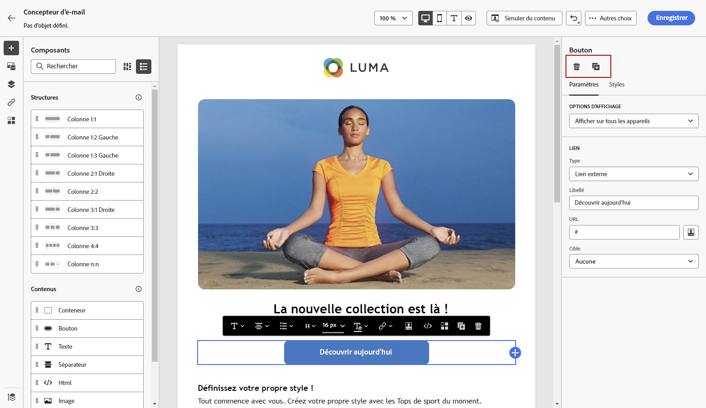

## Conteneur {#container}

Pour appliquer un style spécifique à un groupe de composants de contenu, ajoutez un composant de **[!UICONTROL conteneur]**, puis ajoutez-y le ou les composants de contenu de votre choix. Cela vous permet d’appliquer un style distinct au conteneur, qui sera différent du style appliqué aux composants de contenu qui s’y trouvent.

Par exemple, ajoutez un composant **[!UICONTROL Conteneur]**, puis ajoutez un composant [Bouton](#button) à l’intérieur de ce conteneur. Vous pouvez utiliser un arrière-plan spécifique pour le conteneur et un autre pour le bouton.

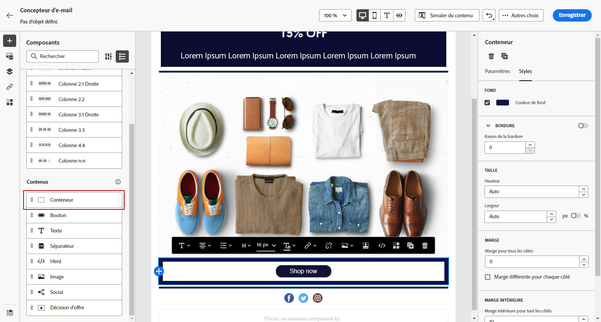

## Bouton {#button}

Utilisez le composant **[!UICONTROL Bouton]** pour insérer un ou plusieurs boutons dans votre e-mail et rediriger votre audience d’e-mail vers une autre page.

1. À partir de la section **[!UICONTROL Composants de contenu]**, faites glisser et déposez le composant **[!UICONTROL Bouton]** dans un **[!UICONTROL composant de structure]**.

1. Cliquez sur le bouton nouvellement ajouté pour personnaliser le texte et accéder aux onglets **[!UICONTROL Paramètres]** et **[!UICONTROL Styles]** dans le volet droit du concepteur d’e-mail.

   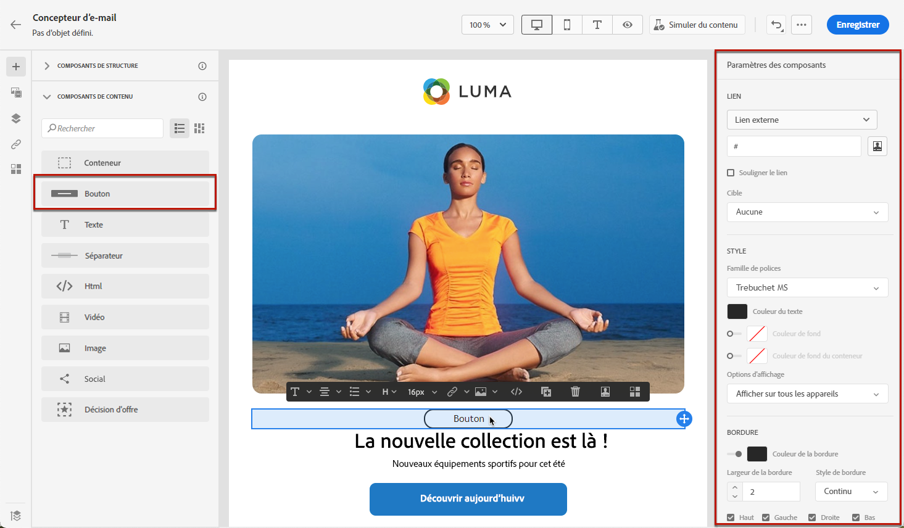

1. Dans le menu **[!UICONTROL Lien]**, ajoutez l’URL vers laquelle effectuer la redirection en cas de clic sur le bouton.

1. Choisissez comment votre audience sera redirigée avec la liste déroulante **[!UICONTROL Cible]** :

   * **[!UICONTROL Aucune]** : ouvre le lien dans le même cadre que celui sur lequel l’utilisateur a cliqué (par défaut).
   * **[!UICONTROL Vierge]** : ouvre le lien dans une nouvelle fenêtre ou un nouvel onglet.
   * **[!UICONTROL Self]** : ouvre le lien dans le même cadre que celui sur lequel l’utilisateur a cliqué.
   * **[!UICONTROL Parent]** : ouvre le lien dans le cadre parent.
   * **[!UICONTROL Haut]** : ouvre le lien dans le corps complet de la fenêtre.

   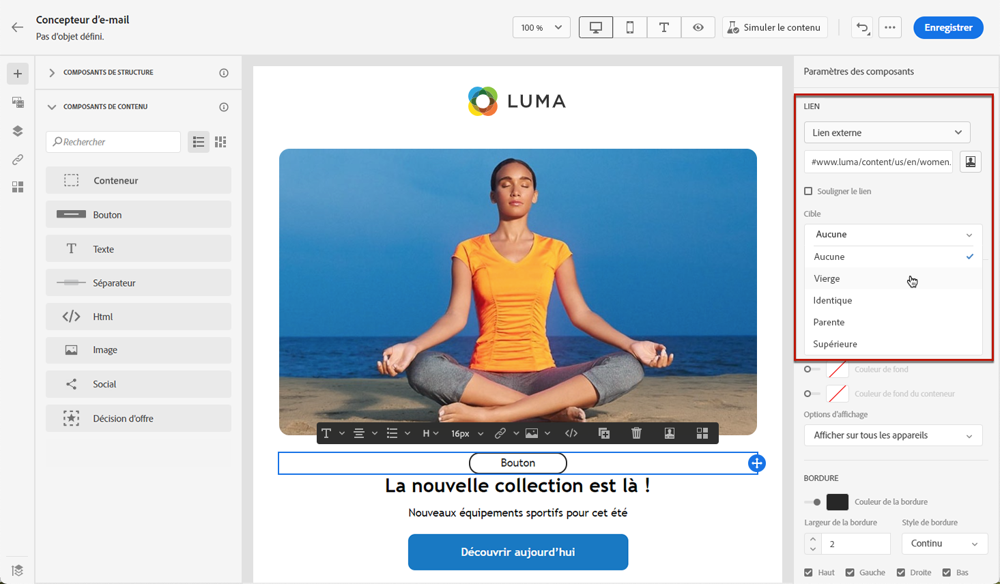

1. Vous pouvez personnaliser davantage votre bouton en modifiant les attributs de style, tels que la **[!UICONTROL bordure]**, la **[!UICONTROL taille]**, la **[!UICONTROL marge]**, etc. à partir du volet **[!UICONTROL Paramètres des composants]**.

## Texte {#text}

Utilisez le composant **[!UICONTROL Texte]** pour insérer du texte dans votre e-mail et ajustez le style (bordure, taille, marge intérieure, etc.) à l’aide de l’onglet **[!UICONTROL Styles]**.

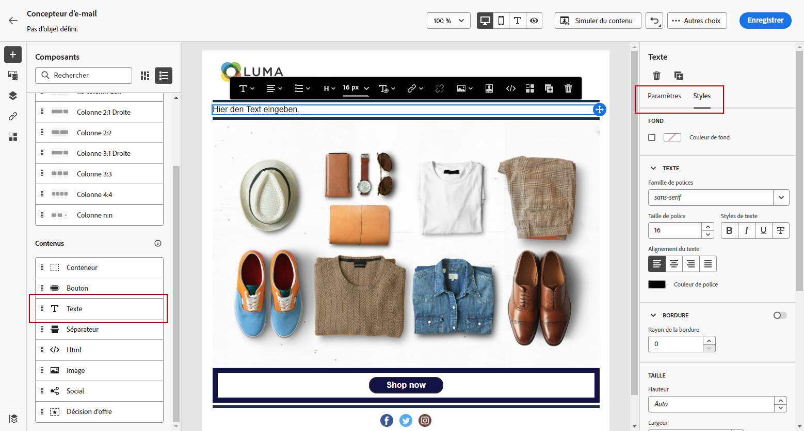

1. À partir des **[!UICONTROL composants de contenu]**, faites glisser et déposez le composant de **[!UICONTROL texte]** dans un **[!UICONTROL composant de structure]**.

1. Cliquez sur le composant nouvellement ajouté pour personnaliser le texte et accéder aux onglets **[!UICONTROL Paramètres]** et **[!UICONTROL Styles]** dans le volet droit du concepteur d’e-mail.

1. Modifiez votre texte à l’aide des options suivantes disponibles dans la barre d’outils :

   

   * **[!UICONTROL Modifier le style de texte]** : appliquez des caractères gras, italiques, soulignés ou barrés à votre texte.
   * **Modifier l&#39;alignement** : choisissez entre l’alignement à gauche, à droite, centré ou justifié pour votre texte.
   * **[!UICONTROL Créer une liste]** : ajoutez une puce ou une liste numérique à votre texte.
   * **[!UICONTROL Définir le titre]** : ajoutez jusqu&#39;à six niveaux d&#39;en-tête à votre texte.
   * **Taille de police** : sélectionnez la taille de police de votre texte en pixels.
   * **[!UICONTROL Changer la couleur de la police]** : choisissez la couleur de votre police.
   * **[!UICONTROL Insérer un lien]** : ajoutez n’importe quel type de lien à votre contenu.
   * **[!UICONTROL Modifier l’image]** : ajoutez une image ou une ressource à votre composant de texte. [En savoir plus sur la gestion des ressources](../integrations/assets.md)
   * **[!UICONTROL Modifier la couleur de la police]** : choisissez la couleur de votre police.
   * **[!UICONTROL Ajouter une personnalisation]** : ajoutez des champs de personnalisation pour personnaliser le contenu à partir des données de vos profils. [En savoir plus sur la personnalisation de contenu](../personalization/personalize.md)
   * **[!UICONTROL Afficher le code source]** : affichez le code source de votre texte. Ceci ne peut pas être modifié.
   * **[!UICONTROL Activer le contenu conditionnel]** : ajoutez du contenu conditionnel pour adapter le contenu du composant aux profils ciblés. [En savoir plus sur le contenu dynamique](../personalization/get-started-dynamic-content.md)
   * **[!UICONTROL Dupliquer]** : ajoutez une copie de votre composant de texte.
   * **[!UICONTROL Supprimer]** : supprimez le composant de texte sélectionné de votre e-mail.

1. Ajustez les autres attributs de style, tels que la couleur du texte, la famille de polices, la bordure, la marge intérieure, la marge, etc. à partir de l’onglet **[!UICONTROL Styles]**.

   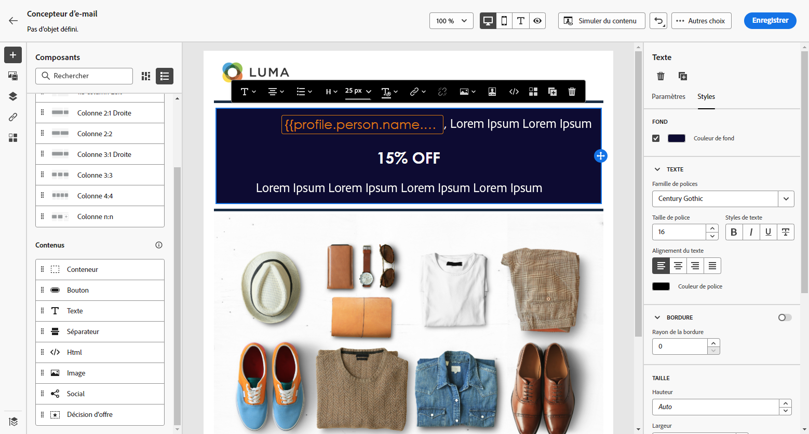

## Diviseur {#divider}

Utilisez le composant **[!UICONTROL Diviseur]** pour insérer une ligne de séparation afin d’organiser la disposition et le contenu de votre e-mail.

Vous pouvez ajuster les attributs de style, tels que la couleur, le style et la hauteur des lignes, à partir des onglets **[!UICONTROL Paramètres]** et **[!UICONTROL Styles]**.

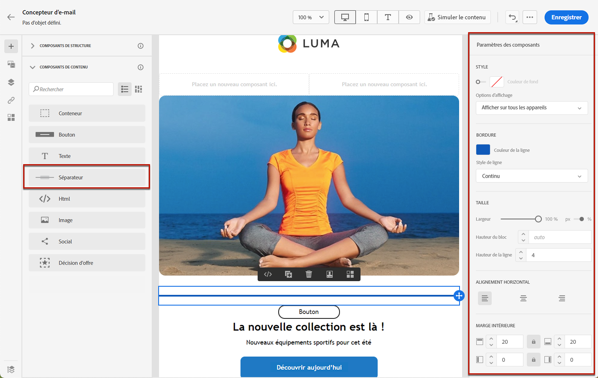

## HTML {#HTML}

Utilisez le composant **[!UICONTROL HTML]** pour copier-coller les différentes parties de votre code HTML existant. Vous pouvez ainsi créer des composants HTML modulaires autonomes afin de réutiliser du contenu externe.

1. À partir de **[!UICONTROL Composants de contenu]**, faites glisser le composant **[!UICONTROL HTML]** et déposez-le dans un **[!UICONTROL composant de structure]**.

1. Cliquez sur votre nouveau composant ajouté, puis sélectionnez **[!UICONTROL Afficher le code source]** dans la barre d’outils contextuelle pour ajouter votre code HTML.

   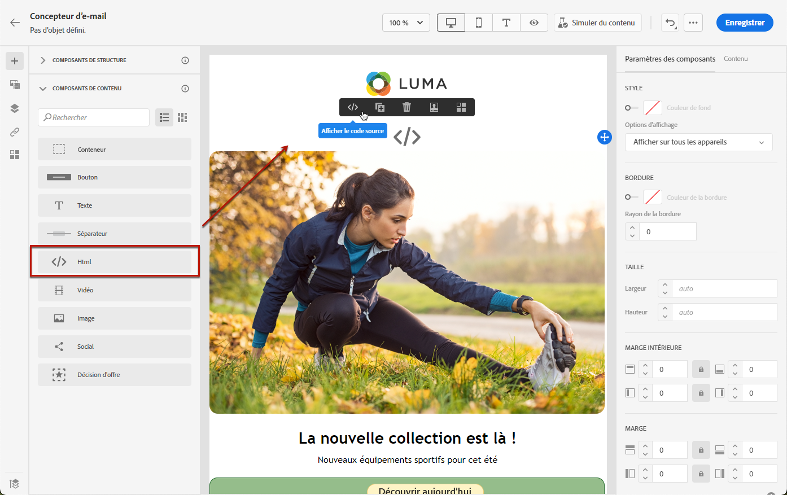

1. Copiez-collez le code HTML à ajouter à votre e-mail et cliquez sur **[!UICONTROL Enregistrer]**.

   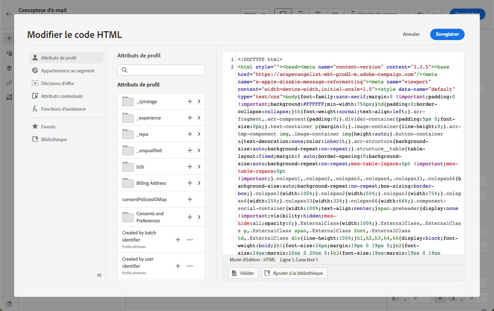

>[!NOTE]
>
>Pour rendre un contenu externe compatible avec le concepteur d’e-mail, Adobe recommande de créer entièrement un message et de copier le contenu de votre e-mail existant dans des composants.

## Image {#image}

Utilisez le composant **[!UICONTROL Image]** pour insérer un fichier image de votre ordinateur dans le corps de votre e-mail.

1. À partir de **[!UICONTROL Composants de contenu]**, faites glisser le composant **[!UICONTROL Image]** et déposez-le dans un **[!UICONTROL composant de structure]**.

   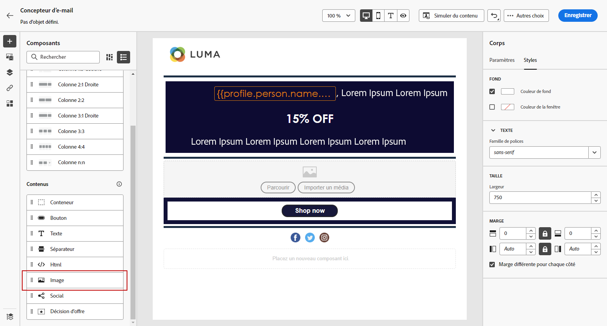

1. Dans l’onglet **[!UICONTROL Paramètres]**, cliquez sur **[!UICONTROL Parcourir]** pour choisir un fichier image parmi vos ressources ou sur **[!UICONTROL Importer un média]** pour charger une ressource vers Adobe Experience Manager Assets.

   Pour en savoir plus sur [!DNL Adobe Experience Manager Assets], consultez la [documentation d’Adobe Experience Manager Assets](https://experienceleague.adobe.com/docs/experience-manager-assets-essentials/help/introduction.html?lang=fr){target="_blank"}.

   >[!NOTE]
   >
   > Pour que vos liens restent actifs et éviter tout problème d’expiration, nous vous recommandons d’utiliser Adobe Assets plutôt que de vous fier à une URL source pour vos images.

1. Vous pouvez également effectuer directement des recherches dans Adobe Stock à l’aide de l’option **[!UICONTROL Trouver des photos Adobe Stock]**.

1. Cliquez sur le composant nouvellement ajouté et configurez les propriétés de l’image :

   * **[!UICONTROL Titre d’image]** vous permet de définir un titre pour votre image.
   * **[!UICONTROL Texte secondaire]** vous permet de définir la légende liée à votre image. Cela correspond à l’attribut HTML alternatif. [En savoir plus](../email/accessible-content.md#alt-text)

   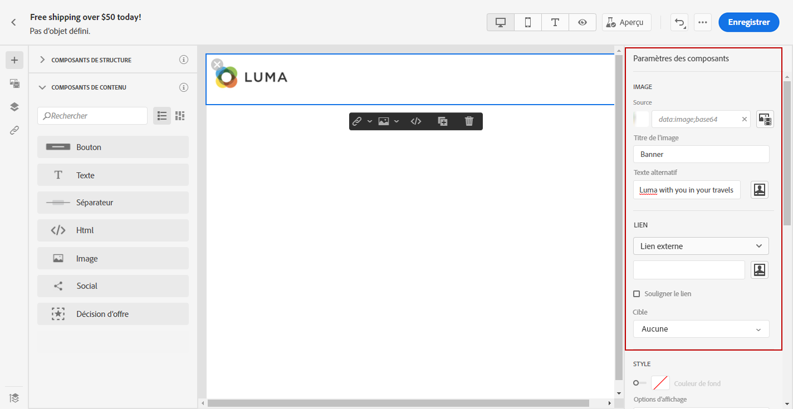

1. Vous pouvez également choisir **[!UICONTROL Trouver des photos Stock similaires]**. [En savoir plus](../integrations/stock.md).

1. Dans l’onglet **[!UICONTROL Styles]**, ajustez les autres attributs de style, tels que la marge, la bordure, etc. ou ajoutez un lien pour rediriger votre audience vers un autre contenu à partir du volet **[!UICONTROL Paramètres des composants]**.

## Social {#social}

Utilisez le composant **[!UICONTROL Social]** pour insérer des liens vers des pages de réseaux sociaux dans le corps de votre e-mail.

1. À partir de **[!UICONTROL Composants de contenu]**, faites glisser le composant **[!UICONTROL Social]** et déposez-le dans un **[!UICONTROL composant de structure]**.

1. Sélectionnez le composant nouvellement ajouté.

1. Dans le champ **[!UICONTROL Social]** de l’onglet **[!UICONTROL Paramètres]**, sélectionnez les médias sociaux à ajouter ou supprimer.

   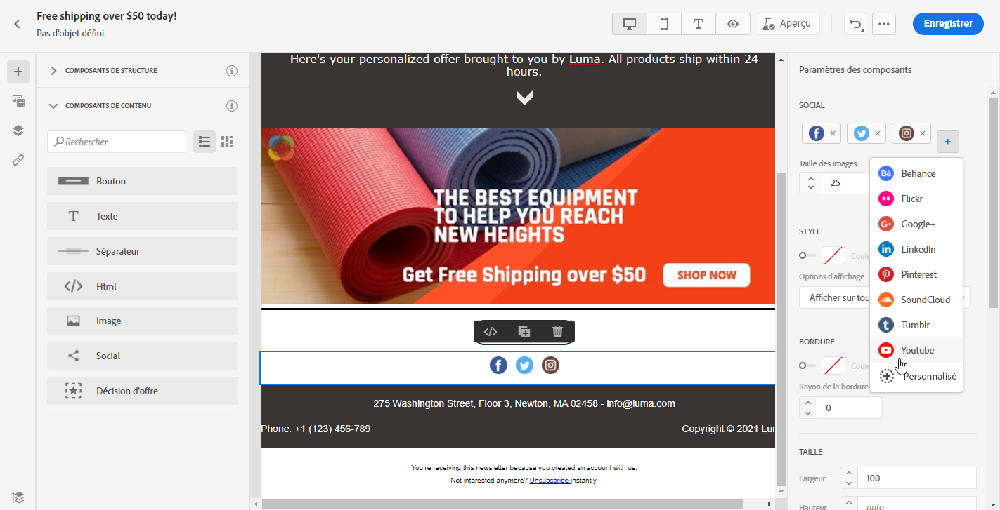

1. Sélectionnez la taille de vos icônes dans le champ dédié.

1. Cliquez sur chacune des icônes de vos réseaux sociaux pour configurer l’**[!UICONTROL URL]** vers laquelle votre audience sera redirigée.

   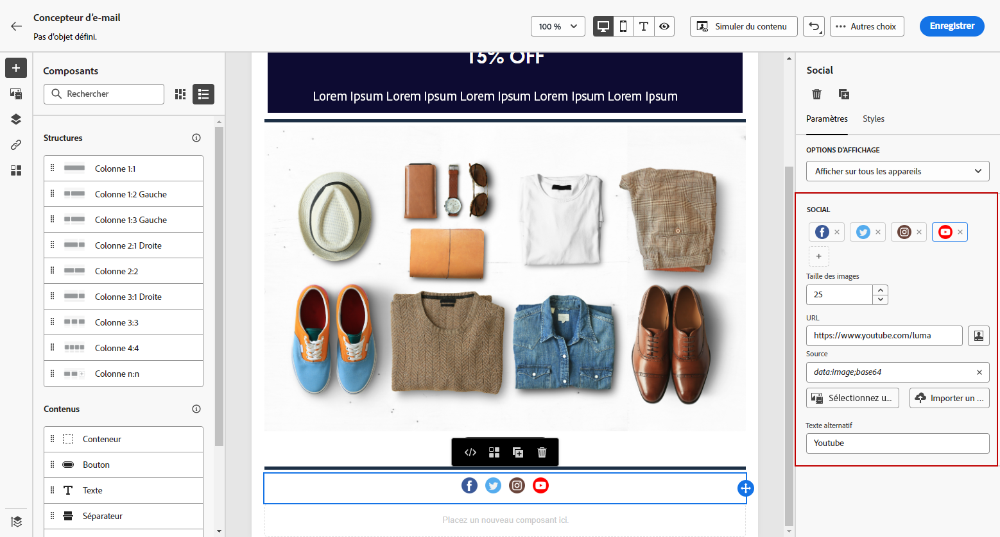

1. Vous pouvez également modifier les icônes de chacun de vos médias sociaux à partir de vos ressources, le cas échéant.

1. Ajustez les autres attributs de style tels que le style, la marge, la bordure, etc. à partir de l’onglet **[!UICONTROL Styles]**.

## Décision d’offre {#offer-decision}

Utilisez le composant **[!UICONTROL Décision d’offre]** pour insérer des offres dans vos messages. Le moteur [Gestion des décisions](../offers/get-started/starting-offer-decisioning.md) choisira la meilleure offre à proposer à votre clientèle.

1. À partir des **[!UICONTROL composants de contenu]**, faites glisser et déposez le composant **[!UICONTROL Décision d’offres]** dans un **[!UICONTROL composant de structure]**.

1. Cliquez sur **[!UICONTROL Ajouter]** pour sélectionner votre **[!UICONTROL décision d’offres]**.

   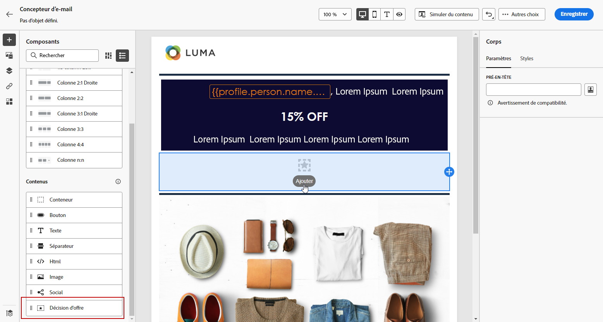

1. Dans la liste déroulante, sélectionnez vos **[!UICONTROL emplacements]**.  Sélectionnez ensuite la **[!UICONTROL décision d’offres]** à ajouter à votre contenu, puis cliquez sur **[!UICONTROL Ajouter]**.

   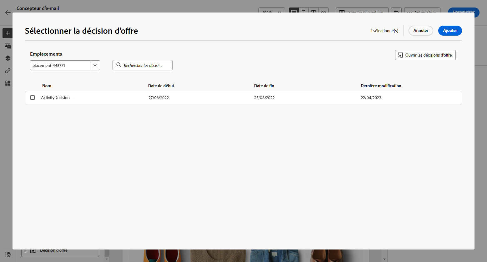

1. L’onglet **[!UICONTROL Décision d’offres]** permet de prévisualiser ou modifier l’offre insérée.

Découvrez comment ajouter des offres personnalisées dans un e-mail dans [cette section](add-offers-email.md).

>[!IMPORTANT]
>
>Si des modifications sont apportées à une décision d’offres qui est utilisée dans le message d’un parcours, vous devez dépublier le parcours et le republier. Cela permet de s’assurer que les modifications sont intégrées au message du parcours et que le message est cohérent avec les dernières mises à jour.
