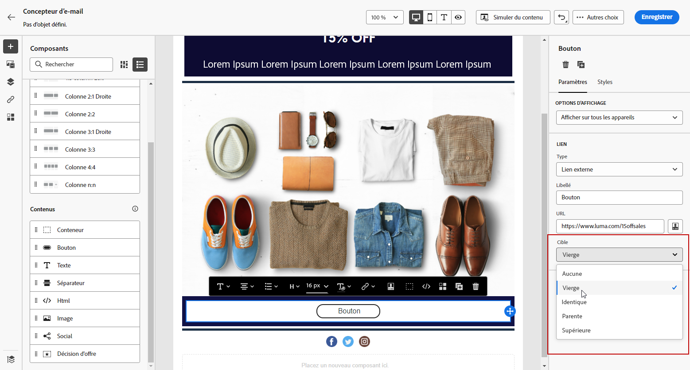
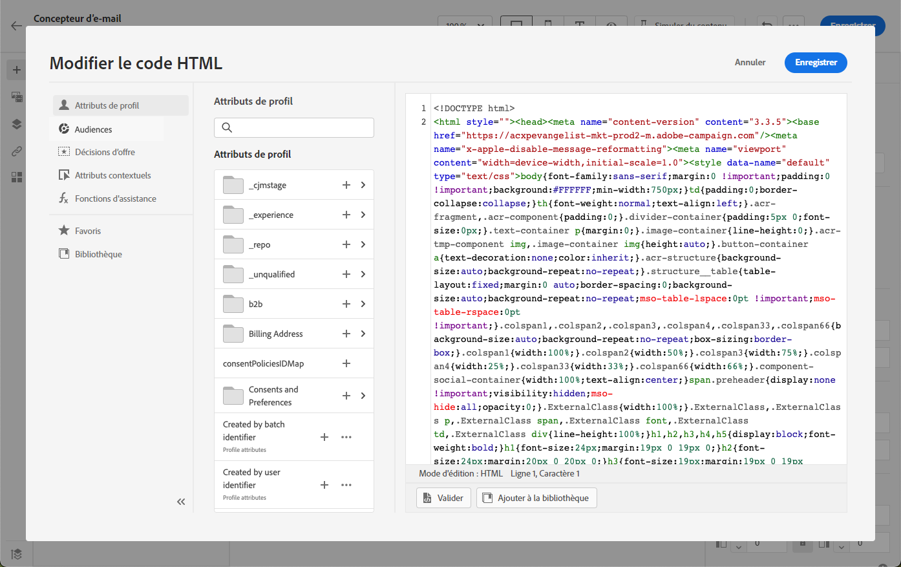

# Utilisation des composants de contenu du Concepteur d&#39;email {#content-components}

>[!CONTEXTUALHELP]
>id="ac_content_components_email"
>title="À propos des composants de contenu"
>abstract="Les composants de contenu sont des espaces réservés de contenu vides que vous pouvez utiliser pour créer la disposition d&#39;un email."

>[!CONTEXTUALHELP]
>id="ac_content_components_landing_page"
>title="À propos des composants de contenu"
>abstract="Les composants de contenu sont des espaces réservés de contenu vides que vous pouvez utiliser pour créer la disposition d’une page de destination."

>[!CONTEXTUALHELP]
>id="ac_content_components_fragment"
>title="À propos des composants de contenu"
>abstract="Les composants de contenu sont des espaces réservés de contenu vides que vous pouvez utiliser pour créer la disposition d’un fragment."

>[!CONTEXTUALHELP]
>id="ac_content_components_template"
>title="À propos des composants de contenu"
>abstract="Les composants de contenu sont des espaces réservés de contenu vides que vous pouvez utiliser pour créer la disposition d’un modèle."

Lors de la création du contenu de votre email, **[!UICONTROL Composants de contenu]** vous permet de personnaliser davantage votre email avec des composants bruts que vous pouvez éditer une fois qu&#39;il a été placé dans un email.

Vous pouvez ajouter autant de composants de contenu que nécessaire dans un ou plusieurs composants de structure, qui définissent la disposition de votre email.

## Ajout de composants de contenu {#add-content-components}

Pour ajouter des composants de contenu à votre email et les ajuster à vos besoins, procédez comme suit.

1. Dans le Concepteur d&#39;email, utilisez un contenu existant ou effectuez un glisser-déposer. **[!UICONTROL Composants de structure]** dans votre contenu vide pour définir la mise en page de votre email. [Voici comment procéder](content-from-scratch.md)

1. Pour accéder au **[!UICONTROL Composants de contenu]** , sélectionnez le bouton correspondant dans le volet de gauche du Concepteur d&#39;email.

   

1. Faites glisser et déposez les composants de contenu de votre choix dans les composants de structure appropriés.

   

   >[!NOTE]
   >
   >Vous pouvez ajouter plusieurs composants dans un seul composant de structure et dans chaque colonne d’un composant de structure.

1. Ajustez les attributs de style de chaque composant à l’aide de la fonction **[!UICONTROL Paramètres des composants]** sur la droite. Par exemple, vous pouvez modifier le style de texte, la marge ou la marge intérieure de chaque composant. [En savoir plus sur l’alignement et la marge intérieure](alignment-and-padding.md)

   

## Conteneur {#container}

Vous pouvez ajouter un conteneur simple à l’intérieur duquel vous pourrez ajouter un autre composant de contenu. Vous pouvez ainsi appliquer un style spécifique au conteneur, qui sera différent du composant utilisé à l’intérieur.

Par exemple, ajoutez une **[!UICONTROL Conteneur]** , puis ajoutez une [Bouton](#button) à l’intérieur de ce conteneur. Vous pouvez utiliser un arrière-plan spécifique pour le conteneur et un autre pour le bouton.

## Bouton {#button}

Utilisez la variable **[!UICONTROL Bouton]** pour insérer un ou plusieurs boutons dans votre email et rediriger votre audience de courrier électronique vers une autre page.

1. De **[!UICONTROL Composants de contenu]**, effectuez un glisser-déposer de la variable **[!UICONTROL Bouton]** dans un composant **[!UICONTROL Composant de structure]**.

1. Cliquez sur le bouton que vous venez d’ajouter pour personnaliser le texte et avoir accès au **[!UICONTROL Paramètres des composants]** dans le volet de droite du Concepteur d’email .

   

1. Dans le **[!UICONTROL Lien]** ajoutez l’URL vers laquelle vous souhaitez rediriger lorsque vous cliquez sur le bouton.

1. Choisissez la manière dont votre audience sera redirigée avec la variable **[!UICONTROL Cible]** liste déroulante :

   * **[!UICONTROL Aucune]** : ouvre le lien dans le même cadre que celui sur lequel l’utilisateur a cliqué (par défaut).
   * **[!UICONTROL Vierge]** : ouvre le lien dans une nouvelle fenêtre ou un nouvel onglet.
   * **[!UICONTROL Self]** : ouvre le lien dans le même cadre que celui sur lequel l’utilisateur a cliqué.
   * **[!UICONTROL Parent]** : ouvre le lien dans le cadre parent.
   * **[!UICONTROL Haut]** : ouvre le lien dans le corps complet de la fenêtre.

   

1. Vous pouvez personnaliser davantage votre bouton en modifiant les attributs de style, tels que **[!UICONTROL Bordure]**, **[!UICONTROL Taille]**, **[!UICONTROL Marge]**, etc. de la **[!UICONTROL Paramètres des composants]** volet.

## Texte {#text}

Utilisez la variable **[!UICONTROL Texte]** pour insérer du texte dans votre email et ajuster le style (bordure, taille, remplissage, etc.) en utilisant la variable **[!UICONTROL Paramètres des composants]** volet.

1. De **[!UICONTROL Composants de contenu]**, effectuez un glisser-déposer de la variable **[!UICONTROL Texte]** dans un composant **[!UICONTROL Composant de structure]**.

1. Cliquez sur le composant que vous venez d’ajouter pour personnaliser le texte et accéder à la fonction **[!UICONTROL Paramètres des composants]** dans le volet droit du Concepteur d’email.

1. Modifiez votre texte à l’aide des options suivantes disponibles dans la barre d’outils :

   

   * **[!UICONTROL Modifier le style de texte]** : appliquez des caractères gras, italiques, soulignés ou barrés à votre texte.
   * **Modifier l&#39;alignement** : choisissez entre l’alignement à gauche, à droite, centré ou justifié pour votre texte.
   * **[!UICONTROL Créer une liste]** : ajoutez une puce ou une liste numérique à votre texte.
   * **[!UICONTROL Définir le titre]** : ajoutez jusqu&#39;à six niveaux d&#39;en-tête à votre texte.
   * **Taille de police** : sélectionnez la taille de police de votre texte en pixels.
   * **[!UICONTROL Modifier l&#39;image]** : ajoutez une image ou une ressource à votre composant de texte. [En savoir plus sur la gestion des ressources](assets-essentials.md)
   * **[!UICONTROL Afficher le code source]** : affichez le code source de votre texte. Ceci ne peut pas être modifié.
   * **[!UICONTROL Dupliquer]** : ajoutez une copie de votre composant de texte.
   * **[!UICONTROL Supprimer]** : supprimez le composant de texte sélectionné de votre e-mail.
   * **[!UICONTROL Ajouter une personnalisation]** : ajoutez des champs de personnalisation pour personnaliser le contenu à partir des données de vos profils. [En savoir plus sur la personnalisation de contenu](../personalization/personalize.md)
   * **[!UICONTROL Activer le contenu conditionnel]** : ajoutez du contenu conditionnel pour adapter le contenu du composant aux profils ciblés. [En savoir plus sur le contenu dynamique](../personalization/get-started-dynamic-content.md)

1. Ajustez les autres attributs de style tels que la couleur du texte, la famille de polices, la bordure, la marge intérieure, la marge, etc. de la **[!UICONTROL Paramètres des composants]** volet.

## Diviseur {#divider}

Utilisez le composant **[!UICONTROL Diviseur]** pour insérer une ligne de séparation afin d’organiser la disposition et le contenu de votre e-mail.

Vous pouvez ajuster les attributs de style, tels que la couleur de la ligne, le style et la hauteur, à partir du **[!UICONTROL Paramètres des composants]** volet.

## HTML {#HTML}

Utilisez la variable **[!UICONTROL HTML]** pour copier-coller les différentes parties de votre HTML existant. Vous pouvez ainsi créer des composants de HTML modulaires gratuits pour réutiliser du contenu externe.

1. De **[!UICONTROL Composants de contenu]**, effectuez un glisser-déposer de la variable **[!UICONTROL HTML]** dans un composant **[!UICONTROL Composant de structure]**.

1. Cliquez sur le composant que vous venez d’ajouter, puis sélectionnez **[!UICONTROL Afficher le code source]** dans la barre d’outils contextuelle pour ajouter votre HTML.

   

1. Copiez-collez le code HTML à ajouter à votre e-mail et cliquez sur **[!UICONTROL Enregistrer]**.

   

>[!NOTE]
>
>Pour rendre un contenu externe compatible avec le Concepteur d’email, Adobe recommande de créer entièrement un message et de copier le contenu de votre email existant dans des composants.

## Image {#image}

Utilisez la variable **[!UICONTROL Image]** pour insérer un fichier image de votre ordinateur dans le contenu de votre email.

1. De **[!UICONTROL Composants de contenu]**, effectuez un glisser-déposer de la variable **[!UICONTROL Image]** dans un composant **[!UICONTROL Composant de structure]**.

1. Cliquez sur **[!UICONTROL Parcourir]** pour choisir un fichier image dans vos ressources.

   Pour en savoir plus sur [!DNL Assets Essentials], consultez la [documentation Adobe Experience Manager Assets Essentials](https://experienceleague.adobe.com/docs/experience-manager-assets-essentials/help/introduction.html?lang=fr){target=&quot;_blank&quot;}.

1. Cliquez sur le composant que vous venez d’ajouter et configurez vos propriétés d’image à l’aide de la fonction **[!UICONTROL Paramètres des composants]** Volet :

   * **[!UICONTROL Titre de l’image]** vous permet de définir un titre pour votre image.
   * **[!UICONTROL Text alt]** vous permet de définir la légende liée à votre image. Cela correspond à l’attribut alt en HTML.

   

1. Ajustez les autres attributs de style tels que la marge, la bordure, etc. ou ajouter un lien pour rediriger votre audience vers un autre contenu de la **[!UICONTROL Paramètres des composants]** volet.

## Vidéo {#Video}

>[!CONTEXTUALHELP]
>id="ac_edition_video_email"
>title="Paramètres vidéo"
>abstract="Utilisez ce composant pour insérer une vidéo dans votre email. Notez que les vidéos ne fonctionnent pas sur tous les clients de messagerie. Nous vous conseillons de définir une image de remplacement."

>[!CONTEXTUALHELP]
>id="ac_edition_video_landing_page"
>title="Paramètres vidéo"
>abstract="Utilisez ce composant pour insérer une vidéo dans votre page de destination. Notez que les vidéos ne fonctionnent pas sur tous les clients de messagerie. Nous vous conseillons de définir une image de remplacement."

>[!CONTEXTUALHELP]
>id="ac_edition_video_fragment"
>title="Paramètres vidéo"
>abstract="Utilisez ce composant pour insérer une vidéo dans votre fragment. Notez que les vidéos ne fonctionnent pas sur tous les clients de messagerie. Nous vous conseillons de définir une image de remplacement."

>[!CONTEXTUALHELP]
>id="ac_edition_video_template"
>title="Paramètres vidéo"
>abstract="Utilisez ce composant pour insérer une vidéo dans votre modèle. Notez que les vidéos ne fonctionnent pas sur tous les clients de messagerie. Nous vous conseillons de définir une image de remplacement."

Utilisez la variable **[!UICONTROL Vidéo]** pour insérer une vidéo dans le contenu de votre email par le biais d’un lien URL.

1. De **[!UICONTROL Composants de contenu]**, effectuez un glisser-déposer de la variable **[!UICONTROL Vidéo]** dans une **[!UICONTROL Composant de structure]**.

   

1. Cliquez sur le composant que vous venez d’ajouter.

1. Dans le **[!UICONTROL Lien de la vidéo]** du champ **[!UICONTROL Paramètres des composants]** ajoutez l’URL de la vidéo.

   

1. Vous pouvez ajouter une **[!UICONTROL Image d&#39;affiche]** à votre vidéo afin de spécifier une image à afficher jusqu’à ce que votre audience clique sur le bouton de lecture .

1. Ajustez les autres attributs de style tels que le style, la marge, la bordure, etc. de la **[!UICONTROL Paramètres des composants]** volet.

## Social {#social}

Utilisez la variable **[!UICONTROL Social]** pour insérer des liens vers des pages de médias sociaux dans le contenu de votre email.

1. De **[!UICONTROL Composants de contenu]**, effectuez un glisser-déposer de la variable **[!UICONTROL Social]** dans un composant **[!UICONTROL Composant de structure]**.

1. Cliquez sur le composant que vous venez d’ajouter.

1. Dans le **[!UICONTROL Social]** du champ **[!UICONTROL Paramètres des composants]** , sélectionnez les médias sociaux à ajouter ou à supprimer.

   

1. Sélectionnez la taille de vos icônes dans le champ dédié.

1. Cliquez sur chacune de vos icônes de médias sociaux pour configurer la variable **[!UICONTROL URL]** vers laquelle votre audience sera redirigée.

   

1. Vous pouvez également modifier les icônes de chacun de vos réseaux sociaux si nécessaire dans le champ **[!UICONTROL Image]**.

1. Ajustez les autres attributs de style tels que le style, la marge, la bordure, etc. de la **[!UICONTROL Paramètres des composants]** volet.

## Décision d’offre {#offer-decision}

Utilisez la variable **[!UICONTROL Décision sur l’offre]** pour insérer des offres dans vos messages. Le [gestion des décisions](../offers/get-started/starting-offer-decisioning.md) Le moteur choisira la meilleure offre à diffuser à vos clients.

Découvrez comment ajouter des offres personnalisées dans un email dans [cette section](add-offers-email.md).

