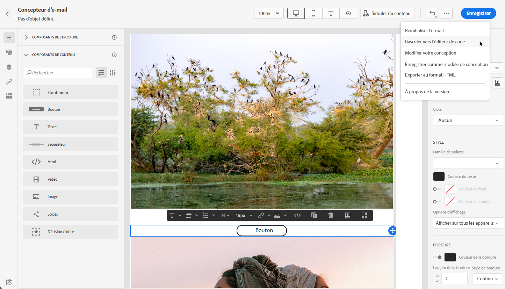

# Concevoir entièrement du contenu {#content-from-scratch}

>[!CONTEXTUALHELP]
>id="ac_structure_components_email"
>title="Ajout de composants Structure"
>abstract="Les composants de structure définissent la disposition de votre email. Faites glisser et déposez un **Structure** dans la zone de travail pour commencer à concevoir le contenu de votre email."

>[!CONTEXTUALHELP]
>id="ac_structure_components_landing_page"
>title="Ajout de composants Structure"
>abstract="Les composants de structure définissent la disposition de la page de destination. Faites glisser et déposez un **Structure** dans la zone de travail pour commencer à concevoir le contenu de votre landing page."

>[!CONTEXTUALHELP]
>id="ac_structure_components_fragment"
>title="Ajout de composants Structure"
>abstract="Les composants de structure définissent la disposition du fragment. Faites glisser et déposez un **Structure** dans la zone de travail pour commencer à concevoir le contenu de votre fragment."

>[!CONTEXTUALHELP]
>id="ac_structure_components_template"
>title="Ajout de composants Structure"
>abstract="Les composants de structure définissent la disposition du modèle. Faites glisser et déposez un **Structure** dans la zone de travail pour commencer à concevoir le contenu de votre modèle."

>[!CONTEXTUALHELP]
>id="ac_edition_columns_email"
>title="Définition des colonnes de courrier électronique"
>abstract="Le Concepteur d&#39;email permet de définir facilement la mise en page de votre email en sélectionnant la structure des colonnes."

>[!CONTEXTUALHELP]
>id="ac_edition_columns_landing_page"
>title="Définition des colonnes de landing page"
>abstract="Designer permet de définir facilement la mise en page de votre landing page en sélectionnant la structure des colonnes."

>[!CONTEXTUALHELP]
>id="ac_edition_columns_fragment"
>title="Définition des colonnes de fragments"
>abstract="Designer permet de définir facilement la mise en page de votre fragment en sélectionnant la structure des colonnes."

>[!CONTEXTUALHELP]
>id="ac_edition_columns_template"
>title="Définition des colonnes de modèles"
>abstract="Designer permet de définir facilement la mise en page de votre modèle en sélectionnant la structure des colonnes."

Utilisez Adobe Journey Optimizer Designer pour définir facilement la structure de vos contenus. En ajoutant et en déplaçant des éléments structurels à l’aide de simples actions de glisser-déposer, vous pouvez concevoir la forme de votre contenu en quelques secondes.

Pour commencer à créer le contenu de votre , procédez comme suit :

1. Dans la page d’accueil de Designer, sélectionnez l’option **[!UICONTROL Conception à partir de zéro]** .

   

1. Commencez à concevoir votre contenu par glisser-déposer. **[!UICONTROL Structures]** dans la zone de travail pour définir la mise en page de votre email.

   >[!NOTE]
   >
   >L’empilement des colonnes n’est pas compatible avec tous les programmes d’e-mail. Si le programme n’est pas prise en charge, les colonnes ne seront pas empilées.

   <!--Once placed in the email, you cannot move nor remove your components unless there is already a content component or a fragment placed inside. This is not true in AJO - TBC?-->

1. Ajoutez autant de **[!UICONTROL Structures]** selon les besoins et modifiez leurs paramètres dans le volet dédié à droite.

   

   Sélectionnez le composant **[!UICONTROL n:n colonne]** pour définir le nombre de colonnes de votre choix (entre 3 et 10). Vous pouvez également définir la largeur des colonnes en déplaçant les flèches situées en bas de chacune d’elles.

   >[!NOTE]
   >
   >La taille de chaque colonne ne peut pas être inférieure à 10 % de la largeur totale du composant de structure. Vous ne pouvez pas supprimer une colonne qui n’est pas vide.

1. Développez l’objet **[!UICONTROL Contenu]** et ajoutez autant d’éléments que nécessaire dans un ou plusieurs composants de structure. [En savoir plus sur les composants de contenu](content-components.md)

1. Chaque composant peut être personnalisé à l’aide de la variable **[!UICONTROL Paramètres]** ou **[!UICONTROL Style]** dans le menu de droite. Par exemple, vous pouvez changer le style de texte, la marge intérieure ou la marge de chaque composant. [En savoir plus sur l’alignement et la marge intérieure](alignment-and-padding.md)

   

1. Dans le **[!UICONTROL Sélecteur de ressources]**, vous pouvez sélectionner directement les ressources stockées dans la **[!UICONTROL Bibliothèque de ressources]**. [En savoir plus sur la gestion des ressources](assets-essentials.md)

   Double-cliquez sur le dossier contenant vos ressources. Glissez et déposez-les dans un composant de structure.

   

1. Insérez des champs de personnalisation pour personnaliser votre contenu à partir des attributs de profil, des appartenances aux segments, des attributs contextuels, etc. [En savoir plus sur la personnalisation de contenu](../personalization/personalize.md)

   

1. Cliquez sur **[!UICONTROL Activation du contenu des conditions]** pour ajouter du contenu dynamique et adapter le contenu aux profils ciblés selon des règles conditionnelles. [Prise en main du contenu dynamique](../personalization/get-started-dynamic-content.md)

   

1. Cliquez sur l’onglet **[!UICONTROL Liens]** du volet de gauche pour afficher toutes les URL de votre contenu qui feront l’objet d’un tracking. Vous pouvez modifier leur **[!UICONTROL Type de tracking]** ou **[!UICONTROL Libellé]** et ajouter des **[!UICONTROL Balises]** si nécessaire. [En savoir plus sur les liens et le suivi](message-tracking.md)

   

1. Si nécessaire, vous pouvez personnaliser davantage votre contenu en cliquant sur **[!UICONTROL Passer à l’éditeur de code]** en haut **Plus** bouton . [En savoir plus sur l’éditeur de code](code-content.md)

   

   >[!CAUTION]
   >
   >Vous ne pouvez pas revenir au concepteur visuel pour ce contenu après avoir basculé vers l’éditeur de code.

1. Une fois que votre contenu est prêt, cliquez sur le bouton **[!UICONTROL Simulation du contenu]** pour vérifier le rendu. Vous pouvez choisir la vue bureau ou la vue mobile. [En savoir plus sur la prévisualisation de votre e-mail](preview.md)

   

1. Lorsque votre contenu est prêt, cliquez sur **[!UICONTROL Enregistrer]**.

