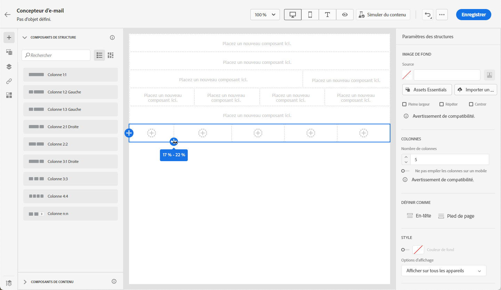

# Commencer à partir de zéro {#content-from-scratch}

>[!CONTEXTUALHELP]
>id="ac_structure_components_email"
>title="À propos des composants de structure"
>abstract="Les composants de structure définissent la disposition de votre email."

>[!CONTEXTUALHELP]
>id="ac_structure_components_landing_page"
>title="À propos des composants de structure"
>abstract="Les composants de structure définissent la disposition de la page de destination."

>[!CONTEXTUALHELP]
>id="ac_structure_components_fragment"
>title="À propos des composants de structure"
>abstract="Les composants de structure définissent la disposition du fragment."

>[!CONTEXTUALHELP]
>id="ac_structure_components_template"
>title="À propos des composants de structure"
>abstract="Les composants de structure définissent la disposition du modèle."

>[!CONTEXTUALHELP]
>id="ac_edition_columns_email"
>title="Définition des colonnes de l’email"
>abstract="Le Concepteur d’email vous permet de définir facilement la disposition de votre email en définissant la structure des colonnes."

>[!CONTEXTUALHELP]
>id="ac_edition_columns_landing_page"
>title="Définir les colonnes de la page de destination"
>abstract="Le Concepteur d’e-mails vous permet de définir facilement la disposition de votre page de destination en définissant la structure des colonnes."

>[!CONTEXTUALHELP]
>id="ac_edition_columns_fragment"
>title="Définir les colonnes du fragment"
>abstract="Le Concepteur d’e-mail vous permet de définir facilement la disposition de votre fragment en définissant la structure des colonnes."

>[!CONTEXTUALHELP]
>id="ac_edition_columns_template"
>title="Définir les colonnes du modèle"
>abstract="Le Concepteur d’e-mail vous permet de définir facilement la disposition de votre modèle en définissant la structure des colonnes."

Le Concepteur d’email permet de définir facilement la structure de votre email. En ajoutant et en déplaçant des éléments structurels à l’aide de simples actions de glisser-déposer, vous pouvez concevoir la forme de votre email en quelques secondes.

Pour commencer à créer le contenu de votre e-mail, procédez comme suit :

1. Dans la page d’accueil du Concepteur d’e-mail, cliquez sur le bouton **[!UICONTROL Créer en partant de zéro]**.

   

1. Commencez à concevoir le contenu de votre e-mail en plaçant les **[!UICONTROL composants de structure]** dans la zone de travail pour définir la mise en page de votre e-mail.

   >[!NOTE]
   >
   >L’empilement des colonnes n’est pas compatible avec tous les programmes d’e-mail. Si le programme n’est pas prise en charge, les colonnes ne seront pas empilées.

   <!--Once placed in the email, you cannot move nor remove your components unless there is already a content component or a fragment placed inside. This is not true in AJO - TBC?-->

1. Ajoutez autant de **[!UICONTROL composants de structure]** que nécessaire et modifiez leurs paramètres dans le volet dédié sur la droite.

   

   Sélectionnez le composant **[!UICONTROL n:n colonne]** pour définir le nombre de colonnes de votre choix (entre 3 et 10). Vous pouvez également définir la largeur des colonnes en déplaçant les flèches situées en bas de chacune d’elles.

   

   >[!NOTE]
   >
   >La taille de chaque colonne ne peut pas être inférieure à 10 % de la largeur totale du composant de structure. Vous ne pouvez pas supprimer une colonne qui n’est pas vide.

1. Développez la section **[!UICONTROL Composants de contenu]** et ajoutez autant d’éléments que nécessaire dans un ou plusieurs composants de structure. [En savoir plus sur les composants de contenu](content-components.md)

1. Chaque composant peut être personnalisé à l’aide du volet **[!UICONTROL Paramètres des composants]** sur la droite. Par exemple, vous pouvez changer le style de texte, la marge intérieure ou la marge de chaque composant. [En savoir plus sur l’alignement et la marge intérieure](alignment-and-padding.md)

   

1. Dans le **[!UICONTROL Sélecteur de ressources]**, vous pouvez sélectionner directement les ressources stockées dans la **[!UICONTROL Bibliothèque de ressources]**. [En savoir plus sur la gestion des ressources](assets-essentials.md)

   Double-cliquez sur le dossier contenant vos ressources. Glissez et déposez-les dans un composant de structure.

   

1. Insérez des champs de personnalisation pour personnaliser le contenu de votre e-mail à partir des données de profil. [En savoir plus sur la personnalisation de contenu](../personalization/personalize.md)

   

1. Ajoutez du contenu dynamique pour adapter le contenu aux profils ciblés selon des règles conditionnelles. [Prise en main du contenu dynamique](../personalization/get-started-dynamic-content.md)

   

1. Cliquez sur l’onglet **[!UICONTROL Liens]** du volet de gauche pour afficher toutes les URL de votre contenu qui feront l’objet d’un tracking. Vous pouvez modifier leur **[!UICONTROL Type de tracking]** ou **[!UICONTROL Libellé]** et ajouter des **[!UICONTROL Balises]** si nécessaire. [En savoir plus sur les liens et le tracking des messages](message-tracking.md)

   

1. Au besoin, vous pouvez personnaliser davantage votre e-mail en cliquant sur **[!UICONTROL Basculer vers l’éditeur de code]** dans le menu avancé. [En savoir plus sur l’éditeur de code](code-content.md)

   

   >[!CAUTION]
   >
   >Vous ne pourrez pas revenir au concepteur visuel pour cet e-mail après avoir basculé vers l’éditeur de code.

1. Une fois que votre contenu est prêt, cliquez sur **[!UICONTROL Simuler du contenu]** pour vérifier le rendu de votre e-mail. Vous pouvez choisir la vue bureau ou la vue mobile. [En savoir plus sur la prévisualisation de votre e-mail](preview.md)

   

1. Lorsque votre e-mail est prêt, cliquez sur **[!UICONTROL Enregistrer]**.

