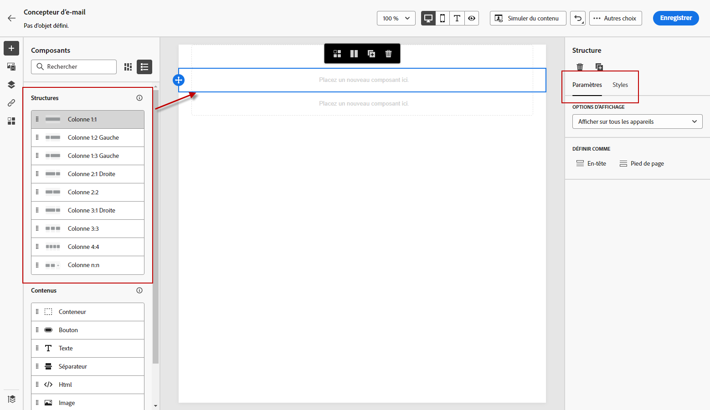
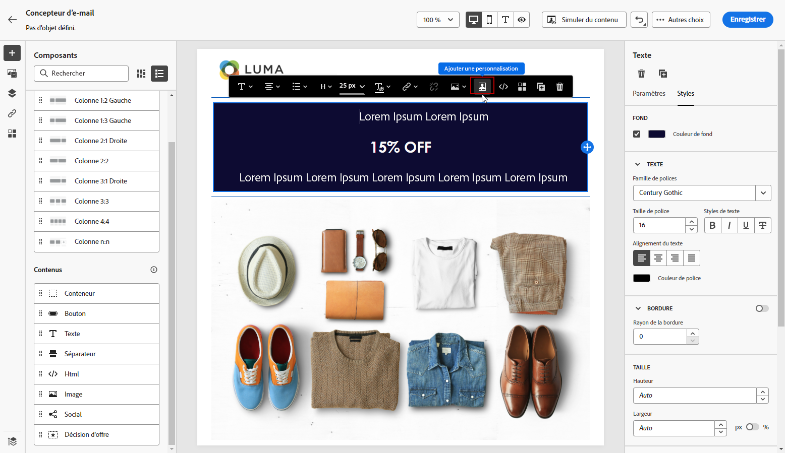
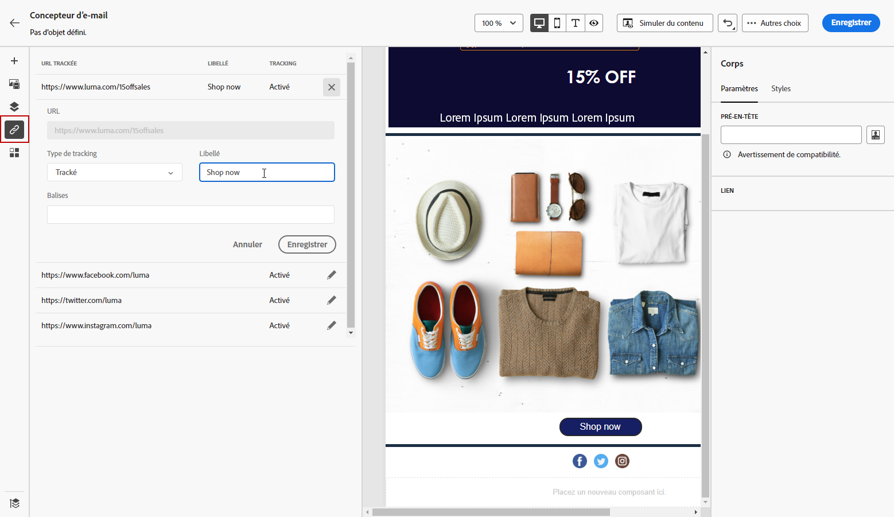

# Concevoir du contenu à partir de zéro avec le concepteur d’e-mail {#content-from-scratch}

>[!CONTEXTUALHELP]
>id="ac_structure_components_email"
>title="Ajout de composants de structure"
>abstract="Les composants de structure définissent la disposition de votre e-mail. Faites glisser et déposez un composant de **structure** dans la zone de travail pour commencer à concevoir le contenu de votre e-mail."

>[!CONTEXTUALHELP]
>id="ac_structure_components_landing_page"
>title="Ajout de composants de structure"
>abstract="Les composants de structure définissent la disposition de la page de destination. Faites glisser et déposez un composant de **structure** dans la zone de travail pour commencer à concevoir le contenu de votre page de destination."

>[!CONTEXTUALHELP]
>id="ac_structure_components_fragment"
>title="Ajout de composants de structure"
>abstract="Les composants de structure définissent la disposition du fragment. Faites glisser et déposez un composant de **structure** dans la zone de travail pour commencer à concevoir le contenu de votre fragment."

>[!CONTEXTUALHELP]
>id="ac_structure_components_template"
>title="Ajout de composants de structure"
>abstract="Les composants de structure définissent la disposition du modèle. Faites glisser et déposez un composant de **structure** dans la zone de travail pour commencer à concevoir le contenu de votre modèle."

>[!CONTEXTUALHELP]
>id="ac_edition_columns_email"
>title="Définir les colonnes des e-mails"
>abstract="Le concepteur d’e-mail vous permet de définir facilement la disposition de votre e-mail en sélectionnant la structure des colonnes."

>[!CONTEXTUALHELP]
>id="ac_edition_columns_landing_page"
>title="Définir les colonnes de la page de destination"
>abstract="Le Concepteur vous permet de définir facilement la disposition de votre page de destination en sélectionnant la structure des colonnes."

>[!CONTEXTUALHELP]
>id="ac_edition_columns_fragment"
>title="Définir les colonnes de fragment"
>abstract="Le Concepteur vous permet de définir facilement la disposition de votre fragment en sélectionnant la structure des colonnes."

>[!CONTEXTUALHELP]
>id="ac_edition_columns_template"
>title="Définir les colonnes du modèle"
>abstract="Le Concepteur vous permet de définir facilement la disposition de votre modèle en sélectionnant la structure des colonnes."

Utilisez le concepteur d’e-mail d’[!DNL Adobe Journey Optimizer] pour définir facilement la structure de vos contenus. En ajoutant et en déplaçant des éléments structurels à l’aide de simples actions de glisser-déposer, vous pouvez concevoir la forme de vos contenus en quelques secondes.

>[!NOTE]
>
>La [loi européenne sur l’accessibilité](https://eur-lex.europa.eu/legal-content/EN/TXT/?uri=CELEX%3A32019L0882){target="_blank"} stipule que toutes les communications numériques doivent être accessibles. Veillez à suivre les instructions spécifiques répertoriées sur [cette page](accessible-content.md) lors de la conception de contenu dans [!DNL Journey Optimizer].

Pour commencer à créer votre contenu , procédez comme suit :

1. Sur la page d’accueil du Concepteur, cliquez sur l’option **[!UICONTROL Créer en partant de zéro]**.

   

1. Accélérez la création de vos e-mails avec l’assistant AI et générez un contenu d’e-mail complet avec du texte et des images à l’aide de l’assistant [&#x200B; AI pour générer du contenu complet](../content-management/generative-full-content.md).

1. Commencez à concevoir votre contenu en plaçant les **[!UICONTROL structures]** dans la zone de travail pour définir la disposition de votre e-mail.

   >[!NOTE]
   >
   >L’empilement des colonnes n’est pas compatible avec tous les programmes d’e-mail. Si le programme n’est pas prise en charge, les colonnes ne seront pas empilées.

   <!--Once placed in the email, you cannot move nor remove your components unless there is already a content component or a fragment placed inside. This is not true in AJO - TBC?-->

1. Ajoutez autant de **[!UICONTROL structures]** que nécessaire et modifiez leurs paramètres dans le volet dédié de droite.

   

   Sélectionnez le composant **[!UICONTROL n:n colonne]** pour définir le nombre de colonnes de votre choix (entre 3 et 10). Vous pouvez également définir la largeur des colonnes en déplaçant les flèches situées en bas de chacune d’elles.

   >[!NOTE]
   >
   >La taille de chaque colonne ne peut pas être inférieure à 10 % de la largeur totale du composant de structure. Vous ne pouvez pas supprimer une colonne qui n’est pas vide.

1. Développez la section **[!UICONTROL Contenus]** et ajoutez autant d’éléments que nécessaire dans un ou plusieurs composants de structure. [En savoir plus sur les composants de contenu](content-components.md)

1. Chaque composant peut être personnalisé à l’aide des onglets **[!UICONTROL Paramètres]** ou **[!UICONTROL Styles]** dans le menu de droite. Par exemple, vous pouvez changer le style de texte, la marge intérieure ou la marge de chaque composant. [En savoir plus sur l’alignement et la marge intérieure](alignment-and-padding.md)

   

1. Dans le **[!UICONTROL Sélecteur de ressources]**, vous pouvez sélectionner directement les ressources stockées dans la **[!UICONTROL Bibliothèque de ressources]**. [En savoir plus sur la gestion des ressources](../integrations/assets.md)

   Double-cliquez sur le dossier contenant vos ressources. Glissez et déposez-les dans un composant de structure.

   

1. Insérez des champs de personnalisation pour personnaliser votre contenu à partir des attributs de profil, des appartenances à des audiences, des attributs contextuels, etc. [En savoir plus sur la personnalisation de contenu](../personalization/personalize.md)

   

1. Cliquez sur **[!UICONTROL Activer le contenu conditionnel]** pour ajouter du contenu dynamique et adapter le contenu aux profils ciblés selon des règles conditionnelles. [Prise en main du contenu dynamique](../personalization/get-started-dynamic-content.md)

   

1. Cliquez sur l’onglet **[!UICONTROL Liens]** du volet de gauche pour afficher toutes les URL de votre contenu qui feront l’objet d’un tracking. Vous pouvez modifier leur **[!UICONTROL Type de tracking]** ou **[!UICONTROL Libellé]** et ajouter des **[!UICONTROL Balises]** si nécessaire. [En savoir plus sur les liens et le tracking](message-tracking.md)

   

1. Au besoin, vous pouvez personnaliser davantage votre e-mail en cliquant sur **[!UICONTROL Basculer vers l’éditeur de code]** dans le menu avancé. Vous pouvez ainsi modifier le code source de l’e-mail, par exemple pour ajouter des balises HTML de suivi ou personnalisées. [En savoir plus sur l’éditeur de code](code-content.md).

   >[!CAUTION]
   >
   >Vous ne pouvez pas revenir au concepteur visuel de cet e-mail après avoir basculé vers l’éditeur de code.

1. Une fois que votre contenu est prêt, cliquez sur le bouton **[!UICONTROL Simuler du contenu]** pour vérifier le rendu. Vous pouvez choisir la vue bureau ou la vue mobile. Vous trouverez des informations détaillées sur la sélection des profils de test et la prévisualisation de votre contenu dans la section [Gestion de contenu](../content-management/preview-test.md).

   

1. Lorsque votre contenu est prêt, cliquez sur **[!UICONTROL Enregistrer]**.
