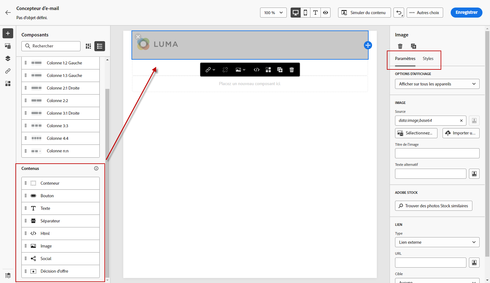

# Commencer à partir de zéro {#content-from-scratch}

>[!CONTEXTUALHELP]
>id="ac_structure_components_email"
>title="À propos des composants de structure"
>abstract="Les composants de structure définissent la disposition de l’email."

>[!CONTEXTUALHELP]
>id="ac_structure_components_landing_page"
>title="À propos des composants de structure"
>abstract="Les composants de structure définissent la disposition de la landing page."

>[!CONTEXTUALHELP]
>id="ac_structure_components_fragment"
>title="À propos des composants de structure"
>abstract="Les composants de structure définissent la disposition du fragment."

>[!CONTEXTUALHELP]
>id="ac_structure_components_template"
>title="À propos des composants de structure"
>abstract="Les composants de structure définissent la disposition du modèle."

>[!CONTEXTUALHELP]
>id="ac_edition_columns_email"
>title="Définir des colonnes d&#39;emails"
>abstract="Le Concepteur d&#39;email permet de définir facilement la disposition de votre email en définissant la structure des colonnes."

>[!CONTEXTUALHELP]
>id="ac_edition_columns_landing_page"
>title="Définir les colonnes de landing page"
>abstract="Le Concepteur d&#39;email permet de définir facilement la mise en page de votre landing page en définissant la structure des colonnes."

>[!CONTEXTUALHELP]
>id="ac_edition_columns_fragment"
>title="Définition des colonnes de fragments"
>abstract="Le Concepteur d&#39;email permet de définir facilement la mise en page de votre fragment en définissant la structure des colonnes."

>[!CONTEXTUALHELP]
>id="ac_edition_columns_template"
>title="Définir les colonnes du modèle"
>abstract="Le Concepteur d&#39;email permet de définir facilement la mise en page de votre modèle en définissant la structure des colonnes."

Le Concepteur d&#39;email permet de définir facilement la structure de votre email. En ajoutant et en déplaçant des éléments structurels à l’aide de simples actions de glisser-déposer, vous pouvez concevoir la forme de votre email en quelques secondes.

Pour commencer à créer le contenu de votre email, procédez comme suit :

1. Sur la page d&#39;accueil du Concepteur d&#39;email, sélectionnez l&#39;option **[!UICONTROL Design from scratch]** .

   

1. Commencez à concevoir le contenu de votre email par glisser-déposer. **[!UICONTROL Structure components]** dans la zone de travail pour définir la mise en page de votre email.

   >[!NOTE]
   >
   >L&#39;empilement des colonnes n&#39;est pas compatible avec tous les programmes de messagerie. Si elle n’est pas prise en charge, les colonnes ne sont pas empilées.

   <!--Once placed in the email, you cannot move nor remove your components unless there is already a content component or a fragment placed inside. This is not true in AJO - TBC?-->

1. Ajoutez autant de **[!UICONTROL Structure components]** selon les besoins et modifiez leurs paramètres dans le volet dédié à droite.

   

   Sélectionnez la **[!UICONTROL n:n column]** pour définir le nombre de colonnes de votre choix (entre 3 et 10). Vous pouvez également définir la largeur de chaque colonne en déplaçant les flèches au bas de chaque colonne.

   

   >[!NOTE]
   >
   >La taille de chaque colonne ne peut pas être inférieure à 10 % de la largeur totale du composant de structure. Vous ne pouvez pas supprimer une colonne qui n’est pas vide.

1. Développez l’objet **[!UICONTROL Content components]** et ajoutez autant d’éléments que nécessaire dans un ou plusieurs composants de structure. [En savoir plus sur les composants de contenu](content-components.md)

1. Chaque composant peut être personnalisé à l’aide de la variable **[!UICONTROL Component settings]** sur la droite. Par exemple, vous pouvez modifier le style de texte, la marge ou la marge intérieure de chaque composant. [En savoir plus sur l’alignement et la marge intérieure](alignment-and-padding.md)

   

1. Dans la **[!UICONTROL Asset picker]**, vous pouvez sélectionner directement les ressources stockées dans la variable **[!UICONTROL Assets library]**. [En savoir plus sur la gestion des ressources](assets-essentials.md)

   Double-cliquez sur le dossier contenant vos ressources. Faites-les glisser et déposez-les dans un composant de structure.

   

1. Insérez des champs de personnalisation pour personnaliser le contenu de votre email à partir des données de profil. [En savoir plus sur la personnalisation du contenu](../personalization/personalize.md)

   

1. Ajoutez un contenu dynamique pour adapter le contenu aux profils ciblés selon des règles conditionnelles. [Prise en main du contenu dynamique](../personalization/get-started-dynamic-content.md)

   

1. Cliquez sur le bouton **[!UICONTROL Links]** dans le volet de gauche pour afficher toutes les URL de votre contenu qui seront suivies. Vous pouvez modifier les **[!UICONTROL Tracking Type]** ou **[!UICONTROL Label]** et ajouter **[!UICONTROL Tags]** si nécessaire. [En savoir plus sur les liens et le tracking des messages](message-tracking.md)

   

1. Si nécessaire, vous pouvez personnaliser davantage votre email en cliquant sur **[!UICONTROL Switch to code editor]** dans le menu avancé. [En savoir plus sur l’éditeur de code](code-content.md)

   

   >[!CAUTION]
   >
   >Vous ne pourrez pas revenir au concepteur visuel de cet email après avoir basculé vers l’éditeur de code.

1. Une fois que votre contenu est prêt, cliquez sur **[!UICONTROL Simulate content]** pour vérifier le rendu de votre email. Vous pouvez choisir la vue de bureau ou mobile. [En savoir plus sur la prévisualisation de votre email](preview.md)

   

1. Lorsque votre email est prêt, cliquez sur **[!UICONTROL Save]**.

