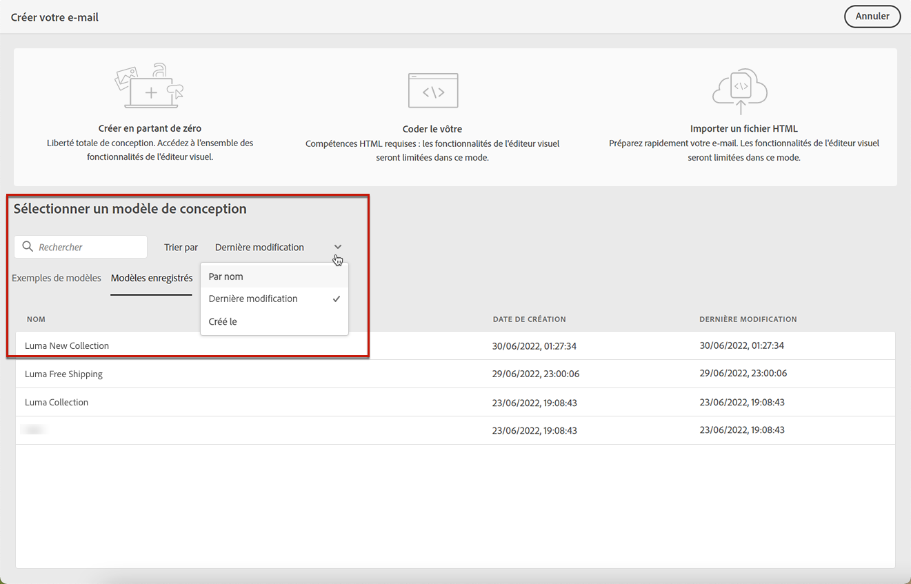

# Créer des modèles de contenu {#content-templates}

>[!CONTEXTUALHELP]
>id="ajo_content_templates"
>title="Créer des modèles de contenu"
>abstract="Créez des modèles autonomes pour réutiliser du contenu sur plusieurs parcours et campagnes."

Pour accélérer et améliorer le processus de conception, vous pouvez créer des modèles autonomes pour réutiliser facilement du contenu personnalisé sur plusieurs [!DNL Journey Optimizer] campagnes et parcours.

Cette fonctionnalité permet aux utilisateurs orientés contenu de travailler sur des modèles en dehors des campagnes ou des parcours. Les utilisateurs marketing peuvent ensuite réutiliser et adapter ces modèles de contenu autonomes dans leurs propres parcours ou campagnes.

>[!CAUTION]
>
>Pour créer, modifier et supprimer des modèles de contenu, vous devez disposer de la variable **[!DNL Manage Library Items]** autorisation incluse dans la variable **[!DNL Content Library Manager]** profil de produit. [En savoir plus](../administration/ootb-product-profiles.md#content-library-manager).

Par exemple, un utilisateur de votre société est responsable du contenu uniquement et n’a donc pas accès aux campagnes ou aux parcours. Cependant, cet utilisateur peut créer un modèle de courrier électronique que les marketeurs de votre entreprise pourront sélectionner pour utilisation dans tous les emails comme point de départ.

>[!NOTE]
>
>* Les modifications apportées aux modèles de contenu ne sont pas propagées aux campagnes ou aux parcours, qu’ils soient en ligne ou en version préliminaire.
>
>* De même, lorsque des modèles sont utilisés dans une campagne ou un parcours, les modifications que vous apportez au contenu de votre campagne et de votre parcours n’affectent pas le modèle de contenu précédemment utilisé.

➡️ [Découvrez comment créer et utiliser des modèles dans cette vidéo](#video-templates)

Pour créer un modèle de contenu, procédez comme suit.

1. Pour accéder à la liste des modèles de contenu, sélectionnez **[!UICONTROL Gestion de contenu]** > **[!UICONTROL Modèles de contenu]** dans le menu de gauche.

   

1. Tous les modèles qui ont été créés sur l’environnement de test actuel, que ce soit à partir d’un parcours, d’une campagne ou du **[!UICONTROL Modèles de contenu]** menu - s’affichent.

   >[!NOTE]
   >
   >Vous pouvez trier les modèles de contenu par date de création ou de modification.

1. Sélectionner **[!UICONTROL Créer un modèle]**.

1. Renseignez les détails du modèle.

   

   >[!NOTE]
   >
   >Actuellement, seule la variable **Email** channel et **HTML** Les types sont pris en charge.

1. Pour attribuer des libellés d’utilisation des données personnalisés ou de base au modèle, sélectionnez **[!UICONTROL Gérer l’accès]**. [En savoir plus sur le contrôle d’accès au niveau de l’objet (OLAC)](../administration/object-based-access.md).

1. Cliquez sur **[!UICONTROL Créer]** et choisissez la conception de votre email parmi les options suivantes :

   * **[!UICONTROL Créer en partant de zéro]**
   * **[!UICONTROL Coder votre propre contenu]**
   * **[!UICONTROL Importer du contenu HTML]**
   * **[!UICONTROL Sélectionner un modèle de conception]**

   

   >[!NOTE]
   >
   >Si vous sélectionnez un modèle, vous pouvez choisir entre **[!UICONTROL Exemples de modèles]**, qui sont des modèles d’email d’usine, et **[!UICONTROL Modèles enregistrés]**, qui sont ceux qui ont été créés à partir d’un parcours, d’une campagne ou de la variable **[!UICONTROL Modèles de contenu]** . [En savoir plus](email-templates.md#save-as-template).

1. Le Concepteur d’email s’affiche. Modifiez votre contenu selon vos besoins, de la même manière que pour tout email contenu dans un parcours ou une campagne, selon l&#39;option que vous avez sélectionnée :

   * [Concevoir entièrement votre email](content-from-scratch.md) à l’aide de l’interface du concepteur et de l’exploitation d’images à partir de [Adobe Experience Manager Assets Essentials](assets-essentials.md).

   * [HTML brut de code ou de copier-coller](code-content.md) directement dans le Concepteur d&#39;email.

   * [Importez du contenu HTML existant](existing-content.md) à partir d’un fichier ou d’un dossier .zip.

   * [Utiliser du contenu existant](email-templates.md) à partir d’une liste de modèles intégrés ou personnalisés.

   

1. Cliquez sur **[!UICONTROL Simulation du contenu]** pour vérifier le rendu de votre email. Vous pouvez choisir la vue bureau ou la vue mobile. [En savoir plus](preview.md).

   >[!CAUTION]
   >
   >Pour simuler le contenu, vous devez disposer de la variable **[!DNL Manage Simulate Content]** autorisation incluse dans la variable **[!DNL Content Library Manager]** profil de produit. [En savoir plus](../administration/ootb-product-profiles.md#content-library-manager).

   

1. Vous pouvez envoyer un BAT pour tester votre contenu et le faire approuver par certains utilisateurs internes avant de l’utiliser dans un parcours ou une campagne.

   * Pour ce faire, cliquez sur le bouton **[!UICONTROL Envoyer un bon à tirer]** et suivez les étapes décrites dans la section [cette section](preview.md#send-proofs).

   * Avant d&#39;envoyer le BAT, vous devez sélectionner la variable [surface email](../configuration/channel-surfaces.md) qui sera utilisé pour tester votre contenu.

      

1. Une fois votre modèle prêt, cliquez sur **[!UICONTROL Enregistrer]**.

1. Si nécessaire, cliquez sur la flèche en regard du nom du modèle pour revenir au **[!UICONTROL Détails]** et modifiez votre modèle.

   

1. Vous pouvez désormais utiliser ce modèle de contenu lors de la création d’un [email](get-started-email-design.md) dans [!DNL Journey Optimizer]. En savoir plus sur [utilisation d’un modèle enregistré](email-templates.md#use-saved-template).

   

## Vidéo pratique{#video-templates}

Découvrez comment créer, modifier et utiliser des modèles de contenu dans [!DNL Journey Optimizer].

>[!VIDEO](https://video.tv.adobe.com/v/3413743/?quality=12)