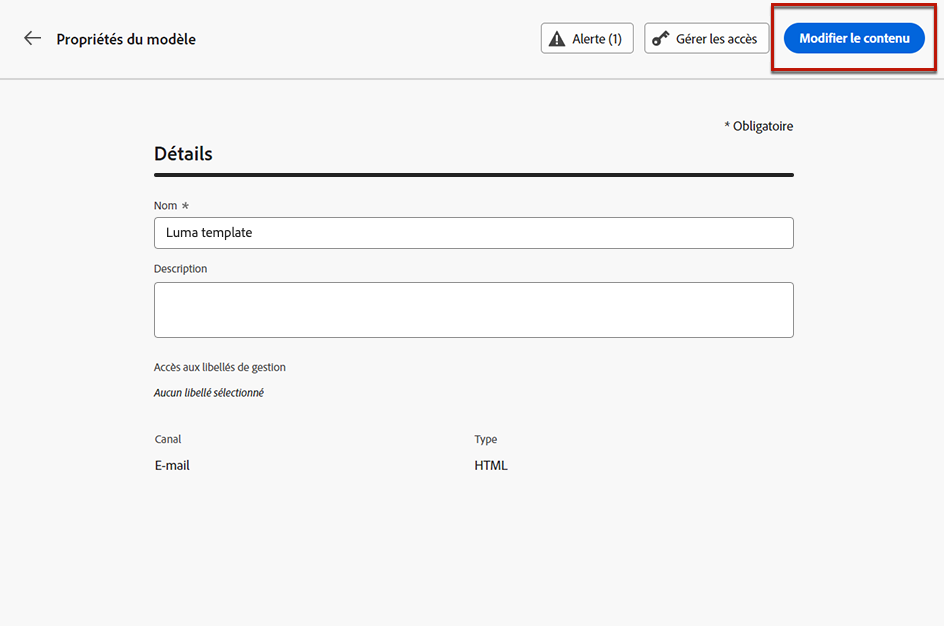
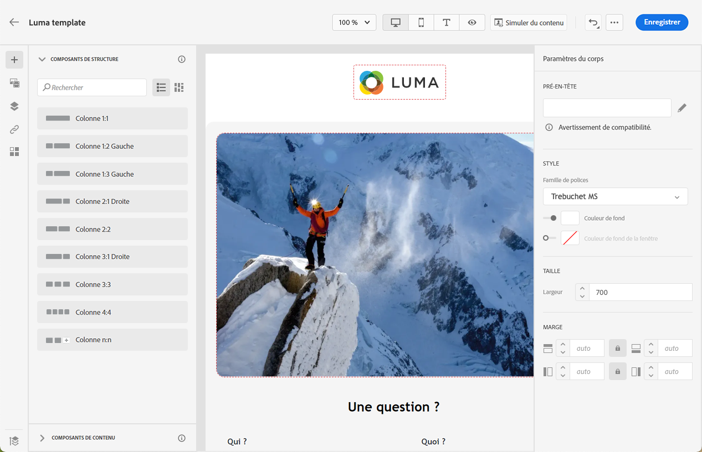

# Utilisation de modèles de contenu {#content-templates}

>[!CONTEXTUALHELP]
>id="ajo_content_templates"
>title="Créer des modèles de contenu"
>abstract="Créez des modèles autonomes pour réutiliser du contenu sur plusieurs parcours et campagnes."

Pour accélérer et améliorer le processus de conception, vous pouvez créer des modèles autonomes pour réutiliser facilement du contenu personnalisé dans [!DNL Journey Optimizer] campagnes et parcours.

Cette fonctionnalité permet aux utilisateurs orientés contenu de travailler sur des modèles en dehors des campagnes ou des parcours. Les utilisateurs marketing peuvent ensuite réutiliser et adapter ces modèles de contenu autonomes dans leurs propres parcours ou campagnes.

Par exemple, un utilisateur de votre société est responsable du contenu uniquement et n’a donc pas accès aux campagnes ou aux parcours. Cependant, cet utilisateur peut créer un modèle de courrier électronique que les marketeurs de votre entreprise pourront sélectionner pour utilisation dans tous les emails comme point de départ.

➡️ [Découvrez comment créer et utiliser des modèles dans cette vidéo](#video-templates)

>[!CAUTION]
>
>Pour créer, modifier et supprimer des modèles de contenu, vous devez disposer de la variable **[!DNL Manage Library Items]** autorisation incluse dans la variable **[!DNL Content Library Manager]** profil de produit. [En savoir plus](../administration/ootb-product-profiles.md#content-library-manager).

## Accès et gestion des modèles {#access-manage-templates}

Pour accéder à la liste des modèles de contenu, sélectionnez **[!UICONTROL Gestion de contenu]** > **[!UICONTROL Modèles de contenu]** dans le menu de gauche.

Tous les modèles qui ont été créés sur l’environnement de test actuel, à partir d’un parcours ou d’une campagne à l’aide de la variable [Enregistrer en tant que modèle](#save-as-template) de l’option **[!UICONTROL Modèles de contenu]** menu - s’affichent.

Vous pouvez trier les modèles de contenu par date de création ou de modification. Vous pouvez également choisir d’afficher uniquement les éléments que vous avez créés ou modifiés.

Pour modifier le contenu d’un modèle, cliquez sur l’élément de votre choix dans la liste, puis sélectionnez **[!UICONTROL Modifier le contenu]**.

Pour supprimer un modèle, sélectionnez l’icône de corbeille en regard du modèle souhaité.

>[!NOTE]
>
>Lorsqu’un modèle est modifié ou supprimé, les campagnes ou les parcours, y compris les emails créés à l’aide de ce modèle, ne sont pas affectés.

## Créer des modèles de contenu {#create-content-templates}

Vous pouvez créer des modèles de contenu de deux manières différentes :

* Créez un modèle de contenu entièrement nouveau à l’aide du rail de gauche. **[!UICONTROL Modèles de contenu]** . [Voici comment procéder](#create-template-from-scratch)

* Lors de la conception d&#39;un email au sein d&#39;une campagne ou d&#39;un parcours, enregistrez votre contenu d&#39;email en tant que modèle. [Voici comment procéder](#save-as-template)

Une fois enregistré, votre modèle de contenu peut être utilisé dans une opération ou un parcours. Créé de zéro ou à partir d’un email précédent, vous pouvez maintenant utiliser ce modèle lors de la création d’un [email](get-started-email-design.md) dans [!DNL Journey Optimizer]. [Voici comment procéder](email-templates.md)

>[!NOTE]
>
>* Les modifications apportées aux modèles de contenu ne sont pas propagées aux campagnes ou aux parcours, qu’ils soient en ligne ou en version préliminaire.
>
>* De même, lorsque des modèles sont utilisés dans une campagne ou un parcours, les modifications que vous apportez au contenu de votre campagne et de votre parcours n’ont aucune incidence sur le modèle de contenu précédemment utilisé.

### Créer un modèle à partir de zéro {#create-template-from-scratch}

Pour créer entièrement un modèle de contenu, procédez comme suit.

1. Accédez à la liste des modèles de contenu via le **[!UICONTROL Gestion de contenu]** > **[!UICONTROL Modèles de contenu]** menu de gauche.

   

1. Sélectionner **[!UICONTROL Créer un modèle]**.

1. Renseignez les détails du modèle.

   

   >[!NOTE]
   >
   >Actuellement, seule la variable **Email** channel et **HTML** Les types sont pris en charge.

1. Pour attribuer des libellés d’utilisation des données personnalisés ou de base au modèle, sélectionnez **[!UICONTROL Gérer l’accès]**. [En savoir plus sur le contrôle d’accès au niveau de l’objet (OLAC)](../administration/object-based-access.md).

1. Cliquez sur **[!UICONTROL Créer]** et choisissez comment concevoir votre email à partir des différentes options :

   * [Concevoir entièrement votre email](content-from-scratch.md) via l&#39;interface du Concepteur d&#39;email.

   * [HTML brut de code ou de copier-coller](code-content.md) directement dans le Concepteur d&#39;email.

   * [Importez du contenu HTML existant](existing-content.md) à partir d’un fichier ou d’un dossier .zip.

   * Utilisez du contenu existant à partir d’une liste de modèles intégrés ou personnalisés. Les étapes d&#39;utilisation d&#39;un modèle de contenu dans un email sont décrites dans la section [cette section](email-templates.md).

   

1. Le [Concepteur d&#39;email](get-started-email-design.md) s’affiche. Modifiez votre contenu selon vos besoins, de la même manière que pour tout email contenu dans un parcours ou une campagne, selon l&#39;option que vous avez sélectionnée.

   

1. Vous pouvez tester votre contenu si nécessaire. [Voici comment procéder](#test-template)

1. Une fois votre modèle prêt, cliquez sur **[!UICONTROL Enregistrer]**.

1. Si nécessaire, cliquez sur la flèche en regard du nom du modèle pour revenir au **[!UICONTROL Détails]** et modifiez votre modèle.

   

Ce modèle est maintenant prêt à être utilisé lors de la création d’un courrier électronique dans [!DNL Journey Optimizer]. [Voici comment procéder](email-templates.md)

### Enregistrer en tant que modèle {#save-as-template}

>[!CONTEXTUALHELP]
>id="ajo_messages_depecrated_inventory"
>title="Découvrez comment migrer vos messages"
>abstract="Le 25 juillet 2022, le menu Messages a disparu et les messages sont désormais créés directement à partir d’un parcours. Si vous souhaitez réutiliser vos messages hérités dans les parcours, vous devez les enregistrer en tant que modèles."

Lors de la conception d’une [email](get-started-email-design.md) dans une campagne ou un parcours, vous pouvez enregistrer le contenu de votre email pour une réutilisation ultérieure. Pour ce faire, suivez les étapes ci-après.

1. Dans le Concepteur d&#39;email, cliquez sur les points de suspension en haut à droite de l&#39;écran.

1. Sélectionner **[!UICONTROL Enregistrer en tant que modèle de contenu]** dans le menu déroulant.

   

1. Ajoutez un nom et une description pour ce modèle.

   

1. Cliquez sur **[!UICONTROL Enregistrer]**.

1. Le modèle est enregistré dans la variable **[!UICONTROL Modèles de contenu]** accessible à partir de la liste [!DNL Journey Optimizer] menu dédié. Il devient alors un modèle de contenu autonome, accessible, édité et supprimé comme tout autre élément de cette liste. [En savoir plus](#access-manage-templates).

Vous pouvez désormais utiliser ce modèle lors de la création d’un [email](get-started-email-design.md) dans [!DNL Journey Optimizer]. [Voici comment procéder](email-templates.md)

>[!NOTE]
>
>Toute modification apportée à ce nouveau modèle n’est pas propagée dans l’e-mail d’où elle provient. De même, lorsque le contenu d’origine est modifié dans cet email, le nouveau modèle n’est pas modifié.

## Tester votre modèle de contenu {#test-template}

Vous pouvez tester le rendu de tout modèle de contenu d&#39;email, qu&#39;il soit créé entièrement ou à partir d&#39;un email. Procédez comme suit.

>[!CAUTION]
>
>Pour simuler le contenu, vous devez disposer de la variable **[!DNL Manage Simulate Content]** autorisation incluse dans la variable **[!DNL Content Library Manager]** profil de produit. [En savoir plus](../administration/ootb-product-profiles.md#content-library-manager).

1. Accédez à la liste des modèles de contenu via le **[!UICONTROL Gestion de contenu]** > **[!UICONTROL Modèles de contenu]** et sélectionnez n’importe quel modèle.

1. Cliquez sur **[!UICONTROL Modifier le contenu]** de la **[!UICONTROL Propriétés du modèle]**.

1. Cliquez sur **[!UICONTROL Simulation du contenu]** et sélectionnez un profil de test pour vérifier le rendu de votre email. Vous pouvez choisir la vue bureau ou la vue mobile. [En savoir plus](preview.md).

   

1. Vous pouvez envoyer un BAT pour tester votre contenu et le faire approuver par certains utilisateurs internes avant de l’utiliser dans un parcours ou une campagne.

   * Pour ce faire, cliquez sur le bouton **[!UICONTROL Envoyer un bon à tirer]** et suivez les étapes décrites dans la section [cette section](preview.md#send-proofs).

   * Avant d&#39;envoyer le BAT, vous devez sélectionner la variable [surface email](../configuration/channel-surfaces.md) qui sera utilisé pour tester votre contenu.

      

## Vidéo pratique {#video-templates}

Découvrez comment créer, modifier et utiliser des modèles de contenu dans [!DNL Journey Optimizer].

>[!VIDEO](https://video.tv.adobe.com/v/3413743/?quality=12)