# Créer un e-mail {#create-email}

>[!BEGINSHADEBOX]

**Sur cette page :** découvrez comment ajouter une action E-mail à un parcours ou à une campagne dans Adobe Journey Optimizer, définir son objet et son contenu, vérifier les alertes et afficher un aperçu avant l’envoi.

>[!ENDSHADEBOX]

>[!CONTEXTUALHELP]
>id="ajo_message_email"
>title="Création d&#39;un e-mail"
>abstract="Définissez l’objet de l’e-mail et ouvrez le Concepteur d’e-mail pour créer le contenu de l’e-mail."

## Ajouter une action d’e-mail {#email-action}

>[!CONTEXTUALHELP]
>id="ajo_journey_action_email"
>title="Action d’e-mail"
>abstract="Une action de canal e-mail envoie un e-mail aux profils lorsqu’ils atteignent cette étape du parcours. Le libellé identifie l’activité dans le canevas du parcours et l’action fait référence à une configuration du canal e-mail qui définit le contenu diffusé. La section **Optimisation** peut inclure des expériences de contenu ou des règles de ciblage, la section **Multilingue** peut diffuser du contenu dans plusieurs langues et la section **Délai d’expiration ou erreur** peut définir un autre chemin en cas d’échec de l’action."
>additional-url="https://experienceleague.adobe.com/fr/docs/journey-optimizer/using/orchestrate-journeys/about-journey-building/journey-action#add-action" text="Commencer avec les actions de canal"

Pour créer un e-mail dans [!DNL Journey Optimizer], ajoutez une action d’**[!UICONTROL e-mail]** à un parcours ou à une campagne. Suivez ensuite les étapes ci-dessous, en fonction de votre cas.

>[!BEGINTABS]

>[!TAB Ajouter un e-mail à un parcours]

1. Ouvrez votre parcours, puis effectuez un glisser-déposer d’une activité **[!UICONTROL Action]** depuis la section **[!UICONTROL Actions]** de la palette. En savoir plus sur l’activité [Action](../building-journeys/journey-action.md).

   >[!IMPORTANT]
   >
   >Les activités de canal natives héritées (e-mail, notification push, SMS, in-app, web, expérience basée sur le code et carte de contenu) sont obsolètes depuis la version de mars 2026. Les parcours existants qui utilisent ces activités continuent à fonctionner sans modification ; aucune migration n’est requise.

1. Sélectionnez **[!UICONTROL E-mail]** comme type d’action.

   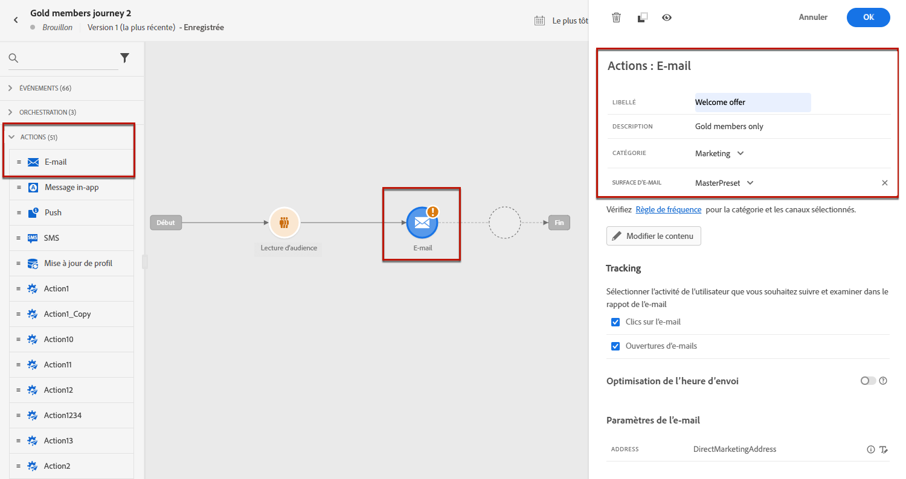

1. Saisissez un **[!UICONTROL Libellé]** pour identifier votre action dans la zone de travail du parcours.

1. Cliquez sur le bouton **[!UICONTROL Configurer l’action]**.

1. Vous accédez à l’onglet **[!UICONTROL Actions]**. À partir de là, sélectionnez ou créez la configuration d’e-mail à utiliser. [En savoir plus](email-settings.md)

   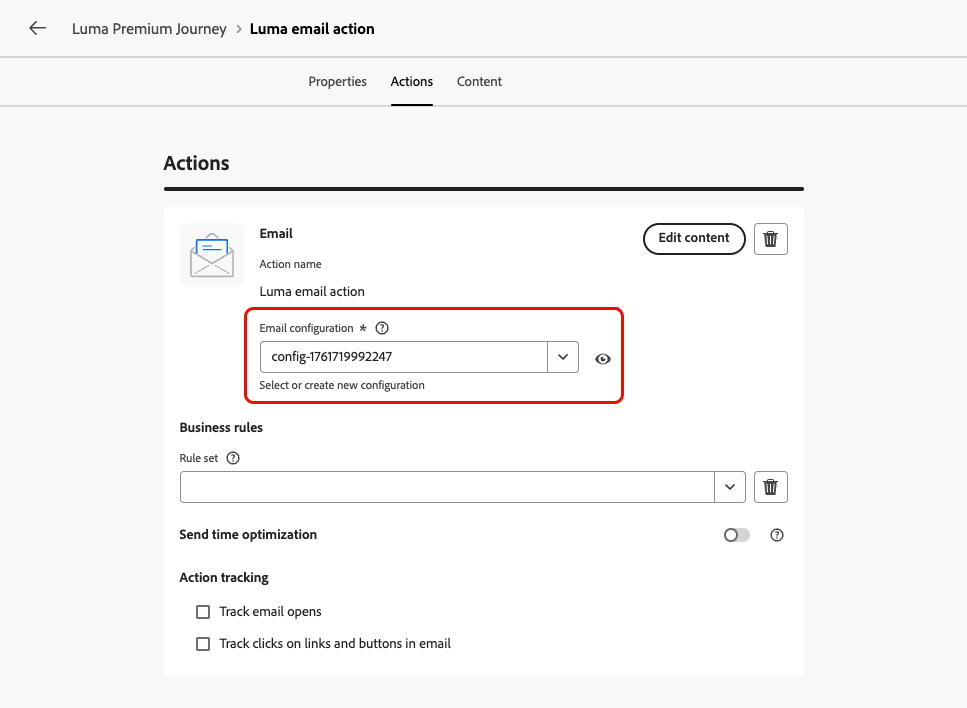

1. En outre :

   * Vous pouvez appliquer des règles de limitation à votre action e-mail en sélectionnant un jeu de règles dans la liste déroulante **[!UICONTROL Règles métier]**. [En savoir plus](../conflict-prioritization/channel-capping.md)

   * Vous pouvez utiliser l’option **[!DNL Send time optimization]** pour prévoir le meilleur moment pour envoyer le message afin d’optimiser l’engagement en fonction des taux historiques d’ouverture et de clic. [Voici comment procéder](../building-journeys/send-time-optimization.md)

1. Sélectionnez le bouton **[!UICONTROL Modifier le contenu]** et créez votre contenu selon vos besoins à l’aide du Designer d’e-mail. [En savoir plus](#define-email-content)

1. Revenez à la zone de travail parcours. Si nécessaire, complétez votre flux de parcours en faisant glisser et en déposant des actions ou des événements supplémentaires. [En savoir plus](../building-journeys/about-journey-activities.md)

Pour plus d’informations sur la création, la configuration et la publication d’un parcours, consultez [cette page](../building-journeys/journey-gs.md).

>[!TAB Ajouter un e-mail à une campagne]

1. [Créez une campagne](../campaigns/create-campaign.md), puis sélectionnez **[!UICONTROL E-mail]** comme action.

1. Suivez les étapes de création d’une campagne par e-mail, telles que les propriétés de la campagne, l’[audience](../audience/about-audiences.md) et le [planning](../campaigns/campaign-schedule.md).

   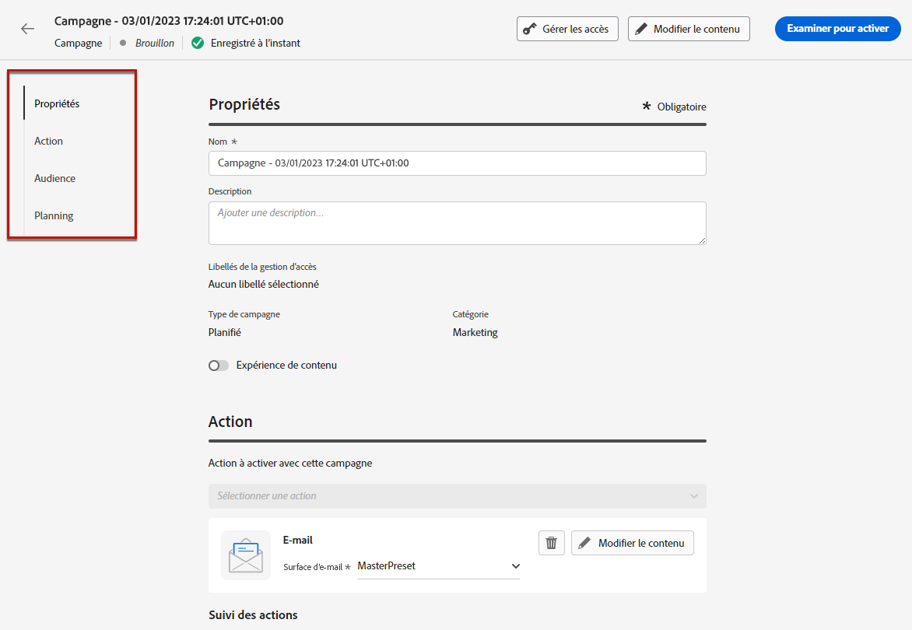

1. Sélectionnez l’action **[!UICONTROL E-mail]**.

1. Sélectionnez ou créez la configuration du canal e-mail. [En savoir plus](email-settings.md)

   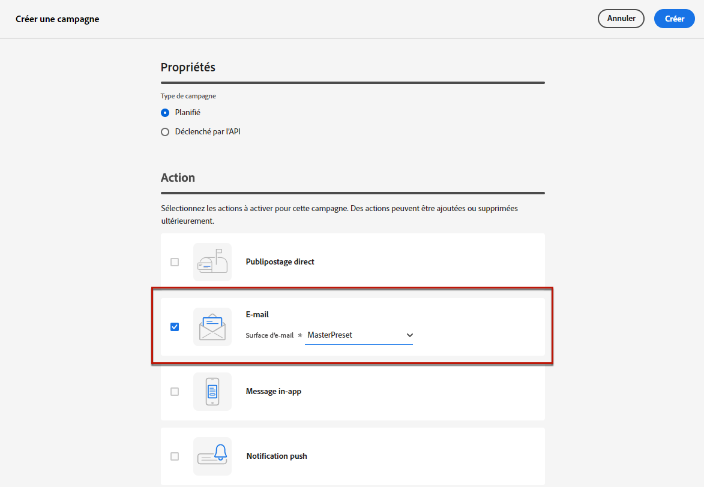

<!--
From the **[!UICONTROL Action]** section, specify if you want to track how your recipients react to your delivery: you can track email opens, and/or clicks on links and buttons in your email.

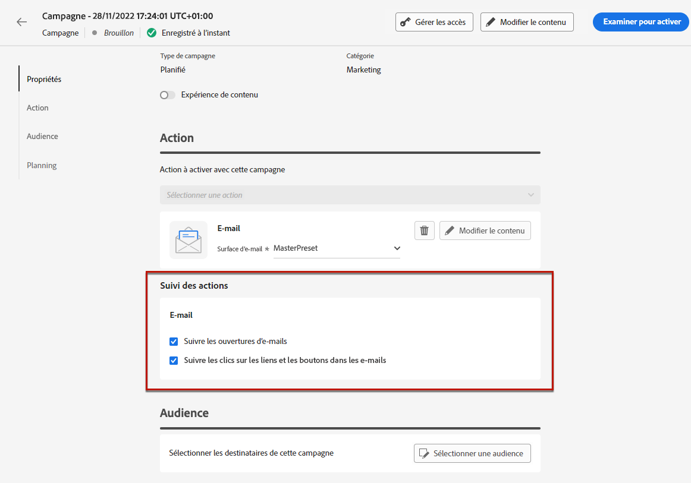
-->
Pour plus d’informations sur la création, la configuration et l’activation d’une campagne, consultez [cette page](../campaigns/get-started-with-campaigns.md).

>[!ENDTABS]

## Définir le contenu de votre e-mail {#define-email-content}

<!-- update the quarry component with right ID value-->

>[!CONTEXTUALHELP]
>id="test_id"
>title="Configurer le contenu des e-mails"
>abstract="Créez le contenu de votre e-mail. Définissez son objet, puis utilisez le concepteur d’e-mails pour créer et personnaliser le corps de l’e-mail."

Après avoir ajouté l’action E-mail à votre parcours ou à votre campagne, vous devez définir le contenu de l’e-mail, y compris l’objet, les informations sur l’expéditeur ou l’expéditrice et le corps de l’e-mail à l’aide du concepteur d’e-mail. Procédez comme suit :

1. Dans l’écran de configuration des parcours ou des campagnes, cliquez sur le bouton **[!UICONTROL Modifier le contenu]** pour configurer le contenu de l’e-mail. [En savoir plus](get-started-email-design.md)

   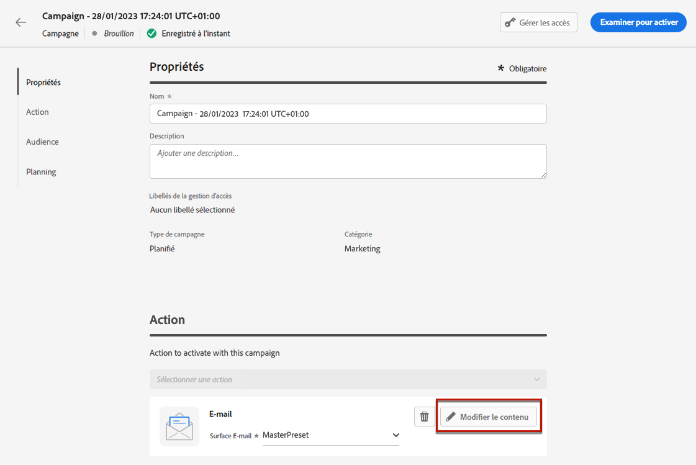

1. Activez le bouton **[!UICONTROL Activer la prise de décision]** si vous souhaitez ajouter des politiques de décision dans votre e-mail.

   Les politiques de décision sont des conteneurs pour vos offres qui tirent profit du moteur de prise de décision afin de renvoyer dynamiquement le meilleur contenu à diffuser pour chaque membre de l’audience. [Découvrez comment ajouter une politique de décision dans un e-mail](../experience-decisioning/create-decision.md#create-decision).

   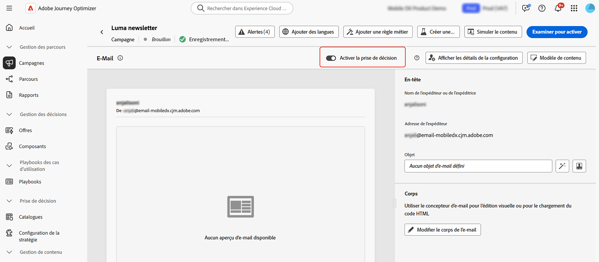

   >[!AVAILABILITY]
   >
   >Pour l’instant, la création de politique de décision dans les e-mails est proposée en disponibilité limitée. Contactez votre représentant ou représentante Adobe pour en obtenir l’accès.

1. Dans la section **[!UICONTROL En-tête]**, vérifiez les champs **[!UICONTROL Nom de l’expéditeur ou de l’expéditrice]**, **[!UICONTROL E-mail de l’expéditeur ou de l’expéditrice]** et **[!UICONTROL Cci]**. Ils sont configurés dans la configuration du canal e-mail que vous avez sélectionnée. [En savoir plus](email-settings.md) <!--check if same for journey-->

   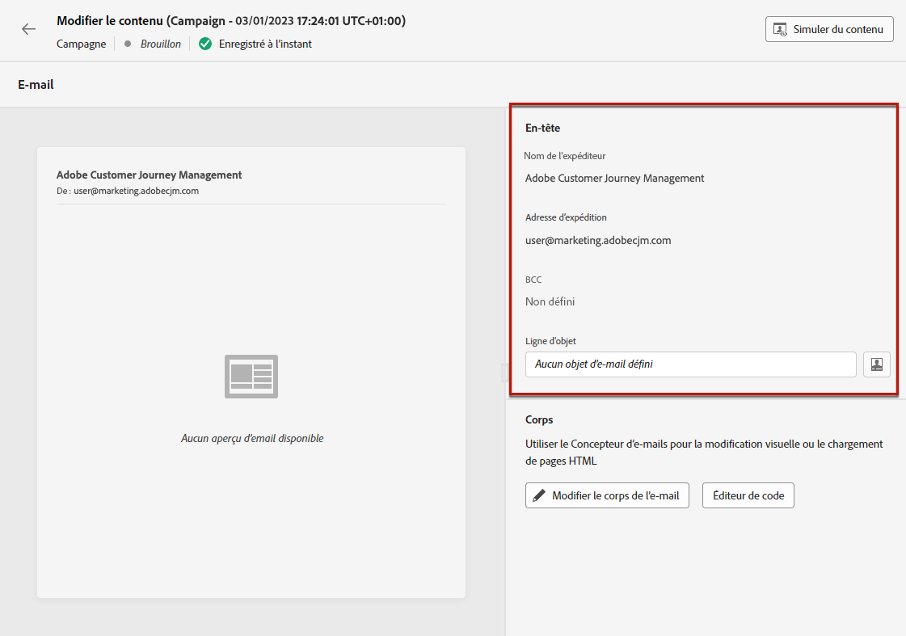

1. Ajoutez un objet pour votre message. Pour configurer et personnaliser l’objet à l’aide de l’éditeur de personnalisation, cliquez sur l’icône **[!UICONTROL Ouvrir la boîte de dialogue de personnalisation]**. [En savoir plus](../personalization/personalization-build-expressions.md)

   >[!NOTE]
   >
   >La ligne d’objet est obligatoire. Elle ne doit pas inclure de sauts de ligne.

1. Cliquez sur le bouton **[!UICONTROL Modifier le corps de l’e-mail]** pour accéder au Concepteur d’e-mail et commencer à créer votre contenu. [En savoir plus](get-started-email-design.md)

   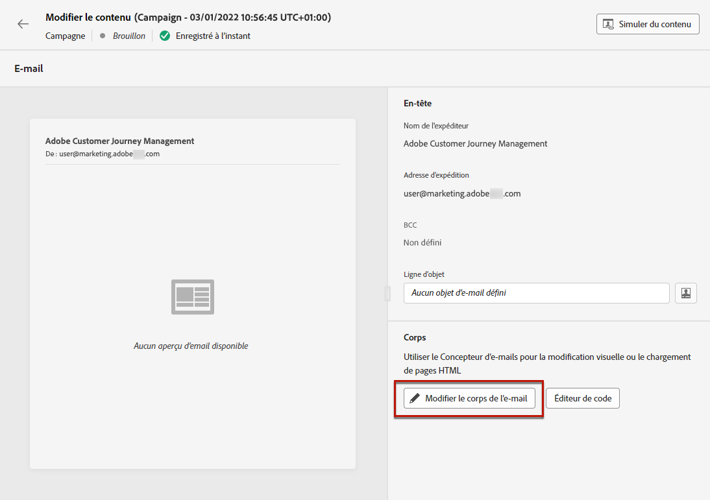

1. Si vous êtes dans une campagne, vous pouvez également cliquer sur le bouton **[!UICONTROL Éditeur de code]** pour coder votre propre contenu en HTML brut à l’aide de la fenêtre pop-up qui s’affiche.

   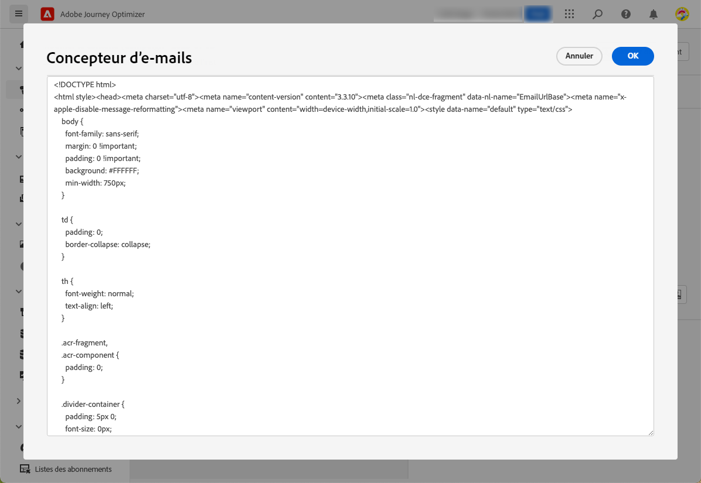

   >[!NOTE]
   >
   >Si vous avez déjà créé ou importé du contenu par l’intermédiaire du concepteur d’e-mail, ce contenu s’affiche par HTML.

1. Si nécessaire, activez l’option **[!UICONTROL Optimiser la taille d’HTML]** pour réduire la taille de votre HTML de messagerie pendant le processus de publication. [En savoir plus](#optimize-html-size)

## Vérifier les alertes {#check-email-alerts}

Lorsque vous concevez vos messages, des alertes s’affichent dans l’interface (en haut à droite de l’écran) lorsque des paramètres clés sont manquants.

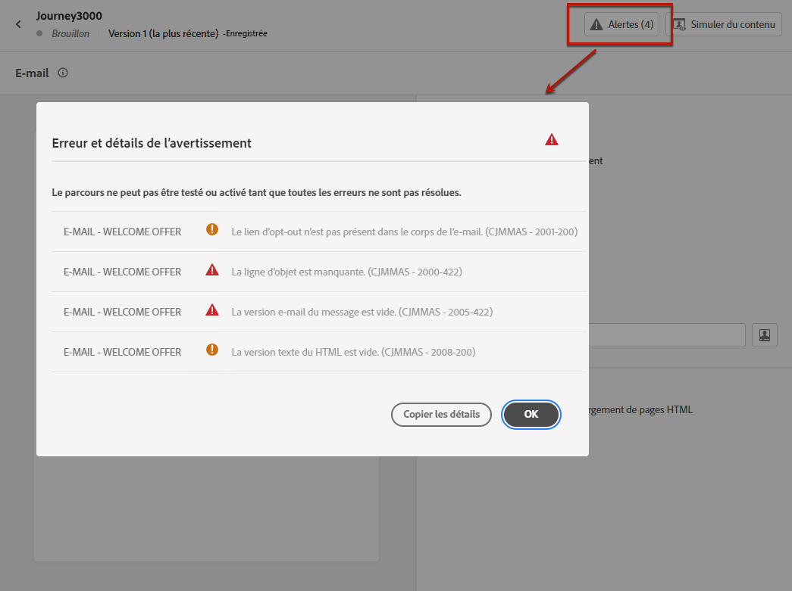

>[!NOTE]
>
>Si ce bouton ne s’affiche pas, aucune alerte n’a été détectée.

Les paramètres et les éléments vérifiés par le système sont répertoriés ci-dessous. Vous trouverez également des informations sur la façon d’adapter votre configuration pour résoudre les problèmes correspondants.

Deux types d’alertes peuvent avoir lieu :

* Les **avertissements** se rapportent aux recommandations et aux bonnes pratiques telles que :

   * **[!UICONTROL Le lien d’opt-out ne figure pas dans le corps de l’e-mail]** : il est recommandé d’ajouter un lien d’exclusion dans le corps de votre e-mail. Découvrez comment configurer ce lien dans [cette section](../privacy/opt-out.md#opt-out-decision-management).

     >[!NOTE]
     >
     >Les e-mails de type marketing doivent inclure un lien de désinscription, qui n’est pas obligatoire pour les messages transactionnels. La catégorie du message (**[!UICONTROL Marketing]** ou **[!UICONTROL Transactionnel]**) est définie au niveau de la [configuration des canaux](email-settings.md#email-type) et au moment de la [création du message](#create-email-journey-campaign) d’un parcours ou d’une campagne.

   * **[!UICONTROL Version texte du contenu HTML vide]** : n’oubliez pas de définir une version texte du corps de votre e-mail, car elle sera utilisée lorsque le contenu HTML ne peut pas être affiché Découvrez comment créer cette version texte dans [cette section](text-version-email.md).

   * **[!UICONTROL Lien vide figurant dans le corps de l’email]** : vérifiez que tous les liens de votre email sont corrects. Découvrez comment gérer le contenu et les liens dans [cette section](content-from-scratch.md).

   * **[!UICONTROL La taille de l’email dépasse la limite de 100 Ko]** : pour une diffusion optimale, veillez à ce que la taille de votre email ne dépasse pas 100 Ko. Pour réduire la taille d’HTML, utilisez l’option **[!UICONTROL Optimiser la taille d’HTML]**. [En savoir plus](#optimize-html-size)

* Les **erreurs** vous empêchent de tester ou d’activer le parcours ou la campagne tant qu’elles ne sont pas corrigées, telles que :

   * **[!UICONTROL L’objet est manquant.]** : l’objet de l’e-mail est obligatoire. Découvrez comment définir et personnaliser ce champ dans [cette section](create-email.md).

  <!--HTML is empty when Amp HTML is present-->

   * **[!UICONTROL La version e-mail du message est vide.]** : cette erreur s’affiche lorsque le contenu de l’e-mail n’a pas été configuré. Découvrez comment concevoir le contenu des e-mails dans [cette section](get-started-email-design.md).

   * **[!UICONTROL La configuration n’existe pas]** : vous ne pouvez pas utiliser votre message si la configuration que vous avez sélectionnée est supprimée après la création du message. Si cette erreur se produit, sélectionnez une autre configuration dans les **[!UICONTROL Propriétés]** du message. En savoir plus sur les configurations des canaux dans [cette section](../configuration/channel-surfaces.md).

>[!CAUTION]
>
>Pour pouvoir tester ou activer le parcours/la campagne à l’aide de l’e-mail, vous devez résoudre toutes les alertes d’**erreurs**.

## Optimiser la taille du HTML de l’e-mail {#optimize-html-size}

>[!CONTEXTUALHELP]
>id="ajo_email_minification"
>title="Réduire la taille du HTML"
>abstract="Activez cette option pour compresser le HTML de votre e-mail lors de la publication en supprimant les espaces blancs, les mises en retrait et les commentaires non indispensables. Cela permet d’éviter l’écrêtage d’e-mails dans des clients tels que Gmail, qui tronque les messages de plus de 100 Ko. Notez que lorsque vous utilisez des e-mails multilingues, cette option est activée par défaut pour tous les paramètres régionaux."

[!DNL Journey Optimizer] vous permet de compresser votre version d’HTML par e-mail pendant le processus de publication en supprimant les espaces inutiles, la mise en retrait et les commentaires non indispensables. Conserver une petite taille pour HTML vous permet d’effectuer les opérations suivantes :

* Évitez de **couper les e-mails** — certains clients comme Gmail tronquent les messages de plus de 100 Ko, empêchant les destinataires de voir le contenu complet.
* Améliorer le **temps de chargement des emails** dans la boîte de réception du destinataire.
* Améliorez la **délivrabilité** et réduisez l’utilisation de la bande passante.

Cette optimisation n’est pas appliquée automatiquement. Vous devez l’activer manuellement dans l’écran [ Modifier le contenu ](#define-email-content).

>[!IMPORTANT]
>
> La réduction de la taille d’HTML n’est appliquée qu’au moment de la publication.

L’optimisation est sûre pour le client de messagerie :

* Il conserve les commentaires conditionnels MSO/Outlook.
* Il ne modifie pas le contenu, les images ou les vidéos.

>[!NOTE]
>
>La réduction de la taille de l’e-mail dépend de la structure HTML d’origine de votre e-mail. Si le contenu est déjà compact ou si la payload de l’e-mail est très volumineuse, la réduction peut être minimale et il se peut que l’écrêtage ne soit pas complètement empêché dans tous les cas.

Vous pouvez tester l’impact de l’optimisation de la taille d’HTML avant de publier lors de l’envoi de BAT. [En savoir plus](#optimize-html-proof)

### Optimisation de la taille d’HTML dans les e-mails multilingues {#optimize-html-multilingual}

Lorsque vous utilisez des [variantes d’e-mail multilingues](../content-management/multilingual-gs.md), le paramètre **[!UICONTROL Optimiser la taille d’HTML]** est suivi au niveau de l’e-mail, et non par paramètre régional.

Par conséquent, l’activation de ce paramètre pour un paramètre régional l’applique à tous les paramètres régionaux de cet e-mail au moment de la publication, même pour les paramètres régionaux dans lesquels la case à cocher apparaît toujours décochée dans l’interface utilisateur. Il n’est pas nécessaire de répéter l’action pour chaque paramètre régional.

Pour désactiver l’optimisation de la taille d’HTML, vous devez décocher la case **[!UICONTROL Optimiser la taille d’HTML]** dans chaque paramètre régional. Si vous la laissez activée pour un seul paramètre régional, l’optimisation peut être appliquée à tous les paramètres régionaux.

>[!NOTE]
>
>Si vous exécutez une [expérience de contenu](../content-management/content-experiment.md), le paramètre **[!UICONTROL Optimiser la taille d’HTML]** est géré indépendamment pour chaque traitement, car chaque traitement est considéré comme un message distinct.

## Vérifier et envoyer votre e-mail

Une fois le contenu de votre message défini, vous pouvez prévisualiser son contenu à l’aide de l’une des méthodes de simulation suivantes :

* Cliquez sur **[!UICONTROL Simuler du contenu]** pour tester les variations de contenu avec des exemples de données d’entrée ou la génération automatique d’IA. [Découvrez comment simuler des variations de contenu.](../test-approve/simulate-sample-input.md)
* Cliquez sur **[!UICONTROL Simuler du contenu]**, puis sélectionnez **[!UICONTROL Simuler du contenu (profils AEP)]** dans la liste déroulante pour afficher un aperçu avec des profils de test, envoyer des BAT et vérifier le rendu des e-mails.

Vous pouvez également valider la qualité de votre contenu pour en évaluer la lisibilité, l’efficacité et la cohésion. [En savoir plus sur la validation de la qualité du contenu](../content-management/brands-score.md#validate-quality)

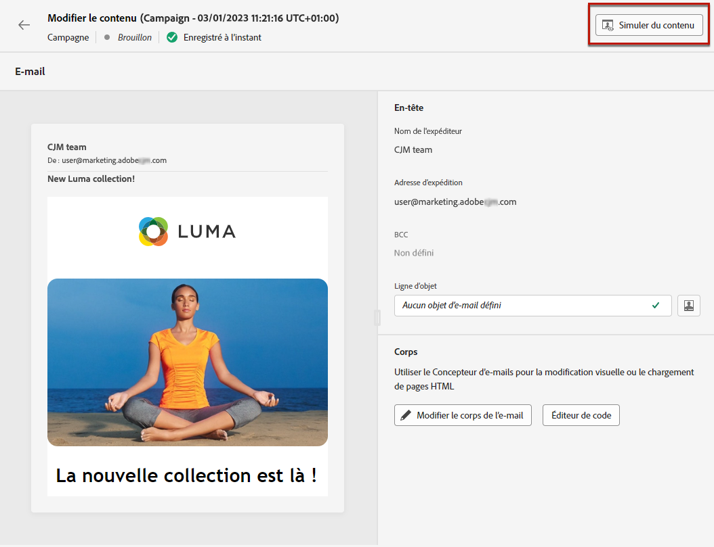

Vous trouverez des informations détaillées sur la sélection des profils de test et la prévisualisation de votre contenu dans la section [Gestion de contenu](../content-management/preview-test.md).

Une fois votre e-mail prêt, effectuez la configuration de votre [parcours](../building-journeys/journey-gs.md) ou [campagne](../campaigns/create-campaign.md) et activez-le pour envoyer le message.

>[!NOTE]
>
>Pour suivre le comportement de vos destinataires par le biais d’ouvertures d’e-mails et/ou d’interactions avec des e-mail,s assurez-vous que les options dédiées dans la section **[!UICONTROL Tracking]** sont activées dans l’[activité E-mail](../building-journeys/journey-action.md) du parcours ou dans la [campagne](../campaigns/create-campaign.md) par e-mail.<!--to move?-->

### Tester l’optimisation de la taille d’HTML {#optimize-html-proof}

Si vous avez activé l’option [Optimisation de la taille d’](#optimize-html-size), vous pouvez évaluer son impact avant de la publier lors de l’envoi de BAT. Suivez les étapes ci-après.

1. Dans le Designer d’e-mail, cliquez sur l’icône Problèmes dans le rail de droite. Si la taille de l’e-mail rendu dépasse 100 Ko, un message s’affiche pour vous avertir que cela peut entraîner la troncation de certains clients de messagerie. <!--Learn more about content checks in [this section](#check-email-alerts).-->

   

1. Cliquez sur **[!UICONTROL Simuler du contenu]**.

   <!---->

1. Pour tester la version optimisée, cliquez sur le bouton **[!UICONTROL Envoyer le BAT]** et sélectionnez l’option **[!UICONTROL Optimiser la taille d’HTML]**. Une épreuve avec la taille réduite d’HTML sera alors envoyée à vos destinataires testés.

   

   >[!NOTE]
   >
   >Ce paramètre est indépendant de l’éditeur d’e-mail : l’épreuve reflète ce que vous sélectionnez dans l’épreuve, que l’option soit activée ou désactivée dans l’e-mail lui-même.

1. Sélectionnez les destinataires du test et cliquez sur le bouton **[!UICONTROL Envoyer un BAT]**. En savoir plus sur l’envoi de BAT dans [cette section](../content-management/proofs.md).
1. Une fois envoyé, de retour dans l’écran **[!UICONTROL Simuler]**, cliquez sur le bouton **[!UICONTROL Afficher le BAT]**.
1. Cliquez sur l’icône Infos en regard du statut du BAT. Les détails de l’optimisation s’affichent dans une fenêtre pop-up, notamment la taille d’origine d’HTML, la taille d’HTML optimisée et le pourcentage de réduction de taille.

   

   Utilisez ces informations pour valider la sortie optimisée et confirmer que l’e-mail reste dans la limite recommandée de 100 Ko avant la publication.

<!--
## Define your email content {#email-content}

Use [!DNL Journey Optimizer] Email Designer to [design your email from scratch](../email/content-from-scratch.md). If you have an existing content, you can [import it in the Email Designer](../email/existing-content.md), or [code your own content](../email/code-content.md) in [!DNL Journey Optimizer]. 

[!DNL Journey Optimizer] comes with a set of [built-in templates](email-templates.md) to help you start. Any email can also be saved as a template.

Use [!DNL Journey Optimizer] personalization editor to personalize your messages with profiles' data. For more on personalization, refer to [this section](../personalization/personalize.md).

Adapt the content of your messages to the targeted profiles by using [!DNL Journey Optimizer] dynamic content capabilities. [Get started with dynamic content](../personalization/get-started-dynamic-content.md)

## Email tracking {#email-tracking}

If you want to track the behavior of your recipients through openings and/or clicks on links, enable the following options: **[!UICONTROL Email opens]** and **[!UICONTROL Click on email]**. 

Learn more about tracking in [this section](message-tracking.md).

## Validate your email content {#email-content-validate}

Control the rendering of your email, and check personalization settings with test profiles, using the preview section on the left-hand side. For more on this, refer to [this section](preview.md).

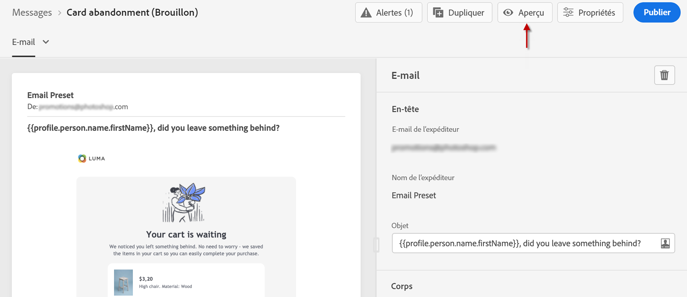

You must also check alerts in the upper section of the editor.  Some of them are simple warnings, but others can prevent you from using the message. 
-->
