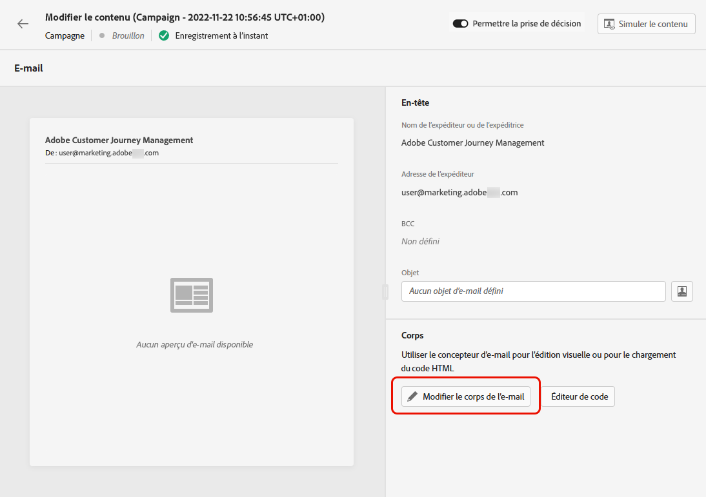
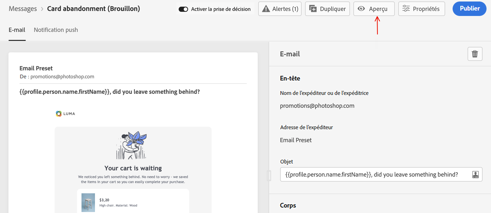

# Créer un email {#create-email}

>[!CONTEXTUALHELP]
>id="ajo_message_email"
>title="Création d&#39;email"
>abstract="Définissez vos paramètres d&#39;email en trois étapes simples."

Pour créer un courrier électronique dans [!DNL Journey Optimizer], procédez comme suit.

## Créer un email dans un parcours ou une campagne {#create-email-journey-campaign}

Ajoutez un **[!UICONTROL Email]** à un parcours ou à une campagne, puis suivez les étapes ci-dessous en fonction de votre cas.

>[!BEGINTABS]

>[!TAB Ajout d’un courrier électronique à un parcours]

1. Ouvrez votre parcours, puis effectuez un glisser-déposer d’une **[!UICONTROL Email]** de l’activité **[!UICONTROL Actions]** de la palette.

1. Fournissez des informations de base sur votre message (libellé, description, catégorie).

1. Choisissez la [surface email](email-settings.md) à utiliser.

   

>[!NOTE]
>
>Si vous envoyez un courrier électronique à partir d’un parcours, vous pouvez tirer parti de la fonction d’optimisation de l’heure d’envoi d’Adobe Journey Optimizer pour prévoir le meilleur moment pour envoyer le message afin d’optimiser l’engagement en fonction des taux d’ouverture et de clic historiques. [Découvrez comment utiliser l’optimisation du temps d’envoi](../building-journeys/journeys-message.md#send-time-optimization)

Pour plus d’informations sur la configuration d’un parcours, reportez-vous à la section [cette page](../building-journeys/journey-gs.md).

>[!TAB Ajout d’un email à une campagne]

1. Créez une campagne planifiée ou déclenchée par une API, puis sélectionnez **[!UICONTROL Email]** comme votre action.

1. Choisissez la [surface email](email-settings.md) à utiliser.

   

1. Cliquez sur **[!UICONTROL Create]**.

1. Suivez les étapes de création d’une campagne par e-mail, telles que les propriétés de la campagne, [audience](../segment/about-segments.md), et [planning](../campaigns/create-campaign.md#schedule).

   

<!--
From the **[!UICONTROL Action]** section, specify if you want to track how your recipients react to your delivery: you can track email opens, and/or clicks on links and buttons in your email.

-->

Pour plus d&#39;informations sur le paramétrage d&#39;une opération, reportez-vous à la section [cette page](../campaigns/get-started-with-campaigns.md).

>[!ENDTABS]

## Définition du contenu de votre email {#define-email-content}

1. Dans l’écran de configuration du parcours ou de la campagne, cliquez sur le bouton **[!UICONTROL Edit content]** pour configurer le contenu de l&#39;email. [En savoir plus](get-started-email-design.md)

   

1. Dans le **[!UICONTROL Header]** de la section **[!UICONTROL Edit content]** l’écran **[!UICONTROL From name]**, **[!UICONTROL From email]** et **[!UICONTROL BCC]** provient de la surface d’email que vous avez sélectionnée. [En savoir plus](email-settings.md) <!--check if same for journey-->

   

1. Vous pouvez ajouter un objet. Saisissez du texte brut directement dans le champ correspondant ou utilisez la méthode [Editeur d&#39;expression](../personalization/personalization-build-expressions.md) pour personnaliser votre objet.

1. Cliquez sur le bouton **[!UICONTROL Edit email body]** pour commencer à créer votre contenu à l’aide du bouton [!DNL Journey Optimizer] Concepteur d’email. [En savoir plus](get-started-email-design.md)

   

1. Si vous êtes dans une campagne, vous pouvez également cliquer sur la variable **[!UICONTROL Code Editor]** pour coder votre propre contenu en HTML brut à l’aide de la fenêtre contextuelle qui s’affiche.

   

   >[!NOTE]
   >
   >Si vous avez déjà créé ou importé du contenu par le biais du Concepteur d&#39;email, ce contenu s&#39;affiche au format HTML.

## Vérifier les alertes {#check-email-alerts}

Lorsque vous concevez vos messages, des alertes s’affichent dans l’interface (en haut à droite de l’écran) lorsque des paramètres clés sont manquants.

>[!NOTE]
>
>Si ce bouton n’est pas visible, aucune alerte n’a été détectée.

Les paramètres et éléments vérifiés par le système sont répertoriés ci-dessous. Vous trouverez également des informations sur la manière d’adapter votre configuration pour résoudre les problèmes correspondants.

Deux types d’alertes peuvent se produire :

* **Avertissements** se référer aux recommandations et bonnes pratiques, telles que :

   * **[!UICONTROL The opt-out link is not present in the email body]**: il est recommandé d’ajouter un lien de désinscription dans votre corps d’email. Découvrez comment le configurer dans [cette section](../privacy/opt-out.md#opt-out-management).

      >[!NOTE]
      >
      >Les messages électroniques de type marketing doivent inclure un lien d’exclusion, qui n’est pas obligatoire pour les messages transactionnels. La catégorie du message (**[!UICONTROL Marketing]** ou **[!UICONTROL Transactional]**) est défini au niveau de la variable [surface du canal](email-settings.md#email-type) niveau et à quel moment [création du message](#create-email-journey-campaign) à partir d’un parcours ou d’une campagne.

   * **[!UICONTROL Text version of HTML is empty]**: n&#39;oubliez pas de définir une version texte du corps de votre email, car elle sera utilisée lorsque le contenu HTML ne peut pas être affiché. Découvrez comment créer la version texte dans [cette section](text-version-email.md).

   * **[!UICONTROL Empty link is present in email body]**: vérifiez que tous les liens de votre email sont corrects. Découvrez comment gérer le contenu et les liens dans [cette section](content-from-scratch.md).

   * **[!UICONTROL Email size has exceeded the limit of 100KB]**: pour une diffusion optimale, veillez à ce que la taille de votre email ne dépasse pas 100 Ko. Découvrez comment modifier le contenu d’un email dans [cette section](content-from-scratch.md).

* **Erreurs** vous empêche de tester ou d’activer le parcours/la campagne tant qu’ils ne sont pas résolus, par exemple :

   * **[!UICONTROL The subject line is missing]**: l’objet de l’email est obligatoire. Découvrez comment le définir et le personnaliser dans [cette section](create-email.md).

   <!--HTML is empty when Amp HTML is present-->

   * **[!UICONTROL The email version of the message is empty]**: cette erreur s&#39;affiche lorsque le contenu de l&#39;email n&#39;a pas été configuré. Découvrez comment concevoir du contenu d’email dans [cette section](get-started-email-design.md).

   * **[!UICONTROL Surface doesn't exist]**: vous ne pouvez pas utiliser votre message si la surface que vous avez sélectionnée est supprimée après la création du message. Si cette erreur se produit, sélectionnez une autre surface dans le message. **[!UICONTROL Properties]**. En savoir plus sur les surfaces des canaux dans [cette section](../configuration/channel-surfaces.md).

>[!CAUTION]
>
>Pour pouvoir tester ou activer le parcours/la campagne à l’aide de l’e-mail, vous devez résoudre tous les **error** alertes.

## Prévisualiser et envoyer votre email

Une fois le contenu de votre message défini, vous pouvez le prévisualiser afin de contrôler le rendu de votre email, et vérifier les paramètres de personnalisation avec les profils de test. [En savoir plus](preview.md)

Une fois votre email prêt, effectuez la configuration de votre [parcours](../building-journeys/journey-gs.md) ou [campaign](../campaigns/create-campaign.md)et activez-la pour envoyer le message.

>[!NOTE]
>
>Pour suivre le comportement de vos destinataires par le biais d&#39;ouvertures et/ou d&#39;interactions d&#39;email, assurez-vous que les options dédiées dans la variable **[!UICONTROL Tracking]** sont activées dans la section [activité email](../building-journeys/journeys-message.md) ou dans l’email [campaign](../campaigns/create-campaign.md).<!--to move?-->

<!--

## Define your email content {#email-content}

Use [!DNL Journey Optimizer] Email Designer to [design your email from scratch](../email/content-from-scratch.md). If you have an existing content, you can [import it in the Email Designer](../email/existing-content.md), or [code your own content](../email/code-content.md) in [!DNL Journey Optimizer]. 

[!DNL Journey Optimizer] comes with a set of [built-in templates](email-templates.md) to help you start. Any email can also be saved as a template.

Use [!DNL Journey Optimizer] Expression editor to personalize your messages with profiles' data. For more on personalization, refer to [this section](../personalization/personalize.md).

Adapt the content of your messages to the targeted profiles by using [!DNL Journey Optimizer] dynamic content capabilities. [Get started with dynamic content](../personalization/get-started-dynamic-content.md)

## Email tracking {#email-tracking}

If you want to track the behavior of your recipients through openings and/or clicks on links, enable the following options: **[!UICONTROL Email opens]** and **[!UICONTROL Click on email]**. 

Learn more about tracking in [this section](message-tracking.md).

## Validate your email content {#email-content-validate}

Control the rendering of your email, and check personalization settings with test profiles, using the preview section on the left-hand side. For more on this, refer to [this section](preview.md).

You must also check alerts in the upper section of the editor.  Some of them are simple warnings, but others can prevent you from using the message. 

-->

