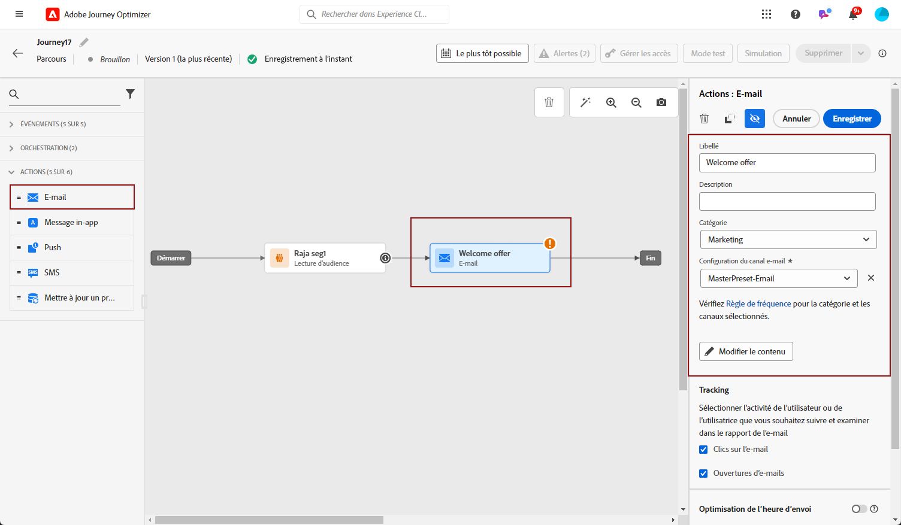
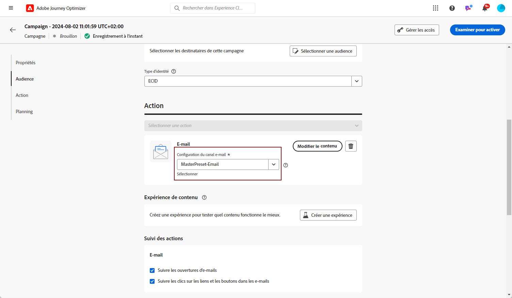
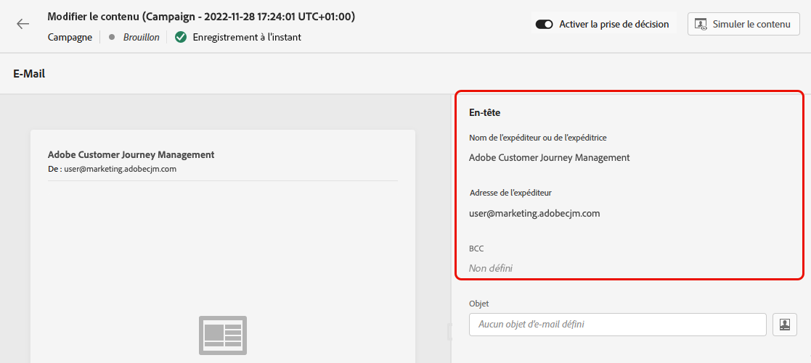

# Création d&#39;un e-mail {#create-email}

>[!CONTEXTUALHELP]
>id="ajo_message_email"
>title="Création d&#39;un e-mail"
>abstract="Définissez vos paramètres d&#39;e-mail en trois étapes simples."

Pour créer un courrier électronique dans [!DNL Journey Optimizer], procédez comme suit.

## Créer un email dans un parcours ou une campagne {#create-email-journey-campaign}

Ajoutez un **[!UICONTROL Email]** à un parcours ou à une campagne, et suivez les étapes ci-dessous en fonction de votre cas.

>[!BEGINTABS]

>[!TAB Ajouter un email à un parcours]

1. Ouvrez votre parcours, puis effectuez un glisser-déposer d’un **[!UICONTROL Email]** de l’activité **[!UICONTROL Actions]** de la palette.

1. Fournissez des informations de base sur votre message (libellé, description, catégorie).

1. Choisissez la [surface email](email-settings.md) à utiliser.

   

>[!NOTE]
>
>Si vous envoyez un courrier électronique à partir d’un parcours, vous pouvez tirer parti de la fonction d’optimisation de l’heure d’envoi de Adobe Journey Optimizer pour prévoir le meilleur moment d’envoi du message afin d’optimiser l’engagement en fonction des taux d’ouverture et de clic historiques. [Découvrez comment utiliser l’optimisation du temps d’envoi](../building-journeys/journeys-message.md#send-time-optimization)

Pour plus d’informations sur la configuration d’un parcours, reportez-vous à la section [cette page](../building-journeys/journey-gs.md).

>[!TAB Ajout d’un email à une campagne]

1. Créez une campagne planifiée ou déclenchée par une API, puis sélectionnez **[!UICONTROL Email]** comme votre action.

1. Choisissez la [surface email](email-settings.md) à utiliser.

   

1. Cliquez sur **[!UICONTROL Créer]**.

1. Suivez les étapes de création d’une campagne par e-mail, telles que les propriétés de la campagne, [audience](../segment/about-segments.md), et [planning](../campaigns/create-campaign.md#schedule).

   

<!--
From the **[!UICONTROL Action]** section, specify if you want to track how your recipients react to your delivery: you can track email opens, and/or clicks on links and buttons in your email.

-->

Pour plus d&#39;informations sur le paramétrage d&#39;une opération, reportez-vous à la section [cette page](../campaigns/get-started-with-campaigns.md).

>[!ENDTABS]

## Définition du contenu de l’e-mail {#define-email-content}

1. Dans l&#39;écran de configuration des parcours ou des campagnes, cliquez sur le bouton **[!UICONTROL Modifier le contenu]** pour configurer le contenu de l&#39;email. [En savoir plus](get-started-email-design.md)

   

1. Dans le **[!UICONTROL En-tête]** de la section **[!UICONTROL Modifier le contenu]** l’écran **[!UICONTROL À partir du nom]**, **[!UICONTROL Adresse électronique]** et **[!UICONTROL Cci]** provient de la surface d’email que vous avez sélectionnée. [En savoir plus](email-settings.md) <!--check if same for journey-->

   

1. Vous pouvez ajouter un objet. Saisissez du texte brut directement dans le champ correspondant ou utilisez la méthode [Editeur d&#39;expression](../personalization/personalization-build-expressions.md) pour personnaliser votre objet.

1. Cliquez sur le bouton **[!UICONTROL Modifier le corps de l’email]** pour commencer à créer votre contenu à l’aide du bouton [!DNL Journey Optimizer] Concepteur d’email. [En savoir plus](get-started-email-design.md)

   

1. Si vous êtes dans une campagne, vous pouvez également cliquer sur la variable **[!UICONTROL Éditeur de code]** pour coder votre propre contenu en HTML brut à l’aide de la fenêtre contextuelle qui s’affiche.

   

   >[!NOTE]
   >
   >Si vous avez déjà créé ou importé du contenu par l&#39;intermédiaire du Concepteur d&#39;email, ce contenu s&#39;affiche par HTML.

## Vérifier les alertes {#check-email-alerts}

Lorsque vous concevez vos messages, des alertes s’affichent dans l’interface (en haut à droite de l’écran) lorsque des paramètres clés sont manquants.

>[!NOTE]
>
>Si ce bouton ne s’affiche pas, aucune alerte n’a été détectée.

Les paramètres et les éléments vérifiés par le système sont répertoriés ci-dessous. Vous trouverez également des informations sur la façon d’adapter votre configuration pour résoudre les problèmes correspondants.

Deux types d’alertes peuvent avoir lieu :

* **Avertissements** se référer aux recommandations et bonnes pratiques, telles que :

   * **[!UICONTROL Le lien d’opt-out ne figure pas dans le corps de l’e-mail]** : il est recommandé d’ajouter un lien d’exclusion dans le corps de votre e-mail. Découvrez comment configurer ce lien dans [cette section](../privacy/opt-out.md#opt-out-management).

      >[!NOTE]
      >
      >Les e-mails de type marketing doivent inclure un lien d’opt-out, qui n’est pas obligatoire pour les messages transactionnels. La catégorie du message (**[!UICONTROL Marketing]** ou **[!UICONTROL Transactionnel]**) est défini au niveau de la variable [surface du canal](email-settings.md#email-type) niveau et à quel moment [création du message](#create-email-journey-campaign) d’un parcours ou d’une campagne.

   * **[!UICONTROL Version texte du contenu HTML vide]** : n’oubliez pas de définir une version texte du corps de votre e-mail, car elle sera utilisée lorsque le contenu HTML ne peut pas être affiché Découvrez comment créer cette version texte dans [cette section](text-version-email.md).

   * **[!UICONTROL Lien vide figurant dans le corps de l’email]** : vérifiez que tous les liens de votre email sont corrects. Découvrez comment gérer le contenu et les liens dans [cette section](content-from-scratch.md).

   * **[!UICONTROL La taille de l’email dépasse la limite de 100 Ko]** : pour une diffusion optimale, veillez à ce que la taille de votre email ne dépasse pas 100 Ko. Découvrez comment modifier le contenu des emails dans [cette section](content-from-scratch.md).

* **Erreurs** vous empêchez de tester ou d’activer le parcours/la campagne tant qu’ils ne sont pas résolus, par exemple :

   * **[!UICONTROL L’objet est manquant.]** : l’objet de l’e-mail est obligatoire. Découvrez comment définir et personnaliser ce champ dans [cette section](create-email.md).

   <!--HTML is empty when Amp HTML is present-->

   * **[!UICONTROL La version e-mail du message est vide.]** : cette erreur s’affiche lorsque le contenu de l’e-mail n’a pas été configuré. Découvrez comment concevoir le contenu des e-mails dans [cette section](get-started-email-design.md).

   * **[!UICONTROL La surface n&#39;existe pas]**: vous ne pouvez pas utiliser votre message si la surface que vous avez sélectionnée est supprimée après la création du message. Si cette erreur se produit, sélectionnez une autre surface dans les **[!UICONTROL Propriétés]** du message. Pour en savoir plus sur les surfaces de canal, consultez [cette section](../configuration/channel-surfaces.md).

>[!CAUTION]
>
>Pour pouvoir tester ou activer le parcours/la campagne à l&#39;aide de l&#39;email, vous devez résoudre tous les **error** alertes.

## Prévisualiser et envoyer votre email

Une fois le contenu de votre message défini, vous pouvez le prévisualiser afin de contrôler le rendu de votre email, et vérifier les paramètres de personnalisation avec les profils de test. [En savoir plus](preview.md)

Une fois votre email prêt, effectuez la configuration de votre [parcours](../building-journeys/journey-gs.md) ou [campaign](../campaigns/create-campaign.md)et activez-la pour envoyer le message.

>[!NOTE]
>
>Pour suivre le comportement de vos destinataires par le biais d&#39;ouvertures et/ou d&#39;interactions d&#39;email, assurez-vous que les options dédiées dans la variable **[!UICONTROL Tracking]** sont activées dans le parcours [activité email](../building-journeys/journeys-message.md) ou dans l’email [campaign](../campaigns/create-campaign.md).<!--to move?-->

<!--

## Define your email content {#email-content}

Use [!DNL Journey Optimizer] Email Designer to [design your email from scratch](../email/content-from-scratch.md). If you have an existing content, you can [import it in the Email Designer](../email/existing-content.md), or [code your own content](../email/code-content.md) in [!DNL Journey Optimizer]. 

[!DNL Journey Optimizer] comes with a set of [built-in templates](email-templates.md) to help you start. Any email can also be saved as a template.

Use [!DNL Journey Optimizer] Expression editor to personalize your messages with profiles' data. For more on personalization, refer to [this section](../personalization/personalize.md).

Adapt the content of your messages to the targeted profiles by using [!DNL Journey Optimizer] dynamic content capabilities. [Get started with dynamic content](../personalization/get-started-dynamic-content.md)

## Email tracking {#email-tracking}

If you want to track the behavior of your recipients through openings and/or clicks on links, enable the following options: **[!UICONTROL Email opens]** and **[!UICONTROL Click on email]**. 

Learn more about tracking in [this section](message-tracking.md).

## Validate your email content {#email-content-validate}

Control the rendering of your email, and check personalization settings with test profiles, using the preview section on the left-hand side. For more on this, refer to [this section](preview.md).

You must also check alerts in the upper section of the editor.  Some of them are simple warnings, but others can prevent you from using the message. 

-->

