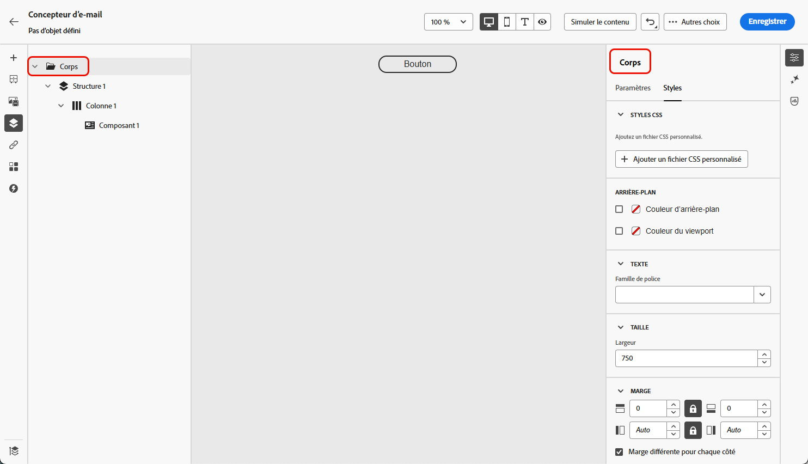
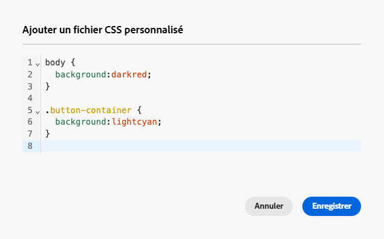
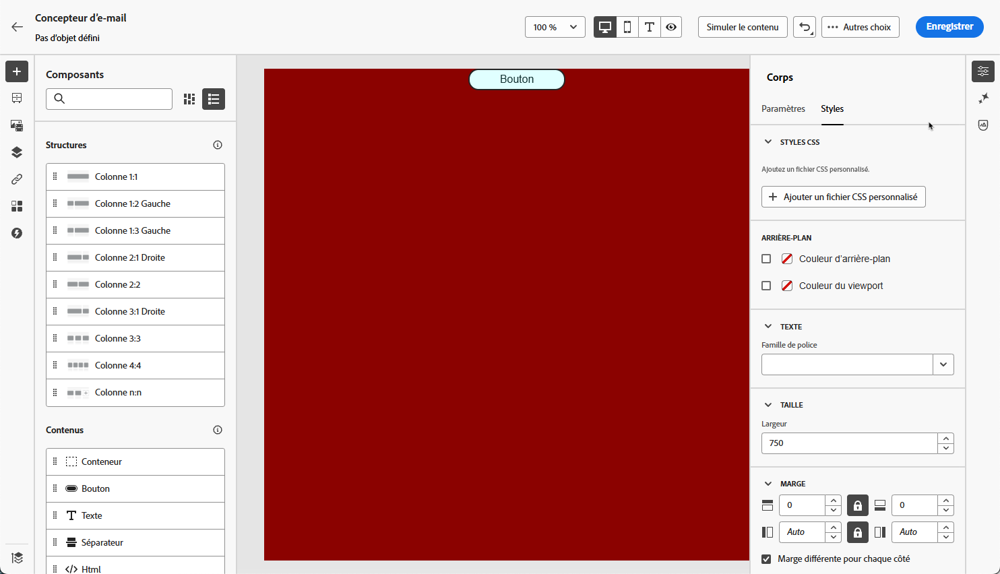

# Ajout d’une page CSS personnalisée au contenu de votre e-mail {#email-metadata}

>[!CONTEXTUALHELP]
>id="ac_edition_css"
>title="Saisir votre propre CSS"
>abstract="Pour plus de flexibilité et de contrôle sur l’apparence de votre contenu, vous pouvez ajouter un CSS personnalisé directement dans le Designer d’e-mail pour appliquer un style avancé et spécifique."

Lors de la conception de vos e-mails, vous pouvez ajouter votre propre CSS personnalisé directement dans le [!DNL Journey Optimizer] [Designer d’e-mail](get-started-email-design.md). Cette fonctionnalité vous permet d’appliquer un style avancé et spécifique, pour une plus grande flexibilité et un meilleur contrôle de l’aspect de votre contenu.

## Définir le CSS personnalisé {#define-custom-css}

Pour ajouter du code CSS personnalisé au contenu de votre e-mail, procédez comme suit.

1. Vérifiez qu’un contenu est défini dans le Designer d’e-mail en ajoutant au moins un [composant](content-components.md).

1. Sélectionnez **[!UICONTROL Corps]** dans l’arborescence de navigation **[!UICONTROL à gauche]** ou en haut du volet de droite. La section **[!UICONTROL Styles CSS]** s’affiche à droite.

   {width="85%"}

   >[!NOTE]
   >
   >La section **[!UICONTROL Styles CSS]** n’est disponible que lorsque du contenu est déjà présent dans l’éditeur.

1. Saisissez votre code CSS dans la zone de texte dédiée qui s’affiche. Assurez-vous que le code CSS personnalisé est valide et suit la syntaxe appropriée. [En savoir plus](#use-valid-css)

   {width="65%"}

   >[!NOTE]
   >
   >Le bouton **[!UICONTROL Ajouter un CSS personnalisé]** n’est disponible que lorsque **[!UICONTROL Corps]** est sélectionné. Cependant, vous pouvez appliquer des styles CSS personnalisés à tous les composants de votre contenu.

1. Enregistrez votre CSS personnalisé et vérifiez qu’il est correctement appliqué à votre contenu. Si ce n’est pas le cas, consultez la section [Dépannage](#troubleshooting).

   {width="85%"}

1. Si vous supprimez tout le contenu, la section disparaît et le CSS personnalisé défini précédemment n’est plus appliqué.

1. Ajoutez à nouveau du contenu à l’éditeur pour que la section **[!UICONTROL styles CSS]** réapparaisse. Le CSS personnalisé est appliqué à nouveau.

## Assurez-vous d’utiliser un CSS valide {#use-valid-css}

Vous pouvez saisir n’importe quelle chaîne CSS valide dans la zone de texte **[!UICONTROL Ajouter un CSS personnalisé]**. Une feuille de style CSS correctement formatée est immédiatement appliquée au contenu.

>[!CAUTION]
>
>Les utilisateurs et utilisatrices sont responsables de la sécurité de leur CSS personnalisé. Assurez-vous que votre CSS n’introduit pas de vulnérabilités ou de conflits avec le contenu existant.
>
>Évitez d’utiliser des feuilles CSS qui pourraient altérer involontairement la disposition ou la fonctionnalité du contenu.

### CSS valide

Vous trouverez ci-dessous des exemples de CSS valide.

```css
.acr-component[data-component-id="form"] {
  display: flex;
  justify-content: center;
  background: none;
}

.acr-Form {
  width: 100%;
  padding: 20px 100px;
  border-spacing: 0px 8px;
  box-sizing: border-box;
  margin: 0;
}

.acr-Form .spectrum-FieldLabel {
  width: 20%;
}

.acr-Form.spectrum-Form--labelsAbove .spectrum-FieldLabel,
.acr-Form [data-form-item="checkbox"] .spectrum-FieldLabel {
  width: auto;
}

.acr-Form .spectrum-Textfield {
  width: 100%;
}

#acr-form-error,
#acr-form-confirmation {
  width: 100%;
  padding: var(--spectrum-global-dimension-static-size-500);
  display: flex;
  align-items: center;
  flex-direction: column;
  justify-content: center;
  gap: var(--spectrum-global-dimension-static-size-200);
}

.spectrum-Form-item.is-required .spectrum-FieldLabel:after{
  content: '*';
  font-size: 1.25rem;
  margin-left: 5px;
  position: absolute;
}

/* Error field placeholder */
.spectrum-HelpText {
  display: none !important;
}

.spectrum-HelpText.is-invalid,
.is-invalid ~ .spectrum-HelpText {
  display: flex !important;
}
```

```css
@media only screen and (min-width: 600px) {
  .acr-paragraph-1 {
    width: 100% !important;
  }
}
```

### CSS non valide

Si une page CSS non valide est saisie, un message d’erreur s’affiche, indiquant que la page CSS ne peut pas être enregistrée. Vous trouverez ci-dessous des exemples de CSS non valide.

L’utilisation de balises `<style>` n’est pas acceptée :

```html
<style type="text/css">
  .acr-Form {
    width: 100%;
    padding: 20px 100px;
    border-spacing: 0px 8px;
    box-sizing: border-box;
    margin: 0;
  }
</style>
```

La syntaxe non valide, telle que les accolades manquantes, n’est pas acceptée :

```css
body {
  background: red;
```

## Implémentation technique {#implementation}

Votre CSS personnalisé est ajouté à la fin de la section `<head>` dans le cadre d’une balise `<style>` avec l’attribut `data-name="global-custom"`, comme dans l’exemple ci-dessous. Cela permet de s’assurer que les styles personnalisés sont appliqués globalement au contenu.

```html
<!DOCTYPE html>
<html>
  <head>
    <meta charset="utf-8">
    <meta name="content-version" content="3.3.31">
    <meta name="x-apple-disable-message-reformatting">
    <meta name="viewport" content="width=device-width,initial-scale=1.0">
    <style data-name="default" type="text/css">
      td { padding: 0; }
      th { font-weight: normal; }
    </style>
    <style data-name="grid" type="text/css">
      .acr-grid-table { width: 100%; }
    </style>
    <style data-name="acr-theme" type="text/css" data-theme="default" data-variant="0">
      body { margin: 0; font-family: Arial; }
    </style>
    <style data-name="media-default-max-width-500px" type="text/css">
      @media screen and (max-width: 500px) {
        body { width: 100% !important; }
      }
    </style>
    <style data-name="global-custom" type="text/css">
      /* Add you custom CSS here */
    </style>
  </head>
  <body>
    <!-- Minimal content -->
  </body>
</html>
```

Le CSS personnalisé n’est pas interprété ni validé par le volet Designer d’e-mail **[!UICONTROL Paramètres]**. Il est entièrement indépendant et ne peut être modifié que par l’intermédiaire de l’option **[!UICONTROL Ajouter un CSS personnalisé]**.

### Contenu importé

Si vous souhaitez utiliser une page CSS personnalisée avec du contenu importé dans le Designer d’e-mail, tenez compte des points suivants :

* Si vous importez du contenu HTML externe, y compris du contenu CSS, sauf si vous le convertissez, il se trouve en **[!UICONTROL mode de compatibilité]**, où la section **[!UICONTROL styles CSS]** n’est pas disponible. [En savoir plus sur l’importation de contenu existant](existing-content.md)

* Si vous importez du contenu créé avec le Designer d’e-mail, y compris le CSS appliqué via l’option **[!UICONTROL Ajouter un CSS personnalisé]**, le CSS précédemment appliqué sera visible et modifiable à partir de la même option.

<!--
* If importing content created with the Email Designer with CSS applied externally, the CSS code previously applied cannot be accessed within the **[!UICONTROL Add custom CSS]** pop-up window, but you can still override it with new custom CSS.-->

## Dépannage {#troubleshooting}

Si votre CSS personnalisé n’est pas appliqué, tenez compte des options ci-dessous.

* Assurez-vous que votre CSS est valide et ne comporte pas d’erreurs de syntaxe (telles que des accolades manquantes, des noms de propriété incorrects). [Voici comment procéder](#use-valid-css)

* Assurez-vous que votre CSS est ajouté à la balise `<style>` avec l’attribut `data-name="global-custom"`. [En savoir plus](#implementation)

* Assurez-vous que votre CSS n’est pas remplacé par d’autres règles CSS, y compris tout [thème](apply-email-themes.md) appliqué à votre contenu.

   * Utilisez les outils de développement de votre navigateur pour inspecter le contenu et vérifier que votre CSS cible les sélecteurs corrects.

   * Pensez à ajouter des `!important` à vos déclarations pour vous assurer qu’elles sont prioritaires. Par exemple :

     ```css
     .acr-Form {
       background: red !important;
     }
     ```

<!--
### Guardrails
-->


