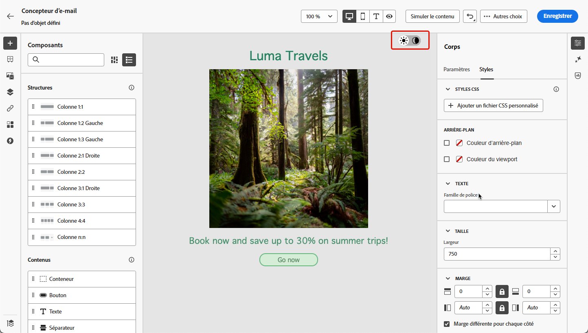
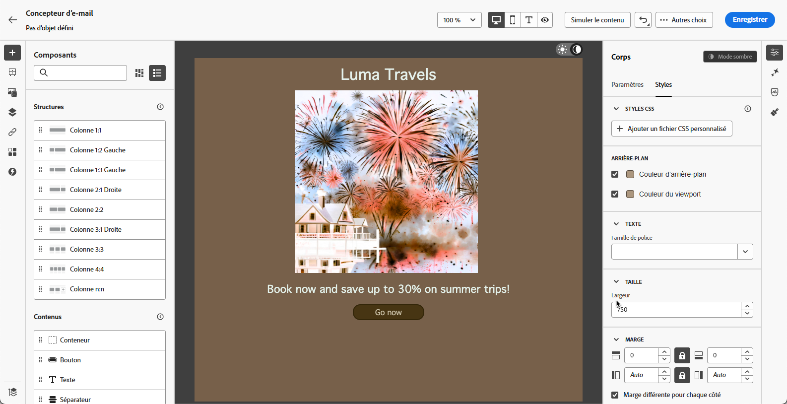
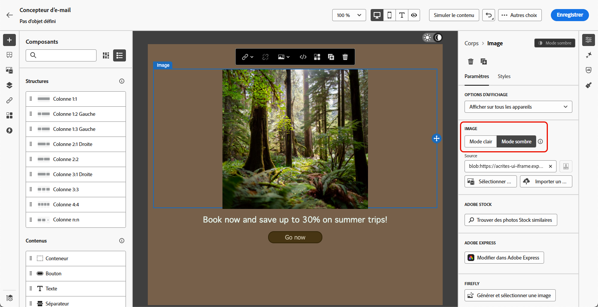
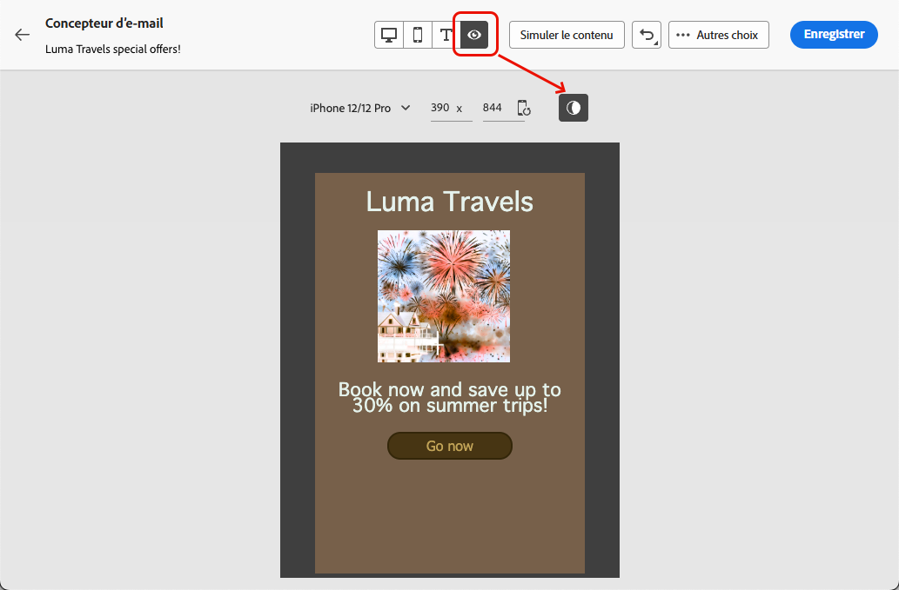
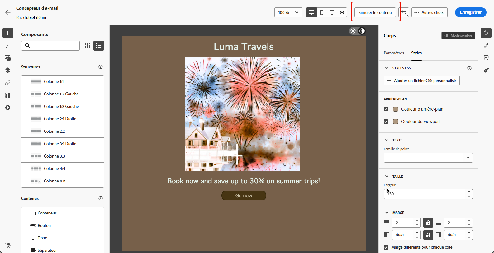

# Gérer le contenu en mode sombre {#dark-mode}

>[!CONTEXTUALHELP]
>id="ac_edition_darkmode"
>title="Basculer vers le mode sombre"
>abstract="Basculez vers le mode sombre pour prévisualiser le rendu et définir des paramètres personnalisés spécifiques.  Le rendu final dépend du client de messagerie de la personne destinataire. Notez que tous les clients de messagerie ne prennent pas en charge le mode sombre personnalisé."

>[!CONTEXTUALHELP]
>id="ac_edition_darkmode_preview"
>title="Basculer vers le mode sombre"
>abstract="Basculez vers le mode sombre pour prévisualiser le rendu sur les clients de messagerie pris en charge.  Le rendu final dépend du client de messagerie de la personne destinataire. Notez que tous les clients de messagerie ne prennent pas en charge le mode sombre."

Lors de la conception de vos e-mails, le [!DNL Journey Optimizer] [Concepteur d’e-mail](get-started-email-design.md) vous permet de passer à la vue **[!UICONTROL Mode sombre]**.

Dans cette vue en mode sombre<!--Email Designer -->, vous pouvez également définir des paramètres personnalisés spécifiques qui seront affichés par les clients de messagerie en mode sombre.

<!--When designing your emails, the Journey Optimizer Email Designer allows you to switch to Dark mode where you can define specific custom settings. When dark mode is on, the supporting email clients will display the settings that you defined for this mode.-->

## Présentation du mode sombre {#what-is-dark-mode}

La manière dont le mode sombre est rendu dans les différents clients de messagerie est complexe. Définissons d’abord le mode sombre.

Le mode sombre permet aux clients de messagerie et aux applications pris en charge d’afficher les e-mails avec des arrière-plans sombres et des couleurs plus claires pour le texte, les boutons et les autres éléments de l’interface d’utilisation. Il permet de réduire la fatigue oculaire, d’économiser la batterie et d’améliorer la lisibilité dans les environnements peu éclairés pour une expérience visuelle plus confortable.

<!--Dark Mode uses a dark color palette with light text and UI elements to reduce eye strain, save battery life, and improve readability in low-light environments.-->

Étant donné qu’il s’agit d’une tendance croissante dans les principaux systèmes d’exploitation et applications <!-- (Apple Mail, Gmail, Outlook, Twitter, Slack)-->, cette fonctionnalité est devenue un point important à prendre en compte dans la conception d’e-mails modernes pour veiller à ce que le contenu reste lisible et visuellement attrayant pour l’ensemble des utilisateurs et utilisatrices.

## Mécanismes de sécurisation {#guardrails}

Les attentes en termes de rendu en mode sombre doivent rester mesurées, car leur application peut varier considérablement selon le client de messagerie.

<!--The dark mode final rendering depends on the recipient's email client. It is not possible to guarantee that your email will look the same in dark mode across all devices.-->

Avant d’utiliser le mode sombre dans le Concepteur d’e-mail [!DNL Journey Optimizer], il est essentiel de comprendre comment les principaux clients de messagerie le gèrent. Il existe trois cas :

<!--
* Check out the list of [email clients supporting dark mode](https://www.caniemail.com/search/?s=dark){target="_blank"}

* Learn more on Dark mode in this [Litmus blog post](https://www.litmus.com/blog/the-ultimate-guide-to-dark-mode-for-email-marketers){target="_blank"}
-->

### Clients qui ne prennent pas en charge le mode sombre. {#not-supporting}

Certains clients de messagerie ne prennent pas du tout en charge cette fonctionnalité, tels que :

* Yahoo!Mail
* AOL

Que vous définissiez des paramètres personnalisés pour le mode sombre ou non dans le Concepteur d’e-mail, ces clients de messagerie n’affichent jamais de rendu en mode sombre. <!--Regardless of whether the interface is in light or dark mode, your email will render the same.-->

### Clients qui appliquent leur propre mode sombre. {#default-support}

Certains clients de messagerie appliquent uniquement leur propre mode sombre par défaut pour tous les e-mails reçus. Les couleurs, arrière-plans, images, etc. sont automatiquement ajustés avec les paramètres du mode sombre spécifiques au client de messagerie, ce qui signifie qu’aucune modification externe n’est possible.

<!--It is important to note that less than 25% of email clients offer customization options for dark mode. Clients such as Gmail implement their own dark mode rendering, which is not subject to external modification.-->

Ces clients sont par exemple :

* Gmail (client de messagerie web de bureau, iOS, Android, client de messagerie web mobile)
* Outlook Windows
* Outlook Windows Mail

Dans ce cas, si vous définissez des paramètres de mode sombre personnalisés dans le Concepteur d’e-mail, ces paramètres sont remplacés par les paramètres du client de messagerie.

Il est important de comprendre que ces clients de messagerie gèrent le mode sombre, mais votre conception de mode sombre spécifique ne sera pas rendue.

<!--In this case, the custom settings that you defined in the Email Designer cannot be rendered.-->

<!--Some visual changes may also be caused by the email app or device overriding the original design.-->

### Clients qui prennent en charge le mode sombre personnalisé. {#custom-support}

D’autres clients de messagerie offrent la possibilité de rendre le mode sombre personnalisé avec la requête `@media (prefers-color-scheme: dark)`, qui est la méthode utilisée par le Concepteur d’e-mail [!DNL Journey Optimizer].

Voici une liste des principaux clients qui gèrent cette option :

* Apple Mail macOS
* Apple Mail iOS
* Outlook macOS
* Outlook.com
* Outlook iOS
* Outlook Android

Dans ce cas, les paramètres spécifiques que vous définissez dans le Concepteur d’e-mail doivent s’afficher.

>[!NOTE]
>
>Découvrez dans [cette section](#define-custom-dark-mode) comment définir les paramètres personnalisés du mode sombre dans le Concepteur d’e-mail.

Cependant, certaines restrictions peuvent s’appliquer en fonction de chaque client de messagerie. Par exemple, certains clients tels qu’Apple Mail 16 (macOS 13) ne génèrent pas de mode sombre si des images sont présentes dans le contenu de l’e-mail.

Pour des résultats optimaux, testez votre contenu avec les clients de messagerie que vous ciblez. Pour visualiser une simulation qui se rapproche le plus possible du résultat final pour chaque client, utilisez l’option [Rendu des e-mails](../content-management/rendering.md) dans le Concepteur d’e-mail.

## Mode sombre dans le Concepteur d’e-mail {#dark-mode-email-designer}

En ce qui concerne le mode sombre dans le Concepteur d’e-mail, deux aspects doivent être pris en compte :

* Vous pouvez prévisualiser la manière dont le mode sombre par défaut s’affichera dans la plupart des clients de messagerie pris en charge. [En savoir plus](#preview-dark-mode)

<!--
    >[!CAUTION]
    >
    >The final rendering may vary according to the recipient's email client. To see the exact rendering for each email client, use the [Email rendering](../content-management/rendering.md) option.-->

* Si vous souhaitez remplacer les paramètres par défaut des clients de messagerie pris en charge, vous pouvez définir des paramètres de mode sombre personnalisés qui s’appliquent à l’e-mail que vous être en train de modifier. [En savoir plus](#define-custom-dark-mode)

<!--
    >[!WARNING]
    >
    >Not all email clients support custom dark mode. Some email clients only apply their own default dark mode for all emails that are received. In this case, the custom settings that you defined in the Email Designer cannot be rendered. [Learn more](#guardrails)-->

### Prévisualiser le mode sombre par défaut {#preview-dark-mode}

Pour accéder au mode sombre dans le Concepteur d’e-mail et prévisualiser les paramètres par défaut du mode sombre, procédez comme suit.

1. Dans la page d’accueil du Concepteur d’e-mail, cliquez sur le bouton **[!UICONTROL Créer à partir de zéro]**. [En savoir plus](content-from-scratch.md)

<!--Should work with templates and themes, NOT for LP and fragments - but TBC with eng.
    >[!NOTE]
    >
    >Currently you may not be able to switch to dark mode if you select an [email template](use-email-templates.md) or if you apply a [theme](apply-email-themes.md).-->

1. Ajoutez des [structures](content-from-scratch.md) et des [composants de contenu](content-components.md) à votre contenu.

1. En haut à droite de la zone de travail centrale, cliquez sur le bouton pour passer en **[!UICONTROL mode sombre]**.

   

1. La prévisualisation du mode sombre par défaut s’affiche.

   

Par défaut, l’aperçu en mode sombre du Concepteur d’e-mail applique le modèle de couleurs « inversion complète des couleurs » à tous les éléments, à l’exception des images et des icônes.

Cela signifie qu’il détecte les zones comportant des éléments clairs et sombres et les inverse, de sorte que les arrière-plans clairs deviennent sombres et que le texte sombre devient clair, tandis que les arrière-plans sombres deviennent clairs et que le texte clair devient sombre.

>[!CAUTION]
>
>Le rendu final peut varier en fonction du client de messagerie de la personne destinataire. Pour visualiser une simulation qui se rapproche le plus possible du résultat final pour chaque client de messagerie, utilisez l’option [Rendu des e-mails](../content-management/rendering.md).

<!--This is custom dark mode:

  

Here you can see that we have applied a different background, defined another image and change the color of the text and button.-->

### Définir le mode sombre personnalisé {#define-custom-dark-mode}

>[!CONTEXTUALHELP]
>id="ac_edition_darkmode_image"
>title="Utiliser une image spécifique pour le mode sombre"
>abstract="Vous pouvez sélectionner une autre image qui s’affichera lorsque le mode sombre sera activé.  L’ajout d’une image spécifique pour le mode sombre ne garantit pas qu’elle s’affichera correctement dans tous les clients de messagerie. Notez que tous les clients de messagerie ne prennent pas en charge le mode sombre personnalisé."

Après avoir activé le **[!UICONTROL mode sombre]**, vous pouvez choisir de modifier des éléments de style spécifiques dans votre contenu qui s’afficheront uniquement si le mode sombre est activé dans le client de messagerie de la personne destinataire, à condition que le client prenne en charge cette fonctionnalité.

>[!WARNING]
>
>Le rendu final en mode sombre dépend de chaque client de messagerie. Le résultat peut donc varier d’un client à l’autre. [En savoir plus](#guardrails)

<!--
>[!WARNING]
>
>Not all email clients support dark mode. Moreover, some email clients only apply their own default dark mode for all emails that are received. In both cases, the custom settings that you defined in the Email Designer cannot be rendered.-->

Pour tirer parti du style du mode sombre personnalisé du Concepteur d’e-mail, Journey Optimizer utilise la requête CSS<!-- `@media (prefers-color-scheme: dark)` method--> `@media (prefers-color-scheme: dark)`, qui détecte si le client de messagerie de l’utilisateur ou de l’utilisatrice est en mode sombre et applique le thème sombre défini dans votre e-mail.

Pour définir les paramètres du mode sombre personnalisé, procédez comme suit.

1. Veillez à basculer vers l’aperçu en **[!UICONTROL mode sombre]** dans le Concepteur d’e-mail. [Voici comment procéder](#preview-dark-mode)

1. Modifiez les attributs de couleurs du style, tels que le texte, les arrière-plans, les boutons, etc.

1. Vous ne pouvez pas modifier les couleurs des images et des icônes, mais vous pouvez définir des ressources spécifiques au mode sombre. Pour ce faire, sélectionnez une image. Passez en **[!UICONTROL mode sombre]** à l’aide du bouton dédié dans le volet **[!UICONTROL Paramètres]** et sélectionnez une autre ressource.

   

   <!---->

1. Vous pouvez à tout moment **[!UICONTROL Passer en mode en direct]** afin de vérifier comment votre contenu s’affiche sur les différentes tailles d’appareils. Dans cette vue, cliquez sur le bouton Mode sombre en haut de l’écran pour prévisualiser la version en mode sombre de votre contenu sur les différents appareils.

   {width="80%" align="center"}

   >[!CAUTION]
   >
   >Le mode en direct est une prévisualisation générique conçue pour comparer l’aspect du rendu sur différentes tailles d’appareils. Le rendu final peut varier en fonction du client de messagerie de la personne destinataire.

1. Une fois que vous avez apporté les modifications souhaitées pour le mode sombre, cliquez sur **[!UICONTROL Simuler le contenu]**.

   

1. Sélectionnez **[!UICONTROL Rendu d’e-mail]** et connectez-vous à votre compte Litmus. Vous pouvez voir le rendu final en mode sombre pour divers clients de messagerie. En savoir plus sur le [rendu des e-mails](../content-management/rendering.md).

   >[!WARNING]
   >
   >Bien que la simulation se rapproche beaucoup de la façon dont les e-mails s’afficheront en mode sombre, le rendu réel peut être différent en raison de variations au niveau des paramètres des fournisseurs de services de messagerie ou au niveau des paramètres des appareils.

## Bonnes pratiques {#best-practices}

À mesure que l’adoption du mode sombre augmente dans les principaux clients de messagerie, il est essentiel d’examiner le rendu de vos e-mails à la fois dans les environnements clairs et sombres, que vous utilisiez le [mode sombre personnalisé](#define-custom-dark-mode) ou non.

Le mode sombre peut modifier les couleurs, les arrière-plans et les images, parfois en remplaçant les choix définis lors de la conception. Pour garantir la cohérence visuelle, l’accessibilité et l’intégrité de la marque, suivez les bonnes pratiques répertoriées ci-dessous.

**Optimiser vos images et vos logos**

* Enregistrez les logos et les icônes au format PNG avec des arrière-plans transparents pour éviter la présence de zones blanches visibles en mode sombre.

* Évitez les images avec des arrière-plans blancs ou clairs codés en dur.

* Si vous ne pouvez pas utiliser la transparence, placez les images sur un arrière-plan uni dans votre conception pour éviter des inversions de couleurs inappropriées.

**Vérifier vos arrière-plans**

* Vérifiez que le contraste entre le texte et les couleurs d’arrière-plan est suffisant pour garantir une bonne lisibilité en mode clair et en mode sombre.

* Évitez de vous fier uniquement aux couleurs d’arrière-plan pour du contenu important. Certains clients remplacent les couleurs d’arrière-plan en mode sombre ; veillez donc à ce que les informations clés soient toujours visibles.

<!--**Inline critical styles**

Inline CSS helps maintain more control over styling, as some clients strip external styles in dark mode.-->

**Concevoir du contenu accessible en mode sombre**

<!--KEEP dark mode accessibility best practices IN ONE SINGLE LOCATION - for now listed on this page.
If needed, it can be moved to the Design accessible content page:
The best practices for designing accesible content in dark mode are listed in [this section](accessible-content.md#dark-mode).-->

* Utilisez des combinaisons de couleurs faciles à distinguer pour les personnes atteintes de daltonisme.

* Utilisez une palette de tons moyens pour garantir un contraste adéquat par rapport à des arrière-plans clairs et sombres.

* Utilisez des combinaisons de couleurs accessibles à fort contraste pour améliorer la lisibilité et respecter les normes WCAG. Utilisez des outils tels que le vérificateur de contraste de WebAIM pour vérifier le contraste des couleurs.

* Évitez les polices de caractères fines, car elles peuvent affecter la lisibilité. Si votre marque nécessite l’utilisation d’une police fine, mettez-la en gras en mode sombre.

* N’utilisez pas de blanc pur sur du noir pur, car cela peut entraîner une fatigue oculaire et peut être automatiquement inversé par certains clients de messagerie.

* Fournissez un style de secours accessible si le mode sombre n’est pas pris en charge.

**Tester vos e-mails dans un environnement en mode sombre**

* Utilisez la [prévisualisation du mode sombre](#preview-dark-mode) du Concepteur d’e-mail, qui utilise des modèles de couleurs inversées, pour repérer les problèmes en amont.

* Utilisez l’option [Rendu des e-mails](../content-management/rendering.md) qui tire parti de Litmus pour simuler vos conceptions sur les principaux clients de messagerie (Apple Mail, Gmail, Outlook) et voir comment les couleurs et les images se comportent en mode sombre.

<!--

## Email clients supporting dark mode {#supporting-email-clients}

Below is a list of the main email clients supporting dark mode using the with the `@media (prefers-color-scheme: dark)` query.

>[!NOTE]
>
>Some versions of these email clients do not support dark mode, so they are also presented in this table for the sake of clarity.

| Email clients supporting custom dark mode| Compatible versions | *Unsupported versions* |
|---------|----------|---------|
| Apple Mail macOS| 12.4, 16.0 | *10.3* |
| Apple Mail iOS | 13.0, 16.1 | *12.2* |
| Outloook macOS | 2019, 16.70, 16.80 | NA |
| Outlook.com | 2019-07, 2022-12 | NA |
| Outloook iOS | 2020-01, 2022-12 | NA |
| Outloook Android | 2023-03 | *2020-01, 2022-12* |

| Other email clients supporting custom dark mode| Compatible versions | *Unsupported versions* |
|---------|----------|---------|
| Samsung Email (Android) | 6.1 | *6.0* |
| Mozilla Thunderbird (macOS) | 68.4 | *60.8, 78.5, 91.13* |
| Fastmail (Desktop Webmail)| 2022-12 | *2021-07* |
| HEY (Desktop Webmail)| 2020-06 | *2022-12* |
| Orange Desktop Webmail| 2019-08, 2021-03, 2022-12, 2024-04 | NA |
| Orange iOS | 2022-12, 2024-04 | *2020-01* |
| Orange Android | 2024-04 | *2020-01, 2022-12* |
| LaPoste.net | 2021-08, 2022-12 | NA |
| SFR  Desktop Webmail | 2019-08, 2022-12 | NA |
| GMX (iOs and Android) | 2022-06 | NA |
| 1&1 (Desktop Webmail and Android) | 2022-06 | NA |
| WEB.DE (iOs and Android) | 2022-06 | NA |
| Free.fr | 2022-12 | NA |

>[!WARNING]
>
>The dark mode final rendering depends on each email client, so results can vary from one to another.

## Email clients not supporting dark mode {#non-supporting-email-clients}

Some email clients allow users to switch their interface to dark mode, but this setting does not affect how HTML emails are displayed.  Here is a list of those clients:

| Main email clients with their own dark mode| 
|---------|
| Gmail (Desktop Webmail, iOS, Android, Mobile Webmail) | 
| Outloook Windows |
| Outlook Windows Mail |

Other email clients do not support dark mode at all:

| Main email clients not supporting dark mode| 
|---------|
| Yahoo!Mail | 
| AOL | 

| Other mail clients not supporting dark mode| 
|---------|
| ProtonMail |
| SFR iOS |
| SFR Android | 
| GMX Desktop Webmail | 
| Mail.ru | 
| WEB.DE Desktop Webmail | 
| T-online.de |

-->