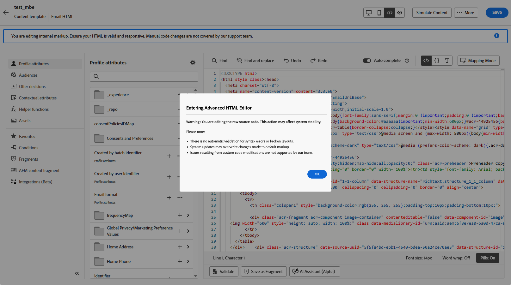

# Modifier le contenu d’un e-mail avec l’éditeur HTML avancé {#email-expert-mode}

>[!AVAILABILITY]
>
>Cette fonctionnalité est en disponibilité limitée. Contactez votre représentant ou représentante Adobe pour en bénéficier.

Le **éditeur d’HTML avancé** est un mode expert qui vous permet d’afficher et de modifier la source HTML brute de **contenu d’e-mail** directement dans le [!DNL Journey Optimizer] [Designer d’e-mail](get-started-email-design.md), que vous [créiez un e-mail](content-from-scratch.md) pour un parcours, une campagne ou que vous modifiiez un [modèle de contenu d’e-mail](../content-management/create-content-templates.md).

Cette fonctionnalité vous permet d’insérer des expressions avancées, telles que des conditions, directement dans la source. Lorsque vous revenez à la vue visuelle (Bureau), le contenu est rendu à nouveau afin que vous puissiez vérifier son aspect et continuer à le modifier dans l’une ou l’autre des vues.

## Mécanismes de sécurisation {#guardrails}

Lorsque vous utilisez l’éditeur HTML avancé, les mécanismes de sécurisation suivants protègent la compatibilité du contenu et définissent les attentes.

* L’éditeur HTML avancé **ne valide pas** votre code. Il ne vérifie pas les erreurs de syntaxe ou les mises en page rompues. Examinez attentivement votre contenu avant d’enregistrer.

* Les futures mises à jour du système peuvent remplacer les modifications apportées aux balises par défaut. **Vos modifications peuvent ne pas persister**.

* L’équipe d’assistance [!DNL Adobe] **ne peut pas résoudre les problèmes liés au code personnalisé et aux modifications manuelles**. Conservez une sauvegarde de votre contenu au cas où vous auriez besoin d’effectuer une restauration.

* Vous ne pouvez pas simuler le contenu dans la vue HTML avancée. Basculez vers la vue Bureau pour prévisualiser votre contenu.

* Pour garantir la compatibilité du contenu, **vous ne pouvez pas enregistrer** dans la vue HTML avancée. Revenez à la vue Bureau lorsque vous êtes prêt à enregistrer vos modifications.

>[!WARNING]
>
>L’éditeur HTML avancé n’est pas identique au mode **[!UICONTROL Coder le vôtre]** dans le Designer d’e-mail. En mode [!UICONTROL Coder le vôtre], vous ne pouvez pas revenir à l’éditeur visuel ; une fois que vous avez choisi ce chemin, vous restez en édition uniquement codée. L’éditeur HTML avancé, en revanche, vous permet de basculer entre les vues HTML et Bureau (visuelle) à tout moment. [En savoir plus sur l’éditeur de code](code-content.md).

## Basculer vers la vue HTML avancée {#switch-to-html-view}

Pour ouvrir l’éditeur HTML avancé et modifier votre source HTML, procédez comme suit.

1. Ouvrez l’e-mail ou le modèle que vous souhaitez modifier dans le Designer d’e-mail, par exemple [créez ou modifiez un e-mail](create-email.md) à partir d’un parcours ou d’une campagne, ou ouvrez un [modèle de contenu d’e-mail](../content-management/create-content-templates.md) et modifiez son corps dans le [Designer d’e-mail](get-started-email-design.md).

1. Cliquez sur le bouton **&#x200B;**&#x200B;dans le coin supérieur droit de l’écran.

   

1. Lors de la première ouverture de l’éditeur HTML avancé, un message d’avertissement s’affiche. Examinez-le attentivement et cliquez sur **[!UICONTROL OK]** pour continuer. [En savoir plus](#guardrails)

   {zoomable="yes"}

   >[!NOTE]
   >
   >Cet avertissement s’affiche uniquement la première fois que vous ouvrez l’éditeur HTML avancé et se réinitialise chaque mois.

1. L’éditeur HTML avancé s’affiche.

   

1. Ajoutez les modifications souhaitées au contenu de votre e-mail.

   >[!WARNING]
   >
   >Veillez à saisir le code HTML et CSS correct, car il n’existe aucun processus de validation de la syntaxe et aucune prise en charge n’est fournie par [!DNL Adobe]. [En savoir plus](#guardrails)

1. La simulation et l’enregistrement de contenu ne sont pas disponibles dans la vue HTML avancée pour des raisons de compatibilité. Revenez à la vue Bureau pour prévisualiser votre contenu et enregistrer vos modifications.

   {zoomable="yes"}

   >[!NOTE]
   >
   >Vos modifications sont conservées lorsque vous changez de vue.

<!--
    {zoomable="yes"}
-->

## Rubriques connexes

* [Codage de votre propre contenu d&#39;e-mail](code-content.md)
* [Créer des modèles de contenu](../content-management/create-content-templates.md)
* [Prise en main du concepteur d’e-mail](get-started-email-design.md)
