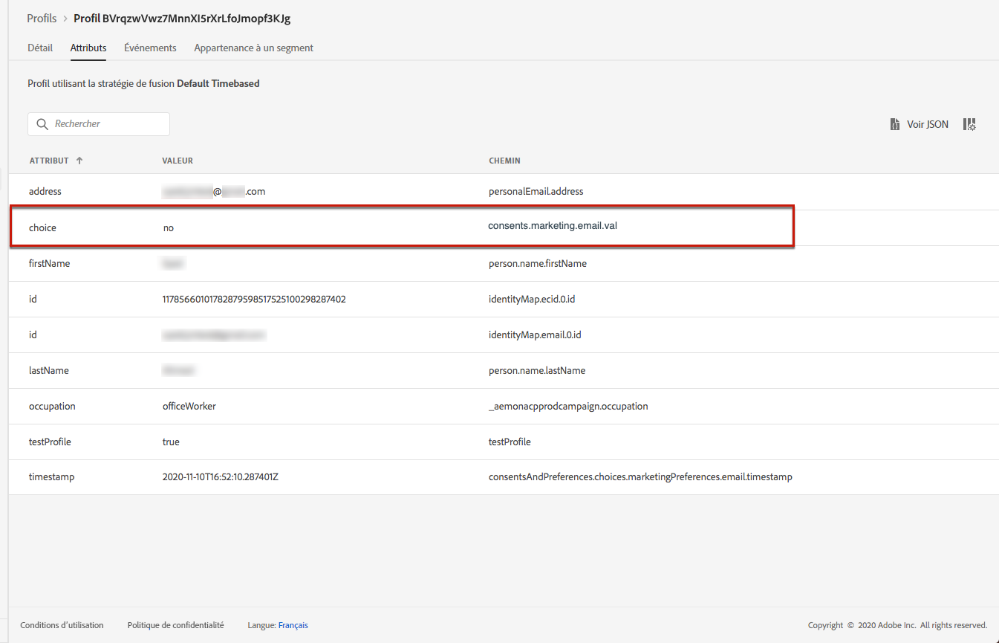
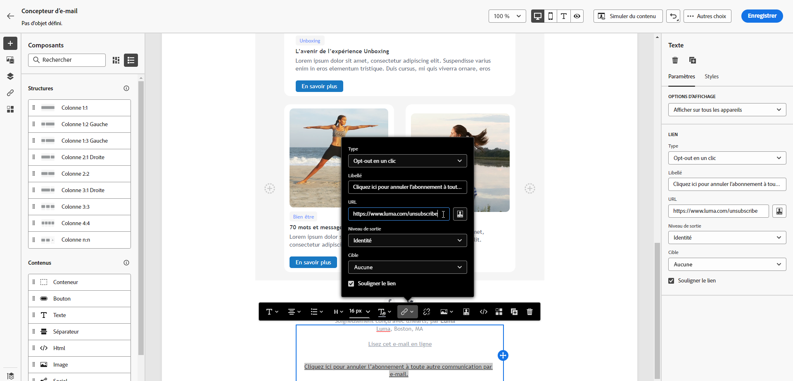
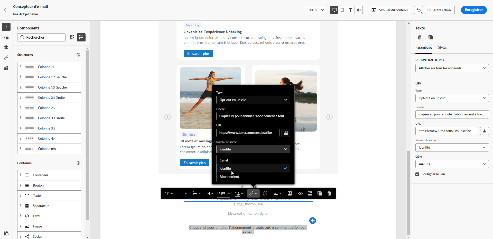
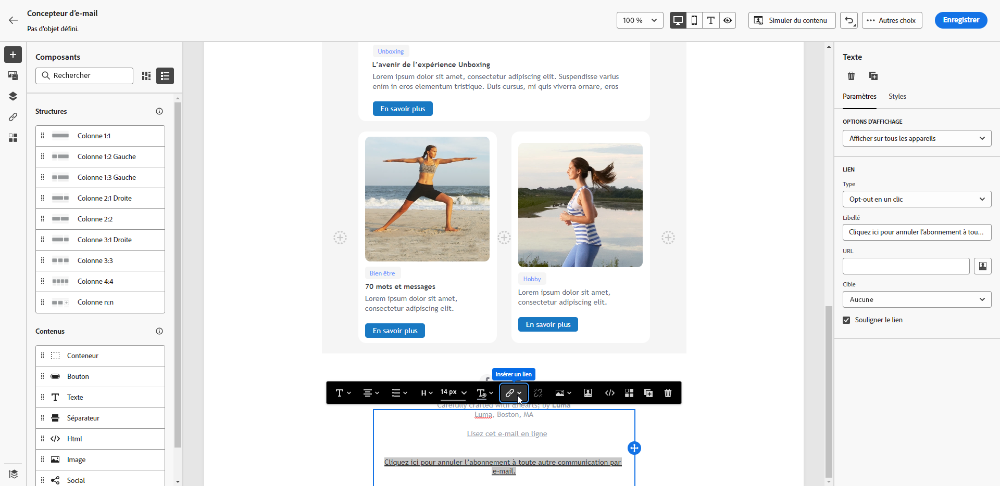
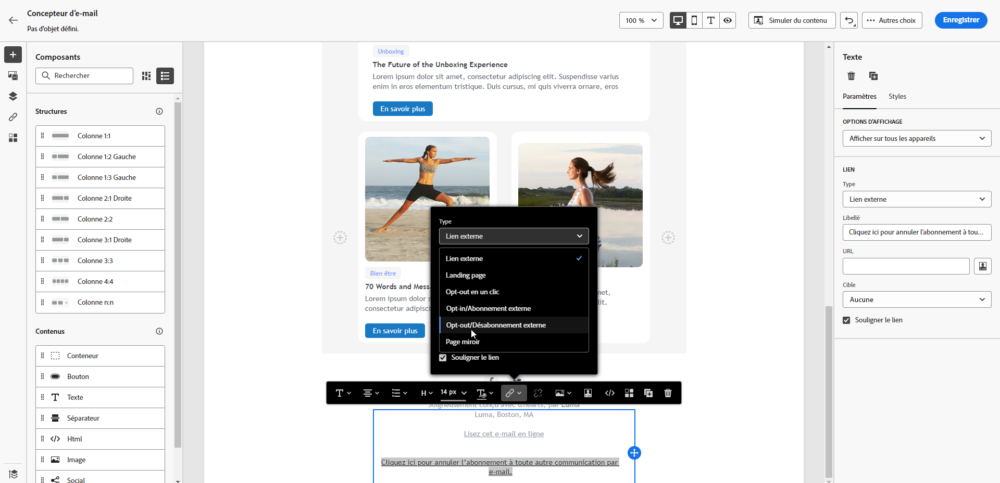
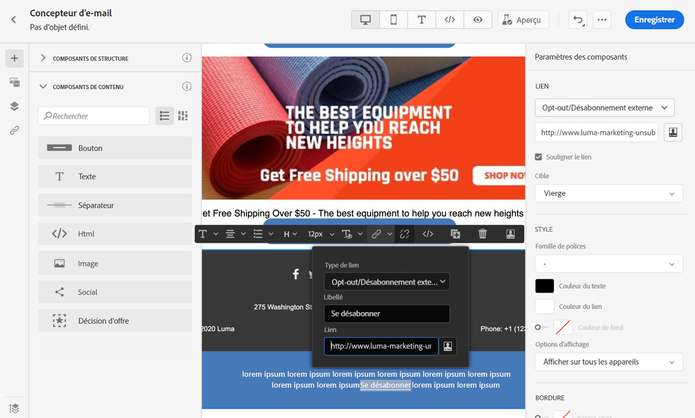
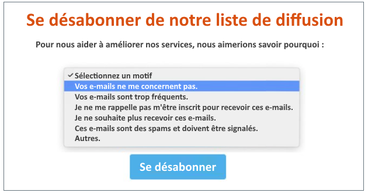
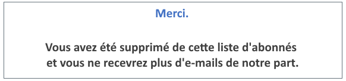

# Gestion du processus de désinscription aux e-mails {#email-opt-out}

Lors de l’envoi de messages à partir des parcours ou des campagnes, vous devez toujours vous assurer que les clientes et clients peuvent se désabonner des futures communications. Une fois désabonnés, les profils sont automatiquement supprimés de l’audience des futurs messages marketing.  [En savoir plus sur la gestion de la confidentialité et du processus d’opt-out](../privacy/opt-out.md)

>[!NOTE]
>
>Tous vos messages marketing doivent inclure un lien d’exclusion. Cela n’est pas nécessaire pour les messages transactionnels. La catégorie du message (**[!UICONTROL Marketing]** ou **[!UICONTROL Transactionnel]**) est définie au niveau de la [configuration des canaux](email-settings.md#email-type) et lors de la création du message.

Pour insérer un lien de désinscription dans le contenu de votre e-mail, vous pouvez procéder comme suit :

* Ajoutez une URL de désabonnement en un clic dans l’en-tête de l’e-mail. L’activation de l’option **[!UICONTROL Activer le désabonnement de la liste]** au niveau de la configuration des canaux ajoute un lien d’exclusion dans l’en-tête de l’e-mail. [En savoir plus sur le processus d’opt-out dans l’en-tête d’e-mail](#unsubscribe-header)

* Activez le **lien d’exclusion en un clic** pour votre e-mail. [Découvrir comment ajouter un lien de désinscription en un clic](#one-click-opt-out)

* Insérez un **lien vers une page de destination**. [Découvrir comment ajouter une page de destination de désinscription](#opt-out-external-lp)

Lorsqu’une personne destinataire clique sur le lien de désinscription (opt-out), sa demande de désabonnement est traitée.

Pour vérifier que le choix du profil correspondant a été mis à jour, rendez-vous sur Experience Platform et [accédez à ce profil](https://experienceleague.adobe.com/en/docs/experience-platform/profile/ui/user-guide?lang=en#browse-tab){target="_blank"}. Dans l’onglet [&#x200B; Attributs &#x200B;](https://experienceleague.adobe.com/en/docs/experience-platform/profile/ui/user-guide#attributes){target="_blank"}, la valeur de **[!UICONTROL choice]** a été remplacée par **[!UICONTROL no]**. En savoir plus sur le traitement du consentement dans la documentation d’[Experience Platform](https://experienceleague.adobe.com/docs/experience-platform/landing/governance-privacy-security/consent/adobe/overview.html){target="_blank"}.



>[!NOTE]
>
>Parfois, la prise en compte des événements de désabonnement au niveau du profil peut prendre plus de temps en raison du traitement des données en aval. Attendez que le système procède à la mise à jour.

## Désinscription (opt-out) en une étape {#opt-out-one-step}

À l’aide d’[!DNL Adobe Journey Optimizer], vous pouvez configurer vos [paramètres de configuration du canal e-mail](email-settings.md#list-unsubscribe) avec une URL de désabonnement en un clic générée automatiquement et une adresse mailto dans l’en-tête de l’e-mail, ou inclure une URL d’exclusion en un clic dans le corps de votre e-mail.

### URL de désabonnement en un clic dans l’en-tête d’e-mail {#unsubscribe-header}

Une URL de désabonnement de liste en un clic est un lien ou un bouton de désabonnement affiché à côté des informations sur l’expéditeur ou l’expéditrice de l’e-mail. Elle permet aux destinataires de se désinscrire (opt-out) instantanément de vos listes de publipostage en un seul clic. Découvrez comment gérer l’option **[!UICONTROL Désabonnement de la liste]** dans [cette section](list-unsubscribe.md).

### Désabonnement en un clic dans le contenu de l’e-mail {#one-click-opt-out}

Pour définir une URL de désabonnement personnalisée, insérez un lien d’exclusion en un clic dans le contenu de l’e-mail et saisissez l’URL de votre choix, comme décrit ci-dessous :

1. Accédez au contenu de votre e-mail et [insérez un lien](../email/message-tracking.md#insert-links).
1. Sélectionnez **[!UICONTROL Opt-out en un clic]** comme type de lien.

   

1. Saisissez l’URL de la page de destination vers laquelle la personne sera redirigée après le désabonnement. Cette page est destinée à confirmer le succès de la désinscription.

   >[!NOTE]
   >
   >Si vous avez activé l’option **[!UICONTROL List-Unsubscribe]** au [niveau de la configuration des canaux](email-settings.md#list-unsubscribe) et que l’option **[!UICONTROL URL de désabonnement en un clic]** est décochée, l’URL de la page de destination est également utilisée lorsque les utilisateurs et utilisatrices cliquent sur le lien de désabonnement dans l’en-tête de l’e-mail. [En savoir plus](list-unsubscribe.md)

   

   Vous pouvez personnaliser vos liens. En savoir plus sur les URL personnalisées dans [cette section](../personalization/personalization-syntax.md).

1. Sélectionnez le mode d’application de la désinscription : au niveau du canal ou de l’identité.

   

   * **[!UICONTROL Canal]** : le processus d’opt-out s’applique aux futurs messages envoyés à la cible du profil (c’est-à-dire son adresse e-mail) pour le canal actuel. Si plusieurs cibles sont associées à un profil, le processus d’opt-out s’applique à toutes les cibles (adresses e-mail, par exemple) du profil pour ce canal.
   * **[!UICONTROL Identité]** : le processus d’opt-out s’applique aux futurs messages envoyés à la cible spécifique (c’est-à-dire l’adresse e-mail) utilisée pour le message en cours.
     <!--* **[!UICONTROL Subscription]**: The opt-out applies to future messages associated with a specific subscription list. This option can only be selected if the current message is associated with a subscription list.-->

1. Enregistrez vos modifications.


## Désinscription en deux étapes {#opt-out-external-lp}

Le mécanisme de désinscription standard repose sur deux étapes : la personne abonnée clique sur le lien d’exclusion dans un e-mail, puis elle est redirigée vers une page de destination d’opt-out pour confirmer sa désinscription.

Pour mettre en œuvre ce mode de désinscription, vous devez créer et publier une page de destination d’opt-out et ajouter un lien de désinscription dans vos e-mails avec un lien vers la page de destination. Ces étapes sont décrites ci-dessous.


### Conditions préalables {#prereq-lp}

Pour configurer un mécanisme de désinscription en deux étapes, vous devez créer vos propres pages de destination de désinscription. La première page de destination est liée à votre message et doit contenir un bouton d’appel à l’action. Un message de confirmation doit s’afficher lorsque l’utilisateur ou l’utilisatrice clique sur le bouton.

Découvrez comment créer une page de destination dans Adobe Journey Optimizer pour gérer les désabonnements sur [cette page](../landing-pages/lp-use-cases.md#opt-out).

Vous pouvez également utiliser une page de destination externe. Dans ce cas, configurez l’API pour envoyer les informations à Adobe Journey Optimizer lorsqu’une personne destinataire s’est désabonnée.

+++ Découvrez comment mettre en œuvre un appel API d’opt-out

Pour que vos personnes destinataires soient désinscrites lorsqu’elles envoient leur choix à partir de la page de destination, vous devez implémenter un **appel API d’abonnement** via [Adobe Developer](https://developer.adobe.com){target="_blank"} pour mettre à jour les préférences des profils correspondants.

Cet appel POST est le suivant :

Point dʼentrée : https://platform.adobe.io/journey/imp/consent/preferences

Paramètres de requête :

* **params** : contient la payload chiffrée
* **pid** : identifiant de profil chiffré

Ces deux paramètres seront inclus dans l’URL de page de destination tierce envoyée à votre destinataire :


Exigences d’en-tête :

* x-api-key
* x-gw-ims-org-id
* x-sandbox-name
* autorisation (jeton utilisateur de votre compte technique)

Contenu de la requête :

```
{
   "marketing": [
       {
            "type": "email",           
            "choice": "no",          
            "scope": "channel"       
        }
    ],
 
}
```

[!DNL Journey Optimizer] utilise ces paramètres pour mettre à jour le choix du profil correspondant par le biais de l’appel API [Adobe Developer](https://developer.adobe.com){target="_blank"}.

+++


### Ajouter un lien de désabonnement {#add-unsubscribe-link}

Vous devez d’abord ajouter un lien de désabonnement dans un message. Pour ce faire, procédez comme suit :

1. Créez un message et [insérez un lien](../email/message-tracking.md#insert-links) à l’aide de la barre d’outils contextuelle.

   

1. Sélectionnez la **[!UICONTROL page de destination]** dans la liste déroulante **[!UICONTROL Type]**, puis sélectionnez votre page de destination d’opt-out dans le champ **[!UICONTROL Page de destination]**.

   Si vous utilisez une page de destination externe, sélectionnez **[!UICONTROL Opt-out/Désabonnement externe]** dans la liste déroulante **[!UICONTROL Type]**.

   

   Dans le champ **[!UICONTROL Lien]**, collez le lien vers votre page de destination tierce.

   

1. Cliquez sur **[!UICONTROL Enregistrer]**.


### Envoyer le message avec le lien de désinscription {#send-message-unsubscribe-link}

Une fois que vous avez configuré le lien de désabonnement sur votre page de destination, vous pouvez créer et envoyer votre message.

1. Configurez votre message avec un lien de désinscription et envoyez-le aux personnes abonnées.

1. Une fois le message reçu, si la personne destinataire clique sur le lien de désinscription, votre page de destination s’affiche.

   

1. Si la personne destinataire envoie le formulaire (en appuyant sur le bouton **[!UICONTROL Se désabonner]** dans votre page de destination, dans ce cas), les données de profil sont mises à jour via l’appel API.

1. Le destinataire désabonné est ensuite redirigé vers un écran de message de confirmation indiquant que la désinscription a réussi.

   

   Par conséquent, cet utilisateur ne recevra aucune communication de votre marque à moins d&#39;être de nouveau abonné.

