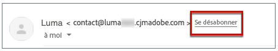

# Gestion du processus de désinscription aux e-mails {#email-opt-out}

Lors de l’envoi de messages à partir des parcours ou des campagnes, vous devez toujours vous assurer que les client(e)s peuvent annuler l’abonnement à de futures communications. Une fois désabonnés, les profils sont automatiquement supprimés de l’audience des futurs messages marketing.  [En savoir plus sur la gestion de la confidentialité et de la désinscription](../privacy/opt-out.md)

>[!NOTE]
>
>Tous vos messages marketing doivent inclure un lien d’exclusion. Ceci n’est pas nécessaire pour les messages transactionnels. La catégorie de messages - **[!UICONTROL Marketing]** ou **[!UICONTROL Transactionnel]** - est défini à l’adresse [surface du canal](../configuration/channel-surfaces.md#email-type) et lors de la création du message.

Pour insérer un lien de désinscription dans le contenu de votre email, vous pouvez :

* Ajoutez une URL de désabonnement en un clic dans l’en-tête de l’email. Activation de **[!UICONTROL En-tête List-Unsubscribe]** au niveau de la surface du canal ajoute un lien d’exclusion dans l’en-tête de l’email. [En savoir plus sur le processus de désinscription dans l’en-tête de l’e-mail](#unsubscribe-header)

* Activez la variable **lien d’exclusion en un clic** pour votre email.  [Découvrez comment ajouter un lien de désinscription en un clic.](#one-click-opt-out)

* Insérer une **lien vers une landing page**. [Découvrez comment ajouter une page de destination d’opt-out](#opt-out-external-lp).

## Exclusion en une étape {#opt-out-one-step}

### URL de désabonnement en un clic dans l’en-tête de l’email {#unsubscribe-header}

<!--Do not modify - Legal Review Done -->

>[!CONTEXTUALHELP]
>id="ajo_admin_preset_unsubscribe"
>title="Ajout de l’URL de désabonnement dans l’en-tête de l’email"
>abstract="Activez l’en-tête List-Unsubscribe pour ajouter une URL de désabonnement dans l’en-tête de l’email. Pour définir une URL de désabonnement, insérez un lien d’opt-out en un clic dans le contenu de l’e-mail."
>additional-url="https://experienceleague.adobe.com/docs/journey-optimizer/using/privacy/consent/opt-out.html?lang=fr#one-click-opt-out" text="Désinscription en un clic"

Une URL de désabonnement de liste en un clic est un lien ou un bouton de désabonnement affiché en regard des informations sur l’expéditeur de l’email et permet aux destinataires de se désabonner instantanément de vos listes de messagerie en un seul clic. Dans Adobe Journey Optimizer, lorsque la variable **Activer List-Unsubscribe** est activée, l’en-tête de l’email comprend par défaut un mailto et/ou une URL que les destinataires peuvent utiliser pour se désabonner de votre liste de diffusion.

La variable [Activer List-Unsubscribe](email-settings.md#list-unsubscribe) Ce bouton doit être activé au niveau de la surface du canal, de sorte que les emails utilisant cette surface incluent l’URL de désabonnement en un clic dans l’en-tête de l’email.

>[!NOTE]
>
>Pour afficher l’URL de désabonnement en un clic dans l’en-tête de l’email, le client de messagerie du destinataire doit prendre en charge cette fonctionnalité.


Par exemple, l’URL de désabonnement en un clic affiche un lien de désabonnement comme celui-ci dans Gmail :




Avec Adobe Journey Optimizer, vous pouvez configurer vos paramètres de surface d’email avec une URL de désabonnement en un clic et une adresse email générées automatiquement dans l’en-tête de l’email, ou inclure une URL d’opt-out en un clic dans votre corps d’email : lorsqu’un destinataire clique sur le lien d’opt-out en un clic, la demande de désabonnement du destinataire est traitée en conséquence.

>[!AVAILABILITY]
>
>À compter du 3 juin 2024, l’en-tête de l’URL de désabonnement en un clic sera disponible dans Adobe Journey Optimizer.
>

Selon le client de messagerie, et la variable [Paramètres de désinscription de la surface d&#39;email](email-settings.md#list-unsubscribe), cliquer sur le lien de désabonnement dans l’en-tête de l’email peut avoir les répercussions suivantes :

* Lorsque la variable **Mailto (désabonner)** est activée par vous, la demande de désabonnement est envoyée à l’adresse de désabonnement par défaut en fonction du sous-domaine que vous avez créé.
* Lorsque la variable **URL de désabonnement en un clic** est activée par vous (ou si vous avez inséré une URL de désabonnement dans le contenu de votre corps d’email), le destinataire est directement désinscrit, au niveau du canal ou au niveau de l’identifiant (selon la configuration du consentement), lorsque le destinataire clique sur l’URL de désabonnement en un clic, qui est basée sur le sous-domaine créé par vous.

Dans les deux cas, le profil correspondant du destinataire est immédiatement exclu et ce choix est mis à jour dans Experience Platform. Pour en savoir plus, consultez la [documentation Experience Platform](https://experienceleague.adobe.com/docs/experience-platform/profile/ui/user-guide.html?lang=fr#getting-started){target="_blank"}.

Si vous avez activé l’option Activer par rapport à l’en-tête de désabonnement à la liste, nous vous recommandons d’activer l’option inclure les deux méthodes de fonctionnalités : Boîte aux lettres et URL de désabonnement en un clic. Tous les clients de messagerie ne prennent pas en charge la méthode HTTP. Grâce à la fonctionnalité de désabonnement à la liste des messages mise à votre disposition pour sélectionner une alternative, votre réputation d’expéditeur peut être mieux protégée et tous vos destinataires pourront probablement avoir accès à la fonctionnalité de désabonnement. [En savoir plus](email-settings.md#list-unsubscribe)


### Exclusion en un clic du contenu de l’email {#one-click-opt-out}

Pour définir une URL de désabonnement personnalisée, insérez un lien d&#39;opt-out en un clic dans le contenu de l&#39;email et saisissez l&#39;URL de votre choix, comme décrit ci-dessous :

1. Accéder au contenu de votre email et [insérer un lien](../email/message-tracking.md#insert-links).
1. Sélectionner **[!UICONTROL Exclusion en un clic]** comme type de lien.

   

1. Saisissez l&#39;URL de la landing page vers laquelle l&#39;utilisateur est redirigé une fois désabonné. Cette page vous permet de confirmer que l’exclusion a réussi.

   >[!NOTE]
   >
   >Si vous avez activé la variable **[!UICONTROL List-Unsubscribe]** à l’adresse [niveau de surface du canal](email-settings.md#list-unsubscribe) et que l’option d’URL d’opt-out en un clic par défaut soit décochée, cette URL est utilisée lorsque les utilisateurs cliquent sur le lien unsubscribe dans l’en-tête de l’email. [En savoir plus](#unsubscribe-header)

   

   Vous pouvez personnaliser vos liens. Pour en savoir plus sur les URL personnalisées, consultez [cette section](../personalization/personalization-syntax.md).

1. Sélectionnez le mode d’application de la désinscription : au niveau du canal, de l’identité ou de l’abonnement.

   

   * **[!UICONTROL Canal]** : le processus d’opt-out s’applique aux futurs messages envoyés à la cible du profil (c’est-à-dire son adresse e-mail) pour le canal actuel. Si plusieurs cibles sont associées à un profil, le processus d’opt-out s’applique à toutes les cibles (adresses e-mail, par exemple) du profil pour ce canal.
   * **[!UICONTROL Identité]** : le processus d’opt-out s’applique aux futurs messages envoyés à la cible spécifique (c’est-à-dire l’adresse e-mail) utilisée pour le message en cours.
   * **[!UICONTROL Abonnement]** : le processus d’opt-out s’applique aux futurs messages associés à une liste d’abonnement spécifique. Cette option ne peut être sélectionnée que si le message actif est associé à une liste d’abonnement.

1. Enregistrez vos modifications.


## Désinscription en deux étapes {#opt-out-external-lp}

Le mécanisme de désinscription standard repose sur deux étapes : l&#39;abonné clique sur le lien de désinscription dans un email, puis il est redirigé vers une landing page de désinscription pour confirmer sa désinscription.

Pour mettre en oeuvre ce mode de désinscription, vous devez créer et publier une landing page de désinscription, et ajouter un lien de désinscription dans vos emails, avec un lien vers la landing page. Ces étapes sont décrites ci-dessous.


### Conditions préalables {#prereq-lp}

Pour configurer un mécanisme d&#39;opt-out en deux étapes, vous devez créer vos propres landing pages de désinscription. La première landing page sera liée à votre message et doit contenir un bouton d&#39;appel à l&#39;action. Un message de confirmation doit s’afficher lorsque l’utilisateur clique sur le bouton.

Découvrez comment créer une landing page dans Adobe Journey Optimizer pour gérer les désabonnements dans [cette page](../landing-pages/lp-use-cases.md#opt-out).

Vous pouvez également utiliser une landing page externe. Dans ce cas, configurez l&#39;API pour envoyer les informations à Adobe Journey Optimizer lorsqu&#39;un destinataire s&#39;est désabonné.

+++ Découvrez comment mettre en oeuvre un appel API d’exclusion

Pour que vos destinataires soient désinscrit(e)s lorsqu’ils ou elles envoient leur choix à partir de la page de destination, vous devez implémenter un **appel API d’abonnement** via [Adobe Developer](https://developer.adobe.com){target="_blank"} pour mettre à jour les préférences des profils correspondants.

Cet appel POST est le suivant :

Point dʼentrée : https://platform.adobe.io/journey/imp/consent/preferences

Paramètres de requête:

* **params** : contient la payload chiffrée
* **pid** : identifiant de profil chiffré

Ces trois paramètres seront inclus dans l’URL de page de destination tierce envoyée à votre destinataire :


Exigences d’en-tête :

* x-api-key
* x-gw-ims-org-id
* x-sandbox-name
* autorisation (jeton utilisateur de votre compte technique)

Contenu de la requête :

```
{
   "marketing": [
       {
            "type": "email",           
            "choice": "no",          
            "scope": "channel"       
        }
    ],
 
}
```

[!DNL Journey Optimizer] utilise ces paramètres pour mettre à jour le choix du profil correspondant via la variable [Adobe Developer](https://developer.adobe.com){target="_blank"} appel API.

+++


### Ajouter un lien de désabonnement {#add-unsubscribe-link}

Vous devez d’abord ajouter un lien de désabonnement dans un message. Pour ce faire, procédez comme suit :

1. Créer un message et [insérer un lien](../email/message-tracking.md#insert-links) à l’aide de la barre d’outils contextuelle.

   

1. Sélectionnez la variable **[!UICONTROL Landing page]** de la **[!UICONTROL Type]** et sélectionnez votre page d’entrée d’exclusion dans la liste déroulante **[!UICONTROL Landing page]** champ .

   Si vous utilisez une landing page externe, sélectionnez **[!UICONTROL Désinscription/désinscription externe]** de la **[!UICONTROL Type]** liste déroulante.

   

   Dans le champ **[!UICONTROL Lien]**, collez le lien vers votre page de destination tierce.

   

1. Cliquez sur **[!UICONTROL Enregistrer]**.


### Envoyer le message avec le lien de désinscription {#send-message-unsubscribe-link}

Une fois que vous avez configuré le lien de désabonnement sur votre landing page, vous pouvez créer et envoyer votre message.

1. Paramétrez votre message avec un lien de désinscription et envoyez-le à vos abonnés.

1. Une fois le message reçu, si le destinataire clique sur le lien de désinscription, votre page de destination s’affiche.

   

1. Si le destinataire envoie le formulaire, ici, en appuyant sur la fonction **[!UICONTROL Désabonner]** dans votre landing page : les données de profil sont mises à jour via l’appel API.

1. Le destinataire désabonné est ensuite redirigé vers un écran de message de confirmation indiquant que la désinscription a réussi.

   

   Par conséquent, cet utilisateur ne recevra aucune communication de votre marque à moins d&#39;être de nouveau abonné.

1. Pour vérifier que le choix du profil correspondant a été mis à jour, accédez à Experience Platform et accédez au profil en sélectionnant un espace de noms d&#39;identité et une valeur d&#39;identité correspondante. Pour en savoir plus, consultez la [documentation Experience Platform](https://experienceleague.adobe.com/docs/experience-platform/profile/ui/user-guide.html?lang=fr#getting-started){target="_blank"}.

   

   Dans l’onglet **[!UICONTROL Attributs]**, la valeur du **[!UICONTROL choix]** a été remplacée par **[!UICONTROL non]**.

