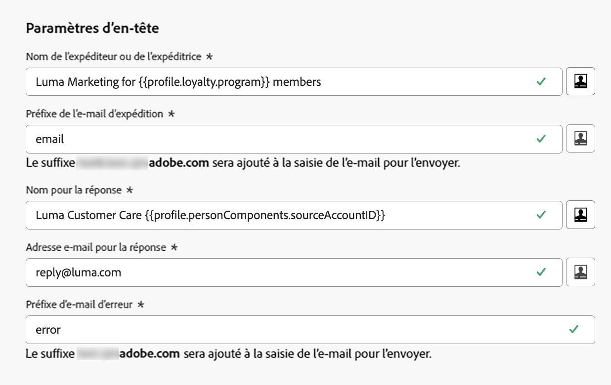
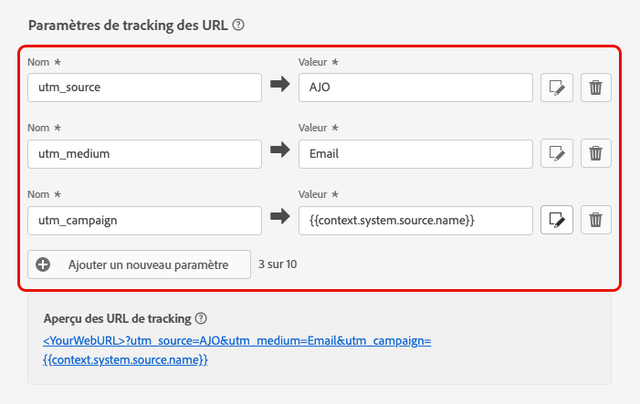

# Configuration des paramètres de courrier électronique {#email-settings}

Pour commencer à créer un email, vous devez configurer les surfaces du canal email qui définissent tous les paramètres techniques requis pour vos messages. [Découvrez comment créer des surfaces](../configuration/channel-surfaces.md)

Définissez les paramètres de l&#39;email dans la section dédiée de la configuration de la surface du canal.

La configuration de la surface des emails est récupérée pour envoyer des communications en suivant la logique ci-dessous :

* Pour les parcours par lots et par lots, cela ne s’applique pas à l’exécution par lots ou par éclats qui avaient déjà commencé avant la configuration de la surface de l’email. Les modifications seront récupérées lors de la prochaine périodicité ou de la nouvelle exécution.

* Pour les messages transactionnels, la modification est immédiatement sélectionnée pour la prochaine communication (délai de cinq minutes maximum).

>[!NOTE]
>
>Les paramètres de surface d&#39;email mis à jour seront automatiquement récupérés dans le ou les parcours ou campagnes où la surface est utilisée.

## Type d’email {#email-type}

>[!CONTEXTUALHELP]
>id="ajo_admin_presets_emailtype"
>title="Définition de la catégorie d’email"
>abstract="Sélectionnez le type d&#39;email qui sera envoyé lors de l&#39;utilisation de cette surface : Marketing pour les emails promotionnels, qui nécessitent un consentement de l’utilisateur, ou Transactionnel pour les emails non commerciaux, qui peuvent également être envoyés à des profils désabonnés dans des contextes spécifiques."

Dans le **TYPE D&#39;EMAIL** , sélectionnez le type de message qui sera envoyé avec la surface : **Marketing** ou **Transactionnel**.

* Choisir **Marketing** pour un email promotionnel : ces messages requièrent le consentement de l’utilisateur.

* Choisir **Transactionnel** pour les emails non commerciaux tels que la confirmation de commande, les notifications de réinitialisation de mot de passe ou les informations de diffusion, par exemple.

>[!CAUTION]
>
>**Transactionnel** les emails peuvent être envoyés aux profils qui se sont désabonnés des communications marketing. Ces messages ne peuvent être envoyés que dans des contextes spécifiques.

Lors de la création d&#39;un message, vous devez choisir une surface de canal valide correspondant à la catégorie que vous avez sélectionnée pour votre email.

## Sous-domaine et pools d’adresses IP {#subdomains-and-ip-pools}

Dans le **Sous-domaine et pools d’adresses IP** , vous devez :

1. Sélectionnez le sous-domaine à utiliser pour envoyer les emails. [En savoir plus](../configuration/about-subdomain-delegation.md)

1. Sélectionnez le pool d’adresses IP à associer à la surface. [En savoir plus](../configuration/ip-pools.md)

Vous ne pouvez pas poursuivre la création de surface lorsque le pool IP sélectionné se trouve sous [edition](../configuration/ip-pools.md#edit-ip-pool) (**[!UICONTROL Processing]** (status) et n’a jamais été associé au sous-domaine sélectionné. Sinon, la version la plus ancienne de l’association pool/sous-domaine d’IP sera toujours utilisée. Si c’est le cas, enregistrez la surface en tant que brouillon et réessayez une fois que le pool IP a la valeur **[!UICONTROL Success]** statut.

>[!NOTE]
>
>Pour les environnements hors production, Adobe ne crée pas de sous-domaines de test d’usine et n’accorde pas l’accès à un pool d’adresses IP d’envoi partagé. Vous devez [déléguer vos propres sous-domaines](../configuration/delegate-subdomain.md) et utiliser les adresses IP du pool affecté à votre organisation.

## List-Unsubscribe {#list-unsubscribe}

Upon [sélection d’un sous-domaine](#subdomains-and-ip-pools) dans la liste, la variable **[!UICONTROL Enable List-Unsubscribe]** s’affiche.

Cette option est activée par défaut.

Si vous la laissez activée, un lien de désabonnement sera automatiquement inclus dans l’en-tête de l’email, par exemple :

Si vous désactivez cette option, aucun lien de désabonnement ne s’affichera dans l’en-tête de l’email.

Le lien de désabonnement se compose de deux éléments :

* Un **unsubscribe email address**, à laquelle toutes les requêtes de désabonnement sont envoyées.

   Dans [!DNL Journey Optimizer], l’adresse électronique de désabonnement est la valeur par défaut. **[!UICONTROL Mailto (unsubscribe)]** adresse affichée à la surface du canal, en fonction de la variable [sous-domaine sélectionné](#subdomains-and-ip-pools).

   

* Le **unsubscribe URL**, qui est l’URL de la landing page vers laquelle l’utilisateur sera redirigé une fois désabonné.

   Si vous ajoutez une [lien d’exclusion en un clic](../privacy/opt-out.md#one-click-opt-out) pour un message créé à partir de cette surface, l&#39;URL de désabonnement sera l&#39;URL définie pour le lien de désinscription en un clic.

   

   >[!NOTE]
   >
   >Si vous n&#39;ajoutez pas de lien d&#39;opt-out en un clic dans le contenu de votre message, aucune landing page ne sera affichée pour l&#39;utilisateur.

En savoir plus sur l’ajout d’un lien de désabonnement d’en-tête à vos messages dans [cette section](../privacy/opt-out.md#unsubscribe-header).

<!--Select the **[!UICONTROL Custom List-Unsubscribe]** option to enter your own Unsubscribe URL and/or your own Unsubscribe email address.(to add later)-->

## Paramètres d’en-tête {#email-header}

Dans le **[!UICONTROL Header parameters]** , renseignez les noms et adresses email de l&#39;expéditeur associés au type d&#39;emails envoyés à partir de cette surface.

* **[!UICONTROL Sender name]**: Nom de l’expéditeur, tel que le nom de votre marque.

* **[!UICONTROL Sender email]**: Adresse électronique que vous souhaitez utiliser pour vos communications.

* **[!UICONTROL Reply to (name)]**: Nom qui sera utilisé lorsque le destinataire clique sur la variable **Répondre** dans leur logiciel client de messagerie.

* **[!UICONTROL Reply to (email)]**: Adresse électronique qui sera utilisée lorsque le destinataire clique sur la variable **Répondre** dans leur logiciel client de messagerie. [En savoir plus](#reply-to-email)

* **[!UICONTROL Error email]**: Toutes les erreurs générées par les FAI après quelques jours de diffusion du courrier (bounces asynchrones) sont reçues sur cette adresse.

>[!CAUTION]
>
>Le **[!UICONTROL Sender email]** et **[!UICONTROL Error email]** Les adresses doivent utiliser la [sous-domaine délégué](../configuration/about-subdomain-delegation.md). Par exemple, si le sous-domaine délégué est *marketing.luma.com*, vous pouvez utiliser *contact@marketing.luma.com* et *error@marketing.luma.com*.

>[!NOTE]
>
>Les adresses doivent commencer par une lettre (A-Z) et ne peuvent contenir que des caractères alphanumériques. Vous pouvez également utiliser des traits de soulignement. `_`, point`.` et trait d’union `-` caractères.

### Répondre à un email {#reply-to-email}

Lors de la définition de la variable **[!UICONTROL Reply to (email)]** , vous pouvez indiquer toute adresse électronique à condition qu’il s’agisse d’une adresse valide, au format correct et sans faute de frappe.

Pour assurer une bonne gestion des réponses, procédez comme suit :

* La boîte de réception utilisée pour les réponses recevra tous les emails de réponse, y compris les notifications d’absence du bureau et les réponses de défi, afin de vous assurer que vous avez mis en place un processus manuel ou automatisé pour traiter les emails entrant dans cette boîte de réception.

* Assurez-vous que la boîte de réception dédiée dispose de suffisamment de capacité pour recevoir tous les emails de réponse envoyés à l’aide de la surface de l’email. Si la boîte de réception renvoie des rebonds, il se peut que certaines réponses de vos clients ne soient pas reçues.

* Les réponses doivent être traitées en tenant compte des obligations de confidentialité et de conformité, car elles peuvent contenir des informations d’identification personnelle (PII).

* Ne marquez pas les messages comme spam dans la boîte de réception de la réponse, car cela aura un impact sur toutes les autres réponses envoyées à cette adresse.

### Transférer l’email {#forward-email}

Si vous souhaitez transférer vers une adresse de courriel spécifique tous les courriers électroniques reçus par [!DNL Journey Optimizer] pour le sous-domaine délégué, contactez l’assistance clientèle d’Adobe. Vous devrez fournir les éléments suivants :

* Adresse électronique de transfert de votre choix. Notez que le domaine de l’adresse électronique de transfert ne peut correspondre à aucun sous-domaine délégué à Adobe.
* Nom de votre environnement de test.
* Nom de la surface pour laquelle l’adresse email de transfert sera utilisée.
* La variable **[!UICONTROL Reply to (email)]** adresse définie au niveau de la surface du canal.

>[!NOTE]
>
>Il ne peut y avoir qu’une seule adresse électronique de transfert par sous-domaine. Par conséquent, si plusieurs surfaces utilisent le même sous-domaine, la même adresse électronique doit être utilisée pour toutes.

L’adresse électronique de transfert sera configurée par Adobe. Cela peut prendre de 3 à 4 jours.

## Email Cci {#bcc-email}

Vous pouvez envoyer une copie identique (ou une copie en carbone invisible) des emails envoyés par [!DNL Journey Optimizer] dans une boîte de réception Cci où ils seront stockés à des fins de conformité ou d’archivage.

Pour ce faire, activez l’option **[!UICONTROL BCC email]** fonctionnalité facultative au niveau de la surface du canal. [En savoir plus](../configuration/archiving-support.md#bcc-email)

## Paramètres de reprise par email {#email-retry}

>[!CONTEXTUALHELP]
>id="ajo_admin_presets_retryperiod"
>title="Réglage de la période de reprise"
>abstract="Les reprises sont effectuées pendant 3,5 jours (84 heures) lorsqu’une diffusion email échoue en raison d’une erreur de soft bounce temporaire. Vous pouvez ajuster cette période de reprise par défaut en fonction de vos besoins."
>additional-url="https://experienceleague.adobe.com/docs/journey-optimizer/using/configuration/configuration-message/email-configuration/monitor-reputation/retries.html" text="A propos des reprises"

Vous pouvez configurer la variable **Paramètres de reprise par email**.

Par défaut, la variable [période de reprise](../configuration/retries.md#retry-duration) est définie sur 84 heures, mais vous pouvez l’ajuster en fonction de vos besoins.

Vous devez saisir une valeur entière (en heures ou minutes) dans la plage suivante :

* Pour les emails marketing, la période de reprise minimale est de 6 heures.
* Pour les emails transactionnels, la période de reprise minimale est de 10 minutes.
* Pour les deux types d’email, la période de reprise maximale est de 84 heures (soit 5 040 minutes).

En savoir plus sur les reprises dans [cette section](../configuration/retries.md).

## Suivi des URL {#url-tracking}

>[!CONTEXTUALHELP]
>id="ajo_admin_preset_utm"
>title="Définition des paramètres de suivi d’URL"
>abstract="Utilisez cette section pour ajouter automatiquement des paramètres de suivi aux URL présentes dans le contenu de votre email. Cette fonction est facultative."

>[!CONTEXTUALHELP]
>id="ajo_admin_preset_url_preview"
>title="Aperçu des paramètres de suivi d’URL"
>abstract="Vérifiez comment les paramètres de suivi seront ajoutés aux URL présentes dans le contenu de votre email."

Vous pouvez utiliser **[!UICONTROL URL tracking parameters]** pour mesurer l’efficacité de vos efforts marketing sur l’ensemble des canaux. Cette fonction est facultative.

Les paramètres définis dans cette section seront ajoutés à la fin des URL incluses dans le contenu de votre email. Vous pouvez ensuite capturer ces paramètres dans des outils d’analyse web tels qu’Adobe Analytics ou Google Analytics, puis créer divers rapports de performances.

<!--Three URL tracking parameters are auto-populated as an example when you create a channel surface. You can edit these and add up to 10 tracking parameters using the **[!UICONTROL Add new parameter]** button.-->

Vous pouvez ajouter jusqu’à 10 paramètres de suivi à l’aide de la variable **[!UICONTROL Add new parameter]** bouton .

Pour configurer un paramètre de suivi d’URL, vous pouvez entrer directement les valeurs souhaitées dans la variable **[!UICONTROL Name]** et **[!UICONTROL Value]** champs.

<!--You can also choose from a list of predefined values by navigating to the following objects:
* Journey attributes: **Source id**, **Source name**, **Source version id**
* Action attributes: **Action id**, **Action name**
* Offer decisioning attributes: **Offer id**, **Offer name**

>[!CAUTION]
>
>Do not select a folder: make sure to browse to the necessary folder and select a profile attribute to use as a tracking parameter value.-->

Vous pouvez également modifier chaque **[!UICONTROL Value]** à l’aide du champ [Éditeur d’expression](../personalization/personalization-build-expressions.md). Cliquez sur l’icône d’édition pour ouvrir l’éditeur. De là, vous pouvez sélectionner les attributs contextuels de votre choix et/ou modifier directement le texte.

>[!NOTE]
>
>Vous pouvez combiner des valeurs de texte de saisie et utiliser des attributs contextuels à partir de l’éditeur d’expression. Chaque **[!UICONTROL Value]** peut contenir jusqu’à 255 caractères au total.

<!--You can drag and drop the parameters to reorder them.-->

Vous trouverez ci-dessous des exemples d’URL compatibles avec Adobe Analytics et Google Analytics.

* URL compatible avec Adobe Analytics : `www.YourLandingURL.com?cid=email_AJO_{{context.system.source.id}}_image_{{context.system.source.name}}`

* URL compatible avec Google Analytics : `www.YourLandingURL.com?utm_medium=email&utm_source=AJO&utm_campaign={{context.system.source.id}}&utm_content=image`

Vous pouvez prévisualiser dynamiquement l’URL de suivi qui en résulte. Chaque fois que vous ajoutez, modifiez ou supprimez un paramètre, l’aperçu est automatiquement mis à jour.

