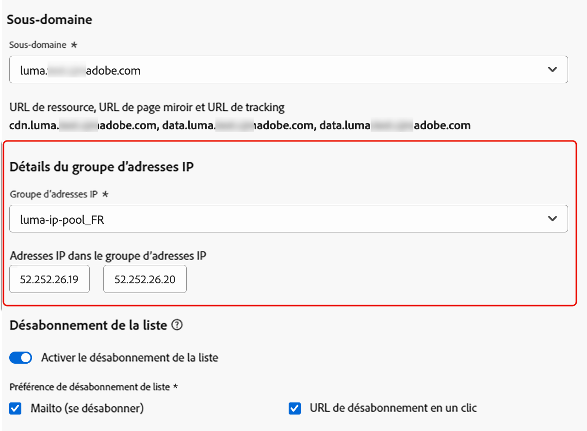
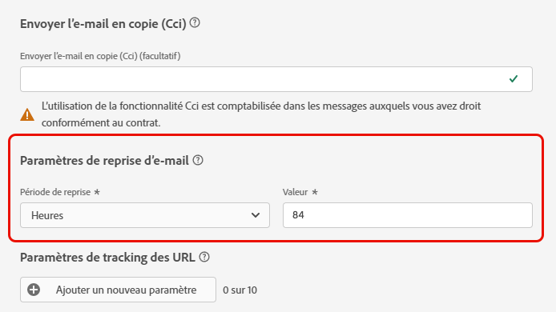

# Configurer les paramètres d’e-mail {#email-settings}

Pour commencer à créer un e-mail, vous devez paramétrer les configuration du canal e-mail qui définissent tous les paramètres techniques requis pour vos messages. [Découvrir comment créer des configurations](../configuration/channel-surfaces.md)

>[!NOTE]
>
>Pour préserver votre réputation et améliorer votre délivrabilité, configurez les sous-domaines que vous utiliserez pour envoyer des e-mails avant de créer une configuration du canal e-mail. [En savoir plus](../configuration/about-subdomain-delegation.md)

Définissez les paramètres d’e-mail dans la section dédiée de la configuration du canal, comme décrit ci-dessous.

{width="50%" align="left"}

La configuration du canal e-mail est récupérée pour envoyer des communications en suivant la logique ci-dessous :

* Pour les parcours par lots, cela ne s’applique pas à l’exécution par lots qui avait déjà démarré avant que la configuration de surface d’e-mail ne soit effectuée. La modification est récupérée à la prochaine périodicité ou nouvelle exécution.

* Pour les messages transactionnels, la modification est immédiatement récupérée pour la communication suivante (délai de cinq minutes maximum).

>[!NOTE]
>
>Les paramètres de configuration d’e-mail mis à jour sont automatiquement récupérés dans le(s) parcours(s) ou campagne(s) où la configuration est utilisée.

## Type d’e-mail {#email-type}

>[!CONTEXTUALHELP]
>id="ajo_admin_presets_emailtype"
>title="Définir le type d’e-mail"
>abstract="Sélectionnez le type d’e-mail qui sera envoyé lors de l’utilisation de cette configuration : Marketing pour les messages promotionnels, qui nécessitent le consentement de l’utilisateur ou de l’utilisatrice, ou Transactionnel pour les messages non commerciaux, qui peuvent également être envoyés aux profils désabonnés dans des contextes spécifiques."

Dans la section **Type dʼe-mail**, sélectionnez le type de message pour la configuration : **[!UICONTROL Marketing]** ou **[!UICONTROL Transactionnel]**.

* Sélectionnez **Marketing** pour les e-mails promotionnels, tels que les promotions hebdomadaires pour un magasin de vente au détail. Ces messages requièrent le consentement de l’utilisateur ou de l’utilisatrice.

* Sélectionnez **Transactionnel** pour les e-mails non commerciaux tels que les confirmations de commande, les notifications de réinitialisation de mot de passe ou les informations de livraison, par exemple. Ces e-mails peuvent être envoyés aux profils qui **se sont désabonnés** des communications marketing. Ces messages ne peuvent être envoyés que dans des contextes spécifiques.

Lors de la création d’un message, vous devez choisir une configuration de canal valable, correspondant à la catégorie que vous avez sélectionnée pour votre e-mail.

## Sous-domaine {#subdomains}

Sélectionnez le sous-domaine à utiliser pour envoyer les e-mails.

>[!NOTE]
>
>Pour un contrôle accru des paramètres de votre e-mail, vous pouvez définir des sous-domaines dynamiques. [En savoir plus](../email/surface-personalization.md#dynamic-subdomains)

Pour préserver la réputation de votre domaine, accélérer le processus de préchauffage des adresses IP et améliorer la délivrabilité, déléguez vos sous-domaines d’envoi à Adobe. [En savoir plus](../configuration/about-subdomain-delegation.md)

## Détails du groupe d’adresses IP {#ip-pools}

Sélectionnez le groupe d’adresses IP à associer à la configuration. [En savoir plus](../configuration/ip-pools.md)

{width="50%" align="left"}

Vous ne pouvez pas poursuivre la création de la configuration lorsque le groupe d’adresses IP sélectionné est en cours d’[édition](../configuration/ip-pools.md#edit-ip-pool) (statut **[!UICONTROL En cours de traitement]**), et n’a jamais été associé au sous-domaine sélectionné. Sinon, la version la plus ancienne de l’association groupe d’adresses IP/sous-domaine sera toujours utilisée. Si c’est le cas, enregistrez la configuration en tant que brouillon, puis réessayez une fois que le groupe d’adresses IP a le statut **[!UICONTROL Succès]**.

>[!NOTE]
>
>Pour les environnements hors production, Adobe ne crée pas de sous-domaines de test d’usine et n’accorde pas l’accès à un groupe d’adresses IP d’envoi partagé. Vous devez [déléguer vos propres sous-domaines](../configuration/delegate-subdomain.md) et utiliser les adresses IP du groupe affecté à votre organisation.

Une fois qu’un groupe d’adresses IP a été sélectionné, les informations PTR sont visibles lorsque vous pointez sur les adresses IP affichées sous la liste déroulante du groupe d’adresses IP. [En savoir plus sur les enregistrements PTR](../configuration/ptr-records.md)

>[!NOTE]
>
>Si un enregistrement PTR n’est pas configuré, contactez votre représentant(e) Adobe.

## Désabonnement de la liste {#list-unsubscribe}

Lors de la sélection d’un sous-domaine dans la liste, l’option **[!UICONTROL Activer List-Unsubscribe]** s’affiche. Elle est activée par défaut.

Elle vous permet d’inclure une URL de désabonnement en un clic dans l’en-tête de l’e-mail. [En savoir plus](list-unsubscribe.md)

## Paramètres d’en-tête {#email-header}

Dans la section **[!UICONTROL Paramètres d’en-tête]**, saisissez les noms de l’expéditeur ou de l’expéditrice et les adresses e-mail associées au type d’e-mails envoyés à l’aide de cette configuration. [En savoir plus](header-parameters.md)

## E-mail Cci {#bcc-email}

Vous pouvez envoyer une copie identique (ou une copie carbone invisible) des e-mails envoyés par [!DNL Journey Optimizer] vers une boîte de réception Cci où ils seront stockés à des fins de conformité ou d’archivage.

Pour ce faire, activez la fonctionnalité optionnelle **[!UICONTROL E-mail Cci]** au niveau de la configuration du canal. [En savoir plus](../configuration/archiving-support.md#bcc-email)

En outre, lors de la définition de l’adresse **[!UICONTROL E-mail Cci]**, veillez à utiliser un sous-domaine possédant une configuration d’enregistrement MX valide, sinon le traitement de configuration du canal e-mail échouera.

Si vous obtenez une erreur lors de l’envoi de la configuration du canal e-mail, cela signifie que l’enregistrement MX n’est pas configuré pour le sous-domaine de l’adresse que vous avez saisie. Contactez votre administrateur ou administratrice pour configurer l’enregistrement MX correspondant ou utilisez une autre adresse avec une configuration d’enregistrement MX valide.

## Envoyer à des adresses e-mail supprimées {#send-to-suppressed-email-addresses}

>[!CONTEXTUALHELP]
>id="ajo_surface_suppressed_addresses"
>title="Remplacer la priorité de la liste de suppression"
>abstract="Vous pouvez décider d’envoyer des messages transactionnels aux profils même si leurs adresses e-mail se trouvent sur la liste de suppression d’Adobe Journey Optimizer en raison d’une plainte relative aux spams. Par défaut, cette option est désactivée."
>additional-url="https://experienceleague.adobe.com/docs/journey-optimizer/using/configuration/monitor-reputation/manage-suppression-list.html?lang=fr" text="Gérer la liste de suppression"

>[!IMPORTANT]
>
>Cette option n’est disponible que si vous avez sélectionné le type d’e-mail **[!UICONTROL Transactionnel]**. [En savoir plus](#email-type)

Dans [!DNL Journey Optimizer], toutes les adresses e-mail marquées comme rebonds définitifs, rebonds temporaires et plaintes relatives aux spams sont automatiquement collectées dans la [liste de suppression](../configuration/manage-suppression-list.md) et exclues de l’envoi dans un parcours ou une campagne.

Cependant, vous pouvez décider de poursuivre l’envoi des messages de type **transactionnel** aux profils même si leurs adresses e-mail figurent sur la liste de suppression en raison d’une plainte relative aux spams de l’utilisateur ou de l’utilisatrice.

En effet, les messages transactionnels contiennent généralement des informations utiles et attendues, telles que des confirmations de commande ou des notifications de réinitialisation de mot de passe. Par conséquent, même s’ils ont signalé l’un de vos messages marketing comme spam, la plupart du temps, vous souhaitez que vos clientes et clients reçoivent ce type d’e-mail non commercial.

Pour inclure les adresses e-mail supprimées en raison d’une plainte relative aux spams dans votre audience de message transactionnel, sélectionnez l’option correspondante dans la section **[!UICONTROL Envoyer aux adresses e-mail supprimées]**.

>[!NOTE]
>
>Par défaut, cette option est désactivée.

Cette option est une bonne pratique en matière de délivrabilité. Elle est désactivée par défaut pour garantir que les clientes et clients qui se sont désinscrits ne soient pas contactés. Vous pouvez toutefois modifier cette option par défaut, qui vous permet ensuite d’envoyer des messages transactionnels à vos clientes et clients.

Une fois cette option activée, même si un client ou une cliente a marqué votre e-mail marketing comme indésirable, cette personne pourra recevoir vos messages transactionnels à l’aide de la configuration actuelle. Veillez toujours à gérer les préférences de désinscription conformément aux bonnes pratiques en matière de délivrabilité.

## Liste de contrôle {#seed-list}

>[!CONTEXTUALHELP]
>id="ajo_surface_seed_list"
>title="Ajouter une liste de contrôle"
>abstract="Sélectionnez la liste de contrôle de votre choix pour ajouter automatiquement des adresses internes spécifiques à vos audiences. Ces adresses de contrôle seront incluses au moment de l’exécution de la diffusion et recevront une copie exacte du message à des fins de vérification."
>additional-url="https://experienceleague.adobe.com/docs/journey-optimizer/using/configuration/seed-lists.html?lang=fr#use-seed-list" text="Que sont les listes de contrôle ?"

Une liste de contrôle dans [!DNL Journey Optimizer] vous permet d’inclure automatiquement des adresses de contrôle d’e-mail spécifiques dans vos diffusions. [En savoir plus](../configuration/seed-lists.md)

>[!CAUTION]
>
>Actuellement, cette fonctionnalité s’applique uniquement au canal e-mail.

Sélectionnez la liste qui vous intéresse dans la section **[!UICONTROL Liste de contrôle]**. Découvrez comment créer une liste de contrôle dans [cette section](../configuration/seed-lists.md#create-seed-list).

{width="80%"}

>[!NOTE]
>
>Une seule liste de contrôle peut être sélectionnée à la fois.

Lorsque la configuration actuelle est utilisée dans une campagne ou un parcours, les adresses e-mail de la liste de contrôle sélectionnée sont incluses au moment de l’exécution de la diffusion, ce qui signifie qu’elles recevront une copie de la diffusion à des fins de vérification.

Découvrez comment utiliser la liste de contrôle dans une campagne ou un parcours dans [cette section](../configuration/seed-lists.md#use-seed-list).

## Paramètres de reprise de lʼe-mail {#email-retry}

>[!CONTEXTUALHELP]
>id="ajo_admin_presets_retryperiod"
>title="Réglage de la période de reprise"
>abstract="Les reprises sont effectuées pendant 3,5 jours (84 heures) lorsqu’une diffusion d’e-mail échoue en raison d’une erreur de rebond temporaire. Vous pouvez ajuster cette période de reprise par défaut en fonction de vos besoins."
>additional-url="https://experienceleague.adobe.com/docs/journey-optimizer/using/configuration/monitor-reputation/retries.html?lang=fr" text="À propos des reprises"

Vous pouvez configurer les **Paramètres de reprise de lʼe-mail**.

Par défaut, la [période de reprise](../configuration/retries.md#retry-duration) est définie sur 84 heures, mais vous pouvez ajuster ce paramètre pour mieux l’adapter à vos besoins.

Vous devez saisir une valeur entière (en heures ou minutes) dans la plage suivante :

* Pour les e-mails marketing, la période de reprise minimale est de 6 heures.
* Pour les e-mails transactionnels, la période de reprise minimale est de 10 minutes.
* Pour les deux types d’e-mail, la période de reprise maximale est de 84 heures (soit 5 040 minutes).

En savoir plus sur les reprises dans [cette section](../configuration/retries.md).

## Tracking d’URL {#url-tracking}

Vous pouvez utiliser les **[!UICONTROL paramètres de tracking d’URL]** pour mesurer l’efficacité de vos efforts marketing sur l’ensemble des canaux. [En savoir plus](url-tracking.md)

## Adresse d’exécution {#execution-address}

Lorsque vous ciblez un profil, plusieurs adresses e-mail peuvent être disponibles dans la base de données (adresse e-mail personnelle, professionnelle, etc.).

Dans ce cas, [!DNL Journey Optimizer] utilise l’adresse spécifiée dans les **[!UICONTROL Champs d’exécution]** au niveau du sandbox pour déterminer l’adresse e-mail à utiliser en priorité à partir du service de profil. [En savoir plus](../configuration/primary-email-addresses.md)

>[!NOTE]
>
>Pour vérifier les champs actuellement utilisés par défaut, accédez au menu **[!UICONTROL Administration]** > **[!UICONTROL Canaux]** > **[!UICONTROL Paramètres généraux]** > **[!UICONTROL Champs d’exécution]**.

Cependant, vous pouvez modifier ce champ d’exécution par défaut au niveau de la configuration du canal e-mail. Vous pouvez ensuite appliquer ce paramètre à des campagnes ou des parcours spécifiques.

Pour ce faire, modifiez le champ **[!UICONTROL Adresse de diffusion]** et sélectionnez un élément dans la liste des champs XDM de type e-mail disponibles. [En savoir plus](../configuration/primary-email-addresses.md#override-execution-address-channel-config)

