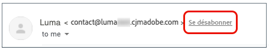
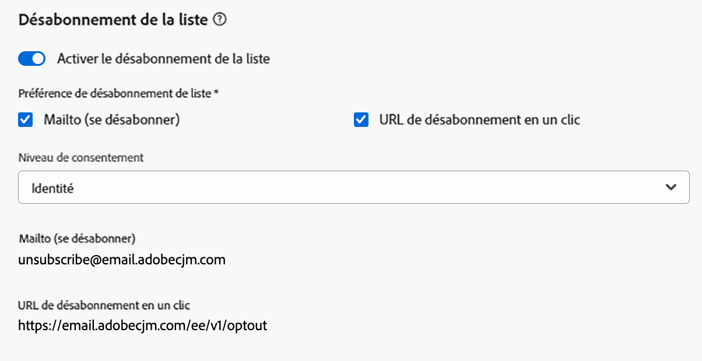
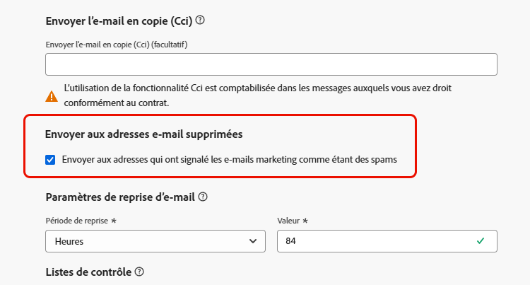
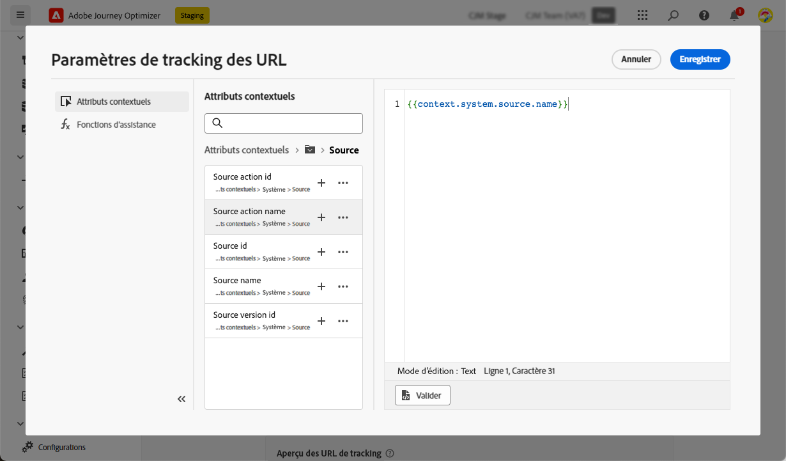

# Configurer les paramètres d’e-mail {#email-settings}

Pour commencer à créer un e-mail, vous devez paramétrer les configuration du canal e-mail qui définissent tous les paramètres techniques requis pour vos messages. [Découvrir comment créer des configurations](../configuration/channel-surfaces.md)

>[!NOTE]
>
>Pour préserver votre réputation et améliorer votre délivrabilité, configurez les sous-domaines que vous utiliserez pour envoyer des e-mails avant de créer une configuration du canal e-mail. [En savoir plus](../configuration/about-subdomain-delegation.md)

Définissez les paramètres d’e-mail dans la section dédiée de la configuration du canal, comme décrit ci-dessous.

{width="50%" align="left"}

La configuration du canal e-mail est récupérée pour envoyer des communications en suivant la logique ci-dessous :

* Pour les parcours par lots, cela ne s’applique pas à l’exécution par lots qui avait déjà démarré avant que la configuration de surface d’e-mail ne soit effectuée. La modification est récupérée lors de la prochaine périodicité ou de la nouvelle exécution.

* Pour les messages transactionnels, la modification est immédiatement récupérée pour la communication suivante (délai de cinq minutes maximum).

>[!NOTE]
>
>Les paramètres mis à jour de la configuration du canal e-mail sont automatiquement récupérés dans le ou les parcours ou la ou les campagnes où la configuration est utilisée.

## Type d’e-mail {#email-type}

>[!CONTEXTUALHELP]
>id="ajo_admin_presets_emailtype"
>title="Définir le type d’e-mail"
>abstract="Sélectionnez le type d’e-mail qui sera envoyé lors de l’utilisation de cette configuration : Marketing pour les messages promotionnels, qui nécessitent le consentement de l’utilisateur ou de l’utilisatrice, ou Transactionnel pour les messages non commerciaux, qui peuvent également être envoyés aux profils désabonnés dans des contextes spécifiques."

Dans la section **Type dʼe-mail**, sélectionnez le type de message pour la configuration : **[!UICONTROL Marketing]** ou **[!UICONTROL Transactionnel]**.

* Sélectionnez **Marketing** pour les e-mails promotionnels, tels que les promotions hebdomadaires pour un magasin de vente au détail. Ces messages requièrent le consentement de l’utilisateur ou de l’utilisatrice.

* Sélectionnez **Transactionnel** pour les e-mails non commerciaux tels que les confirmations de commande, les notifications de réinitialisation de mot de passe ou les informations de livraison, par exemple. Ces e-mails peuvent être envoyés aux profils qui **se sont désabonnés** des communications marketing. Ces messages ne peuvent être envoyés que dans des contextes spécifiques.

Lors de la création d’un message, vous devez choisir une configuration de canal valable, correspondant à la catégorie que vous avez sélectionnée pour votre e-mail.

## Sous-domaine {#subdomains}

Sélectionnez le sous-domaine à utiliser pour envoyer les e-mails.

Pour préserver la réputation de votre domaine, accélérer le processus de préchauffage des adresses IP et améliorer la délivrabilité, déléguez vos sous-domaines d’envoi à Adobe. [En savoir plus](../configuration/about-subdomain-delegation.md)

<!--If needed, you can define dynamic subdomains. [Learn more](../email/surface-personalization.md#dynamic-subdomains)-->

## Détails du groupe d’adresses IP {#ip-pools}

Sélectionnez le groupe d’adresses IP à associer à la configuration. [En savoir plus](../configuration/ip-pools.md)

{width="50%" align="left"}

Vous ne pouvez pas poursuivre la création de la configuration lorsque le groupe d’adresses IP sélectionné est en cours d’[édition](../configuration/ip-pools.md#edit-ip-pool) (statut **[!UICONTROL En cours de traitement]**), et n’a jamais été associé au sous-domaine sélectionné. Sinon, la version la plus ancienne de l’association groupe d’adresses IP/sous-domaine sera toujours utilisée. Si c’est le cas, enregistrez la configuration en tant que brouillon, puis réessayez une fois que le groupe d’adresses IP a le statut **[!UICONTROL Succès]**.

>[!NOTE]
>
>Pour les environnements hors production, Adobe ne crée pas de sous-domaines de test d’usine et n’accorde pas l’accès à un groupe d’adresses IP d’envoi partagé. Vous devez [déléguer vos propres sous-domaines](../configuration/delegate-subdomain.md) et utiliser les adresses IP du groupe affecté à votre organisation.

Une fois qu’un groupe d’adresses IP a été sélectionné, les informations PTR sont visibles lorsque vous pointez sur les adresses IP affichées sous la liste déroulante du groupe d’adresses IP. [En savoir plus sur les enregistrements PTR](../configuration/ptr-records.md)

>[!NOTE]
>
>Si un enregistrement PTR n’est pas configuré, contactez votre représentant(e) Adobe.

## En-tête de désabonnement de la liste{#list-unsubscribe}

<!--Do not modify - Legal Review Done -->

Lors de la [sélection d’un sous-domaine](#subdomains-and-ip-pools) dans la liste, l’option **[!UICONTROL Activer le désabonnement de la liste]** s’affiche.

Cette option est activée par défaut pour inclure une URL de désabonnement en un clic dans l’en-tête de l’e-mail, par exemple :

Si vous désactivez cette option, aucune URL de désabonnement en un clic ne s’affiche dans l’en-tête de l’e-mail.

Vous pouvez sélectionner le niveau de consentement dans la liste déroulante **[!UICONTROL Niveau de consentement]**. Il peut être spécifique au canal ou à l’identité du profil. En fonction de ce paramètre, lorsqu’un utilisateur ou une utilisatrice se désabonne à l’aide de l’URL de désabonnement de la liste dans l’en-tête d’un e-mail, le consentement est mis à jour dans Adobe Journey Optimizer au niveau du canal ou au niveau de l’ID.

L’en-tête de désabonnement de la liste propose deux fonctionnalités (URL de désabonnement Mailto ou en un clic, comme expliqué ci-dessous) qui sont activées par défaut, sauf si vous désélectionnez l’une des deux fonctionnalités, ou les deux :

* Une adresse **Mailto (se désabonner)**, qui est l’adresse de destination vers laquelle les demandes de désabonnement sont acheminées pour le traitement automatique.

  Dans Journey Optimizer, l’adresse e-mail de désabonnement est l’adresse par défaut **Mailto (se désabonner)** affichée dans la configuration de canal, en fonction du [sous-domaine sélectionné](#subdomains-and-ip-pools).

  {width="80%" align="left"}

* **URL de désabonnement en un clic**, qui est par défaut l’URL d’opt-out en un clic générée par l’en-tête de désabonnement de la liste, en fonction du sous-domaine que vous avez défini et configuré dans les paramètres de surface de canal.

<!--
    >[!AVAILABILITY]
    >
    >One-click Unsubscribe URL Header will be available in Adobe Journey Optimizer starting June 3, 2024.
    >
-->

Les fonctionnalités **[!UICONTROL Mailto (se désabonner)]** et **[!UICONTROL URL de désabonnement en un clic]** sont facultatives. Si vous ne souhaitez pas utiliser l’URL de désabonnement en un clic générée par défaut, vous pouvez décocher la fonction. Dans le scénario dans lequel l’option **[!UICONTROL Configuration d’opt-out]** est activée et où la fonctionnalité **[!UICONTROL URL de désabonnement en un clic]** n’est pas cochée, si vous ajoutez un [lien d’opt-out en un clic](../privacy/opt-out.md#one-click-opt-out) dans un message créé à l’aide de cette configuration, l’en-tête de désabonnement de la liste récupère le lien d’opt-out en un clic que vous avez inséré dans le corps de l’e-mail et l’utilise comme valeur de l’URL de désabonnement en un clic.

>[!NOTE]
>
>Si vous n’ajoutez pas de lien d’opt-out en un clic dans le contenu de votre message et que l’URL de désabonnement en un clic par défaut est décochée dans les paramètres de configuration de canal, aucune URL n’est transmise à l’en-tête de l’e-mail dans le cadre de l’en-tête de désabonnement de la liste.

Pour plus d’informations sur la gestion des fonctionnalités de désabonnement dans vos messages, consultez [cette section](../email/email-opt-out.md#unsubscribe-header).

## Paramètres d’en-tête {#email-header}

Dans la section **[!UICONTROL Paramètres d’en-tête]**, saisissez les noms de l’expéditeur ou de l’expéditrice et les adresses e-mail associées au type d’e-mails envoyés à l’aide de cette configuration.

* **[!UICONTROL Nom de l’expéditeur ou de l’expéditrice]** : le nom de l’expéditeur ou de l’expéditrice, tel que le nom de votre marque.
* **[!UICONTROL E-mail de l’expéditeur]** : adresse e-mail que vous souhaitez utiliser pour vos communications.
* **[!UICONTROL Répondre à (nom)]** : le nom qui sera utilisé lorsque le destinataire clique sur le bouton **Répondre** de son logiciel de messagerie.
* **[!UICONTROL Répondre à (e-mail)]** : adresse e-mail qui sera utilisée lorsque le destinataire clique sur le bouton **Répondre** de son logiciel de messagerie. [En savoir plus](#reply-to-email)
* **[!UICONTROL Message d’erreur]** : toutes les erreurs générées par les FAI après quelques jours de diffusion de l’e-mail (rebonds asynchrones) sont reçues sur cette adresse. Les notifications d’absence du bureau et les réponses de défi sont également reçues à cette adresse.

  Si vous souhaitez recevoir les notifications d’absence du bureau et demander des réponses de défi à une adresse e-mail spécifique qui n’est pas déléguée à Adobe, vous devez configurer un [processus de transfert](#forward-email). Dans ce cas, veillez à mettre en place une solution manuelle ou automatisée pour traiter les e-mails arrivant dans cette boîte de réception.

>[!CAUTION]
>
>Les adresses **[!UICONTROL e-mail expéditeur]** et **[!UICONTROL e-mail d’erreur]** doivent utiliser le [sous-domaine délégué](../configuration/about-subdomain-delegation.md) actuel. Par exemple, si le sous-domaine délégué est *marketing.luma.com*, vous pouvez utiliser *contact@marketing.luma.com* et *error@marketing.luma.com*.

>[!NOTE]
>
>Les adresses doivent commencer par une lettre (A-Z) et ne peuvent contenir que des caractères alphanumériques. Vous pouvez également utiliser le trait de soulignement `_`, le point`.` et le trait dʼunion `-`.

### Adresse e-mail de réponse {#reply-to-email}

Lors de la définition de l’adresse **[!UICONTROL Répondre à (e-mail)]**, vous pouvez indiquer toute adresse e-mail à condition qu’il s’agisse d’une adresse valide, au format approprié et sans erreur de frappe.

La boîte de réception utilisée pour les réponses recevra tous les e-mails de réponse, à l’exception des notifications d’absence du bureau et des réponses de défi, qui sont reçues sur l’adresse **[!UICONTROL E-mail d’erreur]**.

Pour assurer une bonne gestion des réponses, procédez comme suit :

* Assurez-vous que la boîte de réception dédiée dispose de suffisamment de capacité pour recevoir tous les e-mails de réponse envoyés à l’aide de la configuration du canal e-mail. Si la boîte de réception renvoie des rebonds, il se peut que certaines réponses de vos clients ne soient pas reçues.

* Les réponses doivent être traitées en tenant compte des obligations de confidentialité et de conformité, car elles peuvent contenir des données à caractère personnel (PII).

* Ne marquez pas les messages comme spam dans la boîte de réception de réponse, car cela aura un impact sur tous les autres e-mails envoyés à cette adresse.

En outre, lors de la définition de l’adresse **[!UICONTROL Répondre à (e-mail)]**, veillez à utiliser un sous-domaine possédant une configuration d’enregistrement MX valide, sinon le traitement de configuration de canal e-mail échouera.

Si vous obtenez une erreur lors de l’envoi de la configuration du canal e-mail, cela signifie que l’enregistrement MX n’est pas configuré pour le sous-domaine de l’adresse que vous avez saisie. Contactez votre administrateur ou administratrice pour configurer l’enregistrement MX correspondant ou utilisez une autre adresse avec une configuration d’enregistrement MX valide.

>[!NOTE]
>
>Si le sous-domaine de l’adresse que vous avez saisie est un domaine qui a été [entièrement délégué](../configuration/delegate-subdomain.md#full-subdomain-delegation) à Adobe, contactez votre gestionnaire de compte Adobe.

### Transférer un e-mail {#forward-email}

Pour transférer vers une adresse e-mail spécifique tous les e-mails reçus par [!DNL Journey Optimizer] pour le sous-domaine délégué, contactez l’Assistance clientèle d’Adobe.

>[!NOTE]
>
>Si le sous-domaine utilisé pour l’adresse **[!UICONTROL Répondre à (e-mail)]** L’adresse n’est pas déléguée à Adobe, le transfert ne peut pas fonctionner pour cette adresse.

Vous devrez fournir les éléments suivants :

* Adresse e-mail de transfert de votre choix. Notez que le domaine de l’adresse e-mail de transfert ne peut correspondre à aucun sous-domaine délégué à Adobe.
* Nom de votre sandbox.
* Nom de la configuration ou du sous-domaine pour qui l’adresse e-mail de transfert sera utilisée.
  <!--* The current **[!UICONTROL Reply to (email)]** address or **[!UICONTROL Error email]** address set at the channel configuration level.-->

>[!NOTE]
>
>Il ne peut y avoir qu’une seule adresse e-mail de transfert par sous-domaine. Par conséquent, si plusieurs configurations utilisent le même sous-domaine, la même adresse e-mail de transfert doit être utilisée pour tous les sous-domaines.

L’adresse e-mail de transfert sera configurée par Adobe. Cela peut prendre 3 à 4 jours.

Une fois que vous avez terminé, tous les messages reçus sur les adresses **[!UICONTROL Répondre à (e-mail)]** et **[!UICONTROL E-mail d’erreur]** sont transférés vers l’adresse e-mail spécifique que vous avez fournie.

## E-mail Cci {#bcc-email}

Vous pouvez envoyer une copie identique (ou une copie carbone invisible) des e-mails envoyés par [!DNL Journey Optimizer] vers une boîte de réception Cci où ils seront stockés à des fins de conformité ou d’archivage.

Pour ce faire, activez la fonctionnalité optionnelle **[!UICONTROL E-mail Cci]** au niveau de la configuration du canal. [En savoir plus](../configuration/archiving-support.md#bcc-email)

En outre, lors de la définition de l’adresse **[!UICONTROL E-mail Cci]**, veillez à utiliser un sous-domaine possédant une configuration d’enregistrement MX valide, sinon le traitement de configuration du canal e-mail échouera.

Si vous obtenez une erreur lors de l’envoi de la configuration du canal e-mail, cela signifie que l’enregistrement MX n’est pas configuré pour le sous-domaine de l’adresse que vous avez saisie. Contactez votre administrateur ou administratrice pour configurer l’enregistrement MX correspondant ou utilisez une autre adresse avec une configuration d’enregistrement MX valide.

## Envoyer à des adresses e-mail supprimées {#send-to-suppressed-email-addresses}

>[!CONTEXTUALHELP]
>id="ajo_surface_suppressed_addresses"
>title="Remplacer la priorité de la liste de suppression"
>abstract="Vous pouvez décider d’envoyer des messages transactionnels aux profils même si leurs adresses e-mail se trouvent sur la liste de suppression d’Adobe Journey Optimizer en raison d’une plainte relative aux spams. Par défaut, cette option est désactivée."
>additional-url="https://experienceleague.adobe.com/docs/journey-optimizer/using/configuration/monitor-reputation/manage-suppression-list.html?lang=fr" text="Gérer la liste de suppression"

>[!IMPORTANT]
>
>Cette option n’est disponible que si vous avez sélectionné le type d’e-mail **[!UICONTROL Transactionnel]**. [En savoir plus](#email-type)

Dans [!DNL Journey Optimizer], toutes les adresses e-mail marquées comme rebonds définitifs, rebonds temporaires et plaintes relatives aux spams sont automatiquement collectées dans la [liste de suppression](../configuration/manage-suppression-list.md) et exclues de l’envoi dans un parcours ou une campagne.

Cependant, vous pouvez décider de poursuivre l’envoi des messages de type **transactionnel** aux profils même si leurs adresses e-mail figurent sur la liste de suppression en raison d’une plainte relative aux spams de l’utilisateur ou de l’utilisatrice.

En effet, les messages transactionnels contiennent généralement des informations utiles et attendues, telles que des confirmations de commande ou des notifications de réinitialisation de mot de passe. Par conséquent, même s’ils ont signalé l’un de vos messages marketing comme spam, la plupart du temps, vous souhaitez que vos clientes et clients reçoivent ce type d’e-mail non commercial.

Pour inclure les adresses e-mail supprimées en raison d’une plainte relative aux spams dans votre audience de message transactionnel, sélectionnez l’option correspondante dans la section **[!UICONTROL Envoyer aux adresses e-mail supprimées]**.

>[!NOTE]
>
>Par défaut, cette option est désactivée.

Cette option est une bonne pratique en matière de délivrabilité. Elle est désactivée par défaut pour garantir que les clientes et clients qui se sont désinscrits ne soient pas contactés. Vous pouvez toutefois modifier cette option par défaut, qui vous permet ensuite d’envoyer des messages transactionnels à vos clientes et clients.

Une fois cette option activée, même si un client ou une cliente a marqué votre e-mail marketing comme indésirable, cette personne pourra recevoir vos messages transactionnels à l’aide de la configuration actuelle. Veillez toujours à gérer les préférences de désinscription conformément aux bonnes pratiques en matière de délivrabilité.

## Liste de contrôle {#seed-list}

>[!CONTEXTUALHELP]
>id="ajo_surface_seed_list"
>title="Ajouter une liste de contrôle"
>abstract="Sélectionnez la liste de contrôle de votre choix pour ajouter automatiquement des adresses internes spécifiques à vos audiences. Ces adresses de contrôle seront incluses au moment de l’exécution de la diffusion et recevront une copie exacte du message à des fins de vérification."
>additional-url="https://experienceleague.adobe.com/docs/journey-optimizer/using/configuration/seed-lists.html?lang=fr#use-seed-list" text="Que sont les listes de contrôle ?"

Une liste de contrôle dans [!DNL Journey Optimizer] vous permet d’inclure automatiquement des adresses de contrôle d’e-mail spécifiques dans vos diffusions. [En savoir plus](../configuration/seed-lists.md)

>[!CAUTION]
>
>Actuellement, cette fonctionnalité s’applique uniquement au canal e-mail.

Sélectionnez la liste qui vous intéresse dans la section **[!UICONTROL Liste de contrôle]**. Découvrez comment créer une liste de contrôle dans [cette section](../configuration/seed-lists.md#create-seed-list).

>[!NOTE]
>
>Une seule liste de contrôle peut être sélectionnée à la fois.

Lorsque la configuration actuelle est utilisée dans une campagne ou un parcours, les adresses e-mail de la liste de contrôle sélectionnée sont incluses au moment de l’exécution de la diffusion, ce qui signifie qu’elles recevront une copie de la diffusion à des fins de vérification.

Découvrez comment utiliser la liste de contrôle dans une campagne ou un parcours dans [cette section](../configuration/seed-lists.md#use-seed-list).

## Paramètres de reprise de lʼe-mail {#email-retry}

>[!CONTEXTUALHELP]
>id="ajo_admin_presets_retryperiod"
>title="Réglage de la période de reprise"
>abstract="Les reprises sont effectuées pendant 3,5 jours (84 heures) lorsqu’une diffusion d’e-mail échoue en raison d’une erreur de rebond temporaire. Vous pouvez ajuster cette période de reprise par défaut en fonction de vos besoins."
>additional-url="https://experienceleague.adobe.com/docs/journey-optimizer/using/configuration/monitor-reputation/retries.html?lang=fr" text="À propos des reprises"

Vous pouvez configurer les **Paramètres de reprise de lʼe-mail**.

Par défaut, la [période de reprise](../configuration/retries.md#retry-duration) est définie sur 84 heures, mais vous pouvez ajuster ce paramètre pour mieux l’adapter à vos besoins.

Vous devez saisir une valeur entière (en heures ou minutes) dans la plage suivante :

* Pour les e-mails marketing, la période de reprise minimale est de 6 heures.
* Pour les e-mails transactionnels, la période de reprise minimale est de 10 minutes.
* Pour les deux types d’e-mail, la période de reprise maximale est de 84 heures (soit 5 040 minutes).

En savoir plus sur les reprises dans [cette section](../configuration/retries.md).

## Tracking des URL {#url-tracking}

>[!CONTEXTUALHELP]
>id="ajo_admin_preset_utm"
>title="Définir les paramètres de tracking d’URL"
>abstract="Cette section décrit comment ajouter automatiquement des paramètres de tracking aux URL présentes dans votre contenu d’e-mail. Cette fonctionnalité est facultative."

>[!CONTEXTUALHELP]
>id="ajo_admin_preset_url_preview"
>title="Prévisualiser les paramètres de tracking d’URL"
>abstract="Prévisualisez comment les paramètres de tracking seront ajoutés aux adresses URL présentes dans votre contenu d’e-mail."

Vous pouvez utiliser les **[!UICONTROL paramètres de tracking d’URL]** pour mesurer l’efficacité de vos efforts marketing sur l’ensemble des canaux. Cette fonctionnalité est facultative.

Les paramètres définis dans cette section seront ajoutés à la fin des URL incluses dans le contenu de votre e-mail. Vous pouvez ensuite capturer ces paramètres dans des outils d’analyse web tels qu’Adobe Analytics ou Google Analytics, et créer divers rapports de performances.

Vous pouvez ajouter jusqu’à 10 paramètres de tracking à l’aide du bouton **[!UICONTROL Ajouter un nouveau paramètre]**.

Pour configurer un paramètre de tracking d’URL, vous pouvez saisir directement les valeurs souhaitées dans les champs **[!UICONTROL Nom]** et **[!UICONTROL Valeur]**.

Vous pouvez également modifier chaque champ **[!UICONTROL Valeur]** à l’aide de l’[Éditeur de personnalisation](../personalization/personalization-build-expressions.md). Cliquez sur l’icône d’édition pour ouvrir l’éditeur. De là, vous pouvez sélectionner les attributs contextuels de votre choix et/ou modifier directement le texte.

Les valeurs prédéfinies suivantes sont disponibles dans l’éditeur de personnalisation :

* **ID d’action source** : ID de l’action e-mail ajoutée au parcours ou à la campagne.

* **Nom de l’action source** : nom de l’action e-mail ajoutée au parcours ou à la campagne.

* **ID source** : ID du parcours ou de la campagne avec lequel l’e-mail a été envoyé.

* **Nom de la source** : nom du parcours ou de la campagne avec lequel l’e-mail a été envoyé.

* **ID de la version source** : ID du parcours ou de la version de campagne avec lequel l’e-mail a été envoyé.

* **ID de l’offre** : ID de l’offre utilisée dans l’e-mail.

>[!NOTE]
>
>Vous pouvez combiner la saisie de valeurs de texte et l’utilisation d’attributs contextuels à partir de l’éditeur de personnalisation. Chaque champ **[!UICONTROL Valeur]** peut contenir un certain nombre de caractères jusqu’à une limite de 5 Ko.

<!--You can drag and drop the parameters to reorder them.-->

Vous trouverez ci-dessous des exemples d’URL compatibles avec Adobe Analytics et Google Analytics.

* URL compatible avec Adobe Analytics : `www.YourLandingURL.com?cid=email_AJO_{{context.system.source.id}}_image_{{context.system.source.name}}`

* URL compatible avec Google Analytics : `www.YourLandingURL.com?utm_medium=email&utm_source=AJO&utm_campaign={{context.system.source.id}}&utm_content=image`

Vous pouvez prévisualiser de manière dynamique l’URL de tracking obtenue. Chaque fois que vous ajoutez, modifiez ou supprimez un paramètre, la prévisualisation est automatiquement mise à jour.

>[!NOTE]
>
>Vous pouvez également ajouter des paramètres de suivi personnalisés et dynamiques aux liens présents dans le contenu de votre e-mail, mais cela n’est pas possible au niveau de la configuration. Vous devez le faire lors de la création de votre message à l’aide du concepteur d’e-mail. [En savoir plus](message-tracking.md#url-tracking).

## Adresse d’exécution {#execution-address}

>[!CONTEXTUALHELP]
>id="ajo_email_config_execution_address"
>title="Définir l’adresse à utiliser"
>abstract="Lorsque plusieurs adresses e-mail ou numéros de téléphone sont disponibles dans la base de données (personnel, professionnel, etc.), vous pouvez choisir l’adresse ou le numéro auquel donner la priorité pour l’envoi."

Lorsque vous ciblez un profil, plusieurs adresses e-mail peuvent être disponibles dans la base de données (adresse e-mail professionnelle, adresse e-mail personnelle, etc.).

Dans ce cas, [!DNL Journey Optimizer] utilise l’adresse spécifiée dans le champ **[!UICONTROL Champs d’exécution]** au niveau de la sandbox pour déterminer l’adresse e-mail à utiliser en priorité à partir du service de profil. [En savoir plus](../configuration/primary-email-addresses.md)

>[!NOTE]
>
>Pour vérifier les champs actuellement utilisés par défaut, accédez au menu **[!UICONTROL Administration]** > **[!UICONTROL Canaux]** > **[!UICONTROL Paramètres généraux]** > **[!UICONTROL Champs d’exécution]**.

Cependant, vous pouvez modifier ce champ d’exécution par défaut au niveau de la configuration du canal e-mail.

Pour ce faire, modifiez le champ **[!UICONTROL Adresse de diffusion]** et sélectionnez un élément dans la liste des champs XDM de type e-mail disponibles.

Le champ d’exécution est mis à jour, puis utilisé comme adresse principale. Il remplace le paramètre général au niveau du sandbox.
