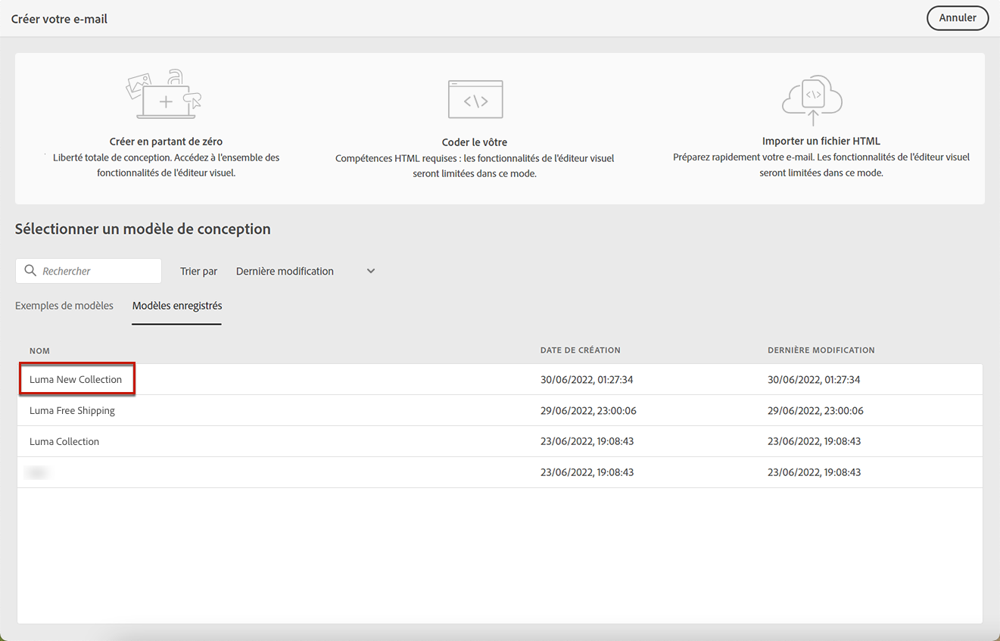

# Utilisation de modèles d’email {#email-templates}

Utilisez la variable **[!UICONTROL Select design template]** pour commencer à créer votre contenu à partir d’un modèle.

Vous pouvez choisir parmi les options suivantes :
* 20 modèles d&#39;email d&#39;usine.
* Modèles enregistrés. [En savoir plus](#use-saved-template)

## Enregistrer en tant que modèle {#save-as-template}

>[!CONTEXTUALHELP]
>id="ajo_messages_depecrated_inventory"
>title="Découvrez comment migrer vos messages"
>abstract="Le 25 juillet 2022, le menu Messages a disparu et les messages sont désormais créés directement à partir d’un Parcours. Si vous souhaitez réutiliser vos messages hérités dans les parcours, vous devez les enregistrer en tant que modèles."

Une fois que vous avez conçu votre [contenu de l&#39;email](get-started-email-design.md), vous pouvez l’enregistrer pour une réutilisation ultérieure. Pour ce faire, procédez comme suit.

1. Cliquez sur les points de suspension en haut à droite de l’écran.

1. Sélectionner **[!UICONTROL Save design template]** dans le menu déroulant.

   

1. Ajoutez un nom pour ce modèle.

   

1. Cliquez sur **[!UICONTROL Save]**.

La prochaine fois que vous créez un email, vous pouvez utiliser ce modèle pour créer votre contenu. [Découvrez comment](#use-saved-template)

## Utiliser un modèle enregistré {#use-saved-template}

1. Ouvrez le [Concepteur d&#39;email](content-from-scratch.md).

1. Sur le **[!UICONTROL Create your email screen]**, la variable **[!UICONTROL Sample templates]** est sélectionné par défaut. Sélectionnez la **[!UICONTROL Saved templates]** .

   

1. La liste de tous les [modèles enregistrés](#save-as-template) s’affiche. Vous pouvez les trier. **[!UICONTROL By name]**, **[!UICONTROL Last modified]** et **[!UICONTROL Last created]**.

   

1. Sélectionnez le modèle de votre choix dans la liste.

1. Une fois sélectionné, vous pouvez naviguer entre tous les modèles enregistrés à l’aide des flèches droite et gauche.

   

1. Cliquez sur **[!UICONTROL Use this email]** en haut à droite de l’écran.

1. Modifiez votre contenu selon vos besoins à l&#39;aide du Concepteur d&#39;email.
