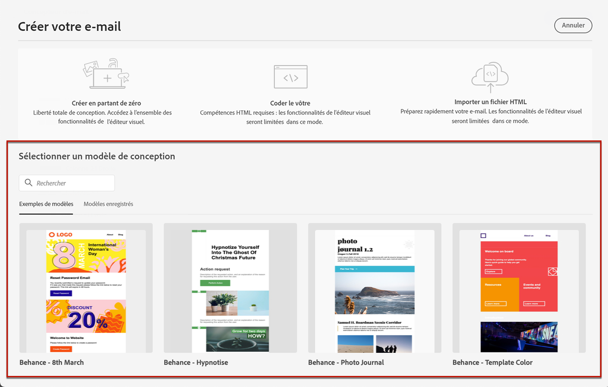
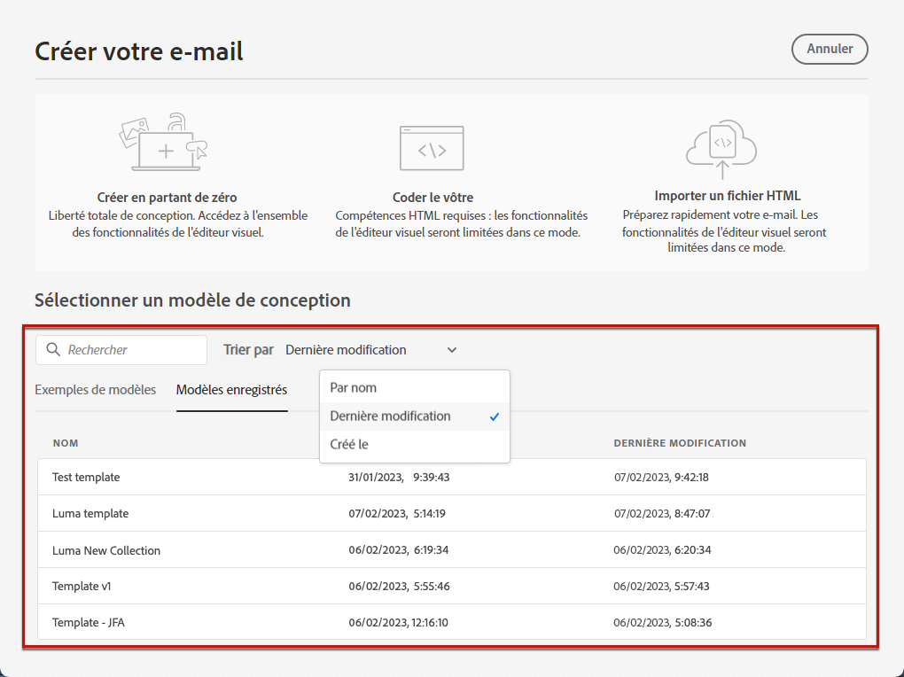
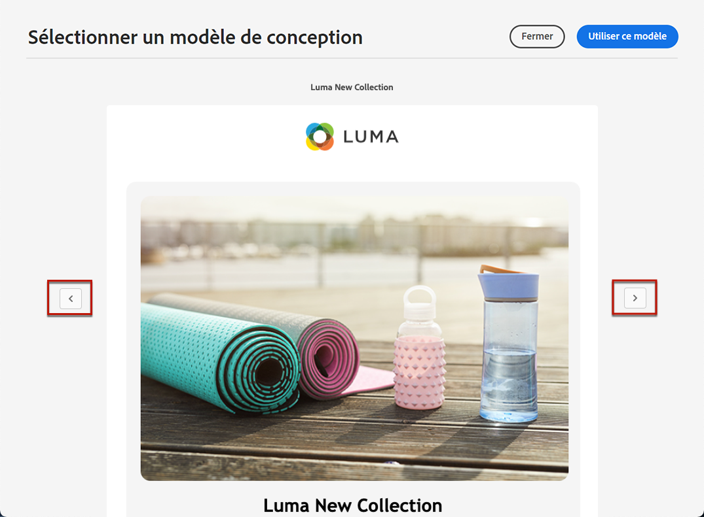

# Utiliser des modèles de courrier électronique {#email-templates}

>[!CONTEXTUALHELP]
>id="ajo_use_template"
>title="Créer du contenu à partir d’un modèle personnalisé"
>abstract="Pour commencer à créer le contenu de votre email, sélectionnez un modèle existant qui a été entièrement créé ou enregistré comme modèle à partir d&#39;un email précédent."
>additional-url="https://experienceleague.adobe.com/docs/journey-optimizer/using/email/content-templates.html#create-content-templates" text="Créer des modèles de contenu"

Dans la **[!UICONTROL Créer votre email]** , utilisez la méthode **[!UICONTROL Sélectionner un modèle de conception]** pour commencer à créer votre contenu à partir d’un modèle.

Vous pouvez choisir parmi les options suivantes :

* **Exemples de modèles**. Le [!DNL Journey Optimizer] propose 20 modèles d’email d’usine, parmi lesquels vous pouvez choisir.

* **Modèles enregistrés**. Vous pouvez également utiliser un modèle personnalisé qui vous permet d’effectuer l’une des opérations suivantes :

   * Créé à partir de zéro à l’aide du **[!UICONTROL Modèles de contenu]** . [En savoir plus](content-templates.md#create-template-from-scratch).

   * Enregistré dans un email dans un parcours ou une campagne à l’aide de la variable **[!UICONTROL Enregistrer en tant que modèle de contenu]** . [En savoir plus](content-templates.md#save-as-template).

Pour commencer à créer votre contenu avec l’un des exemples ou des modèles enregistrés, procédez comme suit.

1. [Accès au Concepteur d&#39;email](get-started-email-design.md) de l’email **[!UICONTROL Modifier le contenu]** écran.

1. Sur le **[!UICONTROL Créer votre email]** l’écran **[!UICONTROL Exemples de modèles]** est sélectionné par défaut.

1. Pour utiliser un modèle personnalisé, accédez au **[!UICONTROL Modèles enregistrés]** .

   

1. La liste de tous les [modèles de contenu](content-templates.md#create-content-templates) créé sur l’environnement de test actif s’affiche. Vous pouvez les trier : **[!UICONTROL Par nom]**, **[!UICONTROL Dernière modification]** et **[!UICONTROL Dernière création]**.

   

1. Sélectionnez le modèle de votre choix dans la liste.

1. Une fois sélectionné, vous pouvez naviguer entre tous les modèles d’une catégorie (exemple ou enregistré selon votre sélection) à l’aide des flèches droite et gauche.

   

1. Cliquez sur **[!UICONTROL Utiliser ce modèle]** en haut à droite de l’écran.

1. Modifiez votre contenu selon vos besoins à l&#39;aide du Concepteur d&#39;email.
