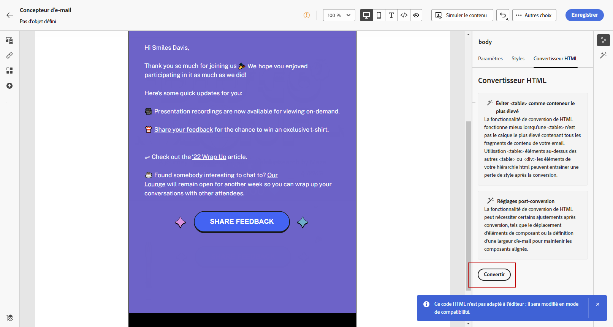

# Importer le contenu de vos e-mails {#existing-content}

[!DNL Journey Optimizer] vous permet d&#39;importer du contenu HTML existant pour concevoir vos e-mails. Ce contenu peut être :

* Un **fichier HTML** avec une feuille de style incorporée ;
* Un **dossier .zip** avec le fichier HTML, la feuille de style (.css) et les images.

  >[!NOTE]
  >
  >Il n’existe aucune contrainte sur la structure des fichiers .zip. Cependant, les références doivent être relatives et s’ajuster à l’arborescence du dossier .zip.

>[!TIP]
>
>Si vous disposez d’images (JPEG ou PNG) au lieu de fichiers HTML, vous pouvez utiliser le [convertisseur d’images en HTML](image-to-html.md) pour les convertir automatiquement en modèles d’e-mail HTML modifiables à l’aide de l’IA.

Pour importer un fichier avec du contenu HTML, procédez comme suit :

1. Dans la page d’accueil du concepteur d’e-mail, sélectionnez **[!UICONTROL Importer du contenu HTML]**.

   

1. Faites glisser et déposez le fichier HTML ou .zip contenant le contenu HTML, puis cliquez sur **[!UICONTROL Importer]**.

   

1. Une fois le contenu HTML chargé, votre contenu sera en **[!UICONTROL Mode de compatibilité]**.

   Dans ce mode, vous pouvez uniquement personnaliser votre texte, ajouter des liens ou inclure des ressources à votre contenu.

1. Pour pouvoir utiliser les composants de contenu du concepteur d’e-mail, accédez à l’onglet **[!UICONTROL Convertisseur HTML]** et cliquez sur **[!UICONTROL Convertir]**.

   

   >[!NOTE]
   >
   > L’utilisation d’une balise `<table>` comme première couche d’un fichier HTML peut entraîner une perte de style, y compris les paramètres d’arrière-plan et de largeur dans la balise de couche supérieure.

1. Vous pouvez désormais personnaliser votre fichier importé selon vos besoins à l’aide des fonctionnalités du Concepteur d’e-mail. [En savoir plus](content-from-scratch.md)

## Vidéo pratique {#video}

Découvrez comment importer du contenu HTML existant, améliorer la conception et ajouter une page miroir et des liens de désabonnement. Apprenez également comment coder le contenu.

>[!VIDEO](https://video.tv.adobe.com/v/3421910?captions=fre_fr&quality=12)
