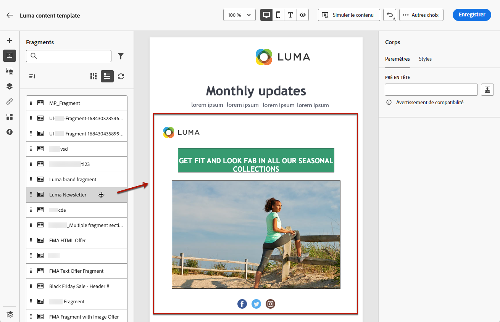

# Utiliser les fragments {#fragments}

Un fragment est un composant réutilisable pouvant être référencé dans un ou plusieurs e-mails dans des campagnes et parcours [!DNL Journey Optimizer].

Cette fonctionnalité permet de précréer plusieurs blocs de contenu personnalisés qui peuvent être utilisés par des utilisateurs et utilisatrices marketing non techniques pour assembler rapidement les contenus d’e-mail dans un processus de conception amélioré.

➡️ [Découvrez comment gérer, créer et utiliser des fragments dans cette vidéo](#video-fragments)

>[!CAUTION]
>
>Pour créer, modifier et archiver des fragments, vous devez disposer de l’autorisation **[!DNL Manage Library Items]** incluse dans le profil de produit **[!DNL Content Library Manager]**. [En savoir plus](../administration/ootb-product-profiles.md#content-library-manager).

Pour optimiser l’utilisation des fragments :

* Créez vos propres fragments. Voir [Créer des fragments](#create-fragments)
* Utilisez-les autant de fois que nécessaire dans vos e-mails. Voir [Utiliser les fragments](#use-fragments)

>[!NOTE]
>
>Actuellement, cette fonctionnalité n’est disponible que pour les e-mails.

## Accéder aux fragments et les gérer {#access-manage-fragments}

Pour accéder à la liste des fragments, sélectionnez **[!UICONTROL Gestion de contenu]** > **[!UICONTROL Fragments]** dans le menu de gauche.

Tous les fragments qui ont été créés sur la sandbox actuelle, soit à partir du menu **[!UICONTROL Fragments]**, soit à l’aide de l’option [Enregistrer en tant que fragment](#save-as-fragment), s’affichent.

Vous pouvez filtrer les fragments selon la date de création ou de modification. Vous pouvez choisir d’afficher tous les fragments ou uniquement les éléments créés ou modifiés par l’utilisateur ou l’utilisatrice actuel(le). Vous pouvez également afficher les fragments **[!UICONTROL archivés]**. [En savoir plus](#archive-fragments).

Cliquez sur l’icône **[!UICONTROL Autres actions]** en regard de chaque fragment pour effectuer les opérations suivantes :

* Dupliquer un fragment.

* Utilisez l’option **[!UICONTROL Explorer les références]** pour afficher les parcours, les campagnes ou les modèles dans lesquels ils sont utilisés. [En savoir plus](#explore-references).

* Archiver un fragment. [En savoir plus](#archive-fragments).

### Modifier des fragments {#edit-fragments}

Pour modifier un fragment, procédez comme suit.

1. Cliquez sur l’élément de votre choix dans la liste **[!UICONTROL Fragments]**.
1. À partir des propriétés du fragment, vous pouvez [explorer les références](#explore-references), [gérer son accès](../administration/object-based-access.md) et mettre à jour les détails du fragment, y compris les [balises](../start/search-filter-categorize.md#tags).

   

1. Sélectionnez le bouton correspondant pour modifier le contenu comme vous le feriez lors de la création d’un fragment à partir de zéro. [En savoir plus](#create-from-scratch).

>[!NOTE]
>
>Lorsque vous modifiez un fragment, les modifications sont automatiquement propagées à tous les e-mails ou modèles contenant ce fragment, à l’exception des e-mails utilisés dans les parcours ou campagnes **[!UICONTROL dynamiques]**. Vous pouvez également rompre l’héritage du fragment d’origine. [En savoir plus](#break-inheritance).

<!--Changes made to a fragment are not propagated to live journeys or campaigns where it is used.-->

<!--When added to an email, if you want to modify a fragment for a specific email, you can break the synchronization with the original fragment. The fragment becomes part of the email content and the changes will not be synchronized anymore. [Learn more](#break-inheritance)-->

### Explorer les références {#explore-references}

Vous pouvez afficher la liste des parcours, campagnes et modèles de contenu qui utilisent actuellement un fragment.

Pour ce faire, sélectionnez **[!UICONTROL Explorer les références]**, soit à partir du menu **[!UICONTROL Autres actions]** dans la liste des fragments ou dans l’écran des propriétés du fragment.

Sélectionnez un onglet pour basculer entre les parcours, les campagnes et les modèles. Vous pouvez voir leur statut et cliquer sur un nom pour le rediriger vers l’élément correspondant où le fragment est référencé.

>[!NOTE]
>
>Si le fragment est utilisé dans un parcours, une campagne ou un modèle dont le libellé vous empêche l’accès, un message d’alerte s’affiche en haut de l’onglet sélectionné. [En savoir plus sur le contrôle d’accès au niveau de l’objet (OLAC)](../administration/object-based-access.md)

### Archiver des fragments {#archive-fragments}

Vous pouvez supprimer de la liste des fragments des éléments qui ne sont plus pertinents pour votre marque.

Pour ce faire, cliquez sur l’icône **[!UICONTROL Autres actions]** en regard du fragment souhaité, puis sélectionnez **[!UICONTROL Archiver]**. Il disparaîtra de la liste des fragments, ce qui empêche leur utilisation dans les futurs e-mails ou modèles.

>[!NOTE]
>
>Si vous archivez un fragment utilisé dans un e-mail ou dans un modèle de contenu,<!--it will remain in the email or template, but you won't be able to select it from the fragment list to edit it-->l’e-mail ou le modèle ne sera pas affecté.

Pour désarchiver un fragment, filtrez sur les éléments **[!UICONTROL archivés]** et sélectionnez **[!UICONTROL Désarchiver]** dans le menu **[!UICONTROL Autres actions]**. Le fragment est à nouveau accessible à partir de la liste des fragments et peut être utilisé dans n’importe quel e-mail ou modèle.

## Créer des fragments {#create-fragments}

Vous pouvez créer des fragments de deux manières :

* Créez un fragment à partir de zéro, à l’aide du menu dédié **[!UICONTROL Fragments]**. [Voici comment procéder.](#create-template-from-scratch)

* Lors de la conception d’un e-mail ou d’un modèle de contenu, enregistrez une partie de votre contenu en tant que fragment. [Voici comment procéder.](#save-as-template)

Une fois enregistré, votre fragment peut être utilisé dans un parcours, une campagne ou un modèle. Que ce fragment soit créé à partir de zéro ou à partir d’un contenu existant, vous pouvez désormais l’utiliser lors de la création d’un [e-mail](get-started-email-design.md) ou d’un [modèle de contenu](content-templates.md) dans [!DNL Journey Optimizer]. [En savoir plus](#use-fragments).

### Créer à partir de zéro {#create-from-scratch}

>[!CONTEXTUALHELP]
>id="ajo_create_fragment"
>title="Définir votre propre fragment"
>abstract="Créez un modèle personnalisé autonome à partir de zéro pour rendre votre contenu réutilisable sur plusieurs parcours et campagnes."

Pour créer un fragment à partir de zéro, procédez comme suit.

1. Accédez à la liste des fragments via le menu de gauche **[!UICONTROL Gestion de contenu]** > **[!UICONTROL Fragments]**.

1. Sélectionnez **[!UICONTROL Créer un fragment]**.

1. Renseignez les détails du fragment, c’est-à-dire le nom et la description (si nécessaire).

   

   >[!NOTE]
   >
   >Actuellement, seul le type **[!UICONTROL Fragment visuel]** et le canal **E-mail** sont pris en charge.

1. Pour attribuer des libellés d’utilisation des données personnalisés ou de base au fragment, sélectionnez **[!UICONTROL Gérer l’accès]**. [En savoir plus sur le contrôle d’accès au niveau de l’objet (OLAC)](../administration/object-based-access.md).

1. Sélectionnez ou créez des balises Adobe Experience Platform à partir du champ **[!UICONTROL Balises]** pour classer votre fragment en vue d’une recherche améliorée. [En savoir plus](../start/search-filter-categorize.md#tags)

1. Cliquez sur **[!UICONTROL Créer]**.

1. Le [Concepteur d’e-mail](get-started-email-design.md) s’affiche. Modifiez votre contenu selon vos besoins, de la même manière que pour tout e-mail contenu dans un parcours ou une campagne.

   >[!NOTE]
   >
   >Vous pouvez ajouter des champs de personnalisation et du contenu dynamique, mais les attributs contextuels ne sont pas pris en charge dans les fragments.

   

1. Une fois votre fragment prêt, cliquez sur **[!UICONTROL Enregistrer]**.

1. Si nécessaire, cliquez sur la flèche en regard du nom du fragment pour revenir à l’écran **[!UICONTROL Détails]** et le modifier.

   

Ce fragment est maintenant prêt à être utilisé lors de la création d’un [e-mail](get-started-email-design.md) ou [modèle de contenu](content-templates.md) dans [!DNL Journey Optimizer]. [Voici comment procéder.](#use-fragments)

### Enregistrer en tant que fragment {#save-as-fragment}

Lors de la conception d’un [modèle de contenu](content-templates.md) ou d’un [e-mail](get-started-email-design.md) dans une campagne ou un parcours, vous pouvez enregistrer une partie de votre contenu en tant que fragment pour une réutilisation ultérieure. Pour ce faire, suivez les étapes ci-après.

1. Dans le [Concepteur d’e-mail](get-started-email-design.md), cliquez sur les points de suspension en haut à droite de l’écran.

1. Sélectionnez **[!UICONTROL Enregistrer en tant que fragment]** dans le menu déroulant.

   

1. L’écran **[!UICONTROL Enregistrer en tant que fragment]** s’affiche. Sélectionnez ensuite les éléments à inclure dans votre fragment, notamment les champs de personnalisation et le contenu dynamique. Notez que les attributs contextuels ne sont pas pris en charge dans les fragments.

   >[!CAUTION]
   >
   >Vous pouvez uniquement sélectionner des sections adjacentes. Vous ne pouvez pas sélectionner une structure vide ou un autre fragment.

   

1. Cliquez sur **[!UICONTROL Créer]**. Renseignez les détails du fragment, c’est-à-dire le nom et la description (si nécessaire).

   

   >[!NOTE]
   >
   >Actuellement, seul le type **[!UICONTROL Fragment visuel]** et le canal **E-mail** sont pris en charge.

1. Pour attribuer des libellés d’utilisation des données personnalisés ou de base au fragment, sélectionnez **[!UICONTROL Gérer l’accès]**. [En savoir plus sur le contrôle d’accès au niveau de l’objet (OLAC)](../administration/object-based-access.md).

1. Sélectionnez ou créez des balises Adobe Experience Platform à partir du champ **Balises** pour classer votre modèle en vue d’une recherche améliorée. [En savoir plus](../start/search-filter-categorize.md#tags)

1. Cliquez de nouveau sur **[!UICONTROL Créer]**. Le fragment est enregistré dans la liste **[!UICONTROL Fragments]**, accessible à partir du menu dédié [!DNL Journey Optimizer].

   Il devient alors un modèle de contenu autonome [accessible](#access-manage-fragments) pouvant être [édité](#edit-fragments) et [archivé](#archive-fragments) comme tout autre élément de cette liste.

Ce fragment est maintenant prêt à être utilisé lors de la création d’un [e-mail](get-started-email-design.md) ou [modèle de contenu](content-templates.md) dans [!DNL Journey Optimizer]. [Voici comment procéder.](#use-fragments)

>[!NOTE]
>
>Toute modification apportée à ce nouveau fragment n’est pas propagée dans l’e-mail ou le modèle d’où il provient. De même, lorsque le contenu d’origine est modifié dans cet e-mail ou modèle, le nouveau fragment n’est pas modifié.

## Utiliser les fragments {#use-fragments}

Vous pouvez utiliser un fragment d’[e-mail](get-started-email-design.md) dans un parcours ou une campagne, ou encore dans un [modèle de contenu](content-templates.md).

1. Ouvrez le contenu d’un e-mail ou d’un modèle à l’aide du [Concepteur d’e-mail](get-started-email-design.md).

1. Sélectionnez l’icône **[!UICONTROL Fragments]** dans le rail de gauche.

   

1. La liste de tous les fragments créés dans le sandbox actuel s’affiche. Vous pouvez :

   * Rechercher un fragment spécifique en commençant à saisir son libellé.
   * Trier les fragments par ordre croissant ou décroissant.
   * Modifier l’affichage des fragments (vue Cartes ou Liste).

1. Vous pouvez également actualiser la liste.

   >[!NOTE]
   >
   >Si certains fragments ont été modifiés ou ajoutés pendant que vous modifiez votre contenu, la liste est mise à jour avec les dernières modifications.

1. Faites glisser un fragment de la liste et déposez-le dans la zone où vous souhaitez l’insérer.

   

1. Comme tout autre composant, vous pouvez déplacer le fragment dans votre contenu.

1. Sélectionnez le fragment pour afficher le volet correspondant à droite. De là, vous pouvez supprimer le fragment de votre contenu ou le dupliquer. Vous pouvez également effectuer ces actions directement à partir du menu contextuel qui s’affiche au-dessus du fragment.

   

1. À partir de l’onglet **[!UICONTROL Paramètres]**, vous pouvez :

   * Sélectionner les appareils sur lesquels afficher le fragment.
   * Ouvrir le fragment dans un nouvel onglet pour le modifier, si nécessaire. [En savoir plus](#edit-fragments).
   * Explorer les références. [En savoir plus](#explore-references).

1. Vous pouvez personnaliser davantage votre fragment à l’aide de l’onglet **[!UICONTROL Styles]**.

1. Si nécessaire, vous pouvez rompre l’héritage avec le fragment d’origine. [En savoir plus](#break-inheritance).

1. Ajoutez autant de fragments que vous le souhaitez. Vous pouvez ensuite **[!UICONTROL enregistrer]** vos modifications.

### Rompre l’héritage {#break-inheritance}

Lorsque vous modifiez un fragment, les modifications sont synchronisées. Elles sont automatiquement propagées à tous les **[!UICONTROL brouillons]** de parcours/campagnes et modèles de contenu contenant ce fragment.

>[!NOTE]
>
>Les modifications ne sont pas propagées aux e-mails utilisés dans les parcours ou campagnes **[!UICONTROL dynamiques]**.

Lorsqu’ils sont ajoutés à un e-mail ou à un modèle de contenu, les fragments sont synchronisés par défaut.

Vous pouvez toutefois rompre l’héritage du fragment d’origine. Dans ce cas, le contenu du fragment est copié dans la conception actuelle et les modifications ne seront plus synchronisées.

Pour rompre l’héritage, procédez comme suit :

1. Sélectionnez le fragment.

1. Cliquez sur l’icône Déverrouiller dans la barre d’outils contextuelle.

   

1. Ce fragment devient alors un élément autonome qui n’est plus lié au fragment d’origine. Modifiez-le comme tout autre composant de votre contenu. [En savoir plus](content-components.md).

## Vidéo pratique {#video-fragments}

Découvrez comment gérer, créer et utiliser des fragments dans [!DNL Journey Optimizer].

>[!VIDEO](https://video.tv.adobe.com/v/3419932/?quality=12)

