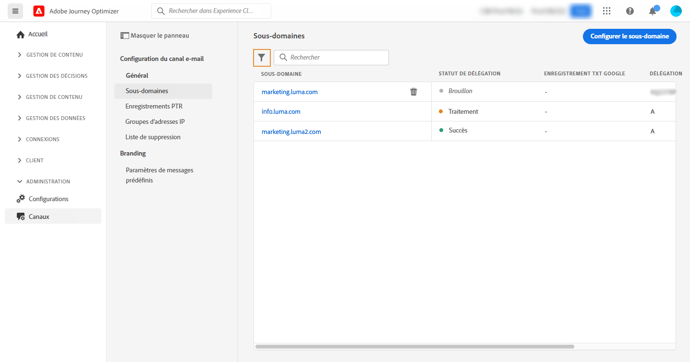
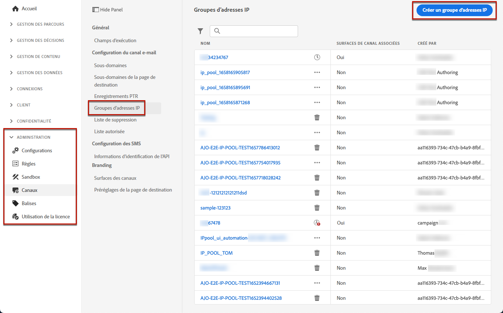
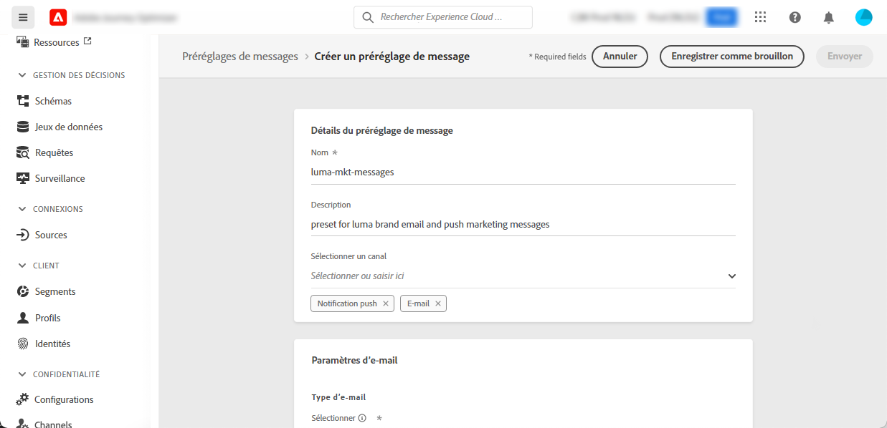
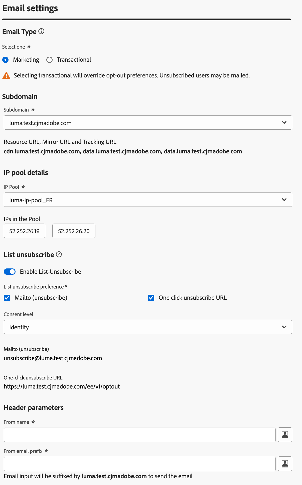
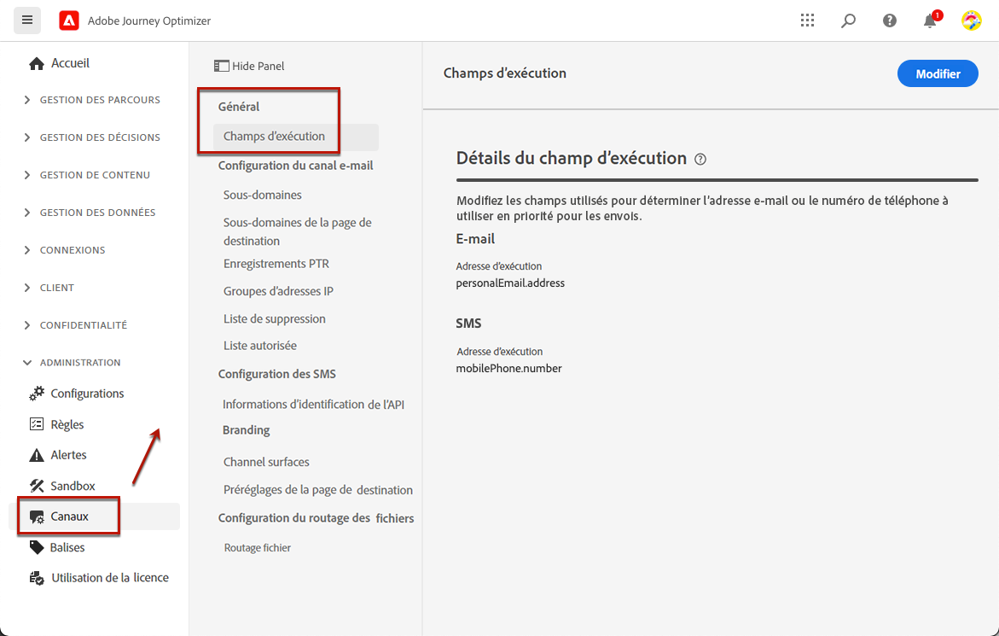
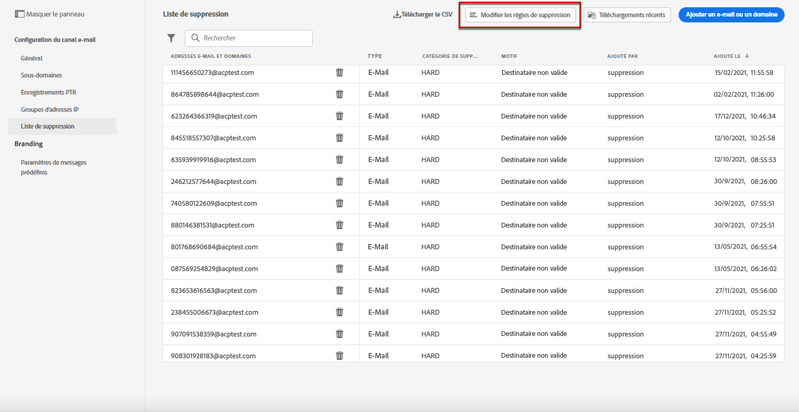

# Commencer la configuration du canal e-mail {#get-starte-email-config}

>[!BEGINSHADEBOX]

**Sur cette page :** découvrez les étapes essentielles pour configurer le canal e-mail dans Adobe Journey Optimizer, de la délégation de sous-domaines à la création de groupes d’adresses IP, en passant par la configuration des canaux, des champs d’exécution et des reprises.

>[!ENDSHADEBOX]

La configuration du canal e-mail dans Adobe Journey Optimizer est la clé pour créer des expériences d’e-mail personnalisées et percutantes qui impliquent efficacement votre audience.

Cette section vous guide tout au long des étapes de configuration essentielles à suivre pour envoyer des e-mails depuis [!DNL Journey Optimizer]. Vous allez découvrir également comment configurer des en-têtes d’e-mail, personnaliser les paramètres de plusieurs marques, activer le tracking des URL pour analyse et même ajouter des liens de désabonnement en un clic pour plus de commodité. Chaque rubrique s’appuie sur la précédente, ce qui vous donne les outils nécessaires pour affiner votre stratégie d’e-mail tout en conservant le contrôle et la précision.

Pour envoyer des e-mails par le biais de parcours et de campagnes dans [!DNL Journey Optimizer], vous devez passer par plusieurs étapes de configuration. Ces étapes sont décrites ci-dessous :

1. Pour garantir une délivrabilité optimale et protéger votre réputation, commencez par **déléguer à Adobe les sous-domaines** que vous allez utiliser pour envoyer vos e-mails avec [!DNL Journey Optimizer]. Ces sous-domaines déterminent des éléments tels que les pages web à suivre et les URL de page miroir. [En savoir plus](../configuration/about-subdomain-delegation.md)

   

1. Créez des groupes d’adresses IP pour **regrouper les adresses IP** approvisionnées avec votre instance. [En savoir plus](../configuration/ip-pools.md)

   

1. Créez des **configurations de canal** et sélectionnez le canal **[!UICONTROL E-mail]**. [En savoir plus](../configuration/channel-surfaces.md)

   

1. Dans chaque configuration de canal e-mail, configurez tous les **paramètres techniques** requis pour diffuser les e-mails. [En savoir plus](email-settings.md)

   * C’est là que vous sélectionnez le sous-domaine à utiliser pour envoyer les e-mails et les groupes d’adresses IP à associer à la configuration. [En savoir plus](email-settings.md#ip-pools)

   

   * Le **[!UICONTROL préfixe des adresses e-mail d’expéditeur/expéditrice]** et le **[!UICONTROL préfixe des adresses e-mail d’erreur]** utilisent le [sous-domaine délégué](../configuration/about-subdomain-delegation.md) actuellement sélectionné. Les champs **[!UICONTROL Nom d’expéditeur/expéditrice]** et **[!UICONTROL Adresse e-mail d’expéditeur/expéditrice]** peuvent éventuellement identifier une autre partie émettrice (adresse d’**expéditeur/expéditrice** complète, non liée à ce suffixe de sous-domaine). [En savoir plus](header-parameters.md#sender-header)

   

1. Terminez la configuration de votre canal e-mail en configurant d’autres paramètres avancés, tels que l’activation de la fonctionnalité Cci, la définition du tracking des URL pour les analyses ou l’ajout de liens de désabonnement en un clic pour plus de commodité. [En savoir plus](email-settings.md)

1. Déterminez les **champs d’exécution** à utiliser en priorité pour vos personnes destinataires lorsque plusieurs adresses sont disponibles dans Adobe Experience Platform. [En savoir plus](../configuration/primary-email-addresses.md)

   

1. Gérez le nombre de jours pendant lesquels des **reprises** sont effectuées avant de transmettre des adresses e-mail à la liste de suppression. [En savoir plus](../configuration/manage-suppression-list.md)

   

:::: landing-cards-container
:::

Commencer avec la configuration du canal e-mail

Découvrez les étapes essentielles pour configurer les fonctionnalités d’e-mail, notamment la délégation des sous-domaines, les groupes d’adresses IP et la gestion des listes de suppression.

[Commencer à configurer les e-mails](get-started-email-config.md)
:::

:::

Définir les paramètres de configuration du canal e-mail

Définissez des configurations de canal e-mail pour la délivrabilité, la conformité et la personnalisation avec des fonctionnalités avancées telles que la Cci, les remplacements de suppression et le suivi des URL.

[Configurer les paramètres](email-settings.md)
:::

:::

Activer et configurer le désabonnement de la liste

Découvrez comment activer la fonctionnalité « désabonnement de la liste » pour inclure des URL de désabonnement en un clic dans les en-têtes des e-mails pour les opt-out des destinataires.

[Configurer le désabonnement de la liste](list-unsubscribe.md)
:::

:::

Configurer les paramètres d’en-tête des e-mails

Personnalisez les adresses e-mail d’expédition et de réponse, gérez les erreurs et transférez les e-mails pour une communication efficace.

[Définir les paramètres d’en-tête](header-parameters.md)
:::

:::

Configurer le suivi des URL pour le canal e-mail

Configurez les paramètres de suivi d’URL pour mesurer l’efficacité des campagnes par e-mail et les intégrer aux outils d’analyse.

[Configurer le suivi des URL](url-tracking.md)
:::

:::

Paramètres personnalisés de configuration du canal e-mail

Configurez des sous-domaines dynamiques, des en-têtes personnalisés et le suivi des URL pour offrir des expériences d’e-mail personnalisées.

[Configurer un e-mail personnalisé](surface-personalization.md)
:::

::::
