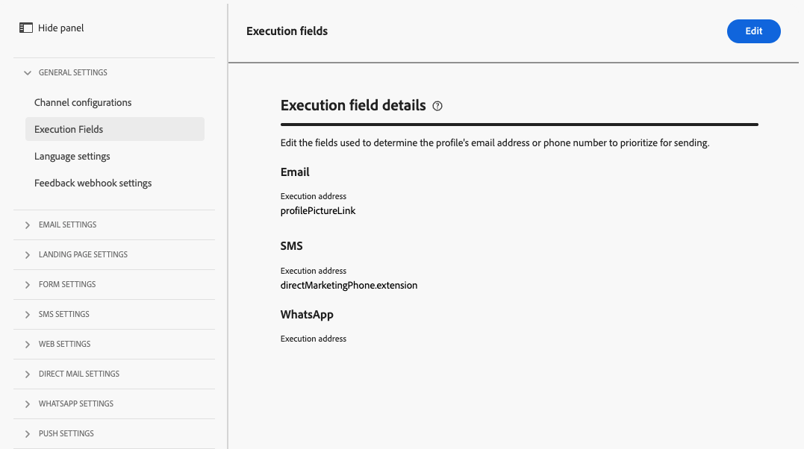

# Prise en main de la configuration du canal e-mail {#get-starte-email-config}

Pour envoyer des e-mails par le biais de parcours et de campagnes dans [!DNL Journey Optimizer], vous devez passer par plusieurs étapes de configuration.

1. Pour garantir une délivrabilité optimale et protéger votre réputation, commencez par déléguer à Adobe les sous-domaines que vous allez utiliser pour envoyer vos e-mails avec [!DNL Journey Optimizer]. Ces sous-domaines déterminent des éléments tels que les pages web à suivre et les URL de page miroir. [En savoir plus](../configuration/about-subdomain-delegation.md)

   

1. Améliorez la délivrabilité et la réputation de vos e-mails en regroupant les adresses IP configurées avec votre instance. [En savoir plus](../configuration/ip-pools.md)

   

1. Créez des surfaces de canal et sélectionnez le canal **[!UICONTROL E-mail]**. [En savoir plus](../configuration/channel-surfaces.md)

   

1. Dans chaque surface de canal e-mail, configurez tous les paramètres techniques requis pour diffuser les e-mails. [En savoir plus](email-settings.md)

   * C’est là que vous sélectionnez le sous-domaine à utiliser pour envoyer les e-mails et les pools d’adresses IP à associer à la surface. [En savoir plus](email-settings.md#subdomains-and-ip-pools)

   

   * Les adresses **[!UICONTROL e-mail expéditeur]** et **[!UICONTROL e-mail d’erreur]** doivent utiliser le sous-domaine délégué actuellement sélectionné. [En savoir plus](email-settings.md#email-header)

   

1. Déterminez l&#39;adresse e-mail à utiliser en priorité pour vos destinataires lorsque plusieurs adresses sont disponibles dans Adobe Experience Platform. [En savoir plus](../configuration/primary-email-addresses.md)

   

1. Gérez le nombre de jours pendant lesquels de nouvelles tentatives sont effectuées avant d&#39;envoyer des adresses électroniques à la liste de suppression. [En savoir plus](../configuration/manage-suppression-list.md)

   
