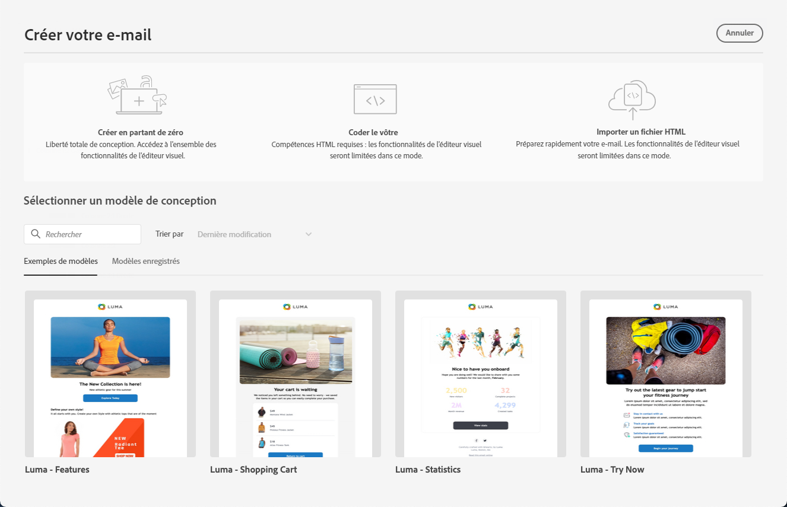
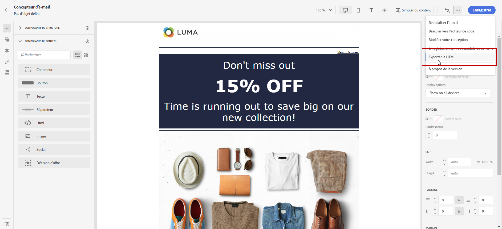

# Commencer la conception d’e-mails {#get-started-content-design}

Pour accéder au Concepteur d’e-mail et commencer à concevoir le contenu de votre e-mail, vous devez d’abord [créer un e-mail](create-email.md) dans un parcours ou une campagne.

Vous pouvez ensuite utiliser les **fonctionnalités de conception d’e-mail** de [!DNL Journey Optimizer] pour importer du contenu existant ou commencer à créer des e-mails réactifs à partir de zéro. [En savoir plus](content-from-scratch.md)

Le Concepteur d’e-mail vous permet également d’effectuer les opérations suivantes :

* Utiliser **Adobe Experience Manager Assets Essentials** pour enrichir vos e-mails, créer et gérer votre propre base de données de ressources. [En savoir plus](../integrations/assets.md)

* Rechercher des **photos Adobe Stock** pour créer votre contenu et améliorer votre conception d’e-mail. [En savoir plus](../integrations/stock.md)

* Améliorez l’expérience des clients en créant des messages dynamiques personnalisés en fonction de leurs attributs de profil. En savoir plus sur [Personnalisation](../personalization/personalize.md) et [Contenu dynamique](../personalization/get-started-dynamic-content.md).

➡️ [Découvrez cette fonctionnalité en vidéo.](#video)

## Étapes clés de création de contenu d’e-mail {#key-steps}

Une fois que vous avez créé un e-mail, vous pouvez commencer à créer son contenu.

1. Dans l’écran de configuration des parcours ou des campagnes, parcourez l’écran **[!UICONTROL Modifier le contenu]** pour accéder au concepteur d’e-mail. [En savoir plus](create-email.md#define-email-content)

   

1. Dans la page d’accueil du concepteur d’e-mail, choisissez la manière de concevoir votre e-mail à l’aide des options suivantes :

   * **Concevez votre e-mail à partir de zéro** dans lʼinterface du concepteur d’e-mail et utilisez les images provenant dʼ[Adobe Experience Manager Assets](../integrations/assets.md). Découvrez comment concevoir le contenu des e-mails dans [cette section](content-from-scratch.md).

   * **Codez ou collez du code HTML brut** directement dans le concepteur d’e-mail. Découvrez comment coder votre propre contenu dans [cette section](code-content.md).

     >[!NOTE]
     >
     >Dans une campagne, vous pouvez également sélectionner le bouton **[!UICONTROL Éditeur de code]** à partir de l’écran **[!UICONTROL Modifier le contenu]** écran. [En savoir plus](create-email.md#define-email-content)

   * **Importez du contenu HTML existant** à partir d’un fichier ou d’un dossier .zip. Découvrez comment importer un contenu d’e-mail dans [cette section](existing-content.md).

   * **Convertissez des conceptions d’image en modèles HTML** à l’aide du convertisseur d’images en HTML optimisé par l’IA. Découvrez comment transformer des images statiques en modèles d’e-mail modifiables dans [cette section](image-to-html.md).

   * **Sélectionnez un contenu existant** à partir d’une liste de modèles intégrés ou personnalisés. Découvrez comment utiliser des modèles d’e-mail dans [cette section](../email/use-email-templates.md).

   

1. Une fois que le contenu de votre e-mail a été défini et personnalisé, vous pouvez exporter votre contenu pour le valider ou pour l’utiliser ultérieurement. Cliquez sur **[!UICONTROL Exporter le HTML]** pour enregistrer sur votre ordinateur un fichier zip qui contiendra votre HTML et vos ressources.

   

1. Vous pouvez également valider la qualité de votre contenu pour identifier les problèmes potentiels de lisibilité, de cohésion du contenu et d’efficacité. [En savoir plus sur la validation de la qualité du contenu](../content-management/brands-score.md#validate-quality)

## Bonnes pratiques en matière de conception d’e-mail {#best-practices}

Lors de l’envoi d’e-mails, il est important de tenir compte du fait que les destinataires peuvent les transférer, ce qui peut parfois entraîner des problèmes de rendu de l’e-mail. Vous risquez de rencontrer ces problèmes si vous utilisez des classes CSS non prises en charge par le fournisseur de messagerie utilisé pour le transfert, comme « is-desktop-hidden », par exemple, pour masquer une image sur les appareils mobiles.

Pour minimiser ces problèmes de rendu, nous vous recommandons de garder votre structure de conception d’e-mail aussi simple que possible. Essayez d’utiliser une conception unique qui fonctionne aussi bien pour les ordinateurs de bureau et les appareils mobiles, et évitez d’utiliser des classes CSS complexes ou d’autres éléments de conception qui ne sont pas entièrement pris en charge par tous les clients de messagerie. En suivant ces bonnes pratiques, vous aurez l’assurance que vos e-mails sont correctement rendus, quelle que soit la manière dont ils sont affichés ou transférés par les destinataires.

Consultez le tableau ci-dessous pour connaître les bonnes pratiques en matière de conception d’e-mail :

| Recommandé | À utiliser avec précaution | Non recommandé |
|-|-|-|
| <ul><li><b>Mises en page statiques, basées sur des tableaux</b> pour la structure</li> <li><b>Tableaux HTML et tableaux imbriqués</b> pour la cohérence de la mise en page</li> <li><b>Largeurs des modèles</b> comprises entre 600 px et 800 px </li> <li><b>CSS simples et intégrées</b> pour le style </li> <li><b>Polices compatibles web</b> pour une conformité universelle</li> | <ul><li>Les <b>images d’arrière-plan</b> peuvent ne pas apparaître sur certaines plateformes de messagerie.</li><li>Les <b>polices web personnalisées</b> ne profitent pas d’une prise en charge universelle.</li><li>Les <b>mises en page larges</b> peuvent mal s’afficher sur de petits écrans.</li><li>Les <b>zones cliquables</b> offrent des fonctionnalités limitées.</li><li>Les <b>CSS incorporées</b> sont parfois supprimées lors de la diffusion des e-mails.</li> | <ul><li>Le code <b>JavaScript</b> n’est généralement pas pris en charge dans les environnements de messagerie.</li> <li> Les balises <b>`<iframe>`</b> sont bloquées sur la plupart des plateformes. </li> <li>Les éléments <b>Flash</b> sont obsolètes et ne sont plus pris en charge.</li> <li>Les <b>fichiers audio intégrés</b> provoquent souvent un blocage.</li> <li>Les <b>vidéos intégrées</b> sont incompatibles avec de nombreuses plateformes de messagerie.</li> <li> Les <b>formulaires</b> ne fonctionnent pas dans les e-mails.</li> <li> La superposition `
` peut entraîner des problèmes de rendu.</li> |

>[!NOTE]
>
>La [loi européenne sur l’accessibilité](https://eur-lex.europa.eu/legal-content/FR/TXT/?uri=CELEX%3A32019L0882){target="_blank"} stipule que toutes les communications numériques doivent être accessibles. Outre les bonnes pratiques de conception d’e-mails présentées dans cette section, veillez également à suivre les recommandations figurant sur [cette page](accessible-content.md), dédiées à la création de contenu accessible avec le Concepteur d’e-mail.

## Vidéos pratiques {#video}

Découvrez comment créer du contenu d’e-mail avec l’éditeur de messages.

>[!VIDEO](https://video.tv.adobe.com/v/334150?quality=12)

Découvrez comment configurer des expériences de contenu pour un test AB et explorer le contenu d’e-mail qui répond le mieux aux objectifs de votre entreprise.

>[!VIDEO](https://video.tv.adobe.com/v/3419893)
