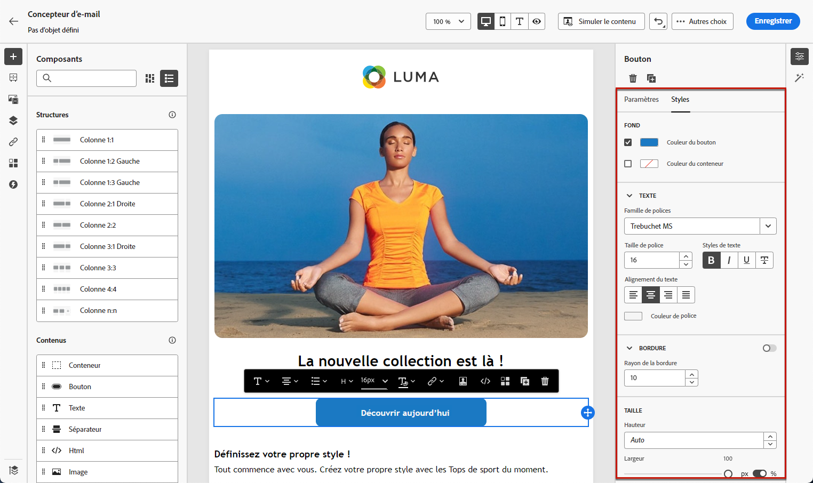

# Prise en main du style des e-mails {#get-started-email-style}

Une fois que vous avez commencé à créer le contenu de votre e-mail dans [!DNL Journey Optimizer], vous pouvez ajuster un certain nombre de paramètres et d’attributs de style dans le volet **[!UICONTROL Styles]** du concepteur d’e-mail.

Vous pouvez appliquer vos modifications au corps de l’e-mail, à un composant de structure ou à un composant de contenu.

Suivez les liens ci-dessous pour découvrir comment ajuster certains des paramètres de style de votre e-mail.

* Découvrez comment [personnaliser l’arrière-plan de votre e-mail](backgrounds.md).
* Découvrez comment [gérer l’alignement vertical et la marge intérieure](alignment-and-padding.md).
* Découvrez comment [personnaliser des attributs de style intégrés](inline-styling.md).
* Découvrez comment [ajouter du code CSS personnalisé au contenu de votre e-mail](custom-css.md).
* Découvrez comment [gérer le contenu en mode sombre](dark-mode.md).

>[!NOTE]
>
>La [loi européenne sur l’accessibilité](https://eur-lex.europa.eu/legal-content/FR/TXT/?uri=CELEX%3A32019L0882){target="_blank"} stipule que toutes les communications numériques doivent être accessibles. Veillez à suivre les directives de style spécifiques répertoriées sur [cette page](../email/accessible-content.md) lorsque vous concevez du contenu dans [!DNL Journey Optimizer], par exemple pour le réglage des couleurs, des libellés et des icônes afin de garantir la clarté, ainsi que lorsque vous optimisez votre conception pour les dispositions mobiles et réactives.