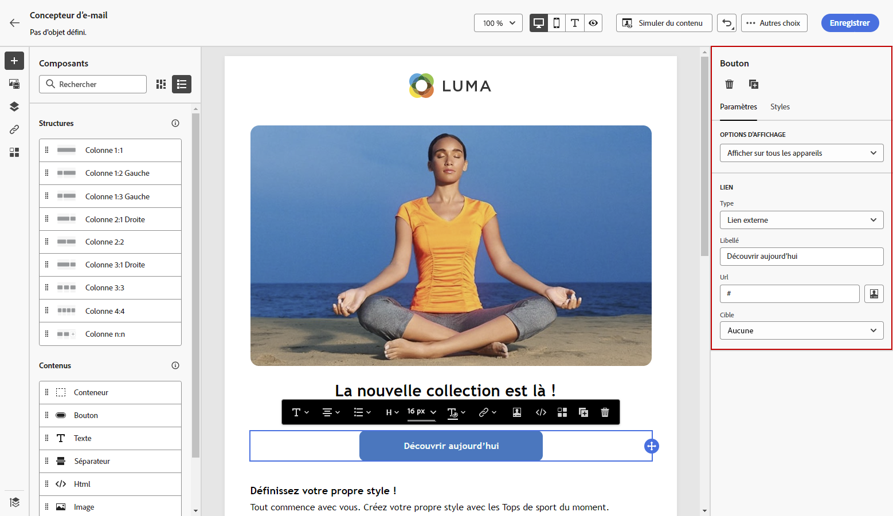

# Prise en main du style de contenu des emails {#get-started-email-style}

Une fois que vous avez commencé à créer le contenu de votre email dans [!DNL Journey Optimizer], vous pouvez ajuster un certain nombre de paramètres et d’attributs de style dans le volet Paramètres du Concepteur d’email .

Vous pouvez appliquer vos modifications au corps de l&#39;email, à un composant de structure ou à un composant de contenu.

Suivez les liens ci-dessous pour découvrir comment ajuster certains des paramètres de style de votre email.

* Découvrez comment [personnaliser l&#39;arrière-plan de votre email](backgrounds.md)
* Découvrez comment [gérer l&#39;alignement vertical et la marge intérieure ;](alignment-and-padding.md)
* Découvrez comment [définir un style pour les liens de votre email ;](styling-links.md)
* Découvrez comment [personnaliser les attributs de style intégrés ;](inline-styling.md)