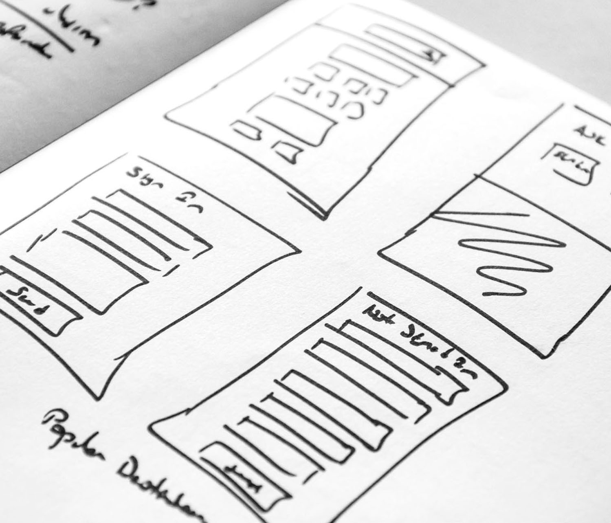

# Commencer avec les e-mails {#get-started-email}

>[!CONTEXTUALHELP]
>id="ajo_homepage_card4"
>title="Concevoir des e-mails"
>abstract="Utilisez **Adobe Journey Optimizer** pour envoyer des e-mails à vos clientes et clients. Vous pouvez créer, personnaliser et prévisualiser des messages dans le concepteur d’e-mail."

Utilisez [!DNL Journey Optimizer] pour envoyer des e-mails à vos client(e)s. Vous pouvez créer, personnaliser et prévisualiser des messages dans le concepteur d’e-mail.

Les diffusions d’e-mails peuvent être créées :

* Dans un **parcours** : une fois que vous avez ajouté une activité **[!UICONTROL E-mail]** dans votre parcours et défini les paramètres de base, utilisez le volet de droite **[!UICONTROL Actions : e-mail]** pour créer le contenu du message. [Découvrez comment créer un parcours.](../building-journeys/journey-gs.md)

* Dans une **campagne** : une fois que vous avez créé une campagne, sélectionnez **[!UICONTROL E-mail]** comme action et définissez les paramètres de base. [Découvrir comment créer une campagne](../campaigns/create-campaign.md#configure)

>[!IMPORTANT]
>
>Si c’est la première fois que vous créez un e-mail, vérifiez que le canal e-mail a été configuré. [En savoir plus](email-settings.md)

<table style="table-layout:fixed"><tr style="border: 0;">
<td>

<a href="create-email.md"><strong>Créer un e-mail</strong>

</td>
<td>

<a href="get-started-email-design.md"><strong>Concevoir un e-mail</strong></a>

</td>
<td>

<a href="email-opt-out.md"><strong>Gestion du processus de désinscription aux e-mails</strong></a>

</td>
<td>

<a href="email-settings.md"><strong>Configurer le canal E-mail</strong></a>

</td>
</tr></table>

<table style="table-layout:fixed"><tr style="border: 0;">
<td>

<a href="../content-management/generative-email.md"><strong>Assistant AI pour la génération de contenu</strong>

</td>
<td>

<a href="../content-management/fragments.md"><strong>Utiliser des fragments de contenu d’e-mail</strong></a>

</td>
<td>

<a href="../personalization/personalize.md"><strong>Personnaliser le contenu de votre e-mail</strong></a>

</td>
<td>

<a href="../integrations/assets.md"><strong>Combiner les applications et solutions Adobe</strong></a>

</td>
</tr></table>
