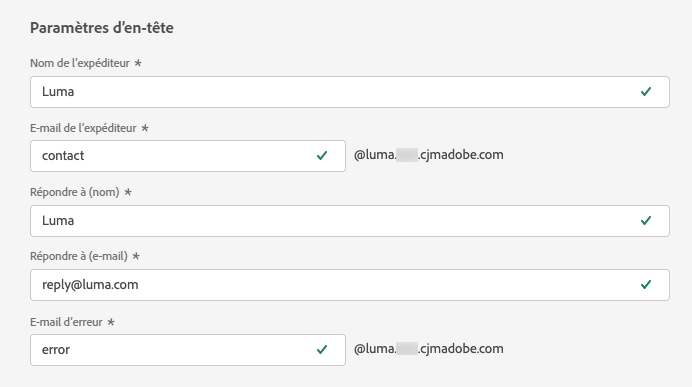

# Paramètres d’en-tête {#email-header}

Lors de la configuration d’une nouvelle [configuration du canal e-mail](email-settings.md), dans la section **[!UICONTROL Paramètres d’en-tête]**, saisissez les noms d’expéditeur ou d’expéditrice et les adresses e-mail associées au type d’e-mails envoyés à l’aide de cette configuration.

>[!NOTE]
>
>Pour un contrôle accru des paramètres d’e-mail, vous pouvez personnaliser les paramètres d’en-tête. [En savoir plus](../email/surface-personalization.md#personalize-header)

* **[!UICONTROL Nom de l’expéditeur ou de l’expéditrice]** : nom de l’expéditeur ou de l’expéditrice, tel que le nom de votre marque.
* **[!UICONTROL Préfixe d’e-mail d’expéditeur]** : adresse e-mail à utiliser pour vos communications.
* **[!UICONTROL Répondre à (nom)]** : nom qui est utilisé lorsque le ou la destinataire clique sur le bouton **Répondre** de son logiciel de messagerie.
* **[!UICONTROL Répondre à (e-mail)]** : adresse e-mail qui est utilisée lorsque le ou la destinataire clique sur le bouton **Répondre** de son logiciel de messagerie. [En savoir plus](#reply-to-email)
* **[!UICONTROL Préfixe d’e-mail d’erreur]** : toutes les erreurs générées par les FAI après quelques jours de diffusion de l’e-mail (rebonds asynchrones) sont reçues à cette adresse. Les notifications d’absence du bureau et les réponses de défi sont également reçues à cette adresse.

  Si vous souhaitez recevoir les notifications d’absence du bureau et demander des réponses de défi à une adresse e-mail spécifique qui n’est pas déléguée à Adobe, vous devez configurer un [processus de transfert](#forward-email). Dans ce cas, veillez à mettre en place une solution manuelle ou automatisée pour traiter les e-mails arrivant dans cette boîte de réception.

>[!NOTE]
>
>Les adresses **[!UICONTROL Préfixe d’e-mail d’expéditeur]** et **[!UICONTROL Préfixe d’e-mail d’erreur]** utilisent le [sous-domaine délégué](../configuration/about-subdomain-delegation.md) actuellement sélectionné pour envoyer l’e-mail. Par exemple, si le sous-domaine délégué est *marketing.luma.com* :
>
>* Saisissez *contact* comme **[!UICONTROL Préfixe d’e-mail d’expéditeur]** : l’e-mail de l’expéditeur est *contact@marketing.luma.com*.
>* Saisissez *erreur* comme **[!UICONTROL préfixe d’e-mail d’erreur]** : l’adresse d’erreur est *error@marketing.luma.com*.

{width="80%"}

>[!NOTE]
>
>Les adresses doivent commencer par une lettre (A-Z) et ne peuvent contenir que des caractères alphanumériques. Vous pouvez également utiliser le trait de soulignement `_`, le point`.` et le trait dʼunion `-`.

## Adresse e-mail de réponse {#reply-to-email}

Lors de la définition de l’adresse **[!UICONTROL Répondre à (e-mail)]**, vous pouvez indiquer toute adresse e-mail à condition qu’il s’agisse d’une adresse valide, au format approprié et sans erreur de frappe.

La boîte de réception utilisée pour les réponses recevra tous les e-mails de réponse, à l’exception des notifications d’absence du bureau et des réponses de défi, qui sont reçues à l’adresse **E-mail d’erreur**.

Pour assurer une bonne gestion des réponses, procédez comme suit :

* Assurez-vous que la boîte de réception dédiée dispose de suffisamment de capacité pour recevoir tous les e-mails de réponse envoyés à l’aide de la configuration du canal e-mail. Si la boîte de réception renvoie des rebonds, il se peut que certaines réponses de vos clients ne soient pas reçues.

* Les réponses doivent être traitées en tenant compte des obligations de confidentialité et de conformité, car elles peuvent contenir des données à caractère personnel (PII).

* Ne marquez pas les messages comme spam dans la boîte de réception de réponse, car cela aura un impact sur tous les autres e-mails envoyés à cette adresse.

En outre, lors de la définition de l’adresse **[!UICONTROL Répondre à (e-mail)]**, veillez à utiliser un sous-domaine possédant une configuration d’enregistrement MX valide, sinon le traitement de la configuration du canal e-mail échouera.

Si vous obtenez une erreur lors de l’envoi de la configuration du canal e-mail, cela signifie que l’enregistrement MX n’est pas configuré pour le sous-domaine de l’adresse que vous avez saisie. Contactez votre administrateur ou administratrice pour configurer l’enregistrement MX correspondant ou utilisez une autre adresse avec une configuration d’enregistrement MX valide.

>[!NOTE]
>
>Si le sous-domaine de l’adresse que vous avez saisie est un domaine qui a été [entièrement délégué](../configuration/delegate-subdomain.md#set-up-subdomain) à Adobe, contactez votre représentant ou représentante Adobe.

## Transférer un e-mail {#forward-email}

Pour transférer vers une adresse e-mail spécifique tous les e-mails reçus par [!DNL Journey Optimizer] pour le sous-domaine délégué, contactez l’Assistance clientèle d’Adobe.

>[!NOTE]
>
>Si le sous-domaine utilisé pour l’adresse **[!UICONTROL Répondre à (e-mail)]** n’est pas délégué à Adobe, le transfert ne peut pas fonctionner pour cette adresse.

Vous devrez fournir les éléments suivants :

* Adresse e-mail de transfert de votre choix. Notez que le domaine de l’adresse e-mail de transfert ne peut correspondre à aucun sous-domaine délégué à Adobe.
* Nom de votre sandbox.
* Nom de la configuration ou du sous-domaine pour qui l’adresse e-mail de transfert sera utilisée.
  <!--* The current **[!UICONTROL Reply to (email)]** address or **[!UICONTROL Error email]** address set at the channel configuration level.-->

>[!NOTE]
>
>Il ne peut y avoir qu’une seule adresse e-mail de transfert par sous-domaine. Par conséquent, si plusieurs configurations utilisent le même sous-domaine, la même adresse e-mail de transfert doit être utilisée pour tous les sous-domaines.

L’adresse e-mail de transfert sera configurée par Adobe. Cela peut prendre 3 à 4 jours.

Une fois cette opération terminée, tous les messages reçus aux adresses **[!UICONTROL Répondre à (e-mail)]** et **E-mail d’erreur**, ainsi que tous les e-mails envoyés à l’adresse **E-mail d’expéditeur**, sont transférés à l’adresse e-mail spécifique que vous avez fournie.

>[!NOTE]
>
>Par défaut, si le transfert n’est pas activé, les e-mails envoyés directement à l’adresse **E-mail d’expéditeur** sont ignorés.
