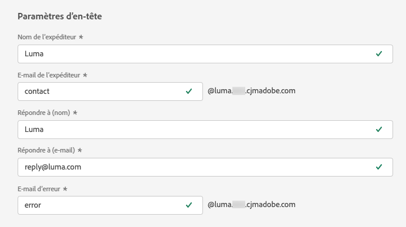
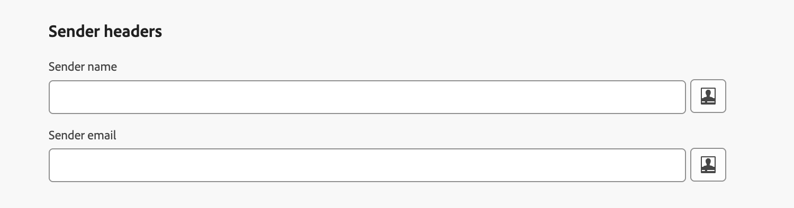

# Paramètres d’en-tête {#email-header}

Lors de la configuration d’une nouvelle [configuration du canal e-mail](email-settings.md), dans la section **[!UICONTROL Paramètres d’en-tête]**, saisissez les noms d’expéditeur ou d’expéditrice et les adresses e-mail associées au type d’e-mails envoyés à l’aide de cette configuration.

>[!NOTE]
>
>Pour un contrôle accru des paramètres d’e-mail, vous pouvez personnaliser les paramètres d’en-tête. [En savoir plus](../email/surface-personalization.md#personalize-header)
>
>Lors de la [ modification d’une configuration d’e-mail](../configuration/channel-surfaces.md#edit-channel-surface) vous ne pouvez pas ajouter de nouveaux [attributs de profil](../personalization/personalization-build-expressions.md#sources) aux paramètres d’en-tête. Vous devez créer une configuration de canal.

* **[!UICONTROL Nom de l’expéditeur ou de l’expéditrice]** : nom de l’expéditeur ou de l’expéditrice, tel que le nom de votre marque.

* **[!UICONTROL Préfixe d’e-mail d’expéditeur]** : adresse e-mail à utiliser pour vos communications.

* **[!UICONTROL Répondre à (nom)]** : nom qui est utilisé lorsque le ou la destinataire clique sur le bouton **Répondre** de son logiciel de messagerie.

* **[!UICONTROL Répondre à (e-mail)]** : adresse e-mail qui est utilisée lorsque le ou la destinataire clique sur le bouton **Répondre** de son logiciel de messagerie. [En savoir plus](#reply-to-email)

* **[!UICONTROL Préfixe d’e-mail d’erreur]** : toutes les erreurs générées par les FAI après quelques jours de diffusion de l’e-mail (rebonds asynchrones) sont reçues à cette adresse. Les notifications d’absence du bureau et les réponses de défi sont également reçues à cette adresse.

  Si vous souhaitez recevoir les notifications d’absence du bureau et demander des réponses de défi à une adresse e-mail spécifique qui n’est pas déléguée à Adobe, vous devez configurer un [processus de transfert](#forward-email). Dans ce cas, veillez à mettre en place une solution manuelle ou automatisée pour traiter les e-mails arrivant dans cette boîte de réception.

>[!NOTE]
>
>Les adresses **[!UICONTROL Préfixe d’e-mail d’expéditeur]** et **[!UICONTROL Préfixe d’e-mail d’erreur]** utilisent le [sous-domaine délégué](../configuration/about-subdomain-delegation.md) actuellement sélectionné pour envoyer l’e-mail. Par exemple, si le sous-domaine délégué est *marketing.luma.com* :
>
>* Saisissez *contact* comme **[!UICONTROL Préfixe d’e-mail d’expéditeur]** : l’e-mail de l’expéditeur est *contact@marketing.luma.com*.
>* Saisissez *erreur* comme **[!UICONTROL préfixe d’e-mail d’erreur]** : l’adresse d’erreur est *error@marketing.luma.com*.

{width="80%"}

>[!NOTE]
>
>Pour **[!UICONTROL Préfixe d’e-mail de l’expéditeur]** et **[!UICONTROL Préfixe d’e-mail d’erreur]**, les valeurs doivent commencer par une lettre (A-Z) et ne peuvent contenir que des caractères alphanumériques. Vous pouvez également utiliser des `_` de soulignement, des `.` de point et des tirets `-`.

## En-têtes de l’expéditeur ou de l’expéditrice {#sender-header}

>[!CONTEXTUALHELP]
>id="ajo_admin_preset_sender_header"
>title="En-têtes de l’expéditeur ou de l’expéditrice"
>abstract="Utilisez ces champs facultatifs lorsque l’entité émettrice (expéditeur ou expéditrice) diffère de l’entité de création (De), par exemple un parent d’entreprise envoyant des messages pour une marque enfant ou une agence envoyant des messages pour plusieurs clientes et clients. Les clients de messagerie qui prennent en charge cette fonctionnalité l’affichent généralement sous la forme « Expéditeur ou expéditrice de la part de » ou affichent un indicateur « via »."

Certains cas d’utilisation nécessitent que la boîte aux lettres qui transmet le message soit différente de l’auteur **De** ; par exemple, une organisation parente qui envoie pour le compte d’une filiale, une équipe marketing partagée pour plusieurs marques ou une agence qui envoie pour plusieurs clients.

En d’autres termes, **De** est l’auteur du message (de qui l’e-mail provient) et **Expéditeur** est l’agent responsable de la transmission du message (qui l’a effectivement envoyé). Le champ **Expéditeur** est destiné à être utilisé lorsque l’entité de transmission est différente de l’auteur.

Dans ce cas, vous pouvez définir un nom et une adresse e-mail **Expéditeur** différents à ajouter à l’en-tête de l’e-mail à l’aide des champs suivants de la section **En-têtes de l’expéditeur** :

* **[!UICONTROL Nom de l’expéditeur]** : le nom de la partie responsable de la transmission du message lorsqu’il diffère de l’auteur **De**.

* **[!UICONTROL E-mail de l’expéditeur]** : adresse e-mail de la partie émettrice.

{width="80%"}

>[!NOTE]
>
>Ces champs sont facultatifs. Vous pouvez les [personnaliser](surface-personalization.md#personalize-header) comme les autres champs d’en-tête.

Lorsque les paramètres **[!UICONTROL Nom de l’expéditeur]** et **[!UICONTROL E-mail de l’expéditeur]** sont définis, [!DNL Journey Optimizer] ajoute un en-tête SMTP **Expéditeur** à l’e-mail<!--as defined in [RFC 5322](https://datatracker.ietf.org/doc/html/rfc5322#section-3.6.2){target="_blank"}-->. Les clients de messagerie qui prennent en charge cette fonctionnalité peuvent afficher un libellé tel que **Expéditeur pour le compte de l’expéditeur** ou un indicateur **via**.

>[!NOTE]
>
>Si vous laissez les champs **[!UICONTROL Nom de l’expéditeur]** et **[!UICONTROL E-mail de l’expéditeur]** vides ou si l’en-tête **Expéditeur** résolu est identique à **De**, aucun en-tête **Expéditeur** n’est ajouté.

Remarques :

* L’adresse **Expéditeur** n’est pas utilisée pour l’alignement SPF, DKIM ou DMARC ; seule la validation **format** est effectuée. SPF, DKIM et DMARC continuent de s’appuyer sur les champs **De**. Le [sous-domaine délégué](../configuration/about-subdomain-delegation.md) sélectionné pour la configuration reste le domaine d’envoi utilisé pour ces vérifications.

* Si **Expéditeur** est configuré et que la personnalisation ne correspond pas à une valeur pour un destinataire, le message n’est pas remis à ce destinataire.

## Adresse e-mail de réponse {#reply-to-email}

Lors de la définition de l’adresse **[!UICONTROL Répondre à (e-mail)]**, vous pouvez indiquer toute adresse e-mail à condition qu’il s’agisse d’une adresse valide, au format approprié et sans erreur de frappe.

La boîte de réception utilisée pour les réponses recevra tous les e-mails de réponse, à l’exception des notifications d’absence du bureau et des réponses de défi, qui sont reçues à l’adresse **E-mail d’erreur**.

Pour assurer une bonne gestion des réponses, procédez comme suit :

* Assurez-vous que la boîte de réception dédiée dispose de suffisamment de capacité pour recevoir tous les e-mails de réponse envoyés à l’aide de la configuration du canal e-mail. Si la boîte de réception renvoie des rebonds, il se peut que certaines réponses de vos clients ne soient pas reçues.

* Les réponses doivent être traitées en tenant compte des obligations de confidentialité et de conformité, car elles peuvent contenir des données à caractère personnel (PII).

* Ne marquez pas les messages comme spam dans la boîte de réception de réponse, car cela aura un impact sur tous les autres e-mails envoyés à cette adresse.

En outre, lors de la définition de l’adresse **[!UICONTROL Répondre à (e-mail)]**, veillez à utiliser un sous-domaine possédant une configuration d’enregistrement MX valide, sinon le traitement de la configuration du canal e-mail échouera.

Si vous obtenez une erreur lors de l’envoi de la configuration du canal e-mail, cela signifie que l’enregistrement MX n’est pas configuré pour le sous-domaine de l’adresse que vous avez saisie. Contactez votre administrateur ou administratrice pour configurer l’enregistrement MX correspondant ou utilisez une autre adresse avec une configuration d’enregistrement MX valide.

>[!NOTE]
>
>Si le sous-domaine de l’adresse que vous avez saisie est un domaine qui a été [entièrement délégué](../configuration/delegate-subdomain.md#set-up-subdomain) à Adobe, contactez votre représentant ou représentante Adobe.

## Transférer un e-mail {#forward-email}

Pour transférer vers une adresse e-mail spécifique tous les e-mails reçus par [!DNL Journey Optimizer] pour le sous-domaine délégué, contactez l’Assistance clientèle d’Adobe.

>[!NOTE]
>
>Si le sous-domaine utilisé pour l’adresse **[!UICONTROL Répondre à (e-mail)]** n’est pas délégué à Adobe, le transfert ne peut pas fonctionner pour cette adresse.

Vous devrez fournir les éléments suivants :

* Adresse e-mail de transfert de votre choix. Notez que le domaine de l’adresse e-mail de transfert ne peut correspondre à aucun sous-domaine délégué à Adobe.
* Nom de votre sandbox.
* Nom de la configuration ou du sous-domaine pour qui l’adresse e-mail de transfert sera utilisée.
  <!--* The current **[!UICONTROL Reply to (email)]** address or **[!UICONTROL Error email]** address set at the channel configuration level.-->

>[!NOTE]
>
>* Il ne peut y avoir qu’une seule adresse e-mail de transfert par sous-domaine. Si plusieurs configurations utilisent le même sous-domaine, la même adresse e-mail de transfert doit être utilisée pour tous les sous-domaines.
>* Si le transfert n’est pas activé, les e-mails envoyés directement à l’adresse **E-mail de l’expéditeur** sont ignorés par défaut.

L’adresse e-mail de transfert sera configurée par Adobe. Cela peut prendre 3 à 4 jours.

Une fois cette opération terminée, tous les messages reçus aux adresses **[!UICONTROL Répondre à (e-mail)]** et **E-mail d’erreur**, ainsi que tous les e-mails envoyés à l’adresse **E-mail d’expéditeur**, sont transférés à l’adresse e-mail spécifique que vous avez fournie.

