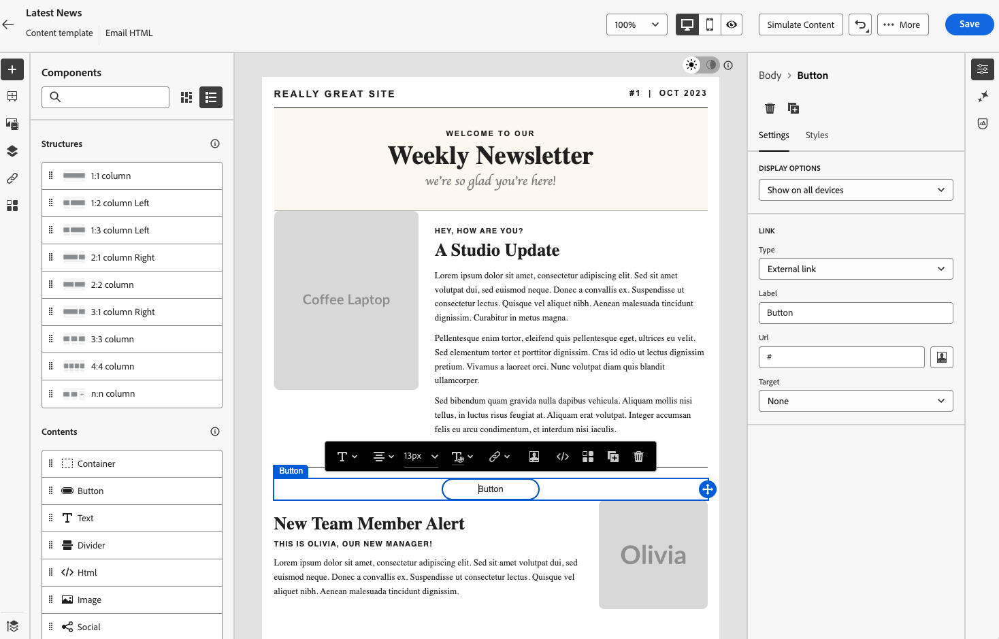

# Convertir des images en modèles HTML avec le convertisseur d’images en HTML {#image-to-html}

## Vue d’ensemble {#overview}

Le convertisseur d’images en HTML est une fonctionnalité innovante optimisée par l’IA disponible dans le menu **Modèles de contenu** qui accélère considérablement la création d’e-mails en convertissant des conceptions d’image statiques en modèles de contenu d’e-mail HTML entièrement modulaires et personnalisables. Cet outil sans code permet aux responsables marketing de transformer les conceptions visuelles des concepteurs graphiques ou des outils de conception en modèles d’e-mail réactifs et modifiables qui peuvent être enregistrés dans la bibliothèque de modèles de contenu, puis réutilisés dans plusieurs parcours et campagnes, sans avoir à recourir à une expertise technique.

>[!AVAILABILITY]
>
>Cette fonctionnalité est en disponibilité limitée. Contactez votre représentant ou représentante Adobe pour en obtenir l’accès.

Grâce à la technologie d’IA générative, le convertisseur d’images en HTML analyse la disposition, la typographie, les couleurs et les éléments visuels de votre image et génère un code HTML propre et modulaire qui conserve la fidélité de la conception tout en garantissant une modifiabilité et une compatibilité complètes avec le concepteur d’e-mail. Cela élimine le processus manuel et long de conversion des modèles en HTML et réduit la dépendance aux ressources de développement.

**Principaux avantages :**

* **Conception en HTML en quelques minutes** : une conversion sans code optimisée par l’IA transforme les images statiques en modèles modifiables et modulaires en quelques minutes, ce qui réduit considérablement le temps de création des modèles.
* **Accessible aux utilisateurs et utilisatrices n’ayant pas de connaissances techniques** : réduit la dépendance envers les équipes de conception ou de développement. Les responsables marketing peuvent générer et personnaliser des modèles avec un minimum de connaissances techniques.
* **Migration simplifiée de la plateforme** : convertissez facilement des modèles ou des conceptions externes d’autres plateformes en HTML compatibles avec AJO
* **Création d’une bibliothèque de modèles réutilisable** : créez une bibliothèque de modèles évolutive et cohérente, qui peut être utilisée dans plusieurs parcours et campagnes.
* **Fidélité de conception** : conservez la cohérence visuelle avec votre conception d’origine tout en créant du contenu entièrement modifiable.
* **Compatibilité des e-mails** : générez un HTML qui fonctionne facilement avec le concepteur d’e-mail et les clients de messagerie.

## Cas d’utilisation courants {#use-cases}

Le convertisseur d’images en HTML est idéal pour :

* **Migration de plateforme** : vous effectuez une migration depuis une autre plateforme de marketing par e-mail ? Convertissez vos conceptions d’e-mail existantes en modèles HTML compatibles avec AJO sans repartir de zéro.
* **Conversion de modèles de conception** : transformez des odèles de conception à partir d’outils tels que Photoshop, Figma ou d’autres logiciels de conception en modèles d’e-mail fonctionnels.
* **Création rapide de modèles** : générez rapidement des modèles d’e-mail pour les campagnes urgentes, sans attendre les ressources de développement.
* **Création de bibliothèques de modèles** : créez une bibliothèque complète de modèles cohérents avec la marque que les membres de l’équipe non techniques peuvent personnaliser et déployer.
* **Réduction des dépendances techniques** : permettez aux responsables marketing de créer et d’itérer indépendamment sur des modèles d’e-mail, ce qui accélère l’exécution des campagnes.

## Conditions préalables {#prerequisites}

Avant d’utiliser le convertisseur d’images en HTML, vérifiez que vous disposez des éléments suivants :

* Accès à Adobe Journey Optimizer avec le concepteur d’e-mail
* Fichier image au format JPEG ou PNG contenant votre conception d’e-mail
* Disponibilité limitée de l’accès au convertisseur d’image en HTML (contactez votre représentant ou représentante Adobe)

>[!NOTE]
>
>Pour de meilleurs résultats, utilisez des images de haute qualité avec des éléments visuels clairs et du texte lisible. La largeur des images doit idéalement être comprise entre 600 et 800 pixels pour correspondre aux dimensions d’e-mail standard.

## Convertir une image en modèle HTML {#convert-image}

Pour convertir une conception d’image en modèle d’e-mail HTML entièrement personnalisable, procédez comme suit :

1. Accédez à la liste des modèles de contenu en sélectionnant **[!UICONTROL Gestion de contenu]** > **[!UICONTROL Modèles de contenu]** dans le menu de gauche.

1. Cliquez sur **[!UICONTROL Créer un modèle]**.

1. Renseignez les détails du modèle et sélectionnez **[!UICONTROL E-mail]** comme canal, puis cliquez sur **[!UICONTROL Créer]**.

1. Dans la section de droite, dans la section **[!UICONTROL Convertir l’image en modèle]**, cliquez sur le bouton **[!UICONTROL Charger l’image]** pour sélectionner votre fichier image.

   

   >[!CAUTION]
   >
   >Lorsque vous chargez une image pour la conversion, **tout le contenu actuellement ajouté dans l’e-mail sera supprimé et remplacé** par le modèle généré. Si votre e-mail contient du contenu existant, veillez à l’enregistrer avant de poursuivre la conversion de l’image.

1. Sélectionnez l’image et cliquez sur **[!UICONTROL Ouvrir]** pour lancer le processus de conversion optimisé par l’IA.

   >[!NOTE]
   >
   >Le processus de génération peut prendre jusqu’à 5 minutes selon la complexité et la taille de votre conception d’image. Le traitement de l’IA se produit en arrière-plan. Vous pouvez donc quitter cet écran et travailler sur d’autres tâches pendant que la conversion est en cours. Vous n’avez pas besoin de garder l’écran ouvert.

1. Une fois la conversion terminée, votre modèle de contenu est automatiquement enregistré en tant que brouillon. Vous pouvez ensuite vérifier et modifier le modèle HTML généré dans la zone de travail du concepteur d’e-mail.

   

1. Le modèle converti s’ouvre dans le concepteur d’e-mail avec des fonctionnalités de modification complètes. Vous pouvez maintenant :

   * modifier le contenu textuel et appliquer une personnalisation ;
   * modifier des images et ajouter des liens ;
   * ajuster les couleurs, les polices et le style ;
   * ajouter, supprimer ou réorganiser des composants de contenu.
   * tirer profit de toutes les fonctionnalités du concepteur d’e-mail comme pour tout autre modèle.

   

1. Effectuez les ajustements nécessaires pour affiner le modèle et respecter les directives de votre marque.

1. Une fois que votre modèle vous plaît, cliquez sur **[!UICONTROL Enregistrer]** pour enregistrer le modèle de contenu.

1. Votre modèle est maintenant disponible dans la bibliothèque de modèles de contenu et peut être utilisé lors de la création d’e-mails dans des parcours ou des campagnes. [Découvrez comment utiliser les modèles de contenu.](use-email-templates.md)

## Utiliser le modèle converti dans les e-mails {#use-template}

Une fois votre modèle de contenu créé et enregistré, vous pouvez l’utiliser lors de la conception d’e-mails dans des parcours ou des campagnes :

Lors de la création d’un e-mail dans un parcours ou une campagne, accédez au concepteur d’e-mail à partir de l’écran **[!UICONTROL Modifier le contenu]**.

Découvrez comment [utiliser des modèles d’e-mail](use-email-templates.md) et [créer des modèles de contenu](../content-management/content-templates.md).

## Bonnes pratiques {#best-practices}

Pour obtenir des résultats optimaux lors de l’utilisation du convertisseur d’images en HTML, suivez ces recommandations :

**Avant de commencer**

* **Enregistrez le contenu existant** : la conversion d’une image en HTML remplacera tout le contenu existant de votre e-mail. Enregistrez toujours votre travail actuel avant d’utiliser cette fonctionnalité.
* **Planifiez votre workflow** : utilisez le convertisseur d’images en HTML au début du processus de création d’e-mail ou assurez-vous que vous souhaitez remplacer tout le contenu actuel.

**Préparation des images**

* **Résolution** : utilisez des images de haute résolution (au moins 1 200 px de large) pour une meilleure reconnaissance du texte et une meilleure détection des éléments.
* **Clarté** : assurez-vous que le texte est clairement lisible et que les éléments visuels sont bien définis.
* **Largeur** : concevez des images aux largeurs d’e-mail standard (600 à 800 px) pour répondre aux exigences courantes des clients de messagerie
* **Format de fichier** : utilisez le format JPEG ou PNG pour éviter les images compressées ou de faible qualité.
* **Conception complète** : incluez la conception complète d’e-mail dans une seule image, de l’en-tête au pied de page.

**Éléments de conception à prendre en compte**

* **Dispositions simples** : les dispositions plus simples et bien structurées se convertissent avec plus de précision que les conceptions très complexes.
* **Éléments standard** : utilisez des modèles de conception d’e-mail courants (en-tête, sections de corps, CTA, pied de page).
* **Lisibilité du texte** : assurez-vous que le contraste entre le texte et l’arrière-plan est suffisant.
* **Polices compatibles avec le web** : les conceptions qui utilisent des polices compatibles avec le web courantes offriront une meilleure fidélité.
* **Évitez le chevauchement des éléments** : séparez clairement les éléments de conception pour une meilleure reconnaissance de la structure.

**Après la conversion**

* **Vérifiez votre brouillon** : une fois la conversion terminée, votre modèle est automatiquement enregistré en tant que brouillon. Examinez attentivement le HTML généré pour en vérifier la précision.
* **Testez minutieusement** : testez l’e-mail sur différents clients de messagerie et appareils.
* **Affinez manuellement** : effectuez les ajustements nécessaires à l’aide des fonctionnalités de modification complètes du concepteur d’e-mail.
* **Alignement de la marque** : vérifiez que les couleurs, les polices et le style correspondent à vos directives de marque.
* **Personnalisation** : ajoutez du contenu dynamique et des jetons de personnalisation selon les besoins.
* **Accessibilité** : consultez et améliorez les fonctionnalités d’accessibilité si nécessaire.

## Limitations et considérations {#limitations}

Gardez à l’esprit les limitations suivantes lors de l’utilisation du convertisseur d’images en HTML :

* **Interprétation de l’IA** : l’IA génère le HTML en fonction de l’interprétation visuelle de votre image. Les conceptions complexes ou inhabituelles peuvent nécessiter des réglages manuels après la conversion.

* **Précision du texte** : bien que l’IA tente de reconnaître et de reproduire le texte avec précision, vérifiez toujours le contenu du texte et apportez les corrections nécessaires.

* **Contenu dynamique** : le processus de conversion crée un HTML statique en fonction de votre image. Vous devrez ajouter manuellement la personnalisation, le contenu dynamique et le suivi après la conversion.

* **Dispositions complexes** : les conceptions très complexes avec des superpositions complexes, des formes inhabituelles ou des éléments non standard peuvent ne pas se convertir parfaitement. Des conceptions plus simples donnent généralement de meilleurs résultats.

* **Temps de traitement** : le processus de conversion peut prendre jusqu’à 5 minutes selon la complexité et la taille de votre image. Le traitement par l’IA se produit en arrière-plan, ce qui vous permet de travailler sur d’autres tâches sans garder l’écran ouvert. Le modèle est automatiquement enregistré en tant que brouillon une fois la conversion terminée.

* **Disponibilité limitée** : en tant que fonctionnalité en disponibilité limitée, le convertisseur d’images en HTML est régulièrement amélioré. Le fonctionnement et la précision peuvent varier, et vos commentaires permettent d’améliorer la fonctionnalité.

>[!NOTE]
>
>Le convertisseur d’images en HTML est conçu de manière à fournir un point de départ solide pour la création d’e-mails. Le HTML généré doit être examiné et affiné à l’aide du concepteur d’e-mail afin de s’assurer qu’il répond exactement à vos besoins.

## Questions fréquentes {#faq}

+++Qu’advient-il du contenu existant de mon e-mail lorsque j’utilise le convertisseur d’images en HTML ?

Tout le contenu existant de votre e-mail est supprimé et remplacé par le modèle nouvellement généré lorsque vous chargez une image pour la convertir. Assurez-vous d’enregistrer tout contenu important avant d’utiliser cette fonctionnalité. Il est préférable d’utiliser le convertisseur d’images en HTML au début de votre tâche de création d’e-mail.

+++

+++Quels formats de fichiers sont pris en charge ?

Le convertisseur d’images en HTML prend en charge les formats d’images JPEG (.jpg, .jpeg) et PNG (.png).

+++

+++Combien de temps prend le processus de conversion ?

La conversion peut prendre jusqu’à 5 minutes, selon la complexité et la taille de votre image. Le traitement par IA s’effectue en arrière-plan, vous pouvez donc quitter l’application et travailler sur d’autres tâches ; il n’est pas nécessaire de garder la fenêtre ouverte à l’écran. Une fois la conversion terminée, votre fichier est automatiquement enregistré en tant que brouillon pour que vous puissiez l’examiner et le modifier.

+++

+++Puis-je modifier le modèle généré ?

Oui ! Le modèle HTML généré s’ouvre dans le concepteur d’e-mail avec les fonctionnalités d’édition complètes. Vous pouvez modifier tous les aspects du modèle, y compris le texte, les images, le style, la disposition et la structure.

+++

+++Que se passe-t-il si la conversion ne correspond pas exactement à mon projet de conception ?

L’IA fait de son mieux pour interpréter avec précision votre projet de conception, mais des ajustements manuels peuvent être nécessaires. Utilisez le concepteur d’e-mail pour modifier tous les éléments qui nécessitent des ajustements.

+++

+++Puis-je utiliser cette fonctionnalité pour des pages de destination ou d’autres types de contenu ?

Le convertisseur d’images en HTML est actuellement conçu spécifiquement pour les modèles d’e-mails. Pour les autres types de contenu, utilisez les options de conception et d’import standard disponibles dans le concepteur d’e-mail.

+++

+++Ai-je besoin d’autorisations spéciales pour utiliser cette fonctionnalité ?

Le convertisseur d’images en HTML est disponible en disponibilité limitée. Vous avez besoin d’un accès à la disponibilité limitée (contactez votre représentant ou représentante Adobe pour obtenir cet accès) et des autorisations standard du concepteur d’e-mail pour utiliser cette fonctionnalité.

+++

+++Puis-je réutiliser des modèles convertis dans plusieurs campagnes ?

Oui ! Les modèles créés avec le convertisseur d’images en HTML sont automatiquement enregistrés dans la bibliothèque de modèles de contenu. Vous pouvez y accéder et les réutiliser dans n’importe quel e-mail dans vos parcours et campagnes. [En savoir plus](../content-management/content-templates.md)

+++

+++Puis-je l’utiliser pour migrer à partir d’une plateforme ?

Oui ! Le convertisseur d’images en HTML est idéal pour migrer à partir d’autres plateformes de marketing par e-mail. Il vous suffit d’exporter ou d’effectuer des captures d’écran de vos conceptions d’e-mails existantes issues de votre plateforme précédente, et de les convertir en modèles HTML prêts à être utilisés dans AJO sans avoir à les recréer à partir de zéro.

+++

## Rubriques connexes {#related-topics}

* [Commencer avec les modèles de contenu](../content-management/content-templates.md)
* [Créer des modèles de contenu](../content-management/create-content-templates.md)
* [Utiliser des modèles d’e-mail](use-email-templates.md)
* [Commencer la conception d’e-mails](get-started-email-design.md)
* [Importer le contenu de vos e-mails](existing-content.md)
* [Concevoir du contenu en partant de zéro](content-from-scratch.md)

