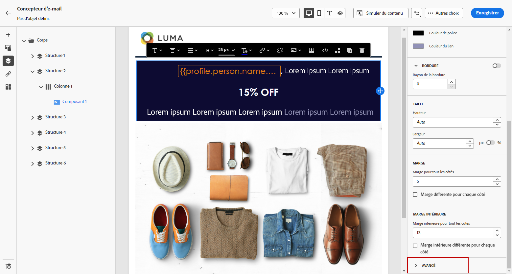
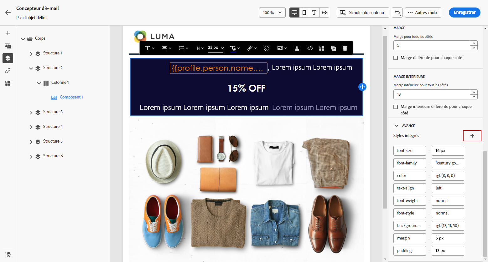

# Ajouter des attributs de style intégrés {#inline-styling}

>[!BEGINSHADEBOX]

**Sur cette page :** découvrez comment appliquer et personnaliser des attributs de style intégrés compatibles CSS sur des éléments individuels dans le Designer d’e-mail.

>[!ENDSHADEBOX]

Dans l’interface du concepteur d’e-mail, lorsque vous sélectionnez un élément et en affichez les paramètres dans le panneau latéral, vous pouvez personnaliser les attributs intégrés et leur valeur pour cet élément spécifique.

1. Sélectionnez un élément de votre contenu.

1. Dans l’onglet **[!UICONTROL Styles]**, recherchez les **[!UICONTROL styles intégrés]** dans le menu déroulant **[!UICONTROL Avancé]**.

   

1. Modifiez les valeurs des attributs existants ou ajoutez de nouveaux attributs à l’aide du bouton **+**. Vous pouvez ajouter un attribut et une valeur quelconques compatibles avec la feuille CSS.

   

Le style est ensuite appliqué à l’élément sélectionné. Si aucun attribut de style spécifique n’est défini pour les éléments enfants, le style de l’élément parent est hérité.
