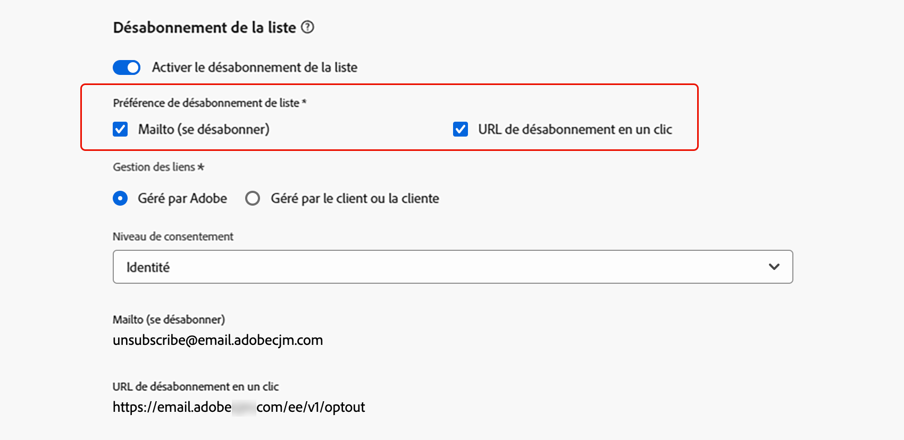

# Désabonnement de la liste{#list-unsubscribe}

<!--Do not modify - Legal Review Done -->

En [!DNL Adobe Journey Optimizer], lors de la configuration d’une nouvelle configuration de canal e-mail, lors de la [sélection d’un sous-domaine](email-settings.md#subdomains-and-ip-pools) dans la liste, l’option **[!UICONTROL Activer List-Unsubscribe]** s’affiche. Elle est activée par défaut.


L’URL de désabonnement de la liste en un clic est un lien ou un bouton de désabonnement affiché en regard des informations de l’expéditeur de l’e-mail. Elle permet aux destinataires de se désinscrire instantanément de vos listes de diffusion en un seul clic.

Par exemple, l’URL de désabonnement en un clic affiche un lien comme ci-dessous dans Gmail :


>[!IMPORTANT]
>
>Pour afficher l’URL de désabonnement en un clic dans l’en-tête de l’e-mail, le client de messagerie de la personne destinataire doit prendre en charge cette fonctionnalité.

Selon le client de messagerie et les paramètres de désabonnement de la configuration du canal e-mail, le fait de cliquer sur le lien de désabonnement dans l&#39;en-tête de l&#39;e-mail peut avoir les impacts suivants :

* Lorsque la fonctionnalité **Mailto (se désabonner)** est activée, la demande de désabonnement est envoyée à l’adresse de désabonnement par défaut en fonction du sous-domaine que vous avez configuré.
* Lorsque la fonctionnalité **URL de désabonnement en un clic** est activée (ou si vous avez inséré une URL de désabonnement dans le contenu de votre corps d’e-mail), la personne destinataire est directement désinscrite, au niveau du canal ou au niveau de l’ID (selon la configuration du consentement), lorsqu’elle clique sur l’URL de désabonnement en un clic (selon le sous-domaine que vous avez configuré).

>[!NOTE]
>
>Découvrez comment gérer les paramètres de désabonnement dans [cette section](#enable-list-unsubscribe) ci-dessous.

Dans les deux cas, lorsqu&#39;un destinataire clique sur le lien d&#39;opt-out, sa demande de désabonnement est traitée en conséquence. Le profil correspondant est immédiatement exclu et ce choix est mis à jour dans [Experience Platform](https://experienceleague.adobe.com/docs/experience-platform/profile/ui/user-guide.html?lang=fr#getting-started){target="_blank"}.

>[!NOTE]
>
>Parfois, la prise en compte des événements de désabonnement au niveau du profil peut prendre plus de temps en raison du traitement des données en aval. Patientez quelques instants le temps que le système se mette à jour.

## Activer le désabonnement de la liste {#enable-list-unsubscribe}

>[!CONTEXTUALHELP]
>id="ajo_admin_preset_unsubscribe"
>title="Ajouter une URL de désabonnement à vos e-mails"
>abstract="Activez cette option pour ajouter automatiquement une URL de désabonnement à l’en-tête de l’e-mail. Pour définir une URL de désabonnement dans un message, insérez un lien d’exclusion en un clic dans le contenu de l’e-mail."
>additional-url="https://experienceleague.adobe.com/fr/docs/journey-optimizer/using/channels/email/email-opt-out#one-click-opt-out" text="Définir le processus de désinscription en un clic pour le contenu de l’e-mail"

Lorsque l’option **[!UICONTROL Activer le désabonnement de la liste]** est activée, si elle est prise en charge par le client de messagerie des destinataires, l’en-tête de l’e-mail comprend à la fois un mailto et/ou une URL par défaut que les destinataires peuvent utiliser pour se désabonner de votre liste de diffusion.

>[!NOTE]
>
>Si vous désactivez cette option, aucune URL de désabonnement en un clic ne s’affiche dans l’en-tête de l’e-mail.

L’en-tête Désabonnement de la liste propose deux fonctionnalités qui sont activées par défaut, sauf si vous désélectionnez l’une des fonctionnalités ou les deux :

{width="80%"}

* Une adresse **[!UICONTROL Mailto (unsubscribe)]**, qui est l’adresse de destination vers laquelle les demandes de désabonnement sont acheminées pour le traitement automatique. Dans [!DNL Journey Optimizer], l’adresse e-mail de désabonnement est l’adresse par défaut **[!UICONTROL Mailto (unsubscribe)]** affichée dans la configuration du canal, en fonction du [sous-domaine sélectionné](email-settings.md#subdomains). <!--With this method, clicking the Unsubscribe link sends a pre-filled email to the unsubscribe address specified in the email header.-->

* L’URL de désabonnement en un clic **[!UICONTROL One-click]**, qui est par défaut l’en-tête de désabonnement de la liste générée par l’URL d’opt-out en un clic, en fonction du [sous-domaine sélectionné](email-settings.md#subdomains). <!--With this method, clicking the Unsubscribe link directly unsubscribes the user, requiring only a single action to unsubscribe.-->

Vous pouvez sélectionner le **[!UICONTROL niveau de consentement]** dans la liste déroulante correspondante. Il peut être spécifique au canal ou à l’identité du profil. En fonction de ce paramètre, lorsqu’un utilisateur ou une utilisatrice se désabonne à l’aide de l’URL de désabonnement de la liste dans l’en-tête d’un e-mail, le consentement est mis à jour dans [!DNL Adobe Journey Optimizer] au niveau du canal ou de l’ID.

## Mécanismes de sécurisation et recommandations {#list-unsubscribe-guardrails}

La fonctionnalité d’URL de désabonnement de liste en un clic permet à vos destinataires de se désabonner facilement de vos communications. Cependant, comme tous les clients de messagerie ne prennent pas en charge ce lien dans l’en-tête de l’e-mail, Adobe vous recommande d’ajouter également un [ lien d’opt-out en un clic ](email-opt-out.md#one-click-opt-out) ou un [ lien de désabonnement ](email-opt-out.md#add-unsubscribe-link) dans le corps de votre e-mail.

Les fonctionnalités **[!UICONTROL Mailto (se désabonner)]** et **[!UICONTROL URL de désabonnement en un clic]** sont facultatives.

* Si vous avez activé l’option **[!UICONTROL Activer List-Unsubscribe]** dans les [paramètres de configuration du canal e-mail](email-settings.md), nous vous recommandons d’activer les deux méthodes : **Mailto (se désabonner)** et **URL de désabonnement en un clic**. Les clients de messagerie ne prennent pas tous en charge la méthode HTTP. Grâce à la fonction de désabonnement de la liste de diffusion Mailto, vous pouvez sélectionner une alternative. Votre réputation en tant qu&#39;expéditeur sera ainsi mieux protégée et tous vos destinataires pourront accéder à la fonctionnalité de désabonnement.

* Si vous ne souhaitez pas utiliser l’URL de désabonnement en un clic générée par défaut, vous pouvez décocher la fonction.

   * Dans le scénario dans lequel l’option **[!UICONTROL Activer le désabonnement de la liste]** est activée et où la fonctionnalité **[!UICONTROL URL de désabonnement en un clic]** n’est pas cochée, si vous ajoutez un [lien d’exclusion en un clic](../email/email-opt-out.md#one-click-opt-out) dans un message créé à l’aide de cette configuration, l’en-tête de désabonnement de la liste récupère le lien d’exclusion en un clic que vous avez inséré dans le corps de l’e-mail et l’utilise comme valeur de l’URL de désabonnement en un clic.

     

   * Si vous n’ajoutez pas de lien d’exclusion en un clic au contenu de votre message et que l’**[!UICONTROL URL de désabonnement en un clic]** par défaut est décochée dans les paramètres de configuration des canaux, aucune URL n’est transmise à l’en-tête de l’e-mail dans le cadre de l’en-tête de désabonnement de la liste.

  >[!NOTE]
  >
  >Pour plus d’informations sur la gestion des fonctionnalités de désabonnement dans vos messages, consultez [cette section](../email/email-opt-out.md#unsubscribe-header).

Dans [!DNL Journey Optimizer], le consentement est géré par le [Schéma de consentement](https://experienceleague.adobe.com/docs/experience-platform/xdm/field-groups/profile/consents.html?lang=fr){target="_blank"} d’Experience Platform. Par défaut, la valeur du champ de consentement est vide et traitée comme un consentement pour recevoir vos communications. Vous pouvez modifier cette valeur par défaut lors de l’intégration à l’une des valeurs possibles répertoriées [ici](https://experienceleague.adobe.com/docs/experience-platform/xdm/data-types/consents.html?lang=fr#choice-values){target="_blank"} ou utiliser [politiques de consentement](../action/consent.md) pour remplacer la logique par défaut.

Actuellement, [!DNL Journey Optimizer] n’ajoute pas de balise spécifique pour désabonner les événements déclenchés par la fonction Désabonnement des listes . Si vous devez différencier les clics de désabonnement de la liste des autres actions de désabonnement, vous devez implémenter le balisage personnalisé en externe ou utiliser une page de destination externe pour le suivi.

## Gérer les données de désabonnement en externe {#custom-managed}

>[!CONTEXTUALHELP]
>id="ajo_email_config_unsubscribe_custom"
>title="Définir la manière de gérer les données de désabonnement"
>abstract="**Géré par Adobe** : les données de consentement sont gérées par vous dans le système Adobe.<br>**Géré par le client ou la cliente** : les données de consentement sont gérées par vous dans un système externe et aucune synchronisation des données de consentement n’est mise à jour dans le système Adobe, sauf si vous en êtes à l’origine."

>[!CONTEXTUALHELP]
>id="ajo_email_config_unsubscribe_custom_url"
>title="Saisissez votre propre URL de désabonnement en un clic"
>abstract="L’**URL de désabonnement en un clic** doit utiliser la méthode de requête POST."

Si vous gérez le consentement en dehors d’Adobe, sélectionnez l’option **[!UICONTROL Géré par le client ou la cliente]** pour saisir une adresse e-mail de désabonnement personnalisée et votre propre URL de désabonnement en un clic.

{width="80%"}

L’**[!UICONTROL URL de désabonnement en un clic]** doit être une URL POST.

>[!WARNING]
>
>Si vous utilisez l’option **[!UICONTROL Géré par le client ou la cliente]**, Adobe ne stocke aucune donnée de désabonnement ou de consentement. Avec l’option **[!UICONTROL Géré par le client ou la cliente]**, les organisations choisissent d’utiliser un système externe et seront chargées de gérer leurs données de consentement dans celui-ci. Il n’existe pas de synchronisation automatique des données de consentement entre le système externe et [!DNL Journey Optimizer]. Toute synchronisation des données de consentement, qui provient du système externe pour mettre à jour les données de consentement d’utilisation dans [!DNL Journey Optimizer], doit être lancée par l’organisation sous la forme d’un transfert de données pour renvoyer les données de consentement vers [!DNL Journey Optimizer].

### Configurer l’API de déchiffrement {#configure-decrypt-api}

Avec l’option **[!UICONTROL Géré par le client]** sélectionnée, si vous saisissez des points d’entrée personnalisés et les utilisez dans une campagne ou un parcours, [!DNL Journey Optimizer] ajoute certains paramètres spécifiques au profil par défaut à l’événement de mise à jour du consentement <!--sent to the custom endpoint -->lorsque vos destinataires cliquent sur le lien de désabonnement.

Ces paramètres sont envoyés au point d’entrée de manière chiffrée. Par conséquent, le système de consentement externe doit mettre en œuvre une API spécifique via [Adobe Developer](https://developer.adobe.com){target="_blank"} pour déchiffrer les paramètres envoyés par Adobe.

L’appel GET pour récupérer ces paramètres dépend de l’option de désabonnement de la liste que vous utilisez : **[!UICONTROL URL de désabonnement en un clic]** ou **[!UICONTROL Mailto (annuler l’abonnement)]**.

<!--To configure the API to send back the information to [!DNL Adobe Journey Optimizer] when a recipient has unsubscribed using the List unsubscribe option with custom endpoints, follow the steps below.-->

+++ URL de désabonnement en un clic

Avec l’option **[!UICONTROL URL de désabonnement en un clic]**, cliquer sur le lien de désabonnement annule directement l’abonnement de l’utilisateur ou de l’utilisatrice.

L’appel GET se présente comme suit :

Point d’entrée : https://platform.adobe.io/journey/imp/consent/decrypt

Paramètres de requête :

* **params** : contient la payload chiffrée
* **pid** : identifiant de profil chiffré

Ces deux paramètres seront inclus dans l’événement de mise à jour du consentement envoyé aux points d’entrée personnalisés.

Exigences d’en-tête :

* x-api-key
* x-gw-ims-org-id
* autorisation (jeton utilisateur de votre compte technique)

Vous trouverez ci-dessous des exemples de paramètres et la réponse de consentement :

| Paramètre de requête | Exemple de payload |
|---------|----------|
| pid | {<br>« pid » : « 5142733041546020095851529937068211571 »,<br>« pns » : « CRMID »,<br>« e »    : « john@google.com »,<br>« ens » : « Email »,<br>} |
| params | {<br>« m » : « messageExecutionId »,<br>« ci » : « campaignId »,<br>« jv » : « journeyVersionId »,<br>« ja » : « journeyActionId »,<br>« s » : « sandboxId »,<br>« us » : « unsubscribeScope »<br>} |

Réponse de consentement :

```
{
    "profileNameSpace": " CRMID ",
    "profileId": "5142733041546020095851529937068211571",
    "emailAddress": "john@google.com",
    "emailNameSpace": "Email",
    "sandboxId": "sandboxId",
    "optOutLevel": "channel",
    "channelType": "email",
    "timestamp": "2024-11-26T14:25:09.316930Z"
}
```

+++

+++ Mailto (se désabonner)

Avec l’option **[!UICONTROL Mailto (se désabonner)]**, cliquer sur le lien de désabonnement envoie un e-mail prérempli à l’adresse de désabonnement spécifiée.

L’appel GET se présente comme suit :

Point d’entrée : https://platform.adobe.io/journey/imp/consent/decrypt

Paramètres de requête :

* **emailParams** : chaîne contenant les paramètres **params** (payload chiffrée) et **pid** (identifiant de profil chiffré).

Les paramètres **params** et **pid** seront inclus dans l’événement de mise à jour du consentement envoyé aux points d’entrée personnalisés.

Exigences d’en-tête :

* x-api-key
* x-gw-ims-org-id
* autorisation (jeton utilisateur de votre compte technique)

Vous trouverez ci-dessous des exemples de paramètres et la réponse de consentement :

| Paramètre de requête | Exemple de payload |
|---------|----------|
| emailParams | {<br>« p » : « profileId »,<br>« pn » : « profileNamespace »,<br>« en » : « emailNamespace »,<br>« ci » : « campaignId »,<br>« jv » : « journeyVersionId »,<br>« ja » : « journeyActionId »,<br>« si » : « sandboxId »,<br>« us » : « unsubscribeScope »<br>} |

Réponse de consentement :

```
{
    "profileNameSpace": " CRMID ",
    "profileId": "5142733041546020095851529937068211571",
    "emailAddress": "john@google.com",
    "emailNameSpace": "Email",
    "sandboxId": "sandboxId",
    "optOutLevel": "channel",
    "channelType": "email",
    "timestamp": "2024-11-26T14:25:09.316930Z"
}
```

+++
