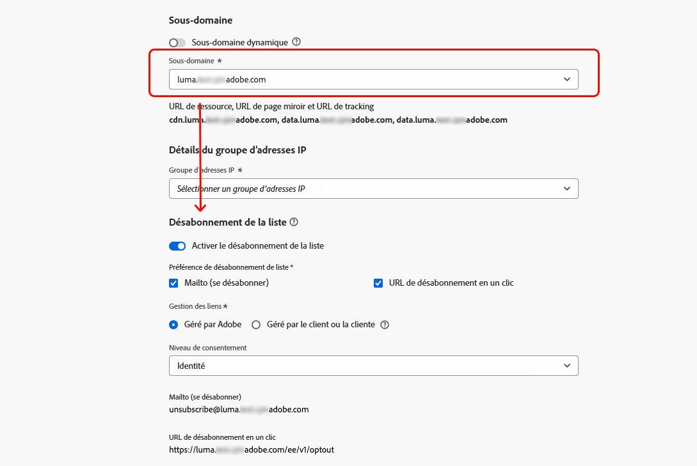

# Désabonnement de la liste{#list-unsubscribe}

<!--Do not modify - Legal Review Done -->

Lors de la configuration d’une nouvelle configuration de canal e-mail, lors de la [sélection d’un sous-domaine](email-settings.md#subdomains-and-ip-pools) dans la liste, l’option **[!UICONTROL Activer List-Unsubscribe]** s’affiche.

## Activer le désabonnement de la liste {#enable-list-unsubscribe}

Cette option est activée par défaut pour inclure une URL de désabonnement en un clic dans l’en-tête de l’e-mail, par exemple :

>[!NOTE]
>
>Si vous désactivez cette option, aucune URL de désabonnement en un clic ne s’affiche dans l’en-tête de l’e-mail.

L’en-tête Désabonnement de la liste propose deux options activées par défaut, sauf si vous désélectionnez l’une des options ou les deux :

{width="80%"}

* Une adresse **[!UICONTROL Mailto (se désabonner)]**, qui est l’adresse de destination vers laquelle les demandes de désabonnement sont acheminées pour le traitement automatique.

  En [!DNL Journey Optimizer], l’adresse e-mail de désabonnement est l’adresse par défaut **[!UICONTROL Mailto (unsubscribe)]** affichée dans la configuration du canal, en fonction de votre [sous-domaine sélectionné](#subdomains-and-ip-pools). <!--With this method, clicking the Unsubscribe link sends a pre-filled email to the unsubscribe address specified in the email header.-->

* L’URL de désabonnement en un clic **[!UICONTROL One-click]**, qui est par défaut l’en-tête de désabonnement de la liste générée par l’URL d’opt-out en un clic, en fonction du sous-domaine que vous avez défini et configuré dans les paramètres de configuration du canal. <!--With this method, clicking the Unsubscribe link directly unsubscribes the user, requiring only a single action to unsubscribe.-->

Vous pouvez sélectionner le **[!UICONTROL Niveau de consentement]** dans la liste déroulante correspondante. Il peut être spécifique au canal ou à l’identité du profil. En fonction de ce paramètre, lorsqu’un utilisateur se désabonne à l’aide de l’URL de désabonnement de liste dans l’en-tête d’un e-mail, le consentement est mis à jour dans [!DNL Adobe Journey Optimizer], au niveau du canal ou de l’identifiant.

Les fonctionnalités **[!UICONTROL Mailto (se désabonner)]** et **[!UICONTROL URL de désabonnement en un clic]** sont facultatives.

Si vous ne souhaitez pas utiliser l’URL de désabonnement en un clic générée par défaut, vous pouvez décocher la fonction. Dans le scénario dans lequel l’option **[!UICONTROL Activer le désabonnement de la liste]** est activée et où la fonctionnalité **[!UICONTROL URL de désabonnement en un clic]** n’est pas cochée, si vous ajoutez un [lien d’exclusion en un clic](../email/email-opt-out.md#one-click-opt-out) dans un message créé à l’aide de cette configuration, l’en-tête de désabonnement de la liste récupère le lien d’exclusion en un clic que vous avez inséré dans le corps de l’e-mail et l’utilise comme valeur de l’URL de désabonnement en un clic.

>[!NOTE]
>
>Si vous n’ajoutez pas de lien d’exclusion en un clic au contenu de votre message et que l’**[!UICONTROL URL de désabonnement en un clic]** par défaut est décochée dans les paramètres de configuration des canaux, aucune URL n’est transmise à l’en-tête de l’e-mail dans le cadre de l’en-tête de désabonnement de la liste.

En savoir plus sur la gestion des fonctionnalités de désabonnement dans vos messages dans [cette section](../email/email-opt-out.md#unsubscribe-header).

## Gérer les données de désabonnement en externe {#custom-managed}

>[!CONTEXTUALHELP]
>id="ajo_email_config_unsubscribe_custom"
>title="Définir comment les données de désabonnement sont gérées"
>abstract="**Adobe géré** : les données de consentement sont gérées par vous dans le système Adobe. **Gestion par le client** : les données de consentement sont gérées par vous dans un système externe et aucune synchronisation des données de consentement n’est mise à jour dans le système Adobe, sauf si vous en êtes l’initiateur."

>[!AVAILABILITY]
>
>Cette fonctionnalité est publiée en disponibilité limitée pour un petit groupe de personnes.

Si vous gérez le consentement en dehors d’Adobe, sélectionnez l’option **[!UICONTROL Gestion des clients]** pour saisir une adresse e-mail de désabonnement personnalisée et votre propre URL de désabonnement en un clic.

{width="80%"}

>[!WARNING]
>
>Si vous utilisez l’option **[!UICONTROL Gestion par le client]**, Adobe ne stocke aucune donnée de désabonnement ou de consentement. Avec l’option **[!UICONTROL Gestion par le client]**, les organisations choisissent d’utiliser un système externe et seront chargées de gérer leurs données de consentement dans ce système externe. Il n’existe pas de synchronisation automatique des données de consentement entre le système externe et [!DNL Journey Optimizer]. Toute synchronisation des données de consentement, qui provient du système externe pour mettre à jour les données de consentement des utilisateurs en [!DNL Journey Optimizer], doit être lancée par l’organisation sous la forme d’un transfert de données pour renvoyer les données de consentement en [!DNL Journey Optimizer].

## Configuration de l’API de déchiffrement {#configure-decrypt-api}

Avec l’option **[!UICONTROL Géré par le client]** sélectionnée, si vous saisissez des points d’entrée personnalisés et les utilisez dans une campagne ou un parcours, [!DNL Journey Optimizer] ajoute certains paramètres spécifiques au profil par défaut à l’événement de mise à jour du consentement <!--sent to the custom endpoint -->lorsque vos destinataires cliquent sur le lien Se désabonner.

Ces paramètres sont envoyés au point d’entrée de manière chiffrée. Par conséquent, le système de consentement externe doit mettre en œuvre une API spécifique via [Adobe Developer](https://developer.adobe.com){target="_blank"} pour déchiffrer les paramètres envoyés par Adobe.

L’appel GET pour récupérer ces paramètres dépend de l’option de désabonnement de la liste que vous utilisez : **[!UICONTROL URL de désabonnement en un clic]** ou **[!UICONTROL Mailto (unsubscribe)]**.

<!--To configure the API to send back the information to [!DNL Adobe Journey Optimizer] when a recipient has unsubscribed using the List unsubscribe option with custom endpoints, follow the steps below.-->

+++ URL de désabonnement en un clic

Avec l’option **[!UICONTROL URL de désabonnement en un clic]**, cliquer sur le lien de désabonnement annule directement l’abonnement de l’utilisateur.

L&#39;appel GET est le suivant :

Point d’entrée : https://platform.adobe.io/journey/imp/consent/decrypt

Paramètres de requête:

* **params** : contient la payload chiffrée
* **pid** : identifiant de profil chiffré

Ces deux paramètres seront inclus dans l’événement de mise à jour du consentement envoyé aux points d’entrée personnalisés.

Exigences d’en-tête :

* x-api-key
* x-gw-ims-org-id
* autorisation (jeton utilisateur de votre compte technique)

+++

+++ Mailto (unsubscribe)

Avec l’option **[!UICONTROL Envoyer (se désabonner)]**, cliquez sur le lien Se désabonner pour envoyer un e-mail prérempli à l’adresse de désabonnement spécifiée.

L&#39;appel GET est le suivant.

Point d’entrée : https://platform.adobe.io/journey/imp/consent/decrypt

Paramètres de requête:

* **emailParams** : chaîne contenant les paramètres **params** (payload chiffrée) et **pid** (identifiant de profil chiffré).

Les paramètres **params** et **pid** seront inclus dans l’événement de mise à jour du consentement envoyé aux points d’entrée personnalisés.

Exigences d’en-tête :

* x-api-key
* x-gw-ims-org-id
* autorisation (jeton utilisateur de votre compte technique)

+++
