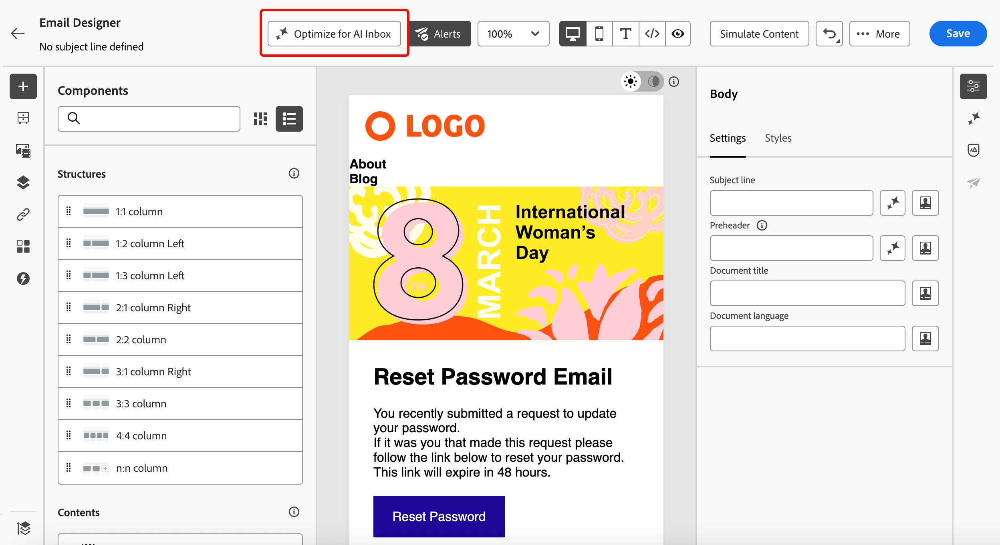
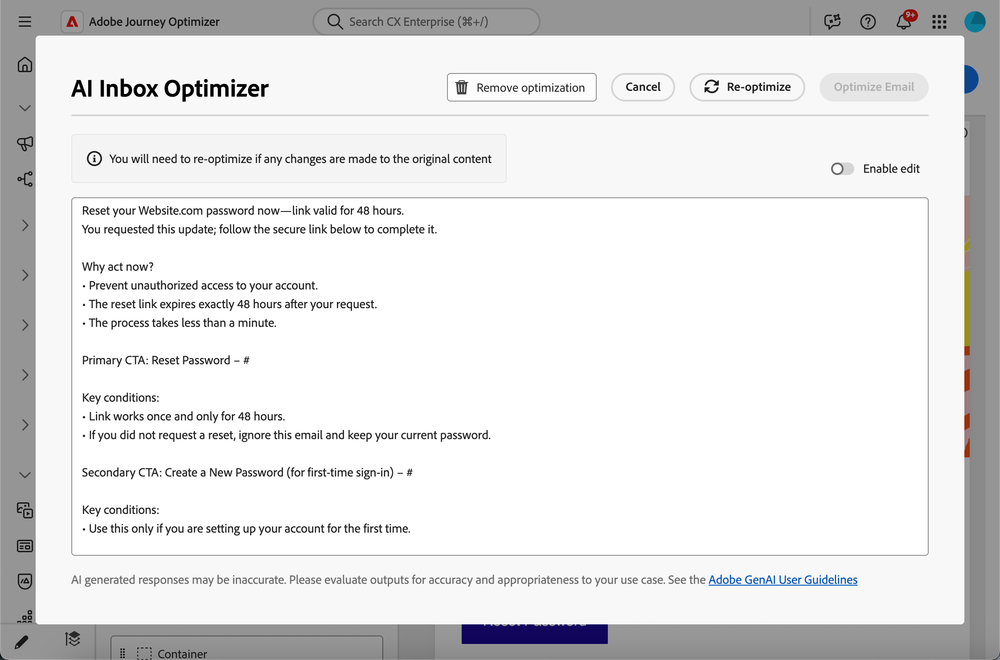

# Optimiser les e-mails pour les boîtes de réception d’IA {#email-text-optimizer}

[!DNL Adobe Journey Optimizer] est fourni avec une fonctionnalité de canal e-mail qui vous permet de structurer une version spécifique de vos messages pour améliorer les expériences de boîte de réception assistée par l’IA, telles que les [!DNL Apple Intelligence] et les [!DNL Google Gemini] dans [!DNL Gmail], afin qu’ils puissent répondre aux questions et résumer les e-mails en fonction de votre contenu plus précisément, avec de meilleurs résultats.

Vous pouvez utiliser cette fonctionnalité pour générer et affiner une version dédiée de vos messages afin que les expériences de boîte de réception assistée par IA soient plus susceptibles de faire surface aux offres, aux appels à l’action et aux détails que vous avez prévus, plutôt qu’à du texte fin généré automatiquement ou à un contexte sans rapport.

<!--
>[!NOTE]
>
>This optimized for AI inboxes text version is not the same as the default or custom plain text version of your messages. [Learn more](text-version-email.md)
-->

## Fonctionnement {#how-it-works}

Les questions standard que les destinataires peuvent poser dans les expériences de boîte de réception assistée par l’IA sont les suivantes *De quoi s’agit cet e-mail ?* ou *Quelles sont ces offres ?*.

* Les réponses fournies par ces assistants d’IA peuvent être un bref résumé (par exemple, le message est promotionnel, mentionne un accès anticipé à VIP et une vente, et inclut des liens vers des catégories de produits). Cependant, ils omettent toujours les objectifs auxquels le professionnel du marketing s’intéressait, car les assistants déduisent de tout texte qu’ils voient réellement - pas nécessairement de l’histoire complète que vous souhaitiez raconter.

* En outre, les assistants peuvent rechercher de manière proactive des remises ou des coupons liés à la marque et les inclure dans la réponse, de sorte que l’utilisateur ne regarde plus uniquement ce que votre message a réellement promis. Ce comportement est utile pour les utilisateurs finaux, mais dilue le contrôle pour les spécialistes marketing qui ont besoin de réponses pour suivre les termes réels de l’envoi.

Pour éviter ces problèmes, [!DNL Journey Optimizer] crée une version spécifique supplémentaire de vos messages afin que les coupons, les périodes de remise, les appels à l’action et d’autres priorités apparaissent au premier plan dans une copie linéaire claire. <!--This version is different from the HTML view and default or custom plain text version of your messages.-->

L’objectif est que l’IA dédiée aux boîtes de réception puisse ancrer les résumés et les questions/réponses dans vos offres et actions définies, au lieu de s’appuyer sur une partie de texte mince par défaut ou sur des résultats web sans rapport.

>[!IMPORTANT]
>
>Les comportements exacts des assistants d’IA dépendent du fournisseur de boîte de réception et de la version du modèle. Une fois votre e-mail diffusé, les réponses et les résumés fournis par les clients d’IA externes peuvent être incorrects, incomplets ou mélangés avec des résultats web.
>
>La fonctionnalité Optimiser les e-mails pour les boîtes de réception IA génère uniquement une version dédiée dans Journey Optimizer ; elle ne garantit pas la façon dont un assistant tiers interprètera ou affichera le message. En savoir plus sur les [limites et risques de l’IA de boîte de réception tierce](#inbox-ai-risks).

## Cas d’utilisation recommandés {#use-cases}

<!--
* **Critical details only in images** — Offers, promo codes, or deadlines shown in banners or graphics are invisible in plain text. Use the optimizer (and manual edits) so the same facts appear as text, improving extraction by AI summaries and text-only clients.
-->

* **Contenu dense ou fragmenté** — Lorsque le contenu de l’e-mail est difficile à analyser, l’optimisation peut produire un récit linéaire plus clair avec des offres et des liens explicites.

* **Contrôle des questions et réponses dans la boîte de réception** — Lorsque vous prévoyez que les destinataires interrogent les assistants *sur le sujet de l’e-mail* ou *sur les offres*, une version optimisée pour l’IA réduit les résumés partiels et évite de recourir à des réponses web qui ne sont pas liées à votre copie approuvée.

## Optimiser pour les expériences de boîte de réception d’IA {#optimize-with-ai}

>[!IMPORTANT]
>
>Avant d’utiliser cette fonctionnalité, lisez les [Risques et limites](#inbox-ai-risks) associés.
>
>Pour accéder à cette fonctionnalité, vous devez accepter un contrat d’utilisation qui s’affiche la première fois que vous utilisez Generative AI dans [!DNL Journey Optimizer]. Pour plus d’informations, consultez les [instructions d’utilisation de Adobe Experience Cloud Generative AI](https://www.adobe.com/fr/legal/licenses-terms/adobe-gen-ai-user-guidelines.html){target="_blank"}.

Pour optimiser le contenu de votre e-mail pour les expériences de boîte de réception IA avec [!DNL Journey Optimizer], procédez comme suit.

1. Ouvrez l’e-mail dans le Designer d’e-mail](content-from-scratch.md) (à partir d’une campagne, d’un parcours ou d’un modèle, selon votre workflow).[

1. Cliquez sur le bouton **[!UICONTROL Optimiser pour la boîte de réception IA]** pour générer une version améliorée qui met en surbrillance les informations clés pour la lecture et la synthèse assistées par IA.

   {zoomable="yes" width="80%"}

1. Si c’est la première fois que vous utilisez Generative AI dans [!DNL Journey Optimizer], il vous sera demandé d’accepter le contrat d’utilisation. Pour en savoir plus, consultez les [instructions d’utilisation d’Adobe Generative AI](https://www.adobe.com/fr/legal/licenses-terms/adobe-gen-ai-user-guidelines.html){target="_blank"}.

   {width=50%}

   Cliquez sur **[!UICONTROL Accepter]** pour continuer.

1. La version générée s’affiche dans la fenêtre **[!UICONTROL Optimisateur de boîte de réception AI]**.

   {zoomable="yes" width="80%"}

   >[!NOTE]
   >
   >La version optimisée est différente des vues HTML et texte de votre e-mail. Cela ne modifie pas votre conception, votre disposition ni vos images.

1. Pour modifier le contenu généré automatiquement, sélectionnez le bouton (bascule) **[!UICONTROL Activer la modification]** et apportez les modifications manuelles nécessaires.

1. Une fois la version créée, cliquez sur le bouton **[!UICONTROL Optimiser l’e-mail]** pour confirmer. Vous pouvez également utiliser le bouton **[!UICONTROL Réoptimiser]** pour générer une nouvelle version.

1. Vous êtes redirigé vers la vue **** et votre e-mail est maintenant optimisé pour les boîtes de réception d’IA. Pour accéder à nouveau à la version optimisée ou la modifier, cliquez sur le bouton **[!UICONTROL Boîte de réception optimisée pour l’IA]**.

   {zoomable="yes" width="80%"}

1. La version optimisée s’affiche. Vous pouvez **[!UICONTROL Supprimer l’optimisation]** ou cliquer sur **[!UICONTROL Réoptimiser]** pour générer une nouvelle version.

   {zoomable="yes" width="80%"}

   >[!NOTE]
   >
   >Si vous apportez des modifications au contenu HTML d’origine, vous devez réoptimiser la version générée pour les boîtes de réception d’IA afin qu’elle soit cohérente avec le nouveau contenu.

## Risques et limites de l’IA dédiée aux boîtes de réception tierces {#inbox-ai-risks}

La fonctionnalité Optimiser l’e-mail pour les boîtes de réception IA vous permet de préparer une version de votre e-mail pour la manière dont les fournisseurs de messagerie peuvent traiter vos envois [!DNL Journey Optimizer]. Il ne contrôle pas les produits de ces fournisseurs. Une fois qu’un message est diffusé, toutes les fonctionnalités d’IA de [!DNL Gmail], [!DNL Apple] Mail, [!DNL Outlook] ou d’autres clients fonctionnent selon leurs conditions, modèles et politiques, et non selon Adobe.

* **Présentation imprévisible** — Les résumés, les bulles de notification et les réponses conversationnelles peuvent omettre des offres, donner des prix ou des dates erronés, fusionner du contenu avec des résultats web sans rapport ou paraphraser d&#39;une manière qui ne correspond plus à votre copie approuvée. Ce comportement peut changer lorsque les fournisseurs mettent à jour les modèles ou l&#39;interface utilisateur sans préavis.

* **Pas de garantie de parité avec HTML** — Les destinataires qui dépendent des aperçus ou des réponses de l&#39;assistant risquent de ne jamais voir l&#39;intégralité de la conception d&#39;HTML, vos images ou vos pieds de page légaux. Ce qu’ils pensent que le message « dit » pourrait provenir uniquement d’un court résumé généré par l’IA.

* **Confidentialité, conformité et utilisation des données** — L&#39;IA dédiée aux boîtes de réception peut traiter le contenu des messages sur l&#39;infrastructure du fournisseur, sous réserve de la politique de confidentialité, de la conservation et des règles régionales de ce fournisseur. Les organisations des secteurs réglementés doivent évaluer si l&#39;utilisation de ces fonctionnalités par les destinataires affecte leurs obligations, quelle que soit la manière dont l&#39;e-mail a été créé en [!DNL Journey Optimizer].

* **Marque et risque juridique** — Des résumés d&#39;IA incorrects ou incomplets peuvent toujours créer de la confusion ou des différends chez les clients au sujet de promotions, de conditions ou d&#39;un langage de désinscription. [!DNL Journey Optimizer] ne garantit pas que le modèle d’un tiers reproduira fidèlement la version optimisée de votre e-mail.

* **[!UICONTROL Optimiser pour la boîte de réception de l’IA]** dans [!DNL Journey Optimizer] : le contrôle du temps de création dans le Designer d’e-mail est distinct des assistants de boîte de réception des utilisateurs finaux. Toujours vérifier le contenu généré avant l’envoi.

## Rubriques connexes {#related-topics}

* [Commencer la conception d’e-mails](get-started-email-design.md)
* Pour les fonctionnalités génératives d’Adobe en général, consultez [Prise en main de l’assistant d’IA pour la création de contenu](../content-management/gs-generative.md).
