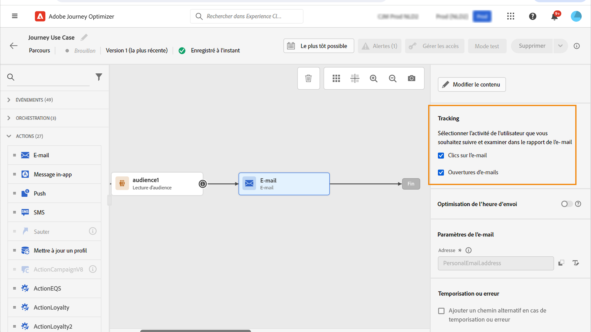

# Ajouter des liens et suivre les messages {#tracking}

Utilisez [!DNL Journey Optimizer] pour ajouter des liens à votre contenu et suivre les messages envoyés afin de surveiller le comportement de vos destinataires.

>[!NOTE]
>
>Lorsque des liens sont inclus dans votre contenu, ils expirent **25 mois** après l’envoi du message, à l’exception des liens vers une page miroir, qui expirent après **90 jours**. Après ce délai, les liens ne sont plus disponibles.

## Activer le suivi {#enable-tracking}

Vous pouvez activer le suivi au niveau des e-mails en cochant les options **[!UICONTROL Ouvertures d’e-mails]** et/ou **[!UICONTROL Clics sur l’e-mail]** lorsque vous créez votre message dans un parcours ou une campagne, comme indiqué dans les onglets ci-dessous :

>[!BEGINTABS]

>[!TAB Activer le tracking dans un parcours]

>[!TAB Activer le tracking dans une campagne]

>[!ENDTABS]

>[!NOTE]
>
>Les deux options sont activées par défaut.

Lorsqu’elles sont activées, ces options effectuent le suivi du comportement des destinataires de vos messages :

* La mesure **[!UICONTROL Ouvertures d’e-mails]** vérifie le nombre de messages ouverts.
* La mesure **[!UICONTROL Clics sur l’e-mail]** calcule le nombre de clics effectués sur les liens contenus dans un e-mail.

## Insertion de liens {#insert-links}

Lorsque le [suivi est activé](#enable-tracking), tous les liens inclus dans le contenu du message font l’objet d’un suivi.

>[!NOTE]
>
>Les liens des fragments utilisés dans un e-mail font également l’objet d’un suivi. [En savoir plus sur les fragments](../content-management/fragments.md)

Pour insérer des liens dans le contenu de votre e-mail, procédez comme suit :

1. Sélectionnez un élément (texte ou image) et cliquez sur **[!UICONTROL Insérer un lien]** dans la barre d’outils contextuelle.

   

1. Choisissez le type de lien que vous souhaitez créer :

   * Sélectionnez **[!UICONTROL Lien externe]** pour insérer un lien vers une URL externe.

   * Sélectionnez **[!UICONTROL Page de destination]** pour insérer un lien vers une page de destination. [En savoir plus](../landing-pages/get-started-lp.md)

   * Sélectionnez **[!UICONTROL Opt-out en un clic]** pour insérer un lien permettant aux utilisateurs et utilisatrices de se désabonner rapidement de vos communications sans avoir à confirmer l’opt-out. [En savoir plus](email-opt-out.md#one-click-opt-out).

   * Sélectionnez **[!UICONTROL Abonnement/opt-in externe]** pour insérer un lien permettant d’accepter de recevoir des communications de votre marque.

   * Sélectionnez **[!UICONTROL Désabonnement/opt-out externe]** pour insérer un lien permettant de se désabonner des communications de votre marque. En savoir plus sur la gestion des opt-outs dans [cette section](email-opt-out.md#email-opt-out).

   * Sélectionnez **[!UICONTROL Page miroir]** pour ajouter un lien vers la page miroir de l’e-mail. [En savoir plus](#mirror-page)

1. Saisissez l’URL de votre choix dans le champ correspondant, ou sélectionnez une page de destination et définissez les styles et paramètres du lien. [En savoir plus](#adjust-links)

   >[!NOTE]
   >
   >Pour l’interprétation des URL, [!DNL Journey Optimizer] est conforme à la syntaxe URI ([norme RFC 3986](https://datatracker.ietf.org/doc/html/rfc3986){target="_blank"}), ce qui désactive certains caractères internationaux spéciaux dans les URL. Lors de l’envoi du BAT ou de l’e-mail, si une erreur impliquant une URL ajoutée à votre contenu vous est renvoyée, vous pouvez encoder la chaîne comme solution de contournement.

1. Vous pouvez personnaliser vos liens. [En savoir plus](../personalization/personalization-build-expressions.md)

1. Enregistrez vos modifications.

1. Une fois le lien créé, vous pouvez toujours le modifier à partir des volets **[!UICONTROL Paramètres]** et **[!UICONTROL Styles]** à droite.

   

>[!NOTE]
>
>Les e-mails de type marketing doivent inclure un [lien d’exclusion](../privacy/opt-out.md#opt-out-decision-management), qui n’est pas obligatoire pour les messages transactionnels. La catégorie du message (**[!UICONTROL Marketing]** ou **[!UICONTROL Transactionnel]**) est définie au niveau de la [configuration des canaux](email-settings.md#email-type), lors de la création du message.

Une fois le message envoyé, la période de conservation d’un lien est de **25 mois**. Après ce délai, le lien n’est plus disponible.

>[!CAUTION]
>
>Lorsque les **libellé** et **URL** d’un bouton sont rendus modifiables dans un fragment, les rapports de suivi affichent l’URL au lieu du libellé du bouton. Le champ `_experience.customerJourneyManagement.messageInteraction.label` du jeu de données de suivi consigne la valeur de l’URL.

## Lien vers une page miroir {#mirror-page}

La page miroir est une version en ligne de votre e-mail. L’ajout d’un lien vers la page miroir constitue une bonne pratique de marketing par e-mail. Les utilisateurs et utilisatrices consultent la page miroir d’un e-mail en cas de problème d’affichage des images dans leur boîte de réception ou lorsque ces dernières sont endommagées. Il est également recommandé de fournir une version en ligne pour des raisons d’accessibilité ou pour faciliter le partage sur les réseaux sociaux.

La page miroir générée par Adobe Journey Optimizer contient toutes les données de personnalisation.

Pour ajouter un lien vers une page miroir dans votre e-mail, [insérez un lien](#insert-links) et sélectionnez **[!UICONTROL Page miroir]** comme type de lien.

La page miroir est automatiquement créée. Une fois l&#39;e-mail envoyé, lorsque les destinataires cliquent sur le lien de la page miroir, le contenu de l’email s&#39;affiche dans leur navigateur web par défaut.

La période de conservation d’une page miroir est de **90 jours**. Une fois ce délai écoulé, la page miroir n’est plus disponible.

>[!CAUTION]
>
>* Les liens de pages miroir sont générés automatiquement et ne peuvent pas être modifiés. Ils contiennent toutes les données personnalisées et chiffrées nécessaires pour générer l’e-mail original. Par conséquent, l’utilisation d’attributs personnalisés dotés de valeurs élevées peut générer de longues URL de pages miroir. Cela peut empêcher le lien de fonctionner dans les navigateurs web qui imposent des limites de longueur d’URL.
>
>* Lors de la création d’e-mails qui reposent fortement sur la personnalisation d’exécution (par exemple, les boucles `#each`, les objets imbriqués, les données de payload volumineuses), les URL de page miroir peuvent devenir trop volumineuses, en particulier dans les campagnes déclenchées par API qui utilisent des données contextuelles volumineuses provenant des payloads. Cela peut entraîner des erreurs HTTP (404, 422, 502) dans les navigateurs ou les clients de messagerie. Adobe recommande de limiter la largeur et la profondeur des champs dynamiques, de réduire la dépendance à l’égard de fragments complexes et de simplifier les structures de personnalisation pour éviter les échecs de lien.
>
>* Dans le [BAT](../content-management/proofs.md) envoyé aux profils de test, le lien vers la page miroir n’est pas actif. Il n’est activé que dans les messages finaux.

## Personnaliser l’aspect du lien et la cible {#adjust-links}

Vous pouvez ajuster vos liens, par exemple en les soulignant, en modifiant leur couleur ou en sélectionnant leur cible. Ces modifications sont définies dans les volets **[!UICONTROL Paramètres]** et **[!UICONTROL Styles]** de la section de droite de l’éditeur de contenu.

### Cible {#link-target}

L’attribut **cible** est utilisé pour contrôler l’emplacement d’ouverture d’une page liée. L’ajout d’un attribut cible dans une balise d’ancrage peut indiquer si le lien doit s’ouvrir dans un nouvel onglet, dans le même onglet ou dans un autre cadre.

Pour définir la cible d’un lien, procédez comme suit :

1. Dans un composant **[!UICONTROL Texte]** contenant un lien, sélectionnez ce dernier.

1. Dans l’onglet **[!UICONTROL Paramètres]**, sélectionnez l’emplacement où s’ouvre le lien dans le menu déroulant **[!UICONTROL Cible]**. Les actions possibles sont répertoriées ci-dessous :

   * **[!UICONTROL Aucune]** : ouvre le lien dans le même cadre que celui sur lequel l’utilisateur a cliqué (par défaut).
   * **[!UICONTROL Vierge]** : ouvre le lien dans une nouvelle fenêtre ou un nouvel onglet.
   * **[!UICONTROL Self]** : ouvre le lien dans le même cadre que celui sur lequel l’utilisateur a cliqué.
   * **[!UICONTROL Parent]** : ouvre le lien dans le cadre parent.
   * **[!UICONTROL Haut]** : ouvre le lien dans le corps complet de la fenêtre.

   

1. Enregistrez vos modifications.

### Souligner le lien {#link-underline}

Cochez la case **[!UICONTROL Souligner le lien]** pour souligner le texte du libellé de votre lien.

### Couleur du lien {#link-color}

Pour modifier la couleur de votre lien, cliquez sur **[!UICONTROL Couleur du lien]** dans l’onglet **[!UICONTROL Styles]**.

## Gestion du suivi {#manage-tracking}

Le [Concepteur d&#39;e-mail](content-from-scratch.md) permet de gérer les URL suivies, par exemple modifier le type de suivi pour chaque lien.

1. Cliquez sur l&#39;icône **[!UICONTROL Liens]** du volet de gauche pour afficher la liste de toutes les URL de votre contenu qui feront l&#39;objet d&#39;un suivi.

   Cette liste permet d&#39;avoir une vue centrale et de localiser chaque URL dans le contenu de l&#39;e-mail.

1. Pour modifier un lien, cliquez sur l&#39;icône de crayon correspondante.

1. Si nécessaire, vous pouvez modifier le **[!UICONTROL Type de tracking]** :

   

   Pour chaque URL suivie, vous pouvez définir le mode de tracking sur l&#39;une des valeurs suivantes :

   * **[!UICONTROL Tracké]** : active le tracking sur cette URL.
   * **[!UICONTROL Opt-out]** : considère cette URL comme une option d&#39;opt-out ou une URL de désabonnement.
   * **[!UICONTROL Page miroir]** : considère cette URL comme une URL de page miroir.
   * **[!UICONTROL Jamais]** : n’active jamais le suivi de cette URL.

La création de rapports sur les ouvertures et les clics est disponible dans le [rapport dynamique](../reports/live-report.md) et dans le [rapport Customer Journey Analytics](../reports/report-gs-cja.md).

## Personnalisation du suivi des URL {#url-tracking}

Le [tracking des URL](email-settings.md#url-tracking) est géré au niveau de la configuration et s’applique à toutes les URL incluses dans le contenu de votre message.

Vous pouvez également personnaliser des URL individuelles dans le Concepteur d’e-mail. Pour ajouter des paramètres de tracking d’URL personnalisés à vos liens, procédez comme suit.

1. Sélectionnez un lien et cliquez sur **[!UICONTROL Insérer un lien]** dans la barre d’outils contextuelle.

1. Sélectionnez l’icône de personnalisation. Elle nʼest disponible que pour les types de liens suivants : **Lien externe**, **Lien de désinscription** et **Opt-out**.

   

1. Ajoutez le paramètre de suivi des URL et sélectionnez l’attribut de profil de votre choix dans l’[éditeur de personnalisation](../personalization/personalization-build-expressions.md).

   

1. Enregistrez vos modifications.

1. Répétez les étapes ci-dessus pour chaque lien auquel vous souhaitez ajouter ce paramètre de tracking.

Désormais, lorsque l’e-mail est envoyé, ce paramètre est automatiquement ajouté à la fin de l’URL. Vous pouvez ensuite capturer ce paramètre dans les outils d’analyse web ou dans les rapports de performances.

>[!NOTE]
>
>Pour vérifier l’URL finale, vous pouvez [envoyer un BAT](../content-management/proofs.md) et cliquer sur le lien dans le contenu de l’e-mail une fois que vous avez reçu le BAT. L’URL doit afficher le paramètre de tracking. Dans l’exemple ci-dessus, l’URL finale est : <https://luma.enablementadobe.com/content/luma/us/en.html?utm_contact=profile.userAccount.contactDetails.homePhone.number>.
