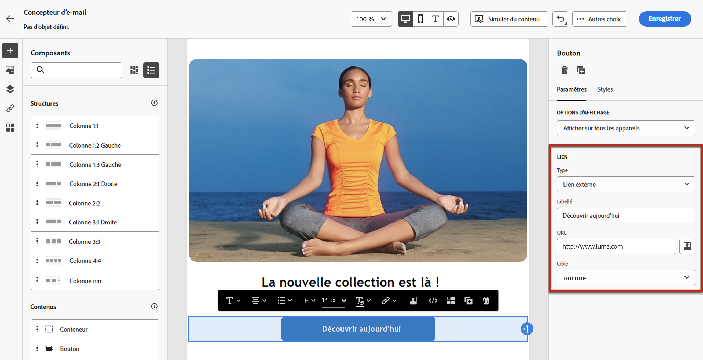
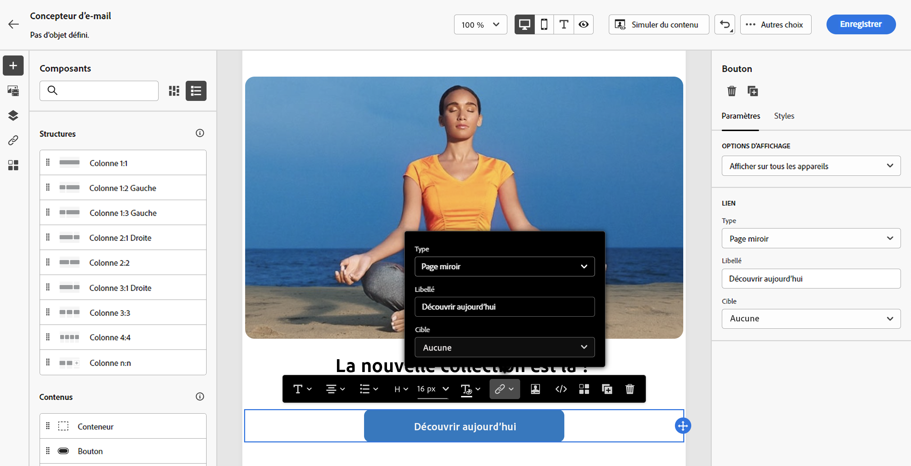

# Ajout de liens et suivi des messages {#tracking}

Utilisation [!DNL Journey Optimizer] pour ajouter des liens à votre contenu et suivre les messages envoyés afin de suivre le comportement de vos destinataires.

## Activation du suivi {#enable-tracking}

Vous pouvez activer le tracking au niveau des emails en cochant la case **[!UICONTROL Email opens]** et/ou **[!UICONTROL Click on email]** lors de la création de votre message dans un parcours ou une campagne.

>[!BEGINTABS]

>[!TAB Activation du suivi dans un parcours]

>[!TAB Activation du suivi dans une campagne]

>[!ENDTABS]

>[!NOTE]
>
>Les deux options sont activées par défaut.

Vous pourrez ainsi tracker le comportement de vos destinataires par :

* **[!UICONTROL Email opens]**: Messages ouverts.
* **[!UICONTROL Click on email]**: Clics sur les liens d’un email.

## Insérer des liens {#insert-links}

Lors de la conception d&#39;un message, vous pouvez ajouter des liens à votre contenu.

>[!NOTE]
>
>When [suivi activé](#enable-tracking), tous les liens inclus dans le contenu du message sont suivis.

Pour insérer des liens dans le contenu de votre email, procédez comme suit :

1. Sélectionnez un élément et cliquez sur **[!UICONTROL Insert link]** dans la barre d’outils contextuelle.

   

1. Choisissez le type de lien que vous souhaitez créer :

   * **[!UICONTROL External link]**: Insérez un lien vers une URL externe.

   * **[!UICONTROL Landing page]**: Insérez un lien vers une landing page. En savoir plus dans [cette section](../landing-pages/get-started-lp.md)

   * **[!UICONTROL One click Opt-out]**: Insérez un lien pour permettre aux utilisateurs de se désabonner rapidement de vos communications sans avoir à confirmer leur désinscription. En savoir plus dans [cette section](../privacy/opt-out.md#one-click-opt-out).

   * **[!UICONTROL External Opt-in/Subscription]**: Insérez un lien pour accepter la réception de communications de votre marque.

   * **[!UICONTROL External Opt-out/Unsubscription]**: Insérez un lien pour vous désabonner de la réception des communications de votre marque. En savoir plus sur la gestion des désinscriptions dans [cette section](../privacy/opt-out.md#opt-out-management).

   * **[!UICONTROL Mirror page]**: Insérez un lien pour afficher le contenu de l&#39;email dans un navigateur web. En savoir plus dans [cette section](#mirror-page).

   

1. Vous pouvez personnaliser vos liens. En savoir plus sur les URL personnalisées dans [cette section](../personalization/personalization-syntax.md#perso-urls).

1. Enregistrez vos modifications.

1. Une fois le lien créé, vous pouvez toujours le modifier à partir de la fonction **[!UICONTROL Component settings]** sur la droite.

   * Vous pouvez éditer le lien et en modifier le type.
   * Vous pouvez souligner le lien ou non en cochant l&#39;option correspondante.

   

>[!NOTE]
>
>Les messages électroniques de type marketing doivent inclure une [lien d’exclusion](../privacy/opt-out.md#opt-out-management), qui n’est pas nécessaire pour les messages transactionnels. La catégorie du message (**[!UICONTROL Marketing]** ou **[!UICONTROL Transactional]**) est défini au niveau de la variable [surface du canal](../configuration/channel-surfaces.md#email-type) niveau (c’est-à-dire le paramètre prédéfini du message) et lors de la création du message.

## Lien vers une page miroir {#mirror-page}

La page miroir est une page HTML accessible en ligne via un navigateur web. Son contenu est identique à celui de votre email.

Pour ajouter un lien vers une page miroir dans votre email, [insérer un lien](#insert-links) et sélectionnez **[!UICONTROL Mirror page]** comme type de lien.

La page miroir est automatiquement créée.

>[!IMPORTANT]
>
>Les liens de pages miroir sont générés automatiquement et ne peuvent pas être modifiés. Ils contiennent toutes les données personnalisées chiffrées requises pour générer l’email d’origine. Par conséquent, l’utilisation d’attributs personnalisés avec des valeurs élevées peut générer de longues URL de pages miroir, ce qui peut empêcher le fonctionnement du lien dans les navigateurs web dont la longueur est maximale.

Une fois l&#39;email envoyé, lorsque les destinataires cliquent sur le lien de la page miroir, le contenu de l&#39;email s&#39;affiche dans leur navigateur web par défaut.

>[!NOTE]
>
>Dans le [BAT](preview.md#send-proofs) envoyé aux profils de test, le lien vers la page miroir n’est pas actif. Elle n’est activée que dans les messages finaux.

La période de conservation d’une page miroir est de 60 jours. Après ce délai, la page miroir ne sera plus disponible.

## Gestion du suivi {#manage-tracking}

Le [Concepteur d&#39;email](content-from-scratch.md) permet de gérer les URL trackées, comme par exemple de modifier le type de suivi pour chaque lien.

1. Cliquez sur le bouton **[!UICONTROL Links]** dans le volet de gauche pour afficher la liste de toutes les URL de votre contenu qui seront trackées.

   Cette liste permet d&#39;avoir une vue centralisée et de localiser chaque URL dans le contenu de l&#39;email.

1. Pour modifier un lien, cliquez sur l’icône de crayon correspondante.

   

1. Vous pouvez modifier la variable **[!UICONTROL Tracking Type]** si nécessaire :

   

   Pour chaque URL trackée, vous pouvez définir le mode de tracking sur l&#39;une de ces valeurs :

   * **[!UICONTROL Tracked]**: Active le tracking sur cette URL.
   * **[!UICONTROL Opt out]**: Considère cette URL comme une URL d’opt-out ou de désabonnement.
   * **[!UICONTROL Mirror page]**: considère cette URL comme une URL de page miroir.
   * **[!UICONTROL Never]**: N’active jamais le suivi de cette URL. <!--This information is saved: if the URL appears again in a future message, its tracking is automatically deactivated.-->

Les rapports sur les ouvertures et les clics sont disponibles dans la [Rapport en direct](../reports/live-report.md) et dans le [Rapport global](../reports/global-report.md).
